# 이미지 최적화

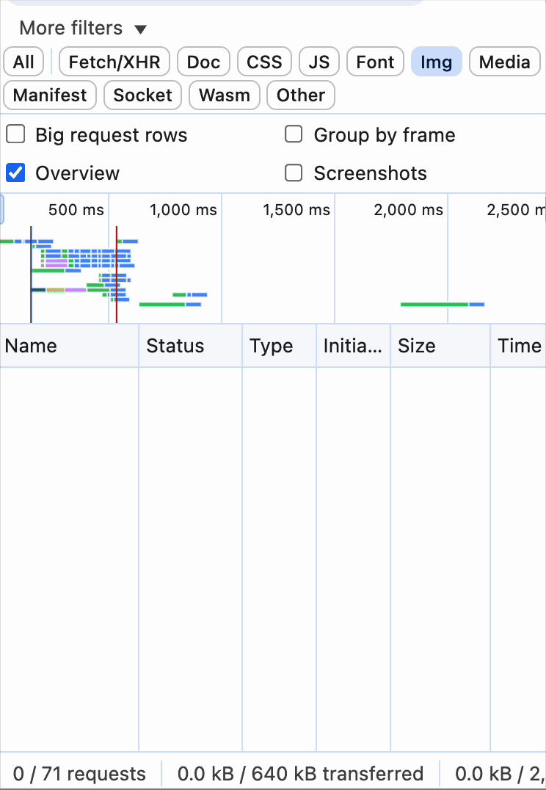

위의 살벌한 이미지는 즐겨찾기 목록을 열었을 때의 네트워크 탭이다. 워터폴 타임라인을 보고 무한 요청 에러가 발생한 것으로 오해할 정도였다.
<br />

# 최적화 필요성

불필요하게 큰 이미지를 요청할 경우 이와 같은 문제가 발생한다. 픽잇에는 즐겨찾기 식당 사진을 업로드하는 기능이 있다. 사용자는 보통 직접 촬영한 사진을 업로드하는데, 이때 고해상도 원본 이미지는 렌더링 크기(90 x 90)에 비해 매우 크다. 이로 인해 렌더링이 속도가 느려지고 네트워크 부하 발생한다. 이는 사용자 경험 및 LCP와 같은 성능 지표에 악영향을 줄 수 있다. 또한 저장 공간과 전송 비용이 낭비된다. 따라서 리사이즈, 압축, 포맷 변환 등을 통한 이미지 최적화가 필요하다.
<br />
<br />

# 이미지 최적화 방식

이미지 최적화 방식 2가지의 소개와 함께 어떤 기준으로 얼마나 최적화하면 좋을지 알아보자!

## 리사이즈

리사이즈란 이미지의 해상도(이미지를 구성하는 픽셀 수)를 줄이는 것을 말한다. 예를 들어 화면에 표시할 이미지 태그의 크기는 90 x 90 인데 4000 x 3000의 해상도를 가진 이미지를 넣는 것은 낭비다.

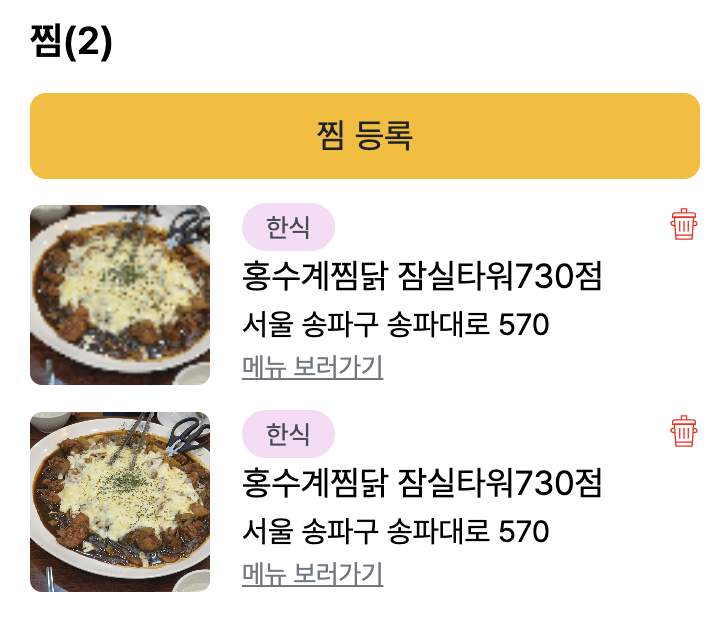
위는 90 x 90 리사이즈한 이미지, 아래는 원본 이미지다. 리사이즈한 이미지의 화질이 눈에 띄게 저하되었다. 이는 DPR을 고려하지 않아 발생한 문제다.
<br />

### 물리적 픽셀 / 논리적 픽셀

먼저 물리적 픽셀과 논리적 픽셀에 대한 이해가 필요하다. 물리적 픽셀은 실제 디스플레이를 구성하는 점의 단위로 ‘iPhone 14 Pro는 2556 × 1179’의 ‘2556 × 1179’에 해당한다. 논리적 픽셀이란 운영체제나 브라우저, CSS가 UI 요소를 배치할 때 사용하는 추상적 단위를 말한다. 개발자/디자이너가 다루는 단위로 ‘width: 100px;’의 px이 논리적 픽셀이다.
<br />

### DPR(device-pixel-ratio)

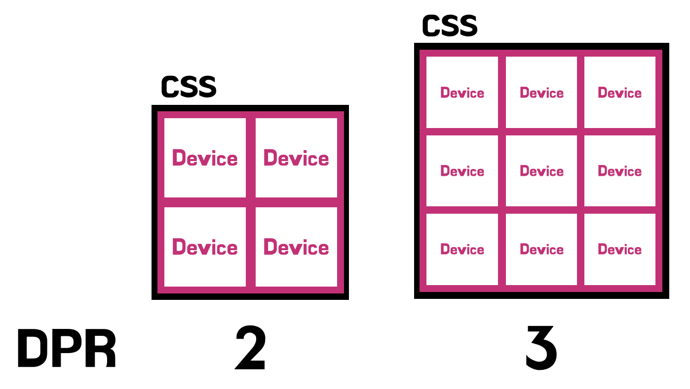
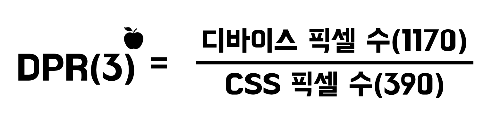
DRP이란 디바이스 픽셀(물리적 픽셀)과 CSS 픽셀 수(논리적 픽셀)의 비율을 말한다. 예를 들어 아이폰 13의 경우 디바이스 폭이 1170px이며 CSS 상에서 viewport 폭은 390px이다.

즉, DPR이 3으로 1개의 CSS 픽셀을 표현하기 위해 총 9(가로 3 × 세로 3)개의 물리적 픽셀이 사용된다.

```jsx
console.log(window.devicePixelRatio);
```

window.devicePixelRatio을 통해 현재 화면의 DPR을 구할 수 있다.
아이폰 14pro max → 3, 아이패드 Pro → 2,맥북 → 2 임을 확인했다.
<br />

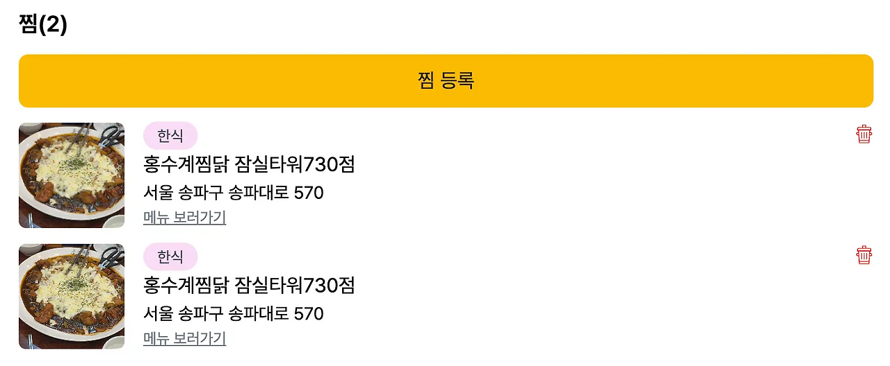
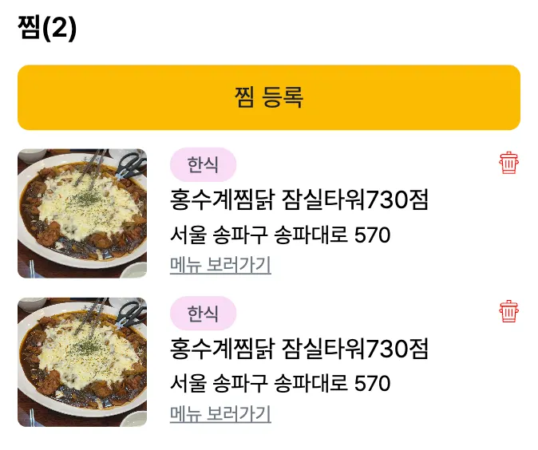
DPR을 고려하여 웹과 모바일 화면에 각각 4배(180 x 180), 9배(270 x 270)로 리사이즈했더니 화질 저하가 체감되지 않았다👍 단, 픽셀 수에 맞추었기 때문에 이미지를 확대하게 되면 화질이 저하된다.
<br />

```jsx
/* DPR */


/* 뷰포트 크기 */


```

리사이즈 시 DPR 뿐만 아니라 이미지 포맷도 함께 고려해야 한다. 또한 반응형 웹에서는 뷰포트 크기에 따라 적절한 크기로 리사이즈 해야한다. srcset과 sizes 속성을 통해 다양한 DPR, 뷰포트 크기에 대응하는 이미지를 제공할 수 있다.

- srcset : 화면 상황(DPR/뷰포트 크기)에 따라 브라우저가 선택할 수 있도록 이미지 파일 목록 지정
- sizes : 뷰포트 크기에 따라 필요한 이미지 크기 힌트 제공
  <br />

## 압축

압축은 리사이즈와 달리 픽셀 수는 그대로지만, 효율적으로 데이터를 저장하여 용량을 줄인다.
<br />

### 무손실 압축

데이터를 압축했다가 다시 복원했을 때 원본 데이터와 완전히 동일하게 복원할 수 있는 압축 방식이다. 반복되는 패턴이나 중복 데이터를 제거하여 용량을 절감한다. 따라서 픽셀 데이터는 그대로 유지되지만 손실 압축보다 압축률이 낮다. 대표적인 무손실 압축 방법을 알아보며 원리를 파악해 보자!

- **Huffman coding(허프만 코딩) 알고리즘을 통한 압축**

  출현 빈도가 높은 값에 짧은 코드를, 낮은 값에 긴 코드를 부여하는 기법이다. 이미지에서는 숫자 데이터지만 이해가 쉽도록 알파벳으로 예시를 들었다.
  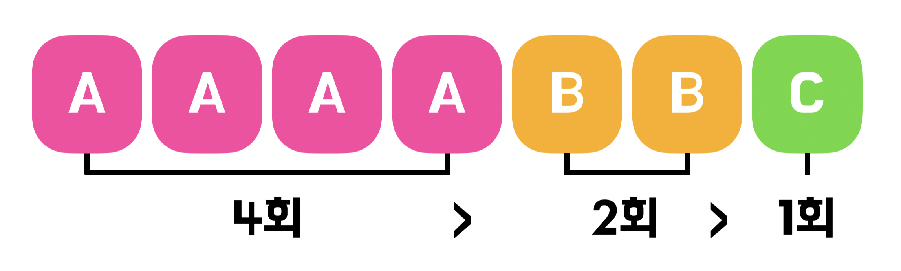
  AAAABBC와 같은 데이터가 있다고 가정했을 때 먼저 각 문자의 빈도를 계산한다.
  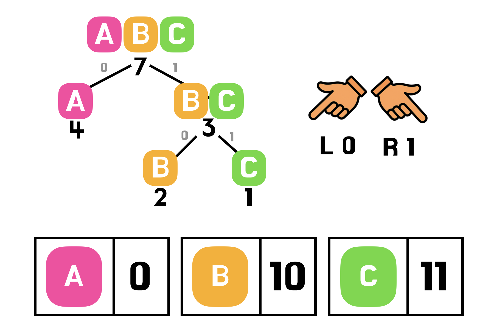
  계산된 빈도를 가중치로 사용하여 노드를 만든다. 이를 오름차순 우선순위 큐에 넣는다. 이후 가장 작은 두 노드부터 꺼내서 묶어나가며 트리를 구성한다. 루트에서 왼쪽은 0, 오른쪽은 1을 부여한다. 즉, 가중치가 높은 문자일수록 짧은 코드를 부여받는다.
  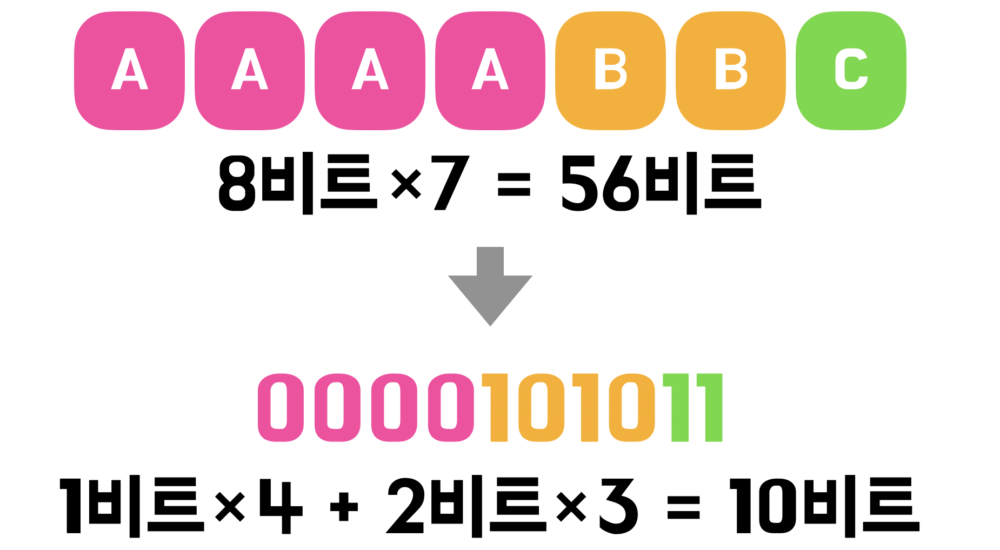
  이러한 과정을 통해 용량을 절감한다. 따라서 패턴이 반복되는 이미지를 무손실 압축했을 때 큰 효과를 볼 수 있다.

- **메타 데이터 제거**

  이미지 파일에는 픽셀 데이터뿐만 아니라 EXIF, ICC profile, GPS 위치, 카메라 기종 등의 추가 정보가 함께 저장돼 있다. 이를 제거함으로써 용량을 줄이는 것이다. 제거 후에 다시 원본 상태로 되돌릴 수 없기 때문에 엄밀히 말하면 무손실 압축이 아니다. 다만 이미지 픽셀 데이터에는 손실이 없기 때문에 무손실 압축과 함께 소개했다. 메타 데이터 제거를 통해 개인 정보 보호 효과까지 얻을 수 있다😎
  <br />

### 손실 압축

무손실 압축과 달리 완벽한 복원을 포기하고, 사람이 인지하기 힘든 정보를 제거하여 압축률을 높인다. 손실 압축은 어찌됐든 데이터가 손실되므로 주의가 필요하다. 아래의 예시를 포함한 대표적인 기법들을 알아보고 적절하게 활용해 보자!
<br />

- **Color Space Transform**
  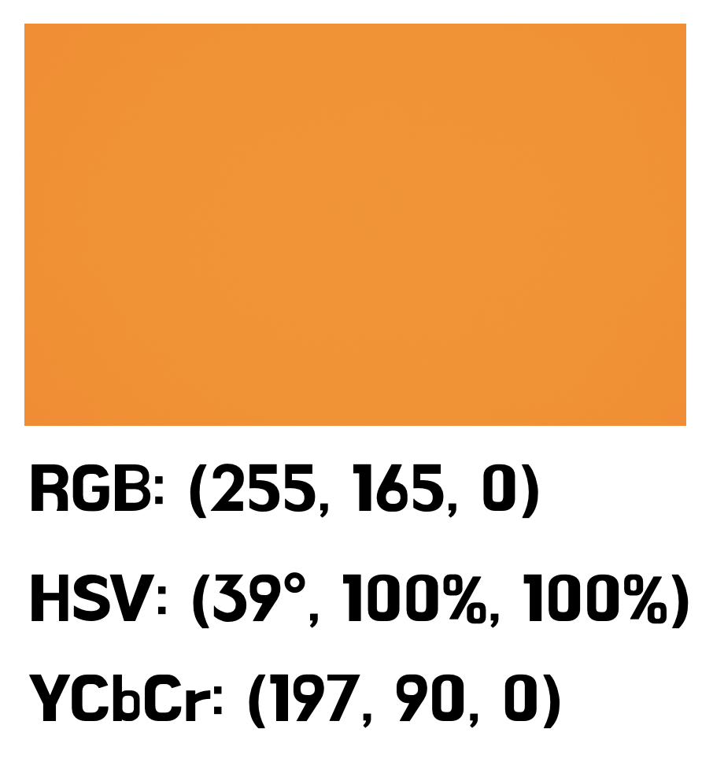
  색공간(Color Space)이란 색을 표현하는 좌표계다. 예를 들어 같은 주황색이라도 각각의 색공간으로 다르게 표현할 수 있다. 따라서 목적에 따라 최적의 색공간을 이용하는 것이다.
  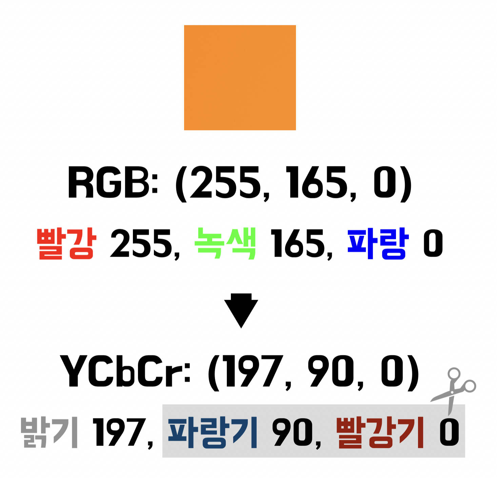
  RGB를 YCbCr로 변환하면 이미지 압축에 용이해진다. YCbCr란 RGB를 밝기(Y)와 색차(Cb, Cr)로 분리한 색 표현 방식이다. 이때 색상의 일부를 제거하여 압축할 수 있다. 사람의 눈은 과학적으로 밝기에 민감하며 색에 둔감하여 손실된 데이터로 인한 화질 저하를 체감하기 어렵다.
- **Chroma Downsampling**

  이와 같이 YCbCr 변환 후 밝기는 그대로, 색상은 적게 샘플링하여 저장하는 방식을 크로마 서브샘플링 (Chroma Subsampling)이라고 한다. 이때 Cb/Cr 채널 해상도를 낮추는 처리 과정이 크로마 다운샘플링(Chroma Downsampling)이다.
  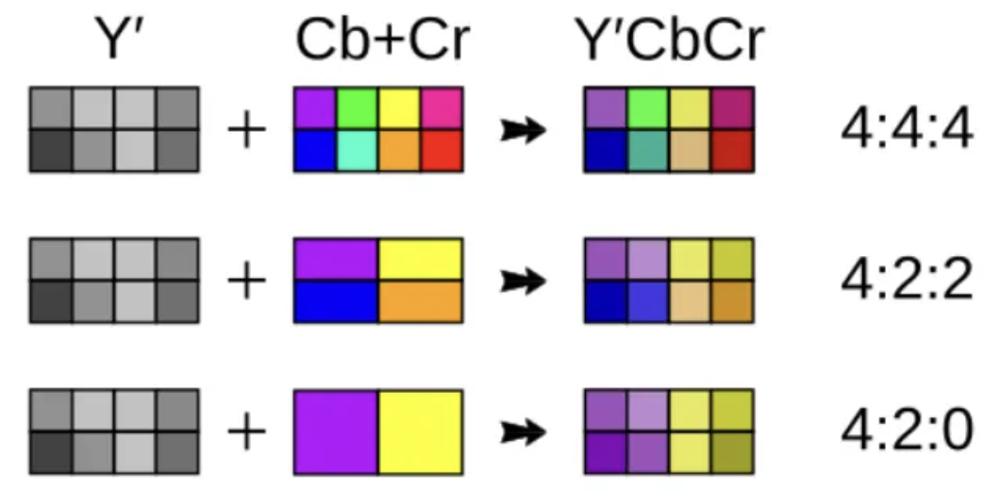

  - 4:4:4

    - 8개 픽셀 → 8개 색상 모두 보존
    - 제거율: 0%
    - 원본 그대로 유지

  - 4:2:2

    - 8개 픽셀 → 4개 색상만 유지 (가로로 인접한 2픽셀의 색상을 하나로 통합)
    - 제거율: 50% (가로 방향만)
    - 세로 방향 색상은 그대로

  - 4:2:0
    - 8개 픽셀 → 2개 색상만 유지 (2×2 블록의 4픽셀 색상을 하나로 통합)
    - 제거율: 75%
    - 전체 데이터의 50%를 색상 제거만으로 절감

<br />

# 라이브러리

이제 라이브러리를 통해 사용자가 등록한 이미지를 최적화해보자! 이미지 최적화 라이브러리 세 가지의 동작 방식을 알아보고, 장단점을 비교하기 전 먼저 Canvas API가 무엇인지 알아보자!
<br />

## Canvas API

js 코드를 통해 픽셀 단위로 그림을 그리고 조작하는 기능을 제공한다. 이때 canvas 태그가 HTML 문서 안에 그림을 그릴 공간이 되어준다. 즉, canvas 태그가 도화지 역할을 하며 Canvas API는 붓 역할을 하는 것이다.

    drawImage : Canvas에 이미지를 원본 그대로 혹은 일부를 자르거나 크기를 조절하여 그리는 메서드.

    toBlob : Canvas 픽셀을 바이너리 형태로 인코딩해서, 브라우저의 메모리에 Blob 객체로 저장하는 메서드.

<br />

```
/* Canvas API를 통해 파란색 20 x 20 사각형 그리기 */
<canvas id="myCanvas" width="200" height="200"></canvas>

<script>
  const canvas = document.getElementById('myCanvas');
  const ctx = canvas.getContext('2d');

  ctx.fillStyle = 'blue';
  ctx.fillRect(50, 50, 20, 20);
</script>


/* Canvas API를 통해 파란색 90 x 120 이미지 그리기 */
<canvas id="imageCanvas" width="300" height="300"></canvas>

<script>
  const canvas = document.getElementById('imageCanvas');
  const ctx = canvas.getContext('2d');

  const img = new Image();
  img.src = '/images/Cat.png';

  img.onload = () => {
    ctx.drawImage(img, 30, 30, 90, 120);
  };
</script>
```

<br />

## pica

고품질 브라우저 이미지 리사이즈에 특화된 라이브러리다. 앞서 설명한 Canvas API의 drawImage 기반 리사이즈보다 훨씬 정교한 알고리즘을 사용하기 때문에 이미지의 품질 손실이 적다. 또한 WebAssembly를 통해 연산을 가속하기 때문에 큰 이미지 리사이즈 시에도 빠르게 처리한다. \*일부 구형 브라우저에서는 WebAssembly를 지원하지 않는다.

동작 방식을 살펴보면, 먼저 원본 이미지를 \<canvas>에 그린 후 목표 크기의 \<canvas>로 리사이즈를 수행한다. \<canvas>를 생성하기 위한 별도의 설정 과정이 필요하지만 고품질 리사이즈가 가능하다.
<br />

## react-image-file-resizer

리액트 환경에서 간단하게 이미지 리사이즈를 처리할 수 있도록 만들어진 라이브러리다. 사실상 Canvas API의 drawImage와 toBlob을 리액트 환경에서 사용하기 쉽게 감싼 도구다.

직접적인 canvas 조작을 하지 않아 사용법이 매우 간단하다. 파일 객체와 원하는 너비·높이, 압축 품질 등을 전달하면 콜백으로 리사이즈된 결과를 받을 수 있다. 그러나 고품질 알고리즘보다는 기본적인 Canvas 기반의 리사이징을 하기 때문에 이미지의 품질은 pica에 비해 떨어진다.
<br />

## browser-image-compression

리사이즈뿐만 아니라 JPEG 품질 조절을 통한 파일 용량 압축까지 지원한다 `maxWidthOrHeight` 옵션으로 이미지의 크기를 제한할 수 있고, `maxSizeMB` 옵션으로 목표 파일 크기(MB)를 지정한다. 또한 Web Worker를 지원하여 큰 이미지를 처리할 때 UI가 멈추지 않도록 백그라운드에서 압축을 수행할 수 있다. Pica처럼 고급 알고리즘을 사용하지는 않기 때문에 리사이즈 품질 자체는 평균적인 수준이지만 리사이즈와 용량 최적화를 한 번에 처리할 수 있다.
<br />

요약하면,

### pica츄

고해상도 이미지를 빠르고 깔끔하게 줄이고 싶을 때 적합.

### react-image-file-resizer

리액트 프로젝트에서 간단하게 리사이즈 해야할 때 적합

### browser-image-compression

크기도 줄이고, 용량도 줄여서 업로드를 최적화해야할 때 적합
<br />
<br />

픽잇의 즐겨찾기 이미지는 참고용 이미지로 품질을 중요시하지 않는다. 또한 고작 논리적 픽셀 90 x 90으로 화면에 표시되므로 리사이즈만으로도 충분한 용량 절감이 가능하다. 따라서 러닝 커브가 낮고 리사이즈가 가능한 react-image-file-resizer를 사용하기로 했다.
<br />

# 적용

```
  //  긴 쪽을 잘라서 정사각형(270×270)으로 만들기
  const cropAndResizeToSquare = (file: File) => {
    const img = new Image();
    const reader = new FileReader();

    reader.onload = e => {
      img.src = e.target?.result as string;
    };

    img.onload = () => {
      const { width, height } = img;

      // 정사각형으로 자를 영역 계산
      const size = Math.min(width, height);
      const startX = (width - size) / 2;
      const startY = (height - size) / 2;

      // 1. crop canvas
      const cropCanvas = document.createElement('canvas');
      const cropCtx = cropCanvas.getContext('2d')!;
      cropCanvas.width = size;
      cropCanvas.height = size;
      cropCtx.drawImage(img, startX, startY, size, size, 0, 0, size, size);

      // 2. resize canvas (270×270)
      const TARGET_SIZE = 270;
      const resizeCanvas = document.createElement('canvas');
      const resizeCtx = resizeCanvas.getContext('2d')!;
      resizeCanvas.width = TARGET_SIZE;
      resizeCanvas.height = TARGET_SIZE;
      resizeCtx.drawImage(cropCanvas, 0, 0, TARGET_SIZE, TARGET_SIZE);

      // 3. Canvas → Blob(File)
      resizeCanvas.toBlob(
        blob => {
          if (blob) {
            const resizedFile = new File([blob], file.name, {
              type: file.type, //
              lastModified: Date.now(),
            });
            onFormChange('thumbnail', resizedFile);
            setPreviewUrl(URL.createObjectURL(resizedFile));
          }
        },
        file.type,
        0.9
      );
    };

    reader.readAsDataURL(file);
  };

```

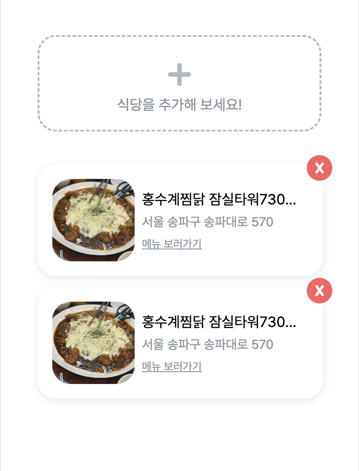
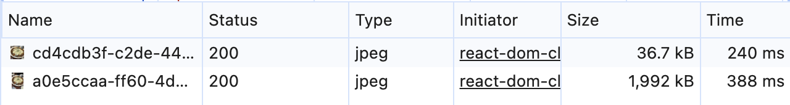

270 x 270으로 리사이즈하여 용량을 1,992kb에서 36.7kb로 약 54배 줄였다! 사진 품질의 중요도가 높지 않아 DPR 3까지만 대응해도 충분하다고 생각했다. 또한 webp 변환을 고려했으나 이미 사이즈가 매우 작아 용량 절감 효과가 미미했으며 지원하지 않는 브라우저에 대처해야 했다. Lambda + CloudFront + S3 조합 등으로 DPR 1/2/3 각각 대처 및 webp 미지원 브라우저 대처가 가능하지만 서비스 규모가 작아 오버엔지니어링이라고 판단했다.
