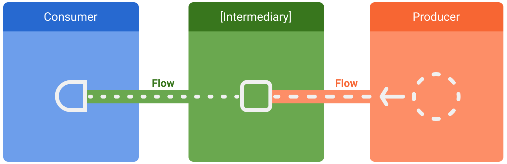

# 목차

1. Flow 란?
2. Flow 의 장점
3. LiveData 의 한계
4. LiveData -> Flow 마이그레이션
   4.1 마이그레이션의 필요성
   4.2 마이그레이션 과정
   4.3 마이그레이션 중 발생할 수 있는 이슈 및 해결책
5. Flow 활용 고급 패턴
   5.1 StateFlow vs SharedFlow
   5.2 Channel 을 활용한 복잡한 데이터 흐름 관리
6. 참고자료

# 1. Flow 란?

**Flow**는 Kotlin에서 제공하는 **비동기 데이터 스트림** 처리 도구로써 비동기적으로 계산해야 할 값의 스트림입니다.
`suspend` 함수는 단일 값만 반환합니다. 하지만 `Flow` 는 `suspend` 함수와 달리 여러 값을 순차적으로 내보낼 수 있습니다.
`Sequence` 와 비슷하지만, 비동기 처리를 지원하고, 데이터를 비동기적으로 생성할 수 있습니다.
예를 들어서 Flow 를 사용해서 데이터베이스에서 실시간 업데이트를 받을 수 있습니다.

`LiveData`와 비슷하게 데이터를 관찰할 수 있지만, 더 강력한 기능과 유연성을 제공합니다.

데이터 스트림에는 생산자, 중개자, 소비자 이렇게 세 가지 엔티티가 관련되어 있습니다.

* 생산자: 데이터 스트림에 추가되는 데이터를 생성합니다. 코루틴 덕분에 flow 는 비동기적으로 데이터를 생산할 수 있습니다.
* 중개자(선택 사항): 스트림 또는 스트림으로 방출된 각 값을 수정할 수 있습니다.
* 소비자: 스트림의 값을 소비합니다.



Flow는 다음과 같은 특징을 가지고 있습니다:

- **Back Pressure 지원**: 빠른 데이터 흐름에서 시스템이 과부하되지 않도록 제어합니다.
- **Suspending 으로 유연한 비동기 데이터 처리**: 코루틴 기반의 비동기 데이터 흐름을 간편하게 관리할 수 있습니다.
- **flow 연산자를 통해 간편한 데이터 변환 및 결합**: `map`, `filter`, `collect` 등 다양한 데이터 변환 및 처리할 수 있습니다.

예제 상황을 통해 간편하게 알아봅시다.

### BackPressure 지원

소비자가 데이터를 처리하는 속도에 맞춰 데이터를 방출하는 방식입니다. 이를 통해 리소스를 효율적으로 관리할 수 있습니다.  
예를 들어 채팅 애플리케이션에서 사용자의 메시지 알림을 처리한다고 가정해보겠습니다.
메시지가 너무 빨리 들어오면 앱이 느려질 수 있습니다.
이 때 Flow 를 사용하여 소비자가 처리할 수 있는 속도에 맞춰 알림 스트림을 제어할 수 있습니다.

```kotlin
fun messageFlow(): Flow<Message> = flow {
    while (true) {
        delay(500) // 메시지가 너무 빨리 오지 않도록 지연시킴
        emit(Message("Hello")) // 메시지를 비동기적으로 방출
    }
}

fun main() = runBlocking {
    messageFlow().collect { message ->
        println("New message: ${message.content}")
        delay(1000) // 메시지 처리
    }
```

위 예제에서 메시지 스트림은 너무 빨리 방출되지 않도록 Back Pressure 를 관리합니다.

### Suspending 으로 유연한 비동기 데이터 처리

Flow는 코루틴 기반으로 작동하며, 코루틴을 이용한 비동기 작업을 쉽게 처리할 수 있습니다. suspend 함수를 사용하여, 비동기 작업을 순차적으로 수행하면서도 코드가 읽기 쉬운 방식으로 유지됩니다.
예를 들어, 원격 API에서 데이터를 가져오는 작업을 할 때 Flow를 사용하면 비동기적으로 데이터를 요청하고 처리할 수 있습니다.

```kotlin
fun weatherFlow(): Flow<Weather> = flow {
    val cities = listOf("Seoul", "New York", "London")
    for (city in cities) {
        val weather = fetchWeatherForCity(city) // 비동기 API 요청
        emit(weather) // 결과를 Flow로 방출
        delay(1000) // 요청 간 지연
    }
}

suspend fun fetchWeatherForCity(city: String): Weather {
    // 원격 서버에서 날씨 데이터를 가져오는 작업 (비동기 처리)
    return api.fetchWeather(city)
}

fun main() = runBlocking {
    weatherFlow().collect { weather ->
        println("Weather in ${weather.city}: ${weather.temperature}")
    }
}
```

### flow 연산자를 통해 간편한 데이터 변환 및 결합

Flow는 다양한 연산자를 제공하여 데이터를 변환하거나 필터링하는 등의 처리를 쉽게 할 수 있습니다. 이를 통해 복잡한 데이터 흐름을 간단한 연산자로 처리할 수 있습니다.

예를 들어 사용자가 특정 조건을 만족하는 제품 목록을 보고 싶어한다고 가정합시다.
Flow에서 데이터를 필터링하고 변환하여 조건에 맞는 데이터만 방출할 수 있습니다.

```kotlin
fun productFlow(): Flow<Product> = flow {
    val products = listOf(Product("Phone", 1000), Product("Laptop", 2000), Product("Tablet", 500))
    products.forEach { emit(it) }
}

fun main() = runBlocking {
    productFlow()
        .filter { it.price > 1000 } // 가격이 1000 이상인 제품만 필터링
        .map { it.copy(price = it.price * 0.9) } // 할인 적용
        .collect { product ->
            println("Discounted product: ${product.name} - ${product.price}")
        }
}
```

위 예제에서, Flow는 제품 목록을 방출하면서 가격 조건에 맞는 제품만 필터링하고, 할인된 가격으로 변환하여 소비자에게 제공합니다.

# 3. LiveData 의 한계

LiveData는 안드로이드에서 사용하기 간편한 데이터 스트림 도구지만, 몇 가지 한계가 있습니다:

- **단방향 데이터 흐름**: LiveData는 단방향으로만 데이터를 전달할 수 있습니다.
- **백그라운드 작업 통합 어려움**: LiveData는 백그라운드에서 데이터를 처리하는 데에 제한이 있습니다.
- **백프레셔 관리 부족**: 대량의 데이터를 처리하거나 빠른 데이터 흐름을 제어하는 기능이 부족합니다.

### 단방향 데이터 흐름

사용자가 상품 목록을 보고, 필터를 적용하여 특정 조건에 맞는 상품만 보고 싶다고 가정해봅시다.
LiveData는 단방향 데이터 흐름이기 때문에 필터링이나 데이터 변환을 실시간으로 적용하는 데 어려움이 있습니다.

```kotlin
val productsLiveData = MutableLiveData<List<Product>>()
val filteredProductsLiveData = MutableLiveData<List<Product>>()

// 사용자가 필터를 적용할 때마다 직접 수동으로 데이터 변환 필요
fun applyFilter(filter: String) {
    val products = productsLiveData.value ?: return
    val filtered = products.filter { it.name.contains(filter) }
    filteredProductsLiveData.value = filtered
}
```

이렇게 수동으로 필터링을 적용해야 하며, 데이터의 흐름을 자동으로 변환하거나 필터링하는 기능이 부족합니다.

### 백그라운드 작업 통합의 어려움

LiveData는 백그라운드에서 비동기 작업을 처리하는 데에 제한이 있습니다.
즉, UI 스레드에서만 안전하게 데이터를 처리하도록 설계되어 있으며, 네트워크 요청이나 데이터베이스 작업과 같이 백그라운드에서 실행해야 하는 비동기 작업을 쉽게 처리할 수 없습니다.   
이를 처리하려면 별도의 Thread나 Executor를 사용해야 하며, 코드가 복잡해집니다.

사용자가 앱을 실행할 때 서버에서 상품 정보를 비동기적으로 가져와서 UI에 표시하고 싶다고 가정해봅시다.
LiveData로 처리할 때는 백그라운드 스레드에서 데이터를 처리하는 로직을 별도로 관리해야 합니다.

```kotlin
val productsLiveData = MutableLiveData<List<Product>>()

fun fetchProductsFromApi() {
    // 백그라운드 스레드에서 비동기 작업을 수행해야 함
    Thread {
        val products = api.getProducts() // API 호출
        productsLiveData.postValue(products) // 메인 스레드로 데이터 전달
    }.start()
}
```

### 백프레셔 관리 부족

LiveData는 대량의 데이터 스트림을 처리하는 경우에도 Back Pressure(과부하 관리) 기능이 부족합니다.
빠르게 들어오는 데이터를 처리하는 동안 소비자가 데이터를 수신할 준비가 되어 있지 않으면, 데이터가 계속 쌓여 메모리 부족이나 성능 저하와 같은 문제를 일으킬 수 있습니다.

실시간으로 서버에서 대량의 로그 데이터를 스트리밍받아 앱에 표시하려고 가정해봅시다. 이때 LiveData는 소비자의 처리 속도를 고려하지 않고 계속해서 데이터를 방출하기 때문에, UI에서 데이터가 늦게 표시되거나
메모리가 과부하될 수 있습니다.

```kotlin
val logDataLiveData = MutableLiveData<String>()

fun fetchLogData() {
    // 서버에서 로그 데이터를 계속해서 받음
    while (true) {
        val log = api.getLog() // 로그 데이터 요청
        logDataLiveData.postValue(log) // UI로 바로 전달
    }
}

```

문제점: 데이터 수신 속도가 너무 빠르면 UI 스레드가 과부하되며, 로그 데이터를 제때 표시하지 못할 수 있습니다. 즉, Back Pressure 관리가 부족합니다.

# 4. LiveData -> Flow 마이그레이션

## 4.1 마이그레이션의 필요성

Flow로의 마이그레이션은 다음과 같은 장점을 제공합니다:

* 더 복잡한 비동기 작업을 효율적으로 처리할 수 있습니다.
* 백그라운드에서 데이터를 안전하게 처리하고 UI 스레드와 통합할 수 있습니다.
* 데이터 흐름의 변환과 필터링을 보다 간결하게 처리할 수 있습니다.

특히, 생명주기 관리, 데이터 스트림 변환, 동시성 제어와 같은 측면에서 Flow가 제공하는 기능은 LiveData에 비해 강력합니다.

## 4.2 마이그레이션 과정

기존 LiveData 코드를 Flow로 변환하는 방법은 기본적으로 observe 대신 collect를 사용하는 것입니다.  
또한, LiveData.observe()는 Activity나 Fragment 생명주기에 맞게 관리되지만, Flow는 이를 별도로 관리해야 하므로 lifecycleScope나 viewModelScope를 활용해야
합니다.

### LiveData 사용 예제

```kotlin
val liveData = MutableLiveData<String>()
liveData.value = "Hello LiveData"

liveData.observe(this, Observer {
    println(it)
})
```

### Flow 사용 예제

```kotlin
val flow = flowOf("Hello Flow")
lifecycleScope.launch {
    flow.collect { println(it) }
}
```

위처럼 `observe` 대신 `collect`를 사용하여 데이터를 수집합니다.

## 4.3 마이그레이션 중 발생할 수 있는 이슈 및 해결책

### 1. 생명주기 연동 문제

- **해결책**: `lifecycleScope`와 `viewModelScope`를 사용하여 Flow가 Activity나 Fragment의 생명주기와 안전하게 연동되도록 합니다.

```kotlin
lifecycleScope.launch {
    flow.collect { value -> println(value) }
}
```

### 2. 기존 LiveData 코드와의 호환성 문제

- **해결책**: `asLiveData()`를 사용하여 기존 LiveData와 Flow를 함께 사용할 수 있습니다.

```kotlin
val liveData = flow.asLiveData()
```

# Flow 활용 고급 패턴

Flow는 단순한 데이터 스트림 처리뿐 아니라 다양한 고급 패턴을 지원합니다. 특히 UI 상태 관리나 이벤트 전파에 유리한 `StateFlow`, `SharedFlow`, `Channel`이 있습니다.

## 5.1 StateFlow vs SharedFlow

### StateFlow

StateFlow는 항상 마지막 상태를 유지하며, 새로운 구독자가 발생하면 즉시 값을 제공하는 구조입니다.
UI 상태를 표현할 때 자주 사용되며, ViewModel과 UI 간에 상태 공유를 할 수 있습니다.

### StateFlow 예제

```kotlin
val stateFlow = MutableStateFlow(0)

lifecycleScope.launch {
    stateFlow.collect { value -> println(value) }
}

stateFlow.value = 10
```

### SharedFlow

SharedFlow는 이벤트 기반의 데이터 흐름을 처리할 때 사용됩니다. 마지막 상태를 저장하지 않으며, 이벤트가 발생할 때만 구독자에게 값을 전송합니다.
이벤트(예: 사용자 클릭, 네트워크 호출 결과) 처리를 위한 도구로 사용되며, 여러 구독자가 있을 때 데이터를 공유합니다.
UI 상태를 표현할 때 자주 사용되며, ViewModel과 UI 간에 상태 공유를 할 수 있습니다.

```kotlin
val sharedFlow = MutableSharedFlow<Int>()

lifecycleScope.launch {
    sharedFlow.collect { value ->
        println("Received value: $value")
    }
}

lifecycleScope.launch {
    sharedFlow.emit(10) // 구독자에게 새로운 이벤트 전달
}

```

# 결론

Flow는 Kotlin에서 비동기 데이터 스트림을 다루는 데 있어 탁월한 유연성과 강력한 기능을 제공합니다. 특히, 백그라운드 작업 통합, Back Pressure 관리, 그리고 복잡한 데이터 변환이 필요할 때
LiveData보다 더욱 적합한 도구입니다.

이 글에서는 LiveData에서 Flow로의 마이그레이션 이유와 과정을 설명했으며, 실제 코드 예제와 함께 그 장점을 살펴보았습니다. 또한, Flow가 제공하는 고급 패턴(StateFlow, SharedFlow,
Channel)을 통해 복잡한 데이터 흐름을 보다 효율적으로 관리하는 방법도 알아보았습니다.

Flow로의 마이그레이션은 단순히 최신 기술을 사용하는 것 이상의 의미를 가집니다. 비동기 처리를 더욱 쉽게 다룰 수 있고, 애플리케이션의 성능과 안정성을 높일 수 있는 기회를 제공합니다.
LiveData를 사용한 기존 프로젝트에서 Flow로의 마이그레이션을 고려하고 있는 개발자라면, 점진적으로 마이그레이션을 진행하면서 lifecycleScope와 viewModelScope의 사용을 익히는 것이
중요합니다. 더 나아가, StateFlow, SharedFlow, 그리고 Channel을 활용한 패턴으로 데이터 스트림을 최적화하여, 비동기 작업을 보다 효과적으로 관리할 수 있습니다.

Flow는 안드로이드 개발에서 더욱 강력한 도구가 되어줄 것입니다. 지금 이 기회를 통해 기존 프로젝트에 Flow를 도입하여 더 나은 데이터 흐름 관리와 비동기 처리를 경험해보세요.

---
이제, Flow를 활용하여 여러분의 프로젝트에서 데이터 스트림 처리를 한 단계 더 발전시켜 보세요!
--- 

# 참고자료

1. [Android 공식 문서: Kotlin Flow](https://developer.android.com/kotlin/flow)
2. 코루틴의 정석 - 조세영
3. Kotlin Coroutines: Deep Dive - 마르친 모스카와
4. [Kotlin Coroutines and Flow for Android Development](https://www.udemy.com/course/coroutines-on-android/?couponCode=SKILLS4SALEB)

