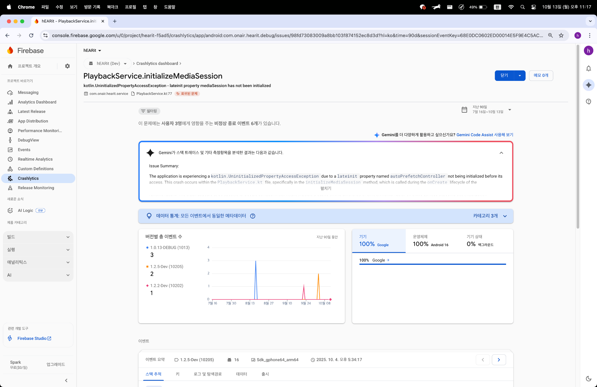
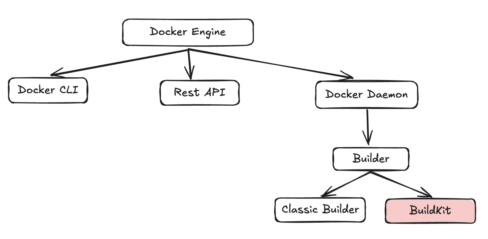

# 인덱스, 항상 효과 있을까?

> 이 글은 데이터베이스와 인덱스에 대한 어느 정도 이해가 있는 독자를 타겟으로 작성하였습니다.

> 이 글은 데이터베이스 중 MySQL을 기준으로 설명합니다.

이론으로만 학습했던 인덱스. 조회 시 성능 측면에서 유용한 기법입니다. 이론적으로는 충분히 이해합니다. 하지만 실제로 눈에 띄는 효과를 직접 확인하고 싶었습니다.

총대마켓 프로젝트에서 100만건의 데이터가 존재하는 테이블에 인덱스를 적용했습니다. 하지만 충분하지 않은 데이터 개수가 이유가 되어, 인덱스 성능 개선 결과가 확연하지 않았던 부분이 많이 아쉬웠습니다. 따라서 이번 기회를 통해 1억건의 데이터가 담긴 테이블에서 인덱스를 통한 성능 개선 결과를 명확히 확인해보고자 합니다. 그 여정을 여러분과 함께 공유합니다.

먼저, 가볍게 인덱스가 무엇인지 짚고 넘어가봅시다.

## 인덱스 개념
인덱스는 데이터베이스에서 데이터를 효율적으로 검색할 수 있도록 도와주는 데이터 구조입니다. 인덱스는 일반적으로 테이블의 특정 컬럼에 대해 설정되며, 해당 컬럼을 기준으로 데이터의 위치를 빠르게 찾을 수 있게 합니다. 인덱스는 책의 색인처럼 작용하여, 원하는 데이터를 쉽게 찾을 수 있도록 해줍니다.

## 인덱스의 필요성
데이터베이스는 인덱스를 걸지 않은 데이터를 어떻게 탐색할까요?

```sql
select * from 테이블 where 컬럼 = 1;
```

위 쿼리를 실행하고 싶습니다.
컬럼에 인덱스를 걸지 않은 경우, 데이터베이스는 첫 행부터 마지막 행까지를 전체적으로 탐색합니다. 이를 `full scan`이라고 명칭하며, 만약 테이블에 1억개의 데이터가 존재한다면 1억개의 데이터 전부를 탐색해 조건에 맞는 행인지를 판단합니다. 그만큼 많은 시간이 소요됩니다.

여기서, 컬럼에 인덱스를 걸어주면 데이터베이스는 데이터를 어떻게 탐색할까요?

데이터베이스가 인덱스 테이블을 통해 데이터를 탐색하는 방법은 이분 탐색 알고리즘과 유사합니다. 요즘 이분 탐색 알고리즘을 공부하고 있어 제시해본 비유인데요. 이분 탐색은 데이터를 빠르게 탐색하기 위한 알고리즘 기법입니다. 데이터가 정렬되어 있는 상황에서 이분 탐색 알고리즘은 효과를 보입니다.

`1부터 100`까지 정렬된 데이터에서 `77`이라는 데이터를 빠르게 찾기 위해 질문을 해야 한다면, 우리는 어떤 질문을 던질 수 있을까요?
```
Q. 1인가요?
Q. 2인가요?
Q. 3인가요?
.
.
.
```
과연 이 방식이 효과적일까요? 77이라는 숫자를 찾기 위해 우리는 77번의 질문을 던져야 합니다. 힘이 듭니다.
그렇다면 아래 방식은 어떨가요?
```
Q. 1 ~ 50인가요?
Q. 50 ~ 75인가요?
Q. 75 ~ 87인가요?
.
.
.
```
세 개의 질문으로 벌써 77에 근접해졌습니다. WOW!

설명했듯, 인덱스의 동작 방식은 마치 이 이분 탐색 알고리즘과 비슷합니다. A 컬럼에 대한 인덱스를 생성하면, A 컬럼과 A 컬럼에 해당하는 테이블의 행 포인터(위치 정보)를 저장한 인덱스 테이블을 생성하고 A 컬럼의 데이터를 기준으로 정렬합니다. 즉, A 컬럼이 77인 행을 찾기 위해서, A 컬럼 인덱스 테이블에 접근하여 이분 탐색과 비슷한 방법으로 행 포인터를 찾고 해당 포인터를 통해 실제 테이블의 데이터에 접근할 수 있는 것이죠.

MySQL도 역시 인덱스의 필요성을 아래와 같이 설명합니다.

> Indexes are used to find rows with specific column values quickly. Without an index, MySQL must begin with the first row and then read through the entire table to find the relevant rows. The larger the table, the more this costs. If the table has an index for the columns in question, MySQL can quickly determine the position to seek to in the middle of the data file without having to look at all the data. This is much faster than reading every row sequentially.

> 인덱스는 특정 열 값을 가진 행을 빠르게 찾는 데 사용됩니다. 인덱스가 없으면 MySQL은 첫 번째 행부터 시작하여 전체 표를 읽어야 관련 행을 찾을 수 있습니다. 표가 클수록 이 비용이 더 많이 듭니다. 표에 문제의 열에 대한 인덱스가 있는 경우, MySQL은 모든 데이터를 살펴볼 필요 없이 데이터 파일의 가운데에서 찾을 위치를 빠르게 결정할 수 있습니다. 이는 모든 행을 순차적으로 읽는 것보다 훨씬 빠릅니다.

여기까지 인덱스에 대한 이론을 가볍게 살펴보았습니다.

그렇다면 모든 상황에서 인덱스의 효과는 보장될까요? 모든 상황에서 인덱스를 통해 성능을 개선할 수 있을까요? 1억건의 데이터와 함께 직접 확인해봅시다.

## 데이터베이스 세팅
인덱스를 통한 성능 개선을 직접 확인해보기 위해 데이터베이스에 1억건의 더미데이터를 넣어봅시다.

### 1. member 테이블 스키마 정의
Member 테이블의 스키마를 아래와 같이 정의하고 로컬 환경에 아래 테이블을 생성해주었습니다.
```sql
create table member (
id bigint auto_increment primary key,
nickname varchar(255) not null,
age int not null,
address varchar(255)
);
```

### 2. insert문 sql 파일 생성
데이터 삽입을 위해 insert문을 정의한 sql 파일을 생성해주었습니다.

```java
import java.io.File;
import java.io.FileWriter;
import java.io.IOException;
import java.util.Random;
import java.util.StringJoiner;

class DataGenerator {

    private static final String MEMBER_FILE_NAME_FORMAT = "dummy/member/member_%d.sql";
    private static final int COUNT_FILE = 100;
    private static final int COUNT_MEMBER_PER_FILE = 1000000;

    private final Random random = new Random();

    public void createFiles() {
        for (int i = 1; i <= COUNT_FILE; i++) {
            createFile(i);
        }
    }

    private void createFile(int i) {
        String insertQuery = generateInsertQuery();
        try {
            File file = new File(MEMBER_FILE_NAME_FORMAT.formatted(i));
            FileWriter writer = new FileWriter(file);
            writer.write(insertQuery);
            writer.close();
        } catch (IOException e) {
            e.printStackTrace();
        }
    }

    private String generateInsertQuery() {
        String prefix = "INSERT INTO member (nickname, age, address)\n"
                + "VALUES ";
        String suffix = ";";
        StringJoiner joiner = new StringJoiner(",\n", prefix, suffix);
        for (int i = 1; i <= COUNT_MEMBER_PER_FILE; i++) {
            joiner.add(generateInsertRow(i));
        }
        return joiner.toString();
    }

    private String generateInsertRow(int i) {
        String nickname = "사용자" + i;
        int age = randomIntBetween(20, 60);
        String address = randomAddress();
        return "('%s', %d, '%s')".formatted(
                nickname,
                age,
                address
        );
    }

    private int randomIntBetween(int from, int to) {
        return random.nextInt(to - from + 1) + from;
    }

    private String randomAddress() {
        String[] address = {
                // random data from gpt
        };
        return address[random.nextInt(address.length)];
    }
}

```

저의 경우 하나의 sql 파일당 용량 제한이 있어, 100개의 파일로 나누어 하나의 파일 당 1만개의 데이터 삽입 구문을 작성해주었습니다.

### 3. IntelliJ Datasource 연결 및 sql 파일 실행
로컬 환경에 구축한 member 테이블에 데이터를 삽입하기 위해, IntelliJ에서 데이터베이스를 연결하고 100개의 sql파일을 실행시켰습니다.

(사진: IntelliJ 데이터 삽입 과정)

위 과정을 통해 1억개의 데이터가 member 테이블에 삽입되었습니다.
```sql
index_practice> select count(*) from member
[2024-10-01 23:04:18] 1 row retrieved starting from 1 in 15 s 146 ms (execution: 15 s 124 ms, fetching: 22 ms)
```


자동으로 생성된 초기 인덱스는 아래와 같습니다. PK인 id 컬럼에 대해서만 인덱스가 설정되었습니다.



## 인덱스 전후 성능 비교
이제 쿼리를 하나하나 실행해보며, 인덱스를 걸기 전후의 조회 성능과 쓰기 성능을 비교해봅시다.

> select * from member where nickname = ‘사용자77’;

- **인덱스 적용: 6m 42s 875ms**
확실히 데이터가 많아, 인덱스 생성에도 많은 시간이 소요됩니다.
```sql
index_practice> create index idx_nickname on member(nickname)
[2024-10-01 23:24:24] completed in 6 m 42 s 875 ms
```

### 조회 성능
- **인덱스 적용 전: 45s 552ms**
```sql
index_practice> select * from member where nickname = '사용자77'
[2024-10-01 23:13:51] 100 rows retrieved starting from 1 in 45 s 575 ms (execution: 45 s 552 ms, fetching: 23 ms)
```
- **인덱스 적용 후: 45ms**
```sql
index_practice> select * from member where nickname = '사용자77'
[2024-10-01 23:25:55] 100 rows retrieved starting from 1 in 70 ms (execution: 45 ms, fetching: 25 ms)
```
한 컬럼에 인덱스를 걸었을 때, 45초에서 45밀리초로, 약 1000배의 성능 개선을 보입니다.

### 쓰기 성능
- **인덱스 적용 전: 1m 10s 324ms**
```sql
index_practice> update member set age = age + 1 where nickname = '사용자77'
[2024-10-01 23:44:30] 100 rows affected in 1 m 10 s 324 ms
```
- **인덱스 적용 후: 13ms**
```sql
index_practice> update member set age = age + 1 where nickname = '사용자77'
[2024-10-01 23:42:07] 100 rows affected in 13 ms
```
한 컬럼에 인덱스를 걸었을 때, 1분에서 13밀리초로, 약 4000배의 성능 저하를 보입니다.

### 체감 포인트
1. 인덱스의 장점으로 제시되는, `where문을 기준으로 탐색할 때 성능이 크게 개선된다.`
2. 인덱스의 단점으로 제시되는, `인덱스를 생성하는 데에로 시간적 리소스가 든다.`
3. 인덱스의 단점으로 제시되는, `조회 성능은 개선되나 쓰기 성능은 저하된다.`

아래의 쿼리를 통해서도 인덱스를 통한 성능 개선 및 저하를 확인할 수 있습니다. 차차 추가해보겠습니다.
```
exists select * from member where nickname = ‘사용자77’;
select * from member where age < 25;
select * from member where age <> 25;
select * from member where age = 20 or age = 30 or age = 40 or age = 50 or age = 60;
select * from member where age in (20, 30, 40, 50);
select * from member where address like ‘서울%’;
select * from member where address like ‘%서울%’;
```

## 실제 프로젝트 인덱스 걸기 / 인덱스 적용 실패 사례
위 상황은 정말 이상적인 상황입니다. 애초에 member 테이블은 인덱스의 효과를 설명하기 위해 생성된 테이블이며, 인덱스를 걸기 좋은 쿼리를 제시하였습니다.

실제 프로젝트 환경에서는 어떨까요?

현재 진행 중인 총대마켓 프로젝트의 쿼리를 살펴봅시다.

```java
@Query("""
        SELECT o
        FROM OfferingEntity as o JOIN OfferingMemberEntity as om
            ON o.id = om.offering.id
        WHERE om.member = :member
        """)
List<OfferingEntity> findCommentRoomsByMember(MemberEntity member);

@Query("""
        SELECT o
        FROM OfferingEntity o
        WHERE o.id < :lastId
            AND (:keyword IS NULL OR o.title LIKE %:keyword% OR o.meetingAddress LIKE %:keyword%)
        ORDER BY o.id DESC
        """)
List<OfferingEntity> findRecentOfferingsWithKeyword(Long lastId, String keyword, Pageable pageable);

@Query("""
        SELECT o
        FROM OfferingEntity o
        WHERE (o.offeringStatus = 'IMMINENT')
            AND (o.meetingDate > :lastMeetingDate OR (o.meetingDate = :lastMeetingDate AND o.id < :lastId))
            AND (:keyword IS NULL OR o.title LIKE %:keyword% OR o.meetingAddress LIKE %:keyword%)
        ORDER BY o.meetingDate ASC, o.id DESC
        """)
List<OfferingEntity> findImminentOfferingsWithKeyword(
        LocalDateTime lastMeetingDate, Long lastId, String keyword, Pageable pageable);

@Query("""
        SELECT o
        FROM OfferingEntity o
        WHERE (o.offeringStatus != 'CONFIRMED')
           AND (o.discountRate IS NOT NULL)
           AND (o.discountRate < :lastDiscountRate OR (o.discountRate = :lastDiscountRate AND o.id < :lastId))
           AND (:keyword IS NULL OR o.title LIKE %:keyword% OR o.meetingAddress LIKE %:keyword%)
        ORDER BY o.discountRate DESC, o.id DESC
        """)
List<OfferingEntity> findHighDiscountOfferingsWithKeyword(
        double lastDiscountRate, Long lastId, String keyword, Pageable pageable);

@Query("""
        SELECT o
        FROM OfferingEntity o
        WHERE (o.offeringStatus = 'AVAILABLE' OR o.offeringStatus = 'IMMINENT')
           AND (o.id < :lastId)
           AND (:keyword IS NULL OR o.title LIKE %:keyword% OR o.meetingAddress LIKE %:keyword%)
        ORDER BY o.id DESC
        """)
List<OfferingEntity> findJoinableOfferingsWithKeyword(Long lastId, String keyword, Pageable pageable);

@Query("SELECT MAX(o.id) FROM OfferingEntity o")
Long findMaxId();

@Query("""
        SELECT o
        FROM OfferingEntity o
        WHERE o.meetingDate = :meetingDate
            AND o.offeringStatus != :offeringStatus
        """)
List<OfferingEntity> findByMeetingDateAndOfferingStatusNot(LocalDateTime meetingDate,
                                                           OfferingStatus offeringStatus);
```

위 쿼리에서 어떤 컬럼에 어떤 인덱스를 걸어야할지 명확한 답을 찾으셨나요? 저는 조금 어려웠는데요. 그럼에도 쿼리의 속도를 개선시키기 위해 여러 시도를 하였습니다. 하지만, 거의 모든 경우의 인덱스를 다 걸어보아도, 실제로 타는 인덱스 컬럼은 1바이트이기도 하고, 인덱스가 활용되어도 확실한 성능 개선을 확인하지 못한 경우도, 오히려 인덱스를 통해 성능이 저하된 경우도 있었습니다.

프로젝트에 기존 존재하던 쿼리에 인덱스를 적용했지만, 성공적인 결과를 거두지 못함. 따라서 쿼리를 잘 작성해야겠다 생각하게 됨.
앞으로 쿼리를 작성할 때 인덱스를 고려해서 작성해야겠다 생각함.

이 경험을 통해 쿼리를 작성하는 시점에서부터 인덱스를 고려하여 쿼리 작성 계획을 세우겠다 다짐했습니다. 저희 총대마켓에서 사용하는 쿼리문들도 최적화가 필요하기 때문에 앞으로 진행할 계획인데요. 쿼리를 최적화하는 방법과 함께 그 여정도 여러분께 공유 드리겠습니다.

우아한테크코스 인덱스 강의에서 토미는 이런 말씀을 하셨습니다.
```
인덱스는 선택이 아닌 필수다.
```
그리고 저의 실패를 통한 조언도 하나 몰래 첨가하여 글을 마무리하겠습니다. 감사합니다.
```
쿼리를 작성할 때 인덱스도 함께 고려하라.
```
## 참고
https://dev.mysql.com/doc/refman/8.4/en/mysql-indexes.html