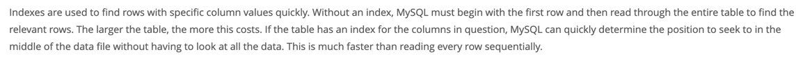
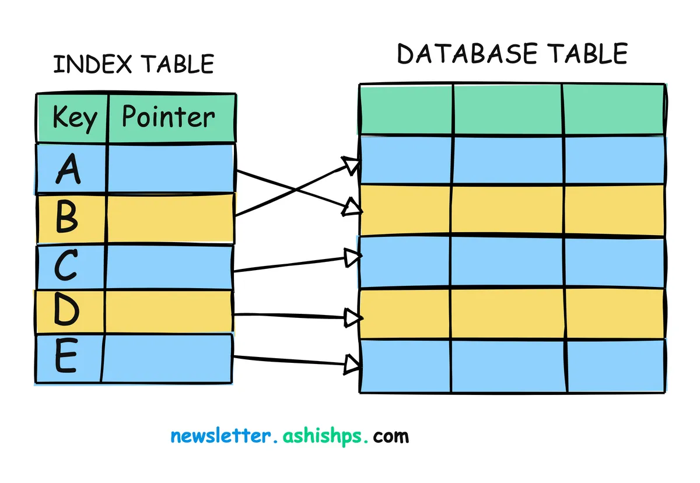
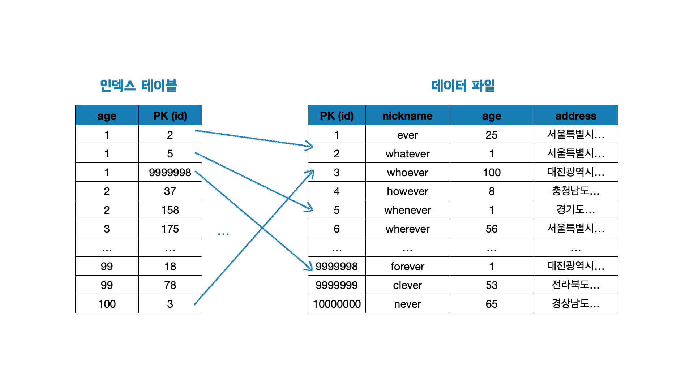

# 인덱스는 만능일까?

> 이 글은 인덱스가 무엇인지 아는 독자를 타겟으로 작성하였으며, MySQL을 기준으로 설명합니다.

인덱스는 성능 개선에 유용합니다. 누구나 이론적으로는 충분히 이해합니다. 하지만 아직 눈에 띄는 효과를 직접 확인하지 못했습니다. 따라서 직접 1억건의 데이터를 쌓고 실험을 해보고자 합니다. 그 여정을 공유합니다.

## 인덱스란
인덱스는 책의 색인과 같이, 데이터베이스에서 데이터를 효율적으로 검색할 수 있도록 도와주는 데이터 구조입니다. 일반적으로 테이블의 컬럼에 대해 설정되며, 해당 컬럼을 기준으로 데이터의 위치를 빠르게 찾을 수 있게 합니다.

아래는 MySQL 공식문서에서 가져온 문구입니다.


> 인덱스는 특정 열 값을 가진 행을 빠르게 찾는 데 사용된다. 인덱스가 없으면 MySQL은 첫번째 행부터 시작하여 전체 표를 읽어야 관련 행을 찾을 수 있다. 표가 클수록 이 비용이 더 많이 든다. 조건 내 컬럼에 대한 인덱스가 있는 경우, MySQL은 모든 데이터를 살펴볼 필요 없이 데이터 파일 내에서 찾을 위치를 빠르게 결정할 수 있다. 이는 모든 행을 순차적으로 읽는 것보다 훨씬 빠르다.

## 인덱스는 데이터를 어떻게 탐색할까

### 이분 탐색 알고리즘
`1부터 100`까지 정렬된 데이터에서 `77`이라는 데이터를 찾기 위해 Y/N로 대답 가능한 질문을 해야 한다고 가정합시다. 우리는 어떤 질문을 던질 수 있을까요?
```
Q. 1인가요?
Q. 2인가요?
Q. 3인가요?
...
```
위 질문을 77번 반복해 답을 얻어낼 수 있습니다.

하지만 과연 이 방식이 효과적일까요? 아니요. 너무 힘이 듭니다.

그렇다면 아래 방식은 어떨까요?
```
Q. 1 ~ 50인가요?
Q. 50 ~ 75인가요?
Q. 75 ~ 87인가요?
...
```
범위를 절반씩 줄여 질문을 해, 찾고자 하는 수의 범위를 좁힙니다. 세 개의 질문으로 벌써 정답인 77에 근접해졌습니다.

위와 같은 흐름으로 원하는 수를 찾는 알고리즘을 `이분 탐색 알고리즘`이라고 합니다.

데이터베이스가 인덱스 테이블에서 데이터를 탐색하는 방법도 마치 이분 탐색 알고리즘과 유사합니다. 이분 탐색 알고리즘은 **정렬**된 데이터를 바탕으로 데이터의 **범위를 좁혀가며** 원하는 데이터를 찾습니다.

### 인덱스 적용 전 데이터 탐색 방법
데이터베이스는 인덱스를 걸지 않은 데이터를 어떻게 탐색할까요?

아래 쿼리를 실행한다고 가정해봅시다.
```sql
select * from 테이블 where 컬럼 = 77;
```

컬럼에 인덱스를 걸지 않은 경우, 데이터베이스는 행 전체를 탐색합니다. 이를 `풀 테이블 스캔`이라 부릅니다. 만약 테이블에 100억개의 데이터가 존재한다면 100억개의 데이터 전부를 탐색해 조건에 맞는 행인지를 판단해야 합니다. 그만큼 많은 시간이 소요되겠죠.

### 인덱스 적용 후 데이터 탐색 방법
위 쿼리의 컬럼에 인덱스를 걸어주면 데이터베이스는 어떻게 데이터를 탐색할까요?

인덱스를 생성하면, 인덱스 테이블이 생성됩니다. 인덱스 테이블은 대상 컬럼의 데이터를 **정렬**하고, 실제 테이블에서의 **위치(포인터) 정보**와 함께 저장합니다.



더 명확한 예시로, age 컬럼에 단일 인덱스를 걸어주었다면 아래와 같은 인덱스 테이블이 생성됩니다.



위 인덱스 테이블로, 아래 두가지 사실을 확인할 수 있습니다.

1. 인덱스 테이블의 age 컬럼은 정렬되어 있다.
2. 각 행은 실제 테이블에서의 주소값을 가지고 있다.

## 테스트 환경 세팅
그렇다면 인덱스는 모든 상황에서 효과적일까요? 인덱스는 만능이라 어떤 상황에서든 성능이 개선될까요? 1억건의 데이터를 삽입하고 인덱스를 걸어보며 눈으로 직접 확인해봅시다.

member 테이블의 스키마를 아래와 같이 정의하고 1억건의 데이터를 삽입했습니다.
```sql
create table member (
    id bigint auto_increment primary key,
    nickname varchar(255) not null,
    age int not null,
    address varchar(255) not null
);
```


자동으로 생성된 초기 인덱스는 아래와 같습니다. 기본키 id 컬럼에 대해서만 인덱스가 설정되어 있습니다.


## 인덱스 성능 비교
인덱스를 걸기 전후의 읽기 성능과 쓰기 성능을 비교해봅시다.

아래 쿼리를 예시로 성능을 측정합니다.

```sql
select * from member where nickname = '사용자77';
```
조건절에서 nickname 컬럼을 사용하고 있기 때문에 nickname 컬럼에 대한 단일 인덱스를 생성했습니다.

**인덱스 적용 과정: 6분 42초**
```sql
index_practice> create index idx_nickname on member(nickname)
[2024-10-01 23:24:24] completed in 6 m 42 s 875 ms
```
데이터 수가 많기 때문에 인덱스 생성에만 약 6분의 시간이 소요되었습니다.

### 읽기 성능
**인덱스 적용 전: 45초**
```sql
index_practice> select * from member where nickname = '사용자77'
[2024-10-01 23:13:51] 100 rows retrieved starting from 1 in 45 s 575 ms (execution: 45 s 552 ms, fetching: 23 ms)
```
**인덱스 적용 후: 45밀리초**
```sql
index_practice> select * from member where nickname = '사용자77'
[2024-10-01 23:25:55] 100 rows retrieved starting from 1 in 70 ms (execution: 45 ms, fetching: 25 ms)
```
인덱스 존재 여부에 따라, 45초에서 45밀리초로 **약 1000배의 성능이 개선**되었습니다.

### 쓰기 성능
**인덱스 적용 전: 13밀리초**
```sql
index_practice> update member set age = age + 1 where nickname = '사용자77'
[2024-10-01 23:42:07] 100 rows affected in 13 ms
```
**인덱스 적용 후: 1분 10초**
```sql
index_practice> update member set age = age + 1 where nickname = '사용자77'
[2024-10-01 23:44:30] 100 rows affected in 1 m 10 s 324 ms
```
인덱스 존재 여부에 따라, 13밀리초에서 1분으로 **약 4500배의 성능이 저하**되었습니다.

### 체감 포인트
위 실험을 통해 체감한 부분은 아래와 같습니다.

1. 장점: 조건절에 있는 컬럼에 인덱스가 걸려있으면 성능이 크게 개선된다.
2. 단점: 인덱스 생성에 꽤 많은 시간 리소스가 든다.
3. 단점: 읽기 성능은 개선되나 쓰기 성능은 저하된다.
4. 기준: 읽기의 성능 개선보다 쓰기의 성능 저하 정도가 더 크다. 쿼리 실행 빈도에 따라 인덱스 적용 여부를 결정하자. 위 예시의 경우, 읽기 쿼리 실행 빈도가 쓰기 쿼리 실행 빈도의 약 4배 이상일 때 인덱스를 걸어야할 것이다.

[//]: # (아래의 쿼리를 통해서도 인덱스를 통한 성능 개선 및 저하를 확인할 수 있습니다.)
[//]: # ()
[//]: # (```)
[//]: # ()
[//]: # (exists select * from member where nickname = ‘사용자77’;)
[//]: # ()
[//]: # (select * from member where age < 25;)
[//]: # ()
[//]: # (select * from member where age <> 25;)
[//]: # ()
[//]: # (select * from member where age = 20 or age = 30 or age = 40 or age = 50 or age = 60;)
[//]: # ()
[//]: # (select * from member where age in &#40;20, 30, 40, 50&#41;;)
[//]: # ()
[//]: # (select * from member where address like ‘서울%’;)
[//]: # ()
[//]: # (select * from member where address like ‘%서울%’;)
[//]: # ()
[//]: # (```)

## 인덱스 적용 실패 사례
앞서 제시한 상황은 이상적인 상황입니다. 애초에 member 테이블은 인덱스의 효과를 설명하기 위해 생성된 테이블이며, 인덱스를 걸기 좋은 쿼리를 제시하였습니다. 그렇다면 실제 프로젝트 환경에서는 어떨까요?

현재 개발 중인 총대마켓 서비스에 사용되는 쿼리입니다.

```sql
SELECT *
FROM offering as o
WHERE (o.discount_rate < 80 OR (o.discount_rate = 80 AND o.id < 900000))
    AND (o.discount_rate IS NOT NULL)
    AND (o.offering_status <> 'CONFIRMED')
    AND ('휴대용' IS NULL OR o.title LIKE '휴대용%' OR o.meeting_address LIKE '휴대용%')
    AND (o.is_deleted = false)
ORDER BY o.discount_rate DESC, o.id DESC;
```
```sql
SELECT *
FROM offering as o
WHERE (o.offering_status = 'AVAILABLE' or o.offering_status = 'IMMINENT')
    AND (o.id < 900000)
    AND ('휴대용' IS NULL OR o.title LIKE '휴대용%' or o.meeting_address LIKE '휴대용%')
    AND (o.is_deleted = false)
ORDER BY o.id DESC;
```

위 쿼리를 보고 인덱스를 어떻게 걸어야할지 명확한 답을 찾으셨나요? 저는 어려웠습니다. 인덱스를 탈 수 있는 컬럼은 is_deleted 뿐이었고, 인덱스가 활용되어도 확실한 성능 개선은 없었습니다. 오히려 인덱스를 걸어 성능이 저하된 경우도 많았습니다.

즉, 쿼리 복잡도와 인덱스로 인한 성능 개선율에는 밀접한 연관관계가 있습니다. 따라서 쿼리를 작성하는 시점에서부터 인덱스를 고려해 복잡한 쿼리는 지양하는 것이 좋습니다.

총대마켓 쿼리에 인덱스 적용을 실패한 후, 위 쿼리에 대해서는 최적화를 진행한 상태입니다. 해당 과정 또한 정리 후 여러분께 공유 드리겠습니다.

우아한테크코스 인덱스 강의에서 토미는 이런 말씀을 하셨습니다.
```
인덱스는 선택이 아닌 필수다.
```

그리고 저의 실패를 통한 조언도 하나 몰래 살포시 첨가하며 글을 마무리하겠습니다.
```
쿼리를 작성할 때 인덱스도 함께 고려하라.
```
## 참고
- https://dev.mysql.com/doc/refman/8.4/en/mysql-indexes.html
- https://blog.algomaster.io/p/a-detailed-guide-on-database-indexes