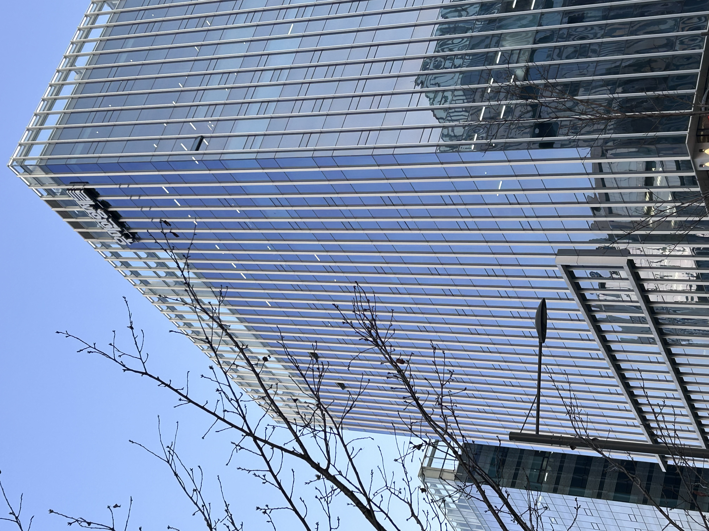
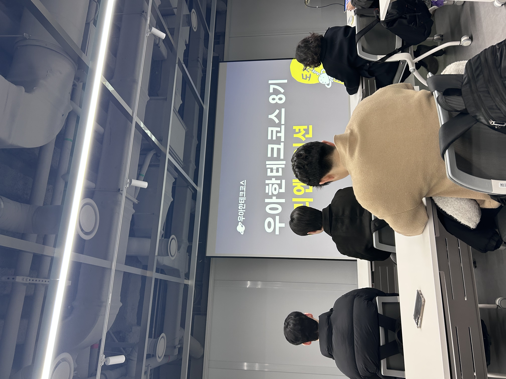
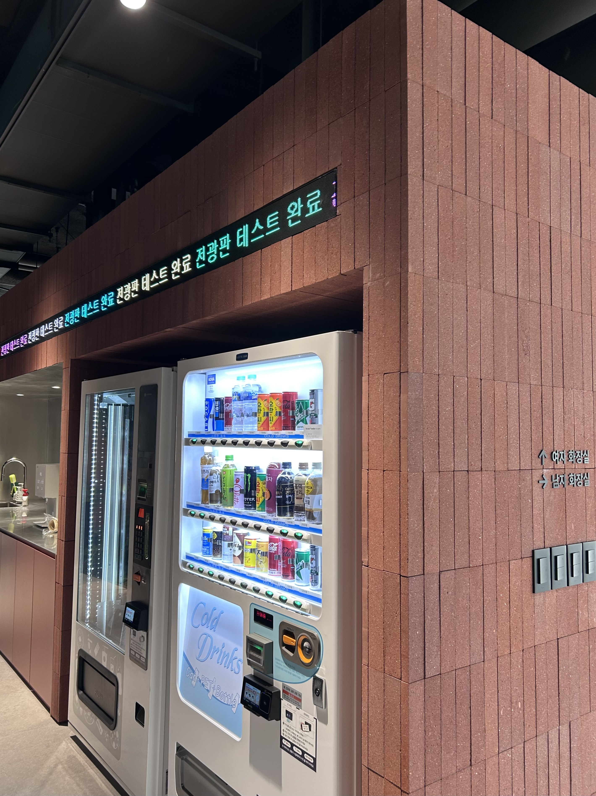
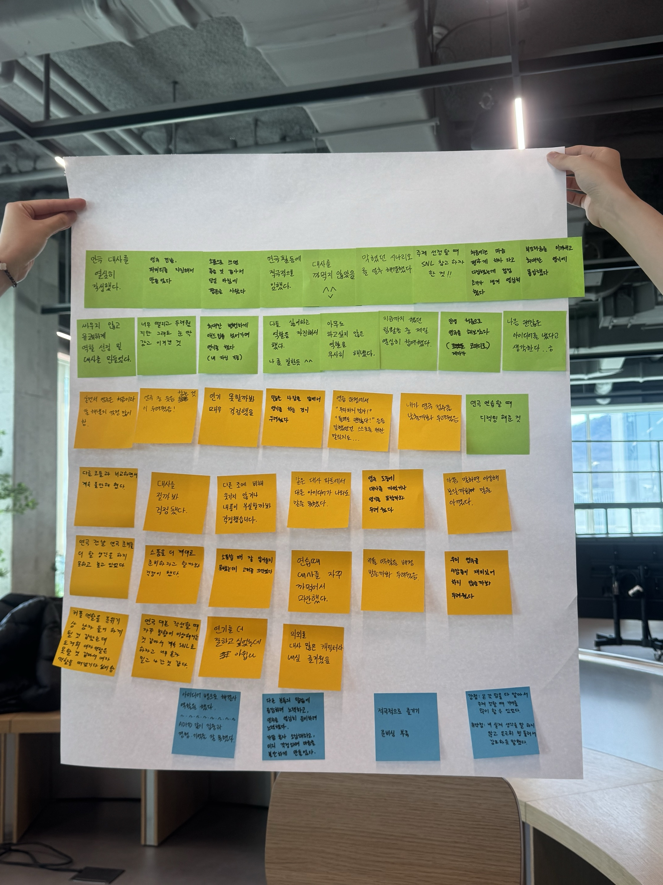
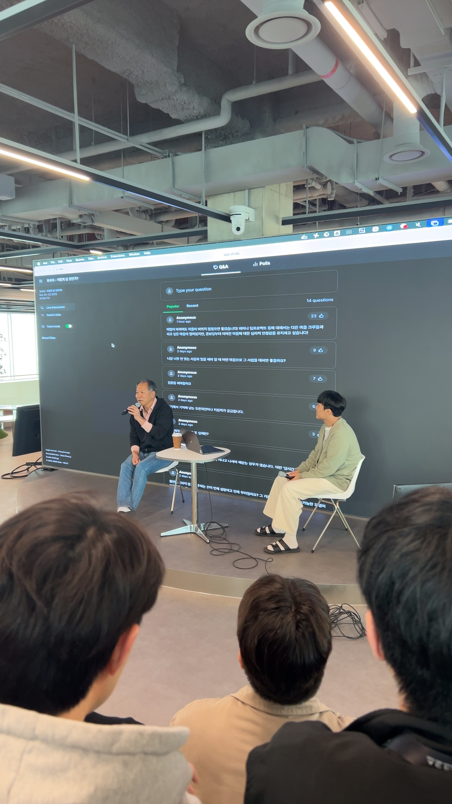
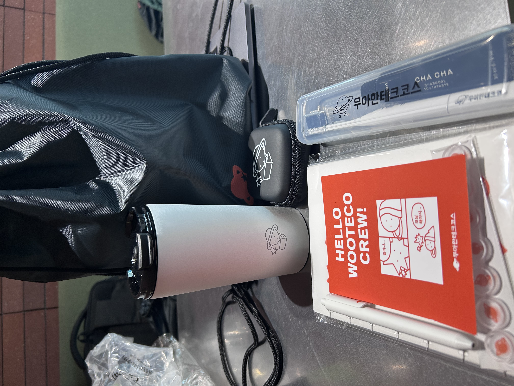

## 나의 우테코 적응기 🪐
### 본격적으로 시작하기 전 😳
우아한테크코스에 최종 합격하고 성남시로 이사온 첫 날, 교육을 받게 될 우아한형제들 건물에 미리 찾아와 높은 유리 빌딩을 올려다보며 얼떨떨하면서도 설레는 기분을 만끽했다.

> 여기서 교육을 받게 되겠구나,, 아니 근데 내가 진짜 우테코에 합격했다고?

---

### 첫날 OT
그토록 오고싶었던 우아한테크코스에 온 것이 실감이 나지 않아, 첫 OT 날은 괜히 잠도 설쳤던 것 같다. 당일이 되어 우아한테크코스 건물에 들어와 11층, 12층, 13층을 여기저기 누비며 속으로 놀라기 바빴다. 다양하게 꾸며진 학습 공간들, 회의실, 우물가, 그리고 안락해보이는 빈백까지. 몰입할 수 있는 최적의 환경이 마련되어 있다는 생각이 들었다.

---

### 첫번째 페어 프로그래밍
첫번째 페어 프로그래밍 미션으로 제미나이 캔버스 미션이 주어졌다. 모든게 낯설었다. 페어? 미션? 제미나이 캔버스? 리뷰어? 설렘 반 걱정 반을 안고 페어를 시작했다. 생각보다 재미있었다.

> 나: 초록! 우리 소크라테스 챗봇 기능도 추가하는 것에 대해 어떻게 생각하시나요?

> 초록: 어? 좋은데요?

페어와 서로 열심히 의견을 내며, 방향이 다를 때면 소통을 통해 조율해나갔다. 처음으로 의견을 조율해나가려면 어떻게 소통해야 할지 고민해본 순간이였다. 프리코스를 여러 차례 경험해보았지만, 직접 와서 경험해보는건 다르다는 생각이 들었다. 그제서야 "우테코에서는 이런 활동들을 하는구나" 싶었다.

제미나이 캔버스도 처음 사용해보았는데, AI의 발전 속도에 감탄을 감추지 못했다. 프롬프트를 작성하고 딸깍하면 웹 애플리케이션이 완성되어 있었다. 기획부터 개발, 다른 크루들에게 사용해보라며 마케팅까지 해본 경험이었다. '프롬프트를 어떻게 하면 잘 작성할 수 있을까? 어떻게 하면 AI에게 내 의도를 잘 전달할 수 있을까?'에 대한 고민을 할 수 있는 시간이었다. 이 때까지도 아직 우테코에 왔다는 사실이 그리 실감나진 않았다. 마을과 데일리 조원이라는 공동체 생활에 적응해가는 시점이었다.

---

### 내가 생애 처음으로 연극을? 연기를?
조원들과 연극도 진행했다. 우테코 생활을 하며 연극 조원들과 가장 끈끈할 것이라는 코치의 말씀이, 연극이 끝날 때쯤 이해가 되었던 것 같다. 함께 대본을 처음부터 끝까지 써내려가고, 그 과정에서 크고 작은 의견들이 부딪힐 때면 대화를 통해 조율해나갔다. 부끄러움을 무릎쓰고 각자가 맡은 역할을 연기하는 서로를 보며, 동지애가 느껴져 더 가까워진 기분이 들었다.🤣

---

### 드디어 우테코에 스며들다! 🧐
브라운과의 수다 타임과 포비와의 수다 타임도 열렸다. 항상 입학 설명회로만 보던 코치와 우테코의 수장인 포비를 두 눈으로 직접 보니, 연예인을 본 듯한 기분이 들어 신기했다. 두근두근 설레는 마음이 점차 부풀어오르던 순간이였다.

네오가 우테코 굿즈도 나눠주었다. 굿즈를 주시지 않을까 내심 기대하고 있었는데, 정말 기뻤다. 굿즈 바구니에는 수첩, 텀블러, 치약・칫솔 세트, 이어폰 케이스가 들어있었다. 특히 수첩과 텀블러, 치약・칫솔 세트가 너무 실용적이라 마음에 들었다!!

코치와의 수다 타임도 갖고, 굿즈도 받고, 매일 같은 시간에 데일리 활동도 하며 점차 우테코 환경에 적응하기 시작했다. 오늘 하루 나에게 주어지는 자유 시간동안, 어떤 학습에 얼마만큼의 시간을 할애할지 미리 계획하는 시간이 정말 소중하게 느껴졌다.

---

### 대망의 장기 미션 😵‍💫
장기 미션을 진행하면서부터는 어느 정도 우테코에 적응된 이후였다. 피즈와 페어가 되어 일주일 동안 매일 함께 아침부터 밤까지 장기 미션을 수행했다. 장기 미션은 이미 규칙부터 복잡했기에, 페어가 시작하기 전에 장기 규칙과 함께 의논해보고 싶은 부분을 미리 정리해갔다.

페어를 하며 느낀 점은 피즈는 두뇌 회전 속도가 정말 빨랐다. 내가 CPU 코어 수가 4개면 피즈는 7개인 느낌,,? 나는 로직을 구현하면서 막히는 부분이 오면 최소 5분 이상은 로딩이 필요한데, 피즈는 한 번 생각하면 바로 어떻게 코드로 구현할지 머릿속으로 그려지는 것 같았다. 그런 모습에 주눅이 들기도 하고, 나도 그만큼 더 열심히 생각하는 습관을 가져야겠다 싶었다. 피즈와 같은 크루도 있고, 나같은 크루도 있는거겠지!!

장기 미션을 진행하며 스타크가 뽀롱뽀롱 마을 사람들에게 같은 질문을 계속 던지는 모습을 보았다.

> 둘 중에 어떤 방향으로 하셨어요?

다른 사람들은 어떤 근거를 가지고, 해당 방향을 선택하게 되었는지 자연스레 의견을 나누는 모습을 보며 확실히 우테코에 왔다는게 실감이 났다.

> 이게 우테코지!

---

### 레벨 1을 돌아보며 ⭐️
데일리 조원인 초록과 도우너와 함께 클래스, 객체, 인스턴스의 차이에 대한 토론을 했다. 도우너의 '유틸리티 클래스가 객체인가?'에 대한 질문에 대해서 얘기하다가 생각나 먼저 꺼낸 질문이었다. 1차 학습을 마친 후에 이해한 바를 설명해보았지만, 다른 크루들의 설명이 더 명확하다는 생각이 들었다.

> 나: 객체는 메모리에 올라가는 조금 더 물리적인 관점이고, 인스턴스는 객체를 내가 원하는데로 정의할 수 있는 일종의 관계의 관점 아닐까요??

> 초록: 로지가 말한 인스턴스의 정의는 객체의 정의 아닌가요?

> 도우너: 클래스는 붕어빵의 틀이고, 객체는 틀로 찍어낸 실제 붕어빵, 인스턴스는 팥 붕어빵, 슈크림 붕어빵, 피자 붕어빵처럼 내가 실제로 들고 있는 붕어빵으로 이해하고 있어요.

> 나: 오,,, 이해가 잘되네요 🧐

내가 이해한 바와 다른 크루들이 이해한 바가 다를 때, 이야기를 이어나갈 수가 없었다. 또한 다른 크루들의 설명을 들었을 때, 해당 키워드에 대한 이해의 깊이가 전보다 더 깊어지는 내 자신을 보며, 나에게 효과적인 학습 방법이 필요하다는 생각이 들었다.

더 나아가 이해의 정의는 '다른 사람과 내가 알고있는 것이 각각 다르더라도, 내가 알고있는 것에 대해 자신있게 말할 수 있는가?'와 '해당 개념을 잘 모르고 있는 크루를 120% 이해시킬 수 있는가?'로 정리되었다.

레벨1이 벌써 끝났다는 것이 믿기지가 않다. 나는 레벨1에서 무엇을 얻었는가를 돌아본다면, 우테코를 시작하기 전과 현재의 나를 비교했을 때 학습에 대한 자세가 조금은 바뀌었다고 말할 수 있다. 이는 곧 함께하는 열정적인 크루들과 했던 토론이 한 단계 더 깊이 생각해보는 습관을 자리매김 했기에 가능했다고 생각한다. 레벨2에서는 궁금했던 부분을 '어떻게 확실히 나만의 지식으로 만들 것인가?'를 고민해야겠다는 생각이 들었다.

늘 우테코 크루가 되는 꿈을 꾸며 직접 경험해보지 못한 것에 대한 선망이 존재했다. 우테코는 나에게 그저 다가가려 할수록 멀어지는 존재였다.

> 우테코는 도대체 어떤 곳일까?

막상 우테코에 와보니 선망하던 존재는 가장 익숙하고 편한 공간이 되었고, 어느새 나는 우며들었다,,🫠 레벨 1이 끝나니, 시간이 빠르게 지나가는게 아쉬울 따름이다. 수료 후 후회 없이 스스로 최선을 다했다고 다독일 수 있도록, 끝까지 열심히 달려야겠다. 
그저 의식의 흐름대로 우테코 커리큘럼을 따라가는 것이 아닌, 내가 하고 있는 활동을 **'왜 하는가?'**에 대해 스스로 생각하고 **주도적으로 인생을 설계하는 사람**이 되고 싶다.
