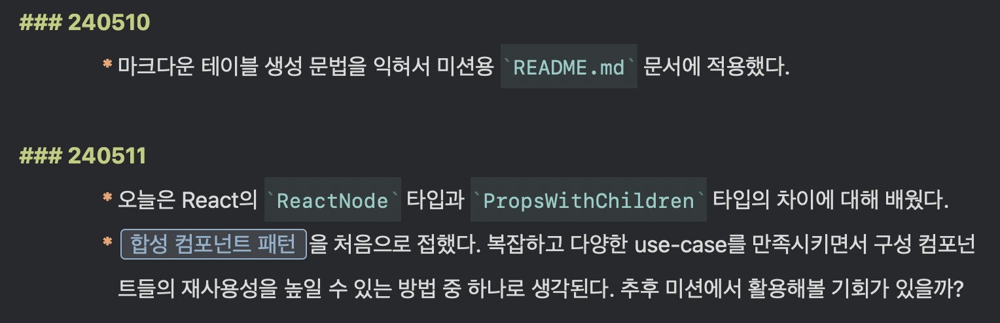
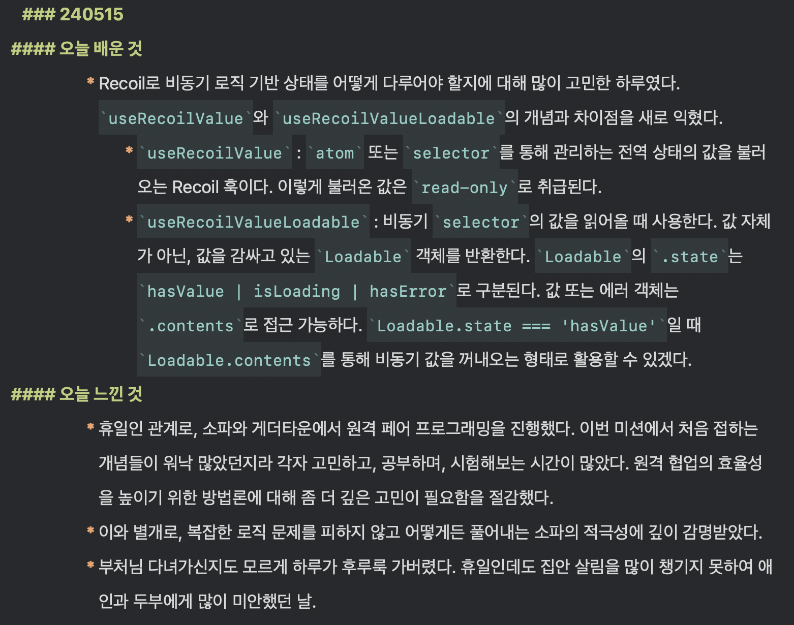
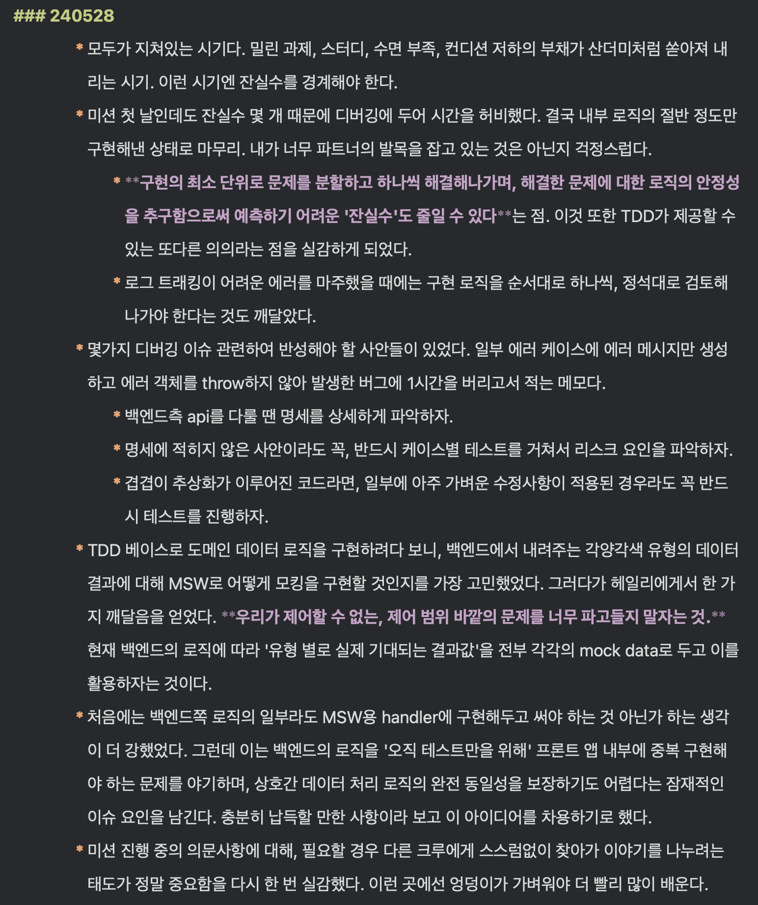

## 제자리걸음을 반복하는 것만 같은 정체감

무지를 드러내는 것에 대한 두려움을 걷어내고 나면 모든 배움의 순간이 순탄하게 이어질 것으로 생각했습니다. 하지만 현실은 기대와 달랐어요. 레벨2에 들어선 직후부터 살아생전 접해 본 적 없는 온갖 기술과 테크닉을 숨 가쁘게 삼키는 일이 반복되었습니다. 자연스럽게 제 일과는 주어진 미션 해결에 급급한 채로 돌아가게 되었어요. 돌봄과 배움을 병행하는 사람으로서 학습에 온전히 전념하기 어려웠던 여건은 이런 어려움을 더욱 키웠습니다.

그러다 보니 레벨1 시절엔 보이지 않던 마음의 응어리가 드러나기 시작했어요.

> "배운 걸 내 것으로 만들 새도 없이 눈앞의 문제만 겨우 해결하는 것 같아."
>
> "시간은 촉박하고 해야 할 건 많은데, 이 모든 경험이 축적되지 않고 휘발되는 것 같아."

모두가 저마다의 길을 향해 치열하게 전진하는 동안 홀로 제자리걸음을 반복하는 것 같다는 정체감에 사로잡혔습니다. 이 정체감을 꼭 해소하고 싶었어요. 주어진 환경과 여건이 제각각인 타인과의 비교가 불필요하다는 사실은 잘 알고 있었습니다. 그저 저 자신이 그동안 정체되지 않고 꾸준히, 작게나마 성장해 왔다는 확신을 얻고 싶었습니다.

### 정체감 극복을 위한 실험 설계

이렇게 하여 `"작은 성취의 경험을 모아 학습에 대한 정체감을 극복하자"`는 새로운 목표가 탄생했습니다. 목표를 이루기 위해 `"매일 작은 성취의 순간을 떠올려보고, 각각의 성취를 한 문장씩 요약해서 기록한다"`는 실험도 고안했습니다.

실험을 시작하기에 앞서, 저는 아래와 같은 원칙을 먼저 세웠습니다.

1. 매일 작성한다.
2. 단 한 줄의 기록이라도 좋다.
3. 우아한테크코스 외의 개인적인 성취도 소재로 허용한다.

실험으로부터 의미 있는 결과를 얻으려면 꾸준한 실천이 필요합니다. 하지만 실천의 과정이 마치 마감을 앞둔 과제처럼 압박감을 주는 상황은 원치 않았어요. 성취의 소재를 우아한테크코스의 교육 내용에만 국한하고 싶지도 않았습니다. 캠퍼스 바깥의 일상 역시 저에게는 소중한 삶의 일부분이기 때문이에요.

이런 마음가짐으로 지난 5월 8일부터 실험을 시작했습니다.

---

### 기록 실험의 변천사

#### 실험 1주 차

처음에는 키워드 위주의 짧은 문장으로만 적었어요. 이를테면 `"마크다운 테이블 생성 문법을 익혀서 미션용 'README.md' 문서에 적용했다"`, `"오늘은 React의 'ReactNode' 타입과 'PropsWithChildren' 타입의 차이에 대해 배웠다"` 같은 식이었죠.

#### 실험 2주 차

실험 2주 차가 되니 단문을 작성하는 일에 익숙해진 것을 느꼈어요. 기록의 분량이 자연스럽게 늘어나기 시작했습니다. 제가 익힌 개념들, 다른 크루들로부터 얻은 아이디어, 미션을 해결하면서 터득한 점들도 조금씩 메모하게 되었어요. 이는 어떠한 노력 없이도 자연스럽게 생긴 변화였습니다.

#### 실험 4주 차

실험 4주 차에 이르러, 데일리 노트는 장문의 일기와 같은 형태로 발전했습니다. 그날그날 품었던 세세한 고민과 이를 해결해 나간 과정도 숨김없이 드러내게 되었어요. 고민을 해결하는 과정에서 배운 내용을 더 깊이 정리하고 싶다는 욕심도 생겼습니다. 단 하나의 짧은 문장으로 시작했던 매일의 기록이, 어느덧 저만의 성장 일지로 변해가고 있었습니다.

---

### 정체감 극복 실험이 내게 남긴 것

이처럼 나날이 변해가는 데일리 노트를 돌아보며 깨달았습니다. 제가 스스로 생각했던 것보다 훨씬 더 성장해 왔다는 것을 알게 되었어요. 레벨2 과정을 시작하던 당시의 저는 React가 뭔지도 몰랐던 사람이었습니다. 이제는 하나의 애플리케이션 안에 다양한 컴포넌트를 조합해 수천 줄의 React 코드를 써낼 수 있는 사람이 되었습니다.

대단한 경험이 있어야만 무언가를 이룰 수 있는 건 아니라는 점도 실감했습니다. 오늘날의 저를 있게 한 원동력은 한순간의 눈부신 성공이 아니라 매일 묵묵히 쌓아 올린 작은 발자국들이었습니다. 자그마한 보폭으로 조금씩 전진해 온 경험들이 모여 훗날 거대한 도약을 이루어낼 수 있음을 이제는 압니다. 그러니 더 이상 정체감에 초조해할 필요도 없어졌어요.

자신만의 속도로 작은 성취의 경험을 매일 꾸준히 만들자는 것. 이것이 이번 유연성 강화 실험을 통해 얻은 소중한 교훈이자 결심입니다.
