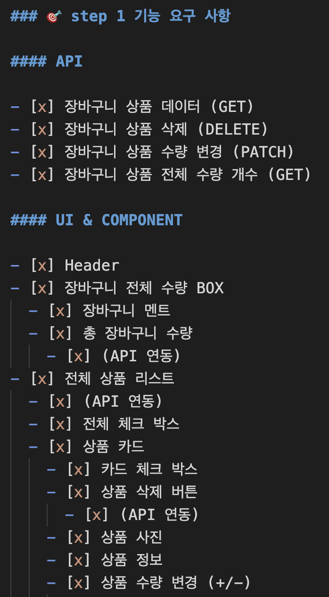
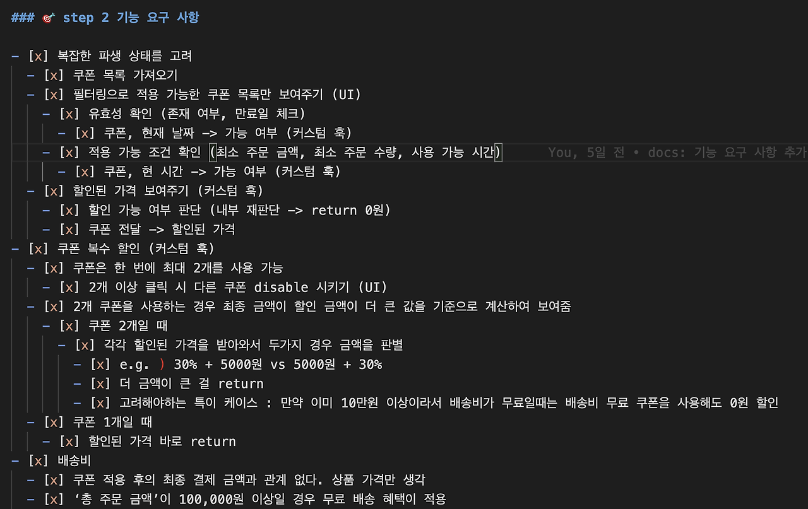

# TDD 적으로 사고하며, 차근차근 꼼꼼하게!

레벨2 유강스 목표는 `미션을 차근차근 스텝별로 생각하며 생각 후 코딩하기`였다.

급한 성격과 시간 안에 제출해야 하는 압박감에 늘 미션을 진행할 때 차근차근 진행하지 못하고, 빨리빨리 하고자 하는 마음이 컸기 때문이다.

하지만 `빨리빨리` 미션을 진행하려다 보면 늘 실수가 따라온다.

A 기능 개발을 하다가 B 기능의 버그를 발견하게 되면 B 기능을 고치게 되고, 고치다가 C 코드가 맘에 안 들면 C를 고치게 되고...

이러한 상황이 반복되다 보니 이를 고치기 위해 개발 Todo 를 작성해서 체크를 하면서 진행하기도 했다.

물론 이것도 Todo 가 있다는 걸 잊기 전까지만 유효했다.

---

 

이러던 과정 속 준이 `TDD 적으로 사고하기`라는 주제로 수업을 진행했다.

사실 TDD는 레벨 1부터 들어왔지만 늘 귀찮은 존재였다.  
요구사항이니 TDD로 하려고 하다가도 까먹고 로직을 다 짠 후 급하게 테스트 코드를 짠 적도 있다.

하지만, 이 수업에서 `TDD 사고방식으로 문제 분석하기` 수업 시트를 차근차근 따라가며 준이 만들어놓은 TDD의 길을 따라갔다.

### **이 과정은 나에게 TDD 적으로 문제를 해결해 보는 지도를 그려주었다.**

유강스 액션 플랜을 고민하던 나는 이를 적용해 보기로 했다.

 

---

 

## 지도를 따라 길을 나서보자

### 한 걸음. 상세한 기능 요구 사항 작성해 보기

**가장 처음에는 기능 요구 사항을 상세히 적어보았다.**

아래는 **내가 이전에 주로 작성했던 기능 요구 사항 명세서**이다.

 
 

대부분 컴포넌트 단위로 어떤 작업을 해야 하는지 명시하는 기능만 했다.  
그러다 보니 진행하면서 작성한 목록을 굳이 확인하지 않아도 문제가 없었다.  
당장 눈앞에 보이는 피그마를 글로 바꾼 것과 다를 바가 없기 때문이다.

그리고 이 명세서는 TDD 적으로 **미션을 시작하면서 적어본 기능 요구 사항** 이다.

 
 

이전보다 최대한 상세히 작성하려고 노력했다.  
그러자, 이 기능에서 어떤 걸 더 고려해야 하는지, 내부 로직이 어떻게 될 것인지를 더욱 명확하게 나타낼 수 있었다.

기능 명세서를 그냥 적는 것이 아니라

어떤 기능이 있는지,
어떤 로직을 가질 건지,

이 로직이 어떤 인풋을 받아서,  
어떤 아웃풋을 가질 건지

생각하면서 작성하다 보니 기능에 대해 코드를 짜기 전에 생각해 볼 수 있었다.

### 두 걸음. 실패하는 테스트 코드 작성해 보기

물론 TDD라고 해서 무조건 테스트를 먼저 작성해야 하는 것은 아니지만 아직 TDD 연습이 덜 된 나에게는 의식적으로 테스트를 먼저 짜는 연습이 필요하다고 느꼈다.  
그렇지 않으면 노력이 무색하게 로직 짜는 것에 집중해서 테스트 코드를 잊어버릴 거 같았다.

테스트를 작성하면서 어떤 변수가 있을지, 어떤 케이스가 있을지도 차근차근 생각해 볼 수 있었다.

### 세 걸음. 로직 완성하기

이제 어떤 로직을 가진 훅이, 실행되면 어떤 결과를 가질 것인지도 작성했다.  
이를 토대로 내부 로직을 작성하면 완성이다.

---

 

**결과적으로** 복잡한 파생 상태도 마음에 들게 관리할 수 있었고, 지난 미션들과 달리 많은 걸 배운 미션이라는 느낌을 강하게 받았다.

TDD 적으로 사고하는 방식은 **차근차근 스텝별로 기능을 생각**하게 되었고, 로직을 코드로 **구현하기 전에 로직의 대략적인 내용을 머릿속으로 먼저 정리**할 수 있었다.

이 경험을 잊지 말고, 잘 정리해서 아주 내 것으로 만들고 싶다.
