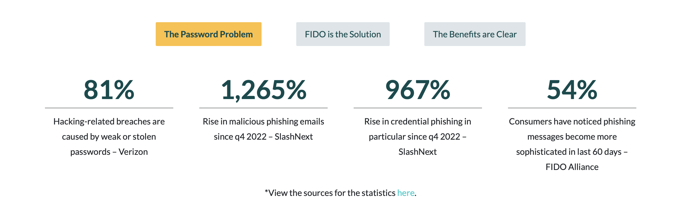
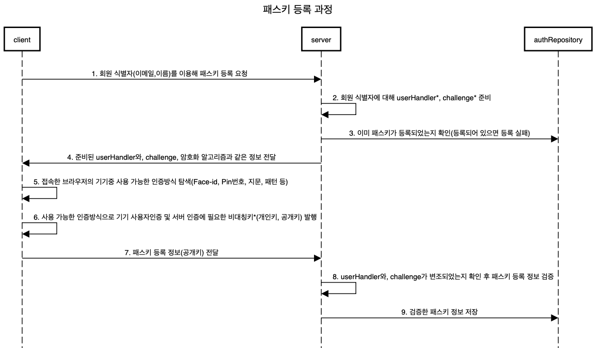
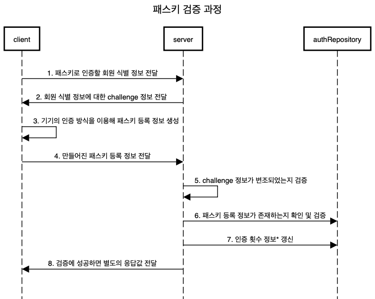
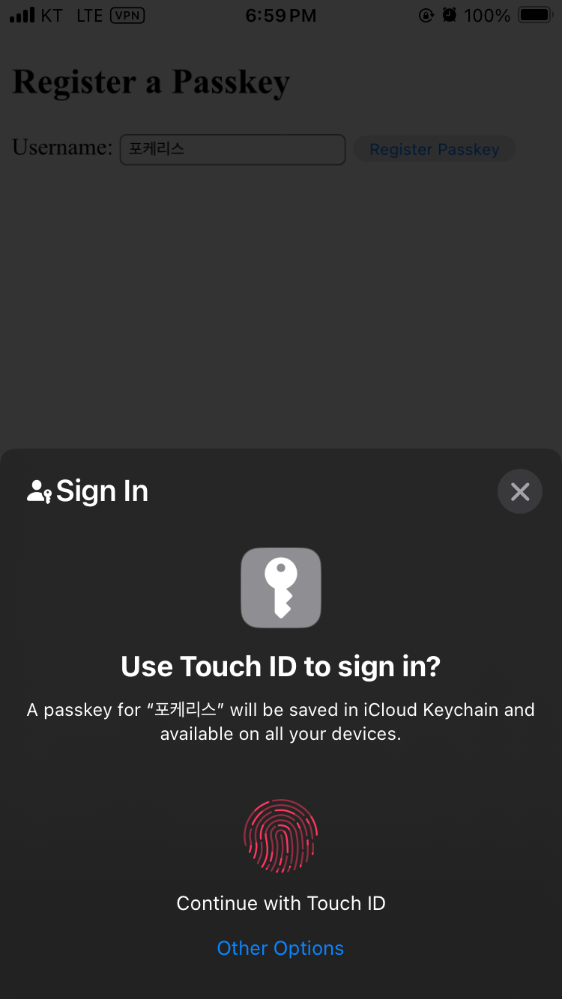
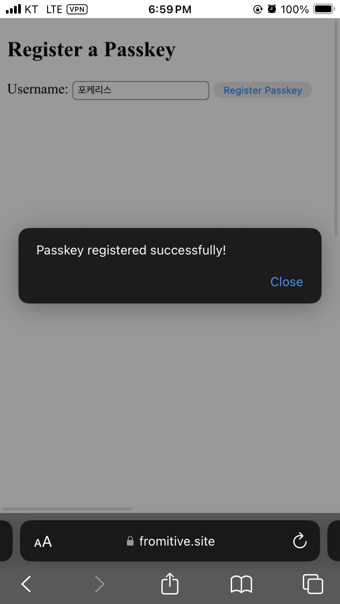
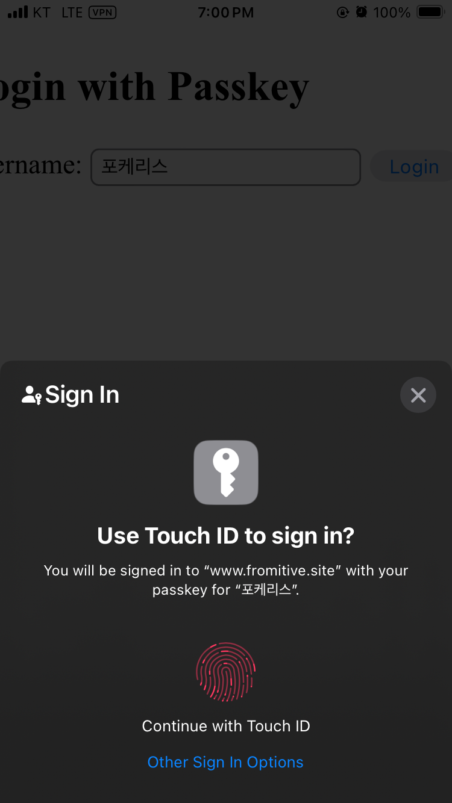
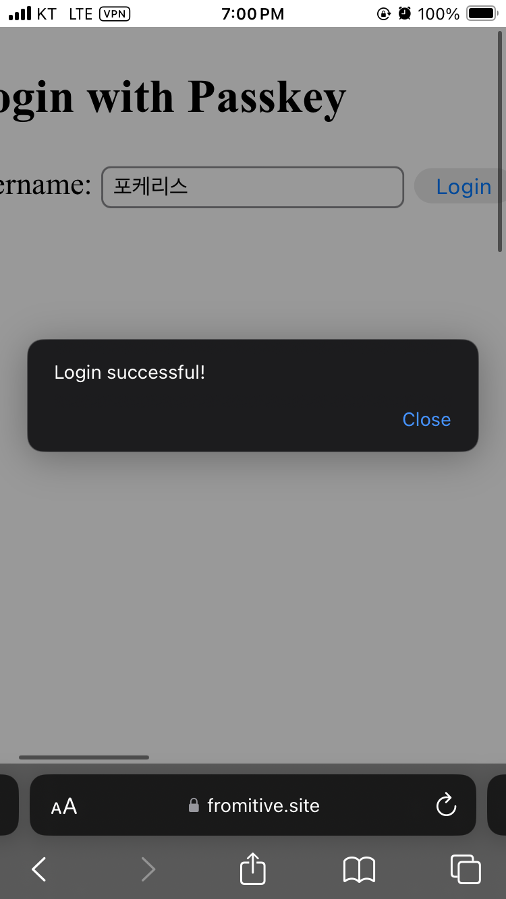

# 패스키(Passkey)란 무엇인가

패스키(Passkey)는 로그인 시 패스워드 없이 등록된 기기를 이용하여 인증하는 인증 방식이다.

구글에 로그인 할 때 아래처럼 기기에 등록된 계정에 로그인하기 위해 지문을 요청하는 작업이 나타나는데 이를 구현하게 하는 것이 패스키의 역할이다.

<div align="center">
   
  <p style="text-align: center;">그림 1 - 구글 로그인 시 나타나는 패스키</p> 
</div>

패스키는 웹사이트의 패스워드를 외우고 있지 않아도 기기가 안전하게 관리하고 간편하게 인증할 수 있는 장점이 있다.

우리는 패스키가 나오기 전까진 회원 인증을 위해 아이디와 패스워드를 기억하며 로그인해왔다.

이로 인해 사이트가 달라도 같은 아이디와 비밀번호를 사용하는 경우가 많았는데, 어느 한 사이트에서 회원 아이디와 비밀번호가 유출되면 다른 사이트도 똑같이 피해를 볼 수 있었다.

FIDO alliance 따르면 패스워드로 인한 피해는 아래와 같이 나타났다고 한다. 패스키는 이처럼 패스워드 사용을 감소시키기 위해 개발된 메커니즘이다.

<div align="center">
   
  <p style="text-align: center;">그림 2 - 패스워드 문제로 인한 피해 증가량 <a href="https://fidoalliance.org">(출처 : FIDO)</a></p>
</div>

## 패스키의 사용 단계

패스키는 아래의 두 단계를 거쳐 사용할 수 있다.

```
1. 패스키 등록 과정

2. 패스키 검증 과정
```

패스키를 사용하기 위해선 사이트에서 회원 계정에 패스키로 인증할 기기를 등록해야 한다.

이후 회원이 로그인 할 때 기기에 등록된 패스키를 이용하여 인증할 수 있다.

### 패스키 등록

패스키를 등록하려먼 아래의 순서대로 진행된다.

<div align="center">
   
  <p style="text-align: center;">그림 3 - 패스키 등록 과정</p>
</div>

`userHandler`: 등록된 패스키를 불러오기 위해 필요한 키 **패스키는 여러 기기를 등록 가능하다**

`challenge`: 패스키 등록 정보가 중간에 변조되었는지 검증하기 위한 난수. 클라이언트는 challenge를 기기안에 있는 개인키로 암호화 한 후 서버에 전달한다. 이후 서버는 클라이언트가 전달한 공개키로 복호화 하여 패스키 등록 정보가 변조되었는지 확인할 수 있다.

`비대칭키`: 암호화하는 키와 복호화 하는키가 다른 키 쌍 개인키로 암호화 한 정보는 공개키로만 복호화가 가능하고 공개키로 암호화 한 정보는 개인키로만 복호화가 가능한 특징이 존재한다. SSL의 암호화 키 전달이나 전자서명에 사용된다.

### 패스키 검증

패스키를 검증하려면 아래의 순서대로 진행된다.

<div align="center">
   
  <p style="text-align: center;">그림 4 - 패스키 검증 과정</p>
</div>

`인증 횟수 정보`: 패스키는 같은 기기 정보를 복사하여 기기 인증을 악용하는 것을 방지하고자 인증 횟수를 갱신할 수 있다. 인증 횟수 정보는 클라이언트 측에서 계산한 후 서버에 전달되는데 만일 기기를 복재한 후 인증하고자 한다면 인증 횟수가 현 기기와 차이가 날경우 인증하지 못하도록 방지할 수 있다.

## 패스키 구현

패스키는 Web Authentication API(WebAuthn)을 사용하여 구현이 가능하다. webAuthn은 FIDO2 기반 인증을 구현하기 위한 웹 표준 기술이다. 패스키는 쉽게 말해서 FIDO2 기반 인증 기술을 구현한 구현체라고 생각하면 된다.

언어별로 WebAuthn 라이브러리를 지원하는 목록은 [passkeys.dev에서 확인 가능하다.](https://passkeys.dev/docs/tools-libraries/libraries/) 


### Java 기반 WebAuthn

java 어플리케이션에서 지원하는 라이브러리는 [yubico의 java-webauthn-server](https://developers.yubico.com/java-webauthn-server/)이다. yubico는 W3C에서 [webauthn 웹 표준을 개발하기 위해](https://www.w3.org/TR/webauthn-2/)) 참여한 단체이다.

패스키를 구현하기 위해선 아래의 의존성을 추가해야 한다.

``` groovy
implementation("com.yubico:webauthn-server-core:2.5.3")
```

#### CredentialRepository 구현

추가한 후에는 패스키 등록 정보를 저장하기 위한 저장소인 `CredentialRepository`를 구현해야 한다. 구현하기 쉽게 하기 위해 InMemory기반 저장소로 아래와 같이 구현하였다. 

``` java

@Component
public class InMemoryCredentialRepository implements CredentialRepository {

    private final Map<ByteArray, List<RegisteredCredential>> credentials = new ConcurrentHashMap<>();
    private final Map<String, ByteArray> userIdMapping = new ConcurrentHashMap<>();

    @Override
    public Set<PublicKeyCredentialDescriptor> getCredentialIdsForUsername(String username) {
        ByteArray userId = userIdMapping.get(username);
        if (userId == null) {
            return Collections.emptySet();
        }
        return credentials.getOrDefault(userId, Collections.emptyList()).stream()
                .map(registeredCredential ->
                        PublicKeyCredentialDescriptor.builder()
                                .id(registeredCredential.getCredentialId())
                                .build())
                .collect(Collectors.toSet());
    }

    @Override
    public Optional<ByteArray> getUserHandleForUsername(String username) {
        return Optional.ofNullable(userIdMapping.get(username));
    }

    @Override
    public Optional<String> getUsernameForUserHandle(ByteArray userHandle) {
        return userIdMapping.entrySet().stream()
                .filter(entry -> entry.getValue().equals(userHandle))
                .map(Map.Entry::getKey)
                .findFirst();
    }

    @Override
    public Set<RegisteredCredential> lookupAll(ByteArray credentialId) {
        return credentials.values().stream()
                .flatMap(Collection::stream)
                .filter(cred -> cred.getCredentialId().equals(credentialId))
                .collect(Collectors.toSet());
    }

    @Override
    public Optional<RegisteredCredential> lookup(ByteArray credentialId, ByteArray userHandle) {
        return credentials.getOrDefault(userHandle, Collections.emptyList()).stream()
                .filter(cred -> cred.getCredentialId().equals(credentialId))
                .findFirst();
    }

    // 패스키를 등록하기 위해 추가 구현
    public void addCredential(String username, RegisteredCredential credential) {
        ByteArray userId = userIdMapping.computeIfAbsent(username, (k) -> credential.getUserHandle());
        credentials.computeIfAbsent(userId, k -> new ArrayList<>()).add(credential);
    }

    // 인증 후 credential의 인증 횟수를 업데이트 하기 위해 사용
    public void updateSignatureCount(String username, ByteArray credentialId, long newSignatureCount) {
        ByteArray userId = userIdMapping.get(username);
        if (userId == null) {
            return;
        }

        List<RegisteredCredential> userCredentials = credentials.get(userId);
        if (userCredentials != null) {
            List<RegisteredCredential> updatedCredentials = userCredentials.stream()
                    .map(credential -> updateCredential(credentialId, credential, newSignatureCount))
                    .toList();
            credentials.put(userId, updatedCredentials);
        }
    }

    private RegisteredCredential updateCredential(ByteArray credentialId, RegisteredCredential credential,
                                                  long newSignatureCount) {
        if (credential.getCredentialId().equals(credentialId)) {
            return RegisteredCredential.builder()
                    .credentialId(credential.getCredentialId())
                    .userHandle(credential.getUserHandle())
                    .publicKeyCose(credential.getPublicKeyCose())
                    .signatureCount(newSignatureCount)
                    .build();
        }
        return credential;
    }
}
```

#### RelyParty 설정

패스키 등록 및 검증을 위해선 `RelyingParty`를 설정해야 하는데 `RelyingParty`의 역할은 아래와 같다.

``` 
1. 요청값 검증을 위한 challenge 및 암호화 알고리즘 스팩 정보 생성
2. 패스키를 등록 및 검증할 사이트 정보 전달
3. 클라이언트가 전달한 요청값들을 검증
```
클라이언트에게 보낼 임의의 challenge값을 생성하거나 암호화 알고리즘 스팩 전달하고 클라이언트가 패스키 등록 및 인증을 하기 위한 요청값들을 검증하는 역할을 한다. `RelyingParty`를 설정하기 위해선 위의 `CredentialRepository`를 반드시 등록해줘야 한다.

``` java
    @Bean
    public RelyingParty relyingParty() {
        RelyingPartyIdentity rpIdentity = RelyingPartyIdentity.builder()
                .id("www.fromitive.site")
                .name("passkey 예제")
                .build();

        // CredentialRepository 인스턴스 생성
        return RelyingParty.builder()
                .identity(rpIdentity)
                .credentialRepository(inMemoryCredentialRepository)
                .origins(Set.of("https://www.fromitive.site"))
                .build();
    }
```

#### 패스키 등록

패스키를 등록하기 위해선 아래의 순서대로 요청해야 한다.

```
1. 등록할 계정 식별 정보 서버에 전달(/register/requset)
  - 서버는 계정 식별 정보를 바탕으로 RelyingParty를 이용해 challenge 요청 값 생성
  - 요청 값은 재사용을 위해 세션에 저장
2. 클라이언트는 서버가 전달한 값을 이용해 패스키 정보 생성
3. 패스키 정보를 서버에 전달(/register/finish)
  - 세션에 저장한 요청 값을 불러와 서 변조 여부 검증
  - 성공적으로 검증하면 패스키 정보를 CredentialRepository에 저장
```

처음에 클라이언트가 패스키 등록 요청을 위해 `GET /register/request?userName=`을 요청한다. 이에 서버는 클라이언트의 인증 정보를 검증하기 위한 설정 정보 `PublicKeyCredentialCreationOptions`를 생성후 세션에 저장하고 전송한다.

``` java
@GetMapping("/register/request")
    public ResponseEntity<PublicKeyCredentialCreationOptions> startRegistration(@RequestParam String userName,
                                                                                HttpSession httpSession) {
        PublicKeyCredentialCreationOptions options = registerationService.start(userName);
        httpSession.setAttribute("options", options);
        httpSession.setAttribute("name", userName);
        return ResponseEntity.ok(options);
    }
```

이를 받은 클라이언트는 서버가 전달한 정보를 바탕으로 Base64 및 json을 디코딩 하고 WebAuthn API를 이용해 패스키를 생성한다.

> [!WARNING]  
> javascript에서 사용하는 WebAuthn API인 `navigator`는 반드시 도메인 인증이 완료된 SSL를 적용한 HTTPS 환경에서 실행해야한다.
> HTTP로 요청을 전송할 경우 브라우저 측에서 `navigator` 객체를 불러올 수 없게되니 테스트 시 주의해야 한다.

``` javascript
    // 서버에서 받은 challenge와 user ID 값을 URL-safe base64에서 표준 base64로 변환 후 디코딩
    options.challenge = Uint8Array.from(atob(base64UrlToBase64(options.challenge)), c => c.charCodeAt(0));
    options.user.id = Uint8Array.from(atob(base64UrlToBase64(options.user.id)), c => c.charCodeAt(0));

    // Step 2: WebAuthn API를 통해 passkey 생성
    const credential = await navigator.credentials.create({
        publicKey: options
    });

    // Step 3: 생성된 자격 증명 데이터를 서버로 전송합니다.
    const attestationResponse = {
        id: credential.id,
        rawId: toBase64Url(btoa(String.fromCharCode(...new Uint8Array(credential.rawId)))),
        type: credential.type,
          response: {
            clientDataJSON: toBase64Url(btoa(String.fromCharCode(...new Uint8Array(credential.response.clientDataJSON)))),
            attestationObject: toBase64Url(btoa(String.fromCharCode(...new Uint8Array(credential.response.attestationObject))))
          },
          clientExtensionResults: {}
    };
```

이후 클라이언트 측에서 생성한 패스키 등록 정보를 정보를 검증한다. 검증이 성공하면 패스키를 저장하고 클라이언트에 성공 메시지를 전달한다.

``` java
    @PostMapping("/register/finish")
    public ResponseEntity<Void> finishRegistration(
            @RequestBody PublicKeyCredential<AuthenticatorAttestationResponse, ClientRegistrationExtensionOutputs> credential
            , HttpSession session) {
        PublicKeyCredentialCreationOptions options = (PublicKeyCredentialCreationOptions) session.getAttribute(
                "options");
        String userName = (String) session.getAttribute("name");
        registerationService.finish(options, credential, userName);
        return ResponseEntity.ok().build();
    }
```

#### 패스키 검증

패스키를 검증하기 위해선 아래의 순서대로 요청해야 한다.

```
1. 인증 요청할 계정 식별 정보를 서버에 전달(/assert/requset)
  - 서버는 인증할 식별 정보를 바탕으로 challenge를 생성
  - challenge 정보는 검증을 위해 세션에 저장 후 클라이언트에게 전달
2. 클라이언트는 전달받은 challenge 정보를 바탕으로 패스키를 인증
3. 서버는 전달 받은 패스키 인증 정보 검증
  - 세션에 저장한 challenge 정보를 불러온 후 인증 정보가 변조가 되었는지 확인
4. 인증이 성공하면 인증 횟수를 CredentialRepository에 업데이트
```

클라이언트가 특정 식별 정보에 대한 패스키 인증을 요청하면 서버는 아래와 같이 `AssertionRequest` 객체를 생성하고 세션에 저장 한 후 클라이언트에 전달한다.

``` java
 @GetMapping("/assertion/request")
    public ResponseEntity<String> startAssertion(@RequestParam String userName, HttpSession session)
            throws JsonProcessingException {
        AssertionRequest request = assertionService.start(userName);
        session.setAttribute("assertionRequestOptions", request);
        String credentialGetJson = request.toCredentialsGetJson();
        return ResponseEntity.ok(credentialGetJson);
    }
```

클라이언트는 서버가 전달한 정보를 디코딩 한 후 `navigator`를 통해 패스키 인증 정보를 생성 

``` javascript
    const loginResponse = await fetch(`/assertion/request?username=${encodeURIComponent(username)}`);
    const assertionOptions = await loginResponse.json();
    const publicKey = assertionOptions.publicKey

    publicKey.challenge = Uint8Array.from(atob(base64UrlToBase64(publicKey.challenge)), c => c.charCodeAt(0));
    publicKey.allowCredentials = publicKey.allowCredentials.map(cred => {
        return {
            ...cred,
            id: Uint8Array.from(atob(base64UrlToBase64(cred.id)), c => c.charCodeAt(0))
        };
    });

    const assertion = await navigator.credentials.get({ publicKey: publicKey });

```

이후 서버는 인증 정보를 검증한 후 성공 여부를 전달한다.

``` java
    @PostMapping("/assertion/finish")
    public ResponseEntity<String> finishAssertion(
            @RequestBody PublicKeyCredential<AuthenticatorAssertionResponse, ClientAssertionExtensionOutputs> credential,
            HttpSession session) throws AssertionFailedException {

        AssertionRequest request = (AssertionRequest) session.getAttribute("assertionRequestOptions");
        String userName = assertionService.finish(request, credential);

        return ResponseEntity.ok(userName);
    }
```

구현된 패스키 예제는 [fromitive 깃허브](https://github.com/fromitive/passkey-example)에서 확인이 가능하다.


## 구현한 패스키 실행

SSL이 적용된 서버에 접속하면 아래와 같이 등록할 수 있는 페이지가 나타난다. 임의의 값을 입력한후 `Register passkey`를 누르면 아래처럼 기기에서 제공하는 인증 방식이 나타난다. 

<div align="center">
   
  <p style="text-align: center;">그림 5 - 패스키 등록 화면</p>
</div>

인증을 성공하면 서버에서 인증이 성공적으로 등록되었다는 응답 값을 보낸다.

<div align="center">
   
  <p style="text-align: center;">그림 6 - 패스키 등록 성공 화면</p>
</div>

등록한 패스키는 login.html에 접속하면 아래와 같이 사용할 수 있고 사용자 정보를 입력하고 기기 인증을 진행한다.

<div align="center">
   
  <p style="text-align: center;">그림 7 - 패스키 인증 화면</p>
</div>

인증에 성공하면 로그인이 성공했다는 메시지가 나타난다.

<div align="center">
   
  <p style="text-align: center;">그림 8 - 패스키 인증 성공 화면</p>
</div>


## 패스키 구현 시 주의할 점

위의 예제에서 봤듯이 패스키는 여러개의 기기를 등록할 수 있으므로 등록에 관한 로직은 사용자 인증을 진행한 후(전통적인 아이디 패스워드 혹은 식별 정보 등) 해당 사용자를 신뢰할 수 있을 때 등록 기능을 사용할 수 있도록 해야한다.

만일 등록한 기기를 더이상 사용하지 못하거나 기기 변경으로 인해 인증에 실패할 경우 다른 인증 방식 또한 제공받아야 한다. 이를 fallback이라고 한다.


## 참고 자료

- https://developer.okta.com/blog/2022/04/26/webauthn-java
- https://developers.yubico.com/java-webauthn-server/
- https://www.w3.org/TR/webauthn-2/
- https://passkeys.dev/docs/tools-libraries/libraries/
- https://fidoalliance.org/passkeys/
