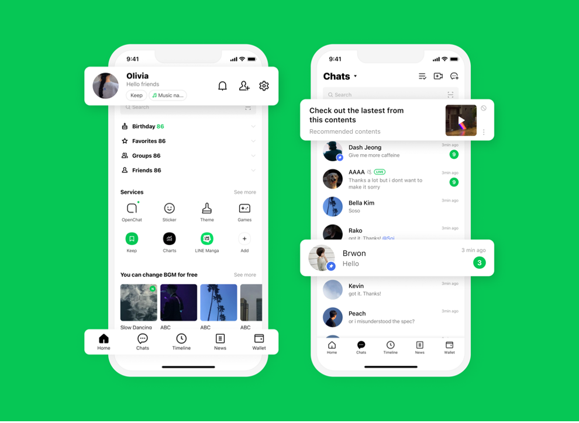
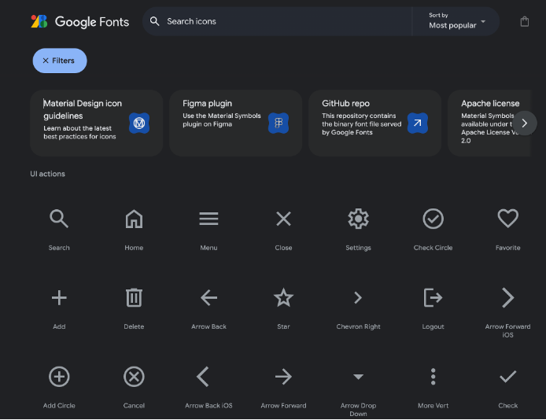

# 1. UI와 UX의 차이

UI와 UX는 제품과 사용자를 연결하는 디자인 요소지만, 역할과 초점이 다르다.

## 1.1. UI (User Interface)

UI는 사용자가 제품을 사용할 때 보거나 상호작용하는 시각적 요소다. 버튼, 레이아웃, 텍스트, 이미지 등이 포함된다. UI의 주된 목적은 사용자가 쉽게 상호작용할 수 있는 명확한 인터페이스를 제공하는 것이다.

### UI의 구성 요소와 활용

• 레이아웃 (Layout): 정보와 요소들이 어떻게 배치되는지를 결정한다.

• 구글의 검색 페이지는 간단한 레이아웃으로 사용자가 쉽게 검색할 수 있도록 돕는다.

• 타이포그래피 (Typography): 글꼴의 스타일과 크기를 결정한다.

• 애플의 웹사이트는 자체적으로 만든 글꼴(San Francisco)을 사용해 정보를 명확하게 전달한다.

• 색상 (Color): 감정적 반응을 유도하고 브랜딩을 강화하는 도구다.

• 라인은 Primary color로 초록색을 활용해 사용자에게 친근감과 안정감을 준다.

• 아이콘 (Icons): 기능을 직관적으로 표현하는 작은 그래픽 요소다.

• 구글의 머터리얼 아이콘은 깔끔하면서도 사용자에게 뜻이 명확하게 전달된다.

• 네비게이션 (Navigation): 사용자가 원하는 정보를 찾고 이동할 수 있도록 돕는 UI 구성 요소다.
• 배달의민족은 직관적인 네비게이션으로 사용자가 쉽게 메뉴를 탐색할 수 있다.

### UI의 목적

• 직관적인 인터페이스 제공

• 사용자 편의성 향상

• 시각적 일관성 유지

• 정보에 쉽게 접근할 수 있도록 지원

• 사용자 피드백 제공

## 1.2. UX (User Experience)

UX는 사용자가 제품이나 서비스를 사용하면서 느끼는 전반적인 경험이다. 사용성이 좋은 제품은 직관적으로 조작할 수 있어 만족도가 높아진다.

### UX의 구성 요소

• 사용성 (Usability): 제품을 쉽게 사용할 수 있는지를 평가하는 요소다.

카카오톡은 사용자가 간편하게 메시지를 주고받을 수 있게 설계되었다.

• 접근성 (Accessibility): 다양한 사용자 그룹이 제품을 문제없이 사용할 수 있도록 설계하는 것이다.

네이버는 시각 장애인을 위한 음성 검색 기능을 제공한다.

• 정보 아키텍처 (Information Architecture): 정보가 어떻게 조직되고 구조화되어 있는지를 의미한다.

위키백과는 주제를 체계적으로 분류하여 사용자가 쉽게 정보를 찾을 수 있게 한다.

• 사용자 흐름 (User Flow): 사용자가 목표를 달성하기 위해 거치는 단계를 의미한다.

신한은행의 모바일 앱은 간편한 송금 절차를 제공해 사용자가 빠르게 이동할 수 있게 한다.

### UX의 목적

• 사용자 만족도 향상

• 사용자 요구 충족

• 사용자의 효율성 향상

• 사용자 신뢰 구축

• 사용자 경험의 일관성 제공

• 장기적인 사용자 충성도 확보

## 1.3. UI와 UX의 상호작용

UI와 UX는 밀접하게 연관되어 있다. UI는 사용자가 제품과 상호작용하는 시각적 요소를 담당하고, UX는 사용자 경험을 책임진다. 좋은 UI는 긍정적인 UX로 이어지고, UX는 UI의 품질을 평가한다.

UI와 UX의 균형

• UI가 좋다고 해서 UX가 반드시 좋은 것은 아니다. 예를 들어, 화려한 디자인의 앱이 복잡한 기능을 요구한다면 사용자는 불편함을 느낄 수 있다.

• 좋은 UX는 UI의 기능적 요소를 반영해 사용자 경험을 극대화한다.

### UI와 UX의 조화로운 설계가 중요한 이유

UI와 UX의 조화로운 설계는 사용자 중심의 제품을 만든다. 기능적 아름다움과 사용자 요구를 충족시키는 디자인이 필요하다.

# 2. UI와 UX가 중요한 이유

오늘날의 디지털 환경에서 UI와 UX는 제품의 성공과 실패를 결정짓는 핵심 요소로 자리 잡고 있다. 사용자들은 더욱 편리하고 직관적인 경험을 기대하고 있으며, 사용자 중심의 디자인이 이루어지지 않으면 시장에서 살아남기 힘든 시대가 되었다.

## 2.1. 사용자 유지율

• 복잡한 UI/UX가 사용자 이탈을 초래: UI와 UX가 복잡할 경우 사용자는 쉽게 혼란을 느낀다. 예를 들어, 쿠팡의 결제 과정이 복잡하면 사용자는 다른 쇼핑몰로 이동할 가능성이 높다.

• 직관적이고 사용하기 쉬운 인터페이스가 사용자 유지율을 향상: 예를 들어, 카카오톡은 간편한 메시지 전송 기능으로 사용자의 만족도를 높이고 있다.

## 2.2. 브랜드 충성도

• UX가 브랜드 이미지에 미치는 영향: 좋은 UX는 사용자의 긍정적인 감정을 이끌어내어 브랜드에 대한 신뢰를 형성한다. 예를 들어, 스타벅스의 모바일 앱은 사용자가 쉽게 주문할 수 있도록 설계되어 브랜드 충성도를 높인다.

• 사용자의 효율성 향상: 예를 들어, 네이버 예약 서비스는 사용자가 간편하게 예약할 수 있도록 UX를 최적화하여 긍정적인 경험을 제공한다.

2.3. 비즈니스 성공
• 매출 증대와 사용자 경험: 매끄럽고 효율적인 UX는 사용자가 제품을 더 자주 사용하게 하여 매출 상승으로 이어질 수 있다. 예를 들어, 쿠팡은 간편한 결제 시스템으로 사용자의 구매 전환율을 높이고 있다.

• 고객 이탈 방지와 충성도 확보: 좋은 UX는 고객의 이탈률을 낮추고 충성도를 높인다. 예를 들어, 신한카드의 앱은 사용자 편의성을 고려한 설계로 긍정적인 경험을 제공하고 있다.

• 경쟁 우위 확보: 뛰어난 UI와 UX는 시장에서 경쟁력을 확보하는 데 중요한 요소다. 예를 들어, 배달의민족은 직관적인 UI와 편리한 UX로 빠르게 시장 점유율을 높였다.

UI와 UX는 사용자 경험을 최적화하고, 브랜드 충성도 및 비즈니스 성공에 중요한 역할을 한다. 이러한 요소들을 고려한 제품 설계가 필요하다.

# 3. 좋은 UI 설계의 원칙

좋은 UI(User Interface) 설계는 단순히 시각적으로 아름다운 요소를 만드는 것이 아니다. UI 설계의 핵심은 사용자가 쉽게 이해하고 상호작용할 수 있는 명확하고 직관적인 인터페이스를 제공하는 것이다. 사용자는 불편함 없이 목적을 달성할 수 있어야 하며, UI의 여러 요소가 유기적으로 조화를 이뤄야 한다.

## 3.1. 일관성 유지

일관성의 중요성
일관성은 UI 설계의 핵심 원칙이다. 모든 UI 요소가 일관되게 설계되면 사용자가 쉽게 이해하고 예측할 수 있다. 예를 들어, 카카오의 다양한 서비스에서 버튼과 색상, 아이콘 스타일이 일관되게 유지돼 사용자가 쉽게 적응할 수 있다.

### 일관성의 적용 방법

• 색상: 버튼과 텍스트의 색상은 일관되게 유지해야 한다

• 글꼴: 텍스트 크기와 스타일은 통일해야 한다.

• 버튼 스타일: 같은 종류의 버튼은 동일한 크기와 모양을 유지해야 한다.

• 아이콘: 아이콘의 크기와 의미는 일정해야 한다.
예를 들어, 애플은 MacOS와 iOS에서 디자인 요소가 통일돼 사용자가 두 플랫폼을 쉽게 사용할 수 있도록 돕는다.

## 3.2. 명확한 네비게이션 제공

네비게이션의 역할
네비게이션은 사용자가 제품 내에서 필요한 정보를 쉽게 찾도록 돕는 중요한 요소다. 예를 들어, 쿠팡은 명확한 네비게이션 구조로 사용자가 원하는 상품을 빠르게 탐색할 수 있게 한다.

### 네비게이션 설계의 원칙

• 직관성: 메뉴 항목은 간결하고 명확하게 라벨링돼야 한다.

• 가시성: 사용자가 현재 위치를 쉽게 파악할 수 있어야 한다.

• 간결함: 네비게이션 항목은 간결하게 구성돼야 한다.

• 응답성: 모바일에서도 최적화된 네비게이션을 제공해야 한다.

## 3.3. 즉각적인 피드백 제공

피드백의 중요성
사용자는 인터페이스와 상호작용할 때 즉각적인 피드백을 원한다. 피드백이 없으면 사용자는 혼란을 느낄 수 있다. 예를 들어, 네이버는 사용자가 검색 후 즉각적으로 결과를 보여줘 사용자가 작업을 확인할 수 있게 한다.

### 피드백 제공 방식

• 시각적 피드백: 버튼 클릭 시 색상이 변하는 등 시각적으로 변화를 줘야 한다.

• 음향 피드백: 작업 완료 시 소리로 알림을 제공할 수 있다.

• 텍스트 피드백: 오류가 발생했을 때 구체적인 설명을 제공해야 한다.

예를 들어, 카카오톡은 메시지 전송 시 즉각적으로 확인 메시지를 제공한다.

# 4. 훌륭한 UX 설계의 방법

훌륭한 UX(User Experience) 설계는 사용자가 제품을 사용하는 과정에서 겪는 경험을 향상시키는 것을 목표로 한다. UX 설계는 단순히 사용성을 개선하는 것을 넘어서 사용자와의 정서적 연결까지 고려해야 한다.

## 4.1. 사용자 조사

사용자 조사의 중요성
사용자 조사는 UX 설계 과정의 첫 단계로, 실제 사용자들의 요구와 기대를 이해하는 데 필수적이다. 이를 통해 사용자의 불편함을 해결할 수 있는 정보를 수집한다.

### 사용자 조사 방법

• 설문조사: 대규모 사용자 집단에서 정량적인 데이터를 수집한다.

• 심층 인터뷰: 소수의 사용자와 1:1로 대화해 심리적 상태를 파악한다.

• 행동 분석: 사용자가 제품을 사용할 때의 행동 데이터를 분석한다.

• 관찰: 사용자가 제품을 사용하는 과정을 직접 관찰한다.

예를 들어, 넷플릭스는 사용자 조사를 통해 맞춤형 콘텐츠를 추천해 사용자 만족도를 높인다.

## 4.2. 프로토타이핑 및 테스트

프로토타이핑의 역할
프로토타입은 제품의 구조와 흐름을 미리 설계하고 사용자의 피드백을 반영하는 과정이다.

### 프로토타입의 종류

• 저충실도 프로토타입: 종이 스케치나 와이어프레임으로 간단하게 표현한다.

• 고충실도 프로토타입: 실제 제품에 가까운 디지털 모델로 상호작용을 시뮬레이션 한다.

예를 들어, 카카오는 저충실도 프로토타입을 통해 빠르게 UI 테스트를 실행한다.

## 4.3. 접근성 고려

### 접근성의 중요성

접근성은 다양한 사용자, 특히 장애가 있는 사용자도 제품을 문제없이 사용할 수 있도록 설계하는 것이다.

### 접근성을 고려한 설계 요소

• 색상 대비: 텍스트는 높은 대비의 색상으로 표시해야 한다.

• 스크린 읽기 지원: 시각 장애인을 위한 음성 읽기 기능을 제공해야 한다.

• 키보드 네비게이션: 모든 UI 요소는 키보드로도 탐색할 수 있어야 한다.
예를 들어, LG는 접근성을 고려한 다양한 기능을 제품에 포함하고 있다.

## 5. 결론: 디지털 성공을 위한 UI와 UX의 중요성

UI(사용자 인터페이스)와 UX(사용자 경험)는 디지털 제품과 서비스의 성공에 필수적인 요소다. 사용자 기대가 높아짐에 따라 기능뿐만 아니라 사용자가 쉽게 이해하고 편리하게 사용할 수 있는 UI와 긍정적인 UX를 제공하는 것이 중요하다.

## 5.1. UI와 UX의 독립적이면서 상호 보완적인 관계

UI와 UX는 각각 독립적이지만 상호 보완적인 관계로 작동한다. UI는 사용자가 제품과 시각적으로 상호작용하는 요소이고, UX는 사용자의 전체 경험을 관리하는 포괄적인 개념이다.

### 5.2. 성공적인 UI와 UX의 상호작용

UI와 UX가 함께 작동할 때 사용자는 제품을 더 쉽고 즐겁게 사용할 수 있다. 이 두 요소가 조화를 이룰 때 사용자는 긍정적인 경험을 하게 된다.

### 5.3. UI와 UX의 중요성

성공적인 디지털 제품은 UI와 UX가 균형을 이루어야 한다. 직관적이고 일관성 있는 UI와 긍정적인 UX는 사용자의 만족도를 높이고 브랜드 충성도를 강화한다.

### 결론: UI와 UX의 시너지로 디지털 제품의 경쟁력 강화

UI와 UX는 서로 조화를 이루어야 한다. 시각적으로 매력적인 UI는 사용자가 제품을 쉽게 접근하고 이해하는 데 도움을 주고, UX는 그 사용 경험을 관리한다. 이 두 가지 요소가 조화를 이룰 때 사용자는 제품과 긍정적인 관계를 형성하게 된다.
