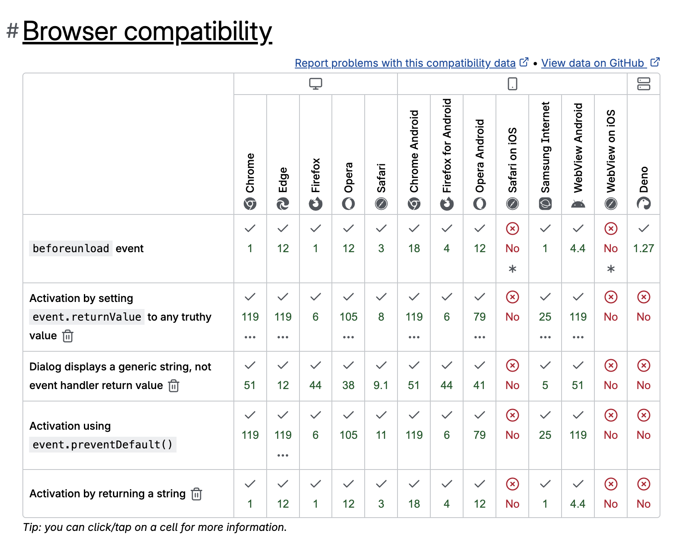
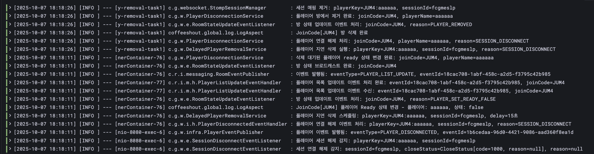
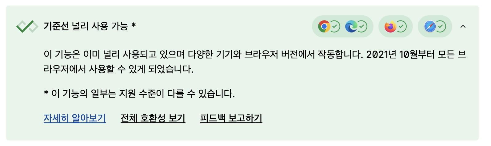
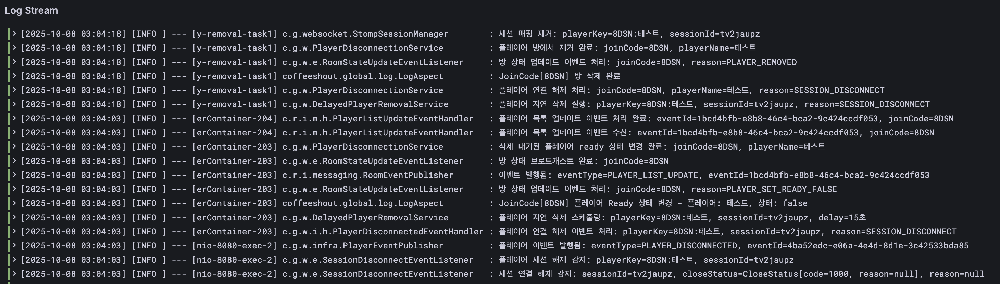
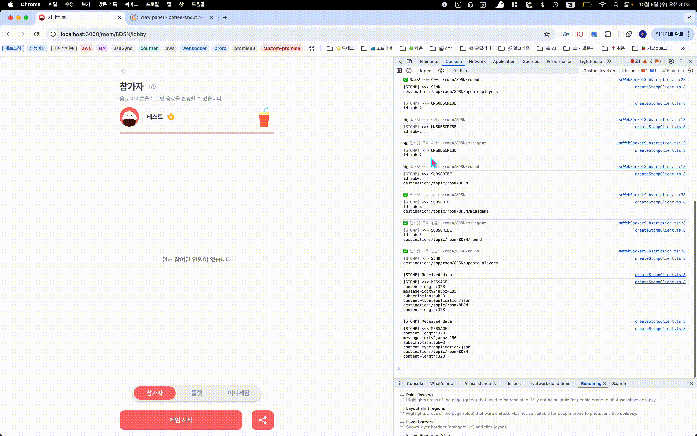
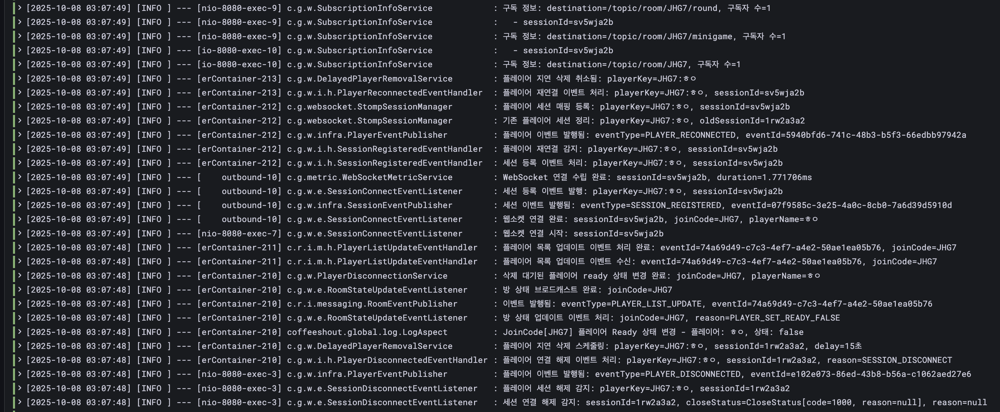

# 문제 상황 정의

웹소켓 연결은 다양한 이유로 끊어질 수 있습니다.
이번 문서에서는 그중에서도 사용자가 새로고침을 했을 때 발생하는 연결 끊김에 초점을 맞추어 살펴보겠습니다.

1. 앱을 전환하여 백그라운드로 나간 경우
2. 네트워크 연결 방식이 변경된 경우
3. 네트워크가 불안정하여 끊어진 경우
4. **새로고침한 경우**

문제 상황은 **로비 화면에서 새로고침 했을 때 웹소켓이 끊긴다는 것**이었습니다.

이렇게 되면 웹소켓이 재연결이 되지 않았습니다.

그 이유를 살펴보면 다음과 같습니다.

# 해결 방안 모색

## 시도 1) — 웹소켓 자동 재연결 활용

우선 저희 커피빵 서비스는 createStompClient라는 함수로 웹소켓 Client 객체를 만들어주고 있습니다.

이 내부에서 웹소켓 재연결 관련 속성을 설정해두고 있습니다.

그렇기 때문에 당연히 재연결이 될 거라고 생각했어요.

```tsx
import { Client, ReconnectionTimeMode } from "@stomp/stompjs";
import SockJS from "sockjs-client";
import { getWebSocketUrl } from "./getWebSocketUrl";

type Props = {
  joinCode: string;
  playerName: string;
};

export const createStompClient = ({ joinCode, playerName }: Props) => {
  const wsUrl = getWebSocketUrl();

  const client = new Client({
    webSocketFactory: () => new SockJS(wsUrl),
    debug: (msg) => console.log("[STOMP]", msg),
    reconnectDelay: 1000, // 재연결 지연 시간
    reconnectTimeMode: ReconnectionTimeMode.EXPONENTIAL, // 재연결 지연 방식 (지수적 증가)
    maxReconnectDelay: 30000, // 최대 지연 시간 (최대 30초로 설정)
    heartbeatIncoming: 4000,
    heartbeatOutgoing: 4000,
    connectHeaders: { joinCode, playerName },
  });

  return client;
};
```

다만, 여기서 유의해서 봐야할 것은 객체를 저장하는 과정입니다.

```tsx
import { Client, IFrame } from "@stomp/stompjs";
import { useCallback, useState } from "react";
import { createStompClient } from "../utils/createStompClient";
import WebSocketErrorHandler from "../utils/WebSocketErrorHandler";

export const useWebSocketConnection = () => {
  const [client, setClient] = useState<Client | null>(null);

  // ...

  const setupStompClient = useCallback(
    (joinCode: string, myName: string): Client => {
      const stompClient = createStompClient({
        joinCode,
        playerName: myName,
      });

      stompClient.onConnect = handleConnect;
      stompClient.onDisconnect = handleDisconnect;
      stompClient.onStompError = handleStompError;
      stompClient.onWebSocketError = (event: Event) =>
        handleWebSocketError(event, stompClient);

      return stompClient;
    },
    [handleConnect, handleDisconnect, handleStompError, handleWebSocketError]
  );

  // ...
};
```

`useWebSocketConnection` 훅은 웹소켓 연결을 해주는 훅인데요. 보시다시피 client 객체를 리액트 상태로 관리해주고 있습니다.

따라서, 새로고침하면 모든 JavaScript 메모리가 사라지면서, 모든 state가 초기화되고, 이전에 만든 웹소켓 클라이언트 객체도 완전히 사라지는 것이죠.

처음에는 이 `client` 객체를 브라우저 스토리지에 저장해두면 새로고침 후에도 재사용할 수 있지 않을까 생각했습니다.

하지만 실제로 시도해보니 아래와 같은 오류가 발생했습니다.

<aside>

**TypeError**: Converting circular structure to JSON
--> starting at object with constructor 'Client'
| property '\_stompHandler' -> object with constructor 'StompHandler'
--- property '\_client' closes the circle
at JSON.stringify (<anonymous>)
at useWebSocketConnection (useWebSocketConnection.ts:7:19)
at WebSocketProvider (WebSocketProvider.tsx:7:84)

</aside>

즉, `client` 객체는 직렬화할 수 없는 객체였습니다.

스토리지는 기본적으로 모든 값을 **문자열 형태로만** 저장할 수 있습니다.

그래서 보통 객체는 `JSON.stringify()`로 문자열로 변환하고, 다시 사용할 때 `JSON.parse()`로 복원하죠.

하지만 **STOMP Client 객체는 이 과정 자체가 불가능**합니다.

대표적으로 직렬화할 수 없는 객체는 다음과 같습니다.

- WebSocket 연결 객체
- 함수(콜백)
- setTimeout / setInterval 타이머
- Promise 객체

그럼 왜 브라우저 스토리지에 저장할 수 없을까요?

이런 객체들은 모두 **런타임 상태에 의존**하고 있기 때문입니다.

`Client`도 내부적으로 `StompHandler`, `WebSocket`, 재연결 타이머 등의 상태를 실시간으로 관리하고 있습니다.

예를 들어 WebSocket 객체는 운영체제의 네트워크 소켓과 연결된 상태 정보를 포함하고 있는데, 이는 문자열로 변환할 수 없는 시스템 리소스입니다.

콜백 함수 역시 실행 가능한 코드 블록이며, 직렬화 시 스코프와 클로저 정보가 사라져 복원이 불가능합니다.

따라서 만약 저장이 가능하더라도, 복원되는 건 이미 연결이 끊긴 **‘죽은 객체’**에 불과하기 때문에 정상적으로 동작할 수 없습니다.

---

여기서 새로고침했을 때 웹소켓 자동 재연결이 안되는 이유를 STOMP 재연결 메커니즘이 어떻게 동작하는지와 함께 간단히 살펴볼게요.

1. STOMP Client의 activate() 메서드를 호출하면 연결이 끊어졌을 때 reconnectDelay 설정에 따라 자동으로 재연결을 시도합니다.

   ```tsx
   const startSocket = useCallback(
     (joinCode: string, myName: string) => {
       if (!validateClient() || !validateConnectionParams(joinCode, myName))
         return;

       const stompClient = setupStompClient(joinCode, myName);
       setClient(stompClient);
       stompClient.activate();
     },
     [validateClient, validateConnectionParams, setupStompClient]
   );
   ```

   저희 서비스에서 보시면 웹소켓 연결을 시작할 때 Client 객체인 stompClient의 activate() 함수를 호출해주고 있습니다! 이렇게 되면 저희 서비스 코드에서 설정한 reconnectDelay 설정값에 따라서 자동으로 재연결을 시도해줍니다.

⭐️ 여기서 중요한 점은,

이 **_자동 재연결은 같은 브라우저 세션 내에서 연결이 끊어진 경우에만 작동한다_** 는 것이에요!!!!

예를 들어,

**자동 재연결이 작동하는 경우,**

- 네트워크 장애
  - 네트워크 변경, 네트워크 끊김 등이 있습니다.
- Heartbeat 실패
  - 모바일 환경에서 앱 전환에 의해 백그라운드로 나가지는 경우가 있어요. Heartbeat가 즉, ping/pong이 오가지않아서 발생하게 됩니다. 이 부분은 이전 백그라운드 이슈 처리에서도 언급한 부분이에요!
- WebSocket 연결 끊김
  - 서버 문제로 끊기는 경우도 있고, 앞서 언급한 원인 외의 경우가 있습니다.

→ 이런 경우들은 **보통 Client 인스턴스가 브라우저 메모리에 살아있는 상태에서의 자동 재연결**을 의미합니다.

**자동 재연결이 작동하지 않는 경우,**

- 페이지 새로고침 → 메모리 초기화
- 탭 닫기/열기 → 새 브라우저 컨텍스트
- 브라우저 재시작

→ 이런 경우들은, **Client 인스턴스가 소멸되기 때문에 자동 재연결이 불가능**해요.

**결국 이런 이유로, 새로고침으로 인한 웹소켓 끊김 현상은 자동 재연결 방식으로는 해결할 수 없는 거죠!**

따라서, 해결하려면 직접 `useEffect`에서 새 Client 생성해줘야 합니다.

---

그렇다면 꼭 새로고침을 했을 때 다시 웹소켓을 재연결 해줘야하는걸까요?

이건 사실 저희 커피빵 서비스의 정책에 따라 달라지는 부분인데요,
다시 말해 그냥 저희가 어떤 정책을 세울 것인지에 따라 웹소켓을 재연결할지 말지 결정된다는 것입니다.

다른 유사 서비스를 참고하여 저희 커피빵 서비스만의 정책을 세웠는데요.

기본적으로 커피빵 서비스는 모바일 사용자를 주요 타겟으로 하고 있지만, 웹 브라우저에서 동작하기 때문에 데스크탑 사용자도 완전히 배제할 수는 없습니다. 특히 데스크탑 환경에서는 새로고침이 훨씬 자유롭기 때문에 더욱 새로고침을 막아야한다고 생각했어요.

저희는 크게 봤을 때 웹소켓 재연결 관리 시점을 **로비**와 **게임 진행 중**으로 나눌 수 있습니다.

먼저, 게임 도중에는 사용자가 직접 새로고침을 누를 가능성은 거의 없다고 판단했습니다.

왜냐하면, 게임 진행 중에는 실시간으로 턴이 바뀌고 상호작용이 빠르게 이루어지기 때문에, 사용자가 의도적으로 새로고침을 시도할 동기가 거의 없다고 생각했기 때문이에요.

그래서 우선은 게임 진행 중에 발생할 수 있는 **‘의도치 않은 새로고침’을 막는 수준으로만 대응**하기로 했습니다!!

(참고로, 만약 게임 중에 의도적인 새로고침이 발생하면 이후 시점부터는 **현재 게임 진행 상태와 사용자 정보를 모두 서버에서 다시 불러와야 합니다.** 이건 새로고침 뿐만 아니라 모든 웹소켓 재연결 상황에서 동일하게 동작해야해요.)

그렇다면 **로비**에서는 어떨까요?

로비는 게임이 시작되기 전, 사용자가 대기하는 공간입니다.

이 시점에는 사용자가 방에 자유롭게 들어오고 나갈 수 있으며, 실제 게임 진행과 달리 조작에 제약이 거의 없습니다. 따라서 이 구간에서는 새로고침이 발생할 가능성도 있다고 판단했어요.

## 적용 1) — CSS로 ‘당겨서 새로고침’ 기능 막기

우선 저희는 아래와 같이 **CSS를 통해 ‘당겨서 새로고침’을 막는 기능을 적용**했습니다.

```css
html,
body {
  /*당겨서 새로고침 막기*/
  overscroll-behavior: none;
}
```

이 설정 덕분에, 모바일 사용자가 웹 브라우저(Chrome, Safari, Samsung Internet 등)로 접속하더라도
**기본 제공되는 ‘당겨서 새로고침’ 기능은 동작하지 않습니다.**

즉, 화면을 아래로 끌어도 새로고침이 발생하지 않아요.

덕분에 로비에서든 게임 도중이든, 사용자가 실수로 새로고침할 일은 없어졌습니다.

다만, **사용자가 직접 브라우저의 메뉴 버튼을 눌러 새로고침을 선택하는 경우까지는 막을 수 없습니다.** 이건 브라우저 차원의 동작이라 제어할 수 없어요.

그래서 사용자가 새로고침을 직접 시도할 가능성이 존재하는 **로비에서는**, 이 상황을 어떻게 대응할지 고민해봤습니다.

## 시도 2) — 새로고침 시 발생하는 **이벤트 활용하기 (`beforeunload` 등)**

이때 [`beforeunload` 이벤트](https://developer.mozilla.org/en-US/docs/Web/API/Window/beforeunload_event)를 활용하는 방법을 고민해봤습니다.

이 이벤트는 사용자가 페이지를 떠나려는 시점에 `window` 객체에서 발생합니다.

처음에는 이 이벤트를 이용해 **새로고침 시 경고창을 띄워볼까** 생각했는데요.

하지만 이 방식은 사용자 경험 측면에서 좋지 않다고 판단했습니다.

특히 게임 진행 중에는 알림창이 뜨면 게임 상호작용을 방해하게 되고, 로비에서도 불필요한 상호작용 때문에 사용자에게 피로감을 줄 수 있다고 판단했습니다.

결국 “그냥 새로고침 시 자동으로 재연결되는 흐름”이 사용자가 추가 동작을 하지 않아도 되어 UX 면에서 훨씬 낫다고 결론 내렸습니다.

다만, 해당 이벤트의 두 가지 문제가 있었는데요.

**첫 번째 문제점은, `beforeunload`는 새로고침뿐 아니라 페이지 이탈 전반에 걸쳐 발생한다는 것입니다.**

다음과 같은 경우 모두 트리거됩니다.

- 브라우저 새로고침
- 탭 닫기
- 다른 URL로 이동 (`window.location.href` 변경 등)
- 뒤로가기 / 앞으로가기
- 브라우저 종료

따라서, **새로고침만 감지하기엔 부적합**하다고 판단했습니다.

**두 번째 문제점은, iOS Safari에서 `beforeunload`가 아예 지원되지 않는다는 점**이었습니다.



저희 서비스는 모바일 Safari 환경도 반드시 지원해야 하기 때문에, 이 이벤트는 자연스럽게 후보에서 제외되었습니다.

따라서 새로고침할 때 발생하는 이벤트가 어떤 것이 있고, 대체할 수 있는 이벤트가 없는지 살펴봤습니다.

어차피 저희 서비스는 페이지 이탈 직전(beforeunload) 보다, 새로고침 이후 시점에서 웹소켓을 재연결하면 되기 때문에 꼭 이 이벤트에 의존할 필요도 없었습니다.

직접 테스트해본 결과, Chrome 기준으로 새로고침 시 다음 순서대로 이벤트가 발생했습니다.

**`beforeunload → pagehide → unload → pageshow`**

이때, [unload 이벤트](https://developer.mozilla.org/en-US/docs/Web/API/Window/unload_event)의 경우에는 Deprecated 되었기 때문에 최신 브라우저에서는 권장하지 않았습니다.

[pagehide](https://developer.mozilla.org/en-US/docs/Web/API/Window/pagehide_event), [pageshow](https://developer.mozilla.org/en-US/docs/Web/API/Window/pageshow_event)의 경우에는, 기기와 브라우저 호환성은 매우 좋았는데요,

다만, 이 이벤트들도 역시 ‘새로고침’ 시에만 발생하는 이벤트는 아니기 때문에 사용하기가 애매했습니다.

특히 pageshow는 새로운 페이지가 로드되었을 때도 항상 발생하는 이벤트이기 때문에, 처음 페이지 접속했을 때도 트리거 되었어요.

**따라서, 위 이벤트들은 “새로고침 전용”으로 쓰기엔 범위가 너무 넓고 브라우저 호환성도 떨어진다는 결론을 내렸습니다.**

## 시도 3) — 서버에서 새로고침 시 발생하는 세션 연결 해제 코드로 식별하기

백엔드 팀원인 엠제이와도 함께 논의해봤습니다.

엠제이는 **서버에서 세션 연결 해제 시 발생하는 코드(closeStatus.code)**를 이용해 새로고침을 식별하는 방식을 제안했는데요.



위 로그를 보면, 새로고침이 발생했을 때 ‘세션 연결 해제 감지’가 발생하며
`closeStatus=CloseStatus[code=1000, reason=null]` 이라는 코드가 출력됩니다.

엠제이가 해당 **code 값(1000)** 으로 새로고침 여부를 구분해보자는 의견이었습니다.

하지만 결론적으로, 이 코드 역시 **‘새로고침만을 특정할 수 있는 고유한 식별자’로 사용하기는 어려웠습니다.**

실제 code=1000의 경우에는, 다른 정상 종료 상황에서도 동일한 코드가 발생했기 때문입니다.

[WebSocket 프로토콜의 표준 명세](https://datatracker.ietf.org/doc/html/rfc6455#section-7.4.1)를 살펴보니,

> **1000 indicates a normal closure, meaning that the purpose for
> which the connection was established has been fulfilled.**
>
> 1000은 **정상적인 연결 종료**를 의미하며,
> 이는 “처음에 연결이 만들어졌던 목적이 이미 완료되었음”을 뜻합니다.

code=1000은 그냥 **정상 종료**임을 알리는 상태코드였습니다.

번외로, 웹소켓 재연결 처리를 위해 **연결이 끊기는 시점에 어떤 상태 코드가 찍히는지** 직접 테스트해본 결과, 다음과 같은 결과를 확인했습니다.

- 백그라운드로 나간 경우(모바일 앱 전환) - 1000 (정상 종료)
- 브라우저 앱 종료 - 1006 (비정상 종료)
- 네트워크 끊김 - 1002 (프로토콜 에러로 연결 종료)
- 네트워크 변경 - 1002 (프로토콜 에러로 연결 종료)
- 새로고침 감지 - 1000 (정상 종료)

결론은 이 방식도 무용지물이라는 것이었습니다.

## 적용 2) — performance.getEntriesByType(’navigation’) 활용하기

최종적으로 발견한 건 🎊⭐️**PerformanceNavigationTiming**⭐️🎊라는 인터페이스였습니다. 🥳

**PerformanceNavigationTiming**은 **브라우저가 페이지를 탐색(navigation)하는 과정에서 발생한 모든 성능 관련 정보**를 담고 있는 **Web Performance API의 인터페이스**입니다.

쉽게 말하면,

“이 문서를 브라우저가 어떻게 불러왔는지”

(새로고침인지, 뒤로 가기인지, 처음 방문인지 등)

그리고 “그 과정에서 얼마만큼의 시간이 걸렸는지”

를 정밀하게 측정할 수 있게 해주는 객체입니다.



그리고 **PerformanceNavigationTiming**은 2021년 10월 이후로 다양한 기기와 거의 모든 브라우저에서 지원이 되고 있어서 호환성 측면에서도 안정적입니다.

이 객체는 `performance.getEntriesByType('navigation')` 호출 시 배열 형태로 반환되는데요,

해당 배열은 0번째 배열 인덱스에 하나의 객체(PerformanceNavigationTiming)만 들어있습니다.

```tsx
const [navigation] = performance.getEntriesByType("navigation");
console.log(navigation);
```

위와 같이 브라우저 콘솔창에 실행해보시면 PerformanceNavigationTiming 객체가 출력되는 걸 볼 수 있어요.

여기서 어떤 걸 활용해볼 수 있느냐 하면, 바로 [`type` 속성](https://developer.mozilla.org/en-US/docs/Web/API/PerformanceNavigationTiming/type)입니다!

```tsx
type NavigationTimingType =
  | "back_forward"
  | "navigate"
  | "prerender"
  | "reload";
```

이 `type` 속성은 탐색 유형을 반환하는데요, 크게 위와 같이 4가지로 분류가 됩니다.

이 중에서 `"reload"` 값은 MDN 문서에 다음과 같이 설명되어 있습니다.

> [`"reload"`](https://developer.mozilla.org/en-US/docs/Web/API/PerformanceNavigationTiming/type#reload)Navigation is through the browser's reload operation, [`location.reload()`](https://developer.mozilla.org/en-US/docs/Web/API/Location/reload) or a Refresh pragma directive like `<meta http-equiv="refresh" content="300">`.

이를 번역하면 다음과 같습니다.

브라우저의 **새로고침 동작**에 의해 탐색이 이루어진 경우를 의미하며,

이는 사용자가 직접 새로고침 버튼을 누르거나 `location.reload()` 메서드를 호출했을 때,

또는 `<meta http-equiv="refresh" content="300">` 과 같은 **Refresh 지시문**에 의해 발생한 경우를 포함합니다.

즉, `type` 속성이 **reload**일 경우, 해당 페이지가 **사용자에 의해 새로고침된 경우**임을 확실히 알 수 있습니다!

```tsx
const navigation = performance.getEntriesByType("navigation")[0];

if (navigation.type === "reload") {
  console.log("새로고침 감지!");
}
```

따라서, 이 속성을 통해 새로고침을 감지하고 웹소켓을 재연결하고자 하였습니다.

```tsx
useEffect(() => {
  if (hasCheckedRefresh.current) return;

  let isReload = false;

  try {
    const navigationEntries = performance.getEntriesByType(
      "navigation"
    ) as PerformanceNavigationTiming[];
    isReload =
      navigationEntries.length > 0 && navigationEntries[0].type === "reload";
  } catch (error) {
    console.warn("performance.getEntriesByType not supported:", error);
    isReload = document.referrer === window.location.href;
  }

  if (isReload && !isConnected && joinCode && myName && startSocket) {
    hasCheckedRefresh.current = true;
    startSocket(joinCode, myName);
  }
}, [myName, joinCode, isConnected, startSocket]);
```

코드는 위와 같이 구현을 했는데요. 하나씩 살펴보겠습니다!

### 1️⃣ 새로고침 중복 체크

```tsx
if (hasCheckedRefresh.current) return;
```

- 이미 새로고침 여부를 한 번 확인했다면, 다시 실행하지 않도록 early return 처리합니다.
- `hasCheckedRefresh`는 `useRef`로 관리되는 플래그로, **중복 재연결 방지용**입니다.

### 2️⃣ 기본 변수 초기화

```tsx
let isReload = false;
```

- 우선 새로고침 여부를 저장할 `isReload` 변수를 `false`로 초기화합니다.
- 이후 실제 감지 로직에서 `true`로 바뀔 수 있습니다.

### 3️⃣ 새로고침 감지 시도

```tsx
try {
  const navigationEntries = performance.getEntriesByType(
    'navigation'
  ) as PerformanceNavigationTiming[];
  isReload = navigationEntries.length > 0 && navigationEntries[0].type === 'reload';
}
```

- **performance.getEntriesByType('navigation')**를 통해 **현재 페이지의 탐색 방식**을 가져옵니다.
- 반환된 객체인 `PerformanceNavigationTiming`의 `type`이 `'reload'`인 경우, 사용자가 **새로고침**으로 들어왔다는 의미입니다.
- 이때 `isReload` 값을 `true`로 설정합니다.

### 4️⃣ 브라우저 미지원 대비

```tsx
catch (error) {
  console.warn('performance.getEntriesByType not supported:', error);
  isReload = document.referrer === window.location.href;
}
```

- `PerformanceNavigationTiming.type`은 대부분 브라우저에서 지원되지만, 예외 상황에 대비하여 방어 코딩으로 **fallback**으로 `document.referrer === window.location.href`를 추가했습니다.
- `referrer`와 현재 URL이 같다면, 이전에도 이 페이지였다는 뜻 → 새로고침으로 간주합니다.

### 5️⃣ 새로고침 시 웹소켓 재연결

```tsx
if (isReload && !isConnected && joinCode && myName && startSocket) {
  hasCheckedRefresh.current = true;
  startSocket(joinCode, myName);
}
```

- 모든 조건이 충족되면 실제로 웹소켓 재연결을 수행합니다.
  - `isReload`: 새로고침으로 들어온 경우
  - `!isConnected`: 현재 웹소켓이 아직 연결되지 않은 상태
  - `joinCode`, `myName`, `startSocket`: 재연결에 필요한 정보가 모두 존재할 때
- 재연결을 한 번만 수행하도록 `hasCheckedRefresh.current`를 `true`로 바꿔 중복 실행을 방지합니다.

# 결론

이와 같이 구현함으로써 새로고침 시에도 웹소켓 재연결이 잘 되는 것을 확인할 수 있었습니다.

### 구현 전





### 구현 후




# 마무리하며

새로고침을 감지하고 웹소켓을 재연결하는 과정을 고민하는 데 생각보다 많은 시간이 들었습니다.

하지만 그 과정에서 **`PerformanceNavigationTiming`** 이라는 새롭고 유용한 인터페이스를 알게 된 점은 큰 수확이었습니다.

또한 삽질 과정 덕분에 웹소켓의 상태 코드와, 각 끊김 상황에 따라 어떤 코드가 발생하는지에 대해서도 깊이 있게 이해할 수 있었습니다.

**`PerformanceNavigationTiming`** 에는 다양한 속성이 존재하기 때문에, 앞으로 더 살펴보면서 활용 범위를 넓혀볼 계획입니다.

무엇보다 중요한 건, 이 개선으로 **사용자 경험이 눈에 띄게 좋아졌다는 점**입니다.

이제 새로고침 후에도 자동으로 재연결이 이루어지기 때문에, 사용자 입장에서는 끊김을 거의 인지하지 못하고 서비스를 계속 이용할 수 있게 되었습니다.

# 관련 자료

- https://github.com/woowacourse-teams/2025-coffee-shout/pull/680
- https://stomp-js.github.io/guide/stompjs/using-stompjs-v5.html
- https://docs.spring.io/spring-framework/docs/current/javadoc-api/org/springframework/web/socket/CloseStatus.html?utm_source=chatgpt.com
- https://datatracker.ietf.org/doc/html/rfc6455#section-7.4.1
- https://developer.mozilla.org/en-US/docs/Web/API/PerformanceNavigationTiming
- https://developer.mozilla.org/en-US/docs/Web/API/PerformanceNavigationTiming/type
- https://leteu.tistory.com/29
