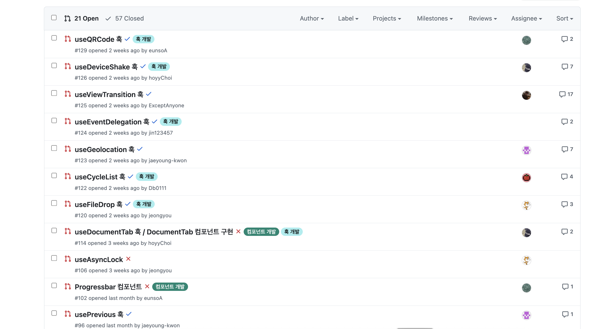

# 💡 좋은 훅을 설계하기 위한 5가지 원칙

> DX와 성능, 일관성, 그리고 경험으로 완성되는 React 훅 설계 이야기

<div align="center">
  
</div>

## 0. 들어가며

React를 사용하다 보면 누구나 한 번쯤 훅을 만들어 보게 됩니다.
그러나 여러 사람이 함께 사용할 수 있는 훅을 **설계**해본 경험은 생각보다 많지 않습니다.
대부분의 경우, 한 번 쓰고 잊혀지는 훅을 간단히 만들어두거나, 이미 만들어진 훅을 가져다 쓰곤 합니다.
저 역시 처음엔 그랬습니다.
그런데 직접 여러 사람이 함께 사용하는 훅을 만들어보면, 금세 다른 점을 깨닫게 됩니다.

**"동작하는 훅"과 "잘 설계된 훅"은 전혀 다릅니다.**

이번 글에서는 제가 스터디를 통해 경험한 훅 설계 과정을 중심으로,
"**좋은 훅을 어떻게 설계할 수 있을까?**"라는 질문에 대한 **저만의 답**을 공유하고자 합니다.

단순히 작동하는 훅이 아닌, 누구나 **직관적으로 이해하고, 일관되게 쓸 수 있는 훅**을 만드는 과정을 다룹니다.

<div style="margin:50px"></div>

---

<div style="margin:50px"></div>

## 1. 훅 설계에 관심을 갖게 된 배경

프로젝트를 여러 개 진행하면서 자연스럽게 React 기반에서 동작하는 커스텀 훅을 많이 만들게 되었습니다. 이벤트 바인딩, 상태 초기화, 다이얼로그 관리처럼 **프로젝트마다 반복되는 패턴**이 많았기 때문입니다.
처음엔 "**복붙을 줄이자**"는 단순한 목적이었습니다.

하지만 어느 순간 팀원들이 제 훅을 쓰면서 "**이 훅 어떻게 써야 하나요?**" "**세 번째 인자가 뭐였죠?**"라는 질문을 하기 시작했습니다. 그리고 대부분은 훅 내부 코드를 직접 열어보며 사용법을 유추하곤 했습니다.

그때 깨달았습니다.

> “**내가 만든 훅이 편한 게 아니라, 오히려 새로운 진입 장벽이 되고 있구나.**”

이 문제의식이 계기가 되어 [Hookdle](https://hookponent.vercel.app/) 이라는 훅 스터디를 시작했습니다.
처음에는 단순히 "좋은 훅을 함께 만들어보자"는 가벼운 생각이었습니다.
하지만 논의가 깊어질수록 "왜 이렇게 써야 하지?", "이 인터페이스는 정말 자연스러운가?" 같은 질문이 끊임없이 나왔습니다. 그때부터 Hookdle은 단순한 스터디를 넘어, **개발자 경험을 실험하고 설계하는 작은 연구소**로 변해갔습니다.

훅을 더 깊이 탐구하며 설계, 사용성, 그리고 DX(Developer Experience) 를 고민하기 시작했습니다.
스터디원들과 함께 다양한 훅을 설계하고 개선하는 과정을 거치면서, 훅은 단순히 기능을 감싸는 코드가 아니라, **개발자 경험을 설계하는 도구**라는 사실을 꺠닫게 되었습니다.

물론, 처음부터 이런 방향성을 가지고 있었던 것은 아닙니다. 여러 훅을 직접 만들고 사용해보는 과정에서 수많은 시행착오를 겪었습니다.
어떤 훅은 동작은 했지만 쓰기 불편했고, 어떤 훅은 인터페이스가 복잡해 오히려 팀의 진입 장벽이 되기도 했습니다.



<div style="margin:50px"></div>

그 과정에서 깨달았습니다. "**좋은 훅은 코드가 아니라, 설계에서 시작된다.**"
그리고 그 설계를 이해하기 위해 먼저 **좋지 않았던 훅들**을 돌아보게 되었습니다.

<div style="margin:50px"></div>

---

<div style="margin:50px"></div>

## 2. 나쁜 훅 설계의 특징

> "동작하는 코드"와 "쓰기 좋은 코드"는 완전히 다릅니다.
> 저는 세 가지 유형의 실패를 통해 그 차이를 명확히 체감했습니다.

<div style="margin:50px"></div>

### (1) 위치 인자 기반의 혼동

```tsx
const [count, inc, dec, reset] = useCounter(0, 5, 10);
```

언뜻 간단해 보이지만, 팀원에게 이 훅을 건네면 늘 같은 질문이 돌아왔습니다.

> "이게 min, max, step 중 뭐가 뭐예요?"

인자의 순서가 늘어날수록 사용법을 외워야 하고, IDE 자동완성도 도움을 주지 못합니다.
결국 코드를 직접 열어보기 전까진 의도를 파악하기 어렵습니다.
**단순한 구조일수록 오히려 혼란을 준다**는 사실을 처음으로 느꼈던 순간이었습니다.

<div style="margin:50px"></div>

### (2) 반환 구조가 직관적이지 않음

```tsx
const [count, increase, decrease, reset] = useCounter();
```

배열 구조는 익숙하지만, 각 인자의 의미를 기억해야만 쓸 수 있습니다.

IDE가 반환값의 의미를 알려주지 않기 때문에,
시간이 지나면 늘 “**세 번째가 뭐였지?**”라는 기억 의존형 사용이 반복됩니다.

배열 구조는 **`useState`처럼 단일 책임 훅에는 적합**하지만, 여러 기능을 함께 제공하는 복합 훅에는 부적합합니다.

> "배열 반환은 익숙하지만, 의미를 숨긴다."

<div style="margin:50px"></div>

### (3) 최적화가 없는 훅

단순한 훅이라도 내부 최적화(`useCallback`, `useRef`)가 없으면 대규모 컴포넌트 트리에서 성능 저하를 유발할 수 있습니다.

예를 들어 다음과 같은 형태가 있습니다.

```tsx
export function useBooleanState(initial = false) {
  const [value, setValue] = useState(initial);

  const setTrue = () => setValue(true);
  const setFalse = () => setValue(false);
  const toggle = () => setValue((v) => !v);

  return [value, setTrue, setFalse, toggle];
}
```

겉보기엔 완벽히 정상 작동합니다.
하지만 이 훅이 수십 개 컴포넌트에서 호출되면,
`setTrue`, `setFalse`, `toggle`이 매 렌더마다 새로 생성되며 불필요한 리렌더링을 유발합니다.

<div style="margin:30px"></div>

또한 외부에서 전달받은 콜백을 사용하는 훅이라면, 다음과 같은 형태로 **콜백 참조 불안정성**이 발생할 수 있습니다.

```tsx
function useEventListener(eventName, handler) {
  useEffect(() => {
    window.addEventListener(eventName, handler);
    return () => window.removeEventListener(eventName, handler);
  }, [eventName, handler]);
}
```

이 경우 `handler`가 렌더마다 새로 생성되면,
`useEffect`가 매번 재실행되며 이벤트 리스너가 반복 등록/해제됩니다.

즉, **참조 안정성(ref)** 을 고려하지 않으면,
훅 내부의 `useEffect`나 이벤트 리스너가 불필요하게 다시 실행될 수 있습니다.

> **"작은 훅일수록, 내부 최적화는 더 중요합니다."** 훅은 한 번 만들어지면 수십, 수백 번 재사용되기 때문입니다.
> 실제로 한 번 배포된 훅은 다른 프로젝트, 다른 팀에서도 그대로 쓰이게 됩니다.
> 즉, 한 번의 설계가 수많은 개발자의 경험을 결정짓게 됩니다. 이 사실을 깨닫고 나서야 작게 만든 훅 하나도 신중해야 한다는 책임감을 갖게 되었습니다.

<div style="margin:50px"></div>

---

<div style="margin:50px"></div>

## 3. 좋은 훅을 만드는 설계 방향

> 실패를 통해 얻은 교훈은 단순했습니다.
> "좋은 훅은 기능이 아니라 **설계로 완성**된다."
> 앞선 나쁜 훅 설계 특징들을 중심으로 각각의 개선 과정을 살펴보겠습니다.

<div style="margin:50px"></div>

### (1) 인자 구조 개선

위치 인자 기반의 혼동으로 헷갈렸던 `useCounter` 훅의 예시입니다.

#### Before

```tsx
const [count, inc, dec, reset] = useCounter(0, 10, 5);
```

#### After

```tsx
const { count, increment, decrement, reset } = useCounter(0, {
  min: 0,
  max: 10,
  step: 5,
});
```

이 단순한 변경만으로도 **읽는 사람이 훨씬 빠르게 이해할 수 있는 코드**가 됩니다.

**옵션 객체**는 다음과 같은 장점을 가집니다.

- 인자 순서를 외울 필요가 없습니다.
- IDE 자동완성으로 옵션 목록을 바로 확인할 수 있습니다.
- 기능이 늘어나도 기존 시그니처가 깨지지 않습니다.

예를 들어 나중에 `onChange`, `loop`, `clamp` 같은 기능이 추가되어도 다음처럼 확장 가능합니다.

```tsx
useCounter(0, { min: 0, max: 10, step: 5, onChange: console.log });
```

> "인자 수가 늘어날수록, 옵션 객체는 선택이 아니라 필수입니다."

<div style="margin:50px"></div>

### (2) 반환 구조 개선

배열 반환은 직관적이지 않다는 문제를 해결하기 위해, 반환 구조를 **객체 형태**로 바꾸었습니다.

#### Before

```tsx
const [count, increase, decrease, reset] = useCounter();
```

#### After

```tsx
const { count, increment, decrement, reset } = useCounter();
```

배열 구조의 "순서 의존"을 제거하고, 이름 기반 접근으로 DX를 크게 개선하였습니다.
이제 IDE 자동완성만으로도 함수의 역할이 명확히 드러납니다.

**다만, 모든 훅에서 객체 반환이 정답은 아닙니다.**
훅이 단일한 책임만 가지거나, 반환값의 의미가 명확히 짝지어져 있다면 배열이 오히려 더 간결하고 익숙합니다.

예를 들어 다음과 같은 훅은 배열 구조가 적합합니다.

```tsx
const [value, setValue] = useState(false);
const [isOpen, open, close] = useBooleanState();
```

이처럼 훅의 성격이 **단일 상태 + 그 상태를 제어하는 함수**에 가까울 경우,
배열 구조는 불필요한 네이밍 고민을 줄여주고, 시각적으로도 직관적입니다.

> "배열은 단일 책임 훅에, 객체는 복합 책임 훅에 어울립니다."

<div style="margin:50px"></div>

### (3) 최적화 개선

단순히 동작하는 훅을 넘어, 내부의 **참조 안정성과 콜백 최적화**까지 고려해야 합니다.
특히 라이브러리 훅은 여러 컴포넌트에서 재사용되기 때문에, 렌더링 시마다 불필요하게 함수가 새로 생성되면 성능 저하로 이어집니다.

#### ① useCallback으로 콜백 안정화

#### Before

```tsx
const setTrue = () => setValue(true);
const setFalse = () => setValue(false);
const toggle = () => setValue((v) => !v);
```

#### After

```tsx
const setTrue = useCallback(() => setValue(true), []);
const setFalse = useCallback(() => setValue(false), []);
const toggle = useCallback(() => setValue((v) => !v), []);
```

매 렌더마다 함수들이 새로 생성되지 않기 때문에, 훅을 여러 컴포넌트에서 사용할 때도 불필요한 함수 재생성이 발생하지 않습니다.

> "useCallback은 훅의 불필요한 함수 재생성을 막는 가장 기본적인 최적화 도구입니다."

<div style="margin:30px"></div>

#### ② 외부 콜백을 인자로 받는 훅이라면 ref로 최신 참조 유지

#### Before

```tsx
function useEventListener(eventName, handler) {
  useEffect(() => {
    window.addEventListener(eventName, handler);
    return () => window.removeEventListener(eventName, handler);
  }, [eventName, handler]);
}
```

#### After

```tsx
function useEventListener(eventName, handler) {
  const handlerRef = useRef(handler);

  useEffect(() => {
    handlerRef.current = handler;
  }, [handler]);

  useEffect(() => {
    const listener = (...args) => handlerRef.current?.(...args);
    window.addEventListener(eventName, listener);
    return () => window.removeEventListener(eventName, listener);
  }, [eventName]);
}
```

이 구조에서는 `handler`가 렌더마다 새로 만들어지더라도 `handlerRef`를 통해 항상 최신 콜백을 참조할 수 있습니다.
결과적으로 `useEffect`가 불필요하게 재실행되지 않으며, 이벤트 리스너가 반복 등록/해제되는 문제를 방지할 수 있습니다.

> "참조 안정성(ref)은 외부 콜백을 다루는 훅에서 반드시 고려해야 할 기본 요소입니다."

> 이렇게 개선한 뒤, 훅을 사용하는 컴포넌트들이 불필요하게 리렌더링되지 않으면서도 항상 최신 상태를 유지하는 걸 확인할 수 있었습니다.

<div style="margin:50px"></div>

---

<div style="margin:50px"></div>

## 4. 좋은 훅을 위한 5가지 설계 원칙

여러 훅을 만들다 보니, 결국 **좋은 훅**은 일관된 기준 위에서만 만들어진다는 결론에 이르렀습니다.
그래서 저는 단순히 코드를 개선하는 대신, 훅을 평가할 수 있는 5가지 원칙을 정립했습니다.

- **인자 설계의 일관성**
  - 인자 수가 많거나 선택 옵션이 있다면 **옵션 객체**가 적합합니다.
  - 단순하고 의미가 짝지어진 경우에는 **위치 인자**(배열형 패턴)가 더 간결할 수 있습니다.
  - 중요한 것은 한 라이브러리 내에서 **일관된 기준**을 유지하여 _self-documenting_ 인터페이스를 제공하는 것입니다.
- **반환 구조 선택**
  - 배열은 단일 책임 훅에, 객체는 복합 책임 훅에 적합합니다.
  - 역할이 명확할수록 배열이 간결하고, 기능이 많을수록 객체가 명확합니다.
- **내부 최적화**
  - `useCallback`, memoization을 통해 불필요한 함수 재생성을 막아야 합니다.
  - 외부 개발자는 내부 동작을 모르기 때문에, 라이브러리 수준에서는 "**무조건 안전하게**" 동작하도록 만들어야 합니다.
- **참조 안정성 확보**
  - 콜백 인자는 `ref`로 감싸 최신 값을 참조하도록 해야 합니다.
  - 이렇게 하면 렌더링이 최소화되고, 예측 가능한 동작을 유지할 수 있습니다.
- **문서화**
  - **`jsDoc`, README, 예제 코드**를 통해 사용자를 안내해야 합니다.
  - 훅은 코드보다 문서로 먼저 이해되는 경우가 많기 때문에, 문서화는 DX 향상의 핵심 요소입니다.

<div style="margin:50px"></div>

---

<div style="margin:50px"></div>

## 5. 내가 훅 설계 철학

#### "좋은 훅은 코드가 아니라, 경험입니다."

훅은 단순한 기능 단위가 아니라, **반복되는 맥락을 단순화하고, 개발자가 덜 생각하게 만드는 구조**입니다.
제가 생각한 DX(Developer Experience)는 **친절함**의 문제가 아니라 **올바르게 사용할 수밖에 없는 설계**를 의미합니다.

- 이름만 보고 기능이 유추되고,
- 타입 추론만으로 인자와 반환 구조를 알 수 있으며,
- 문서를 보지 않아도 사용법이 명확하다면,

그 훅은 이미 좋은 훅이라고 생각합니다.

<div style="margin:50px"></div>

---

<div style="margin:50px"></div>

## 6. 훅에서 팀으로, 그리고 문화로

Hookdle을 스터디를 하고 난 후, 가장 크게 느낀 변화는 **팀의 언어가 통일되었다는 점**이었습니다.

과거 프로젝트를 진행할 때,"**이 훅 뭐 하는 건가요?**"라는 질문이 자주 나왔습니다.
하지만 이제는 훅의 이름과 반환 구조만 봐도 의도를 바로 이해합니다.
문서화와 네이밍의 일관성이 자리 잡으면서 코드 리뷰 시간이 단축되고, 개발자 간의 이해도도 높아졌습니다.

훅은 결국 **React와 개발자를 연결하는 구조이자, 경험의 교차점**이라고 생각합니다.
따라서 훅 설계는 단순한 기능 구현이 아니라, **개발자 경험(DX)** 을 설계하는 일입니다.

Hookdle을 통해 배운 것은 단순한 코드 작성법이 아니라, "**좋은 설계가 문화를 만든다**"는 사실이었습니다.

> 동작하는 훅은 누구나 만들 수 있습니다. 하지만 신뢰받는 훅은 **설계에서 시작**됩니다.
