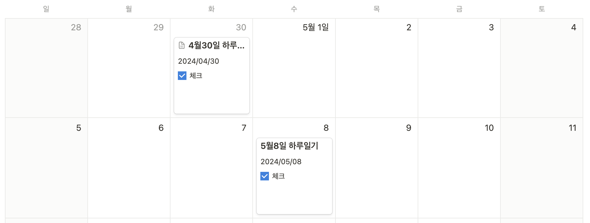
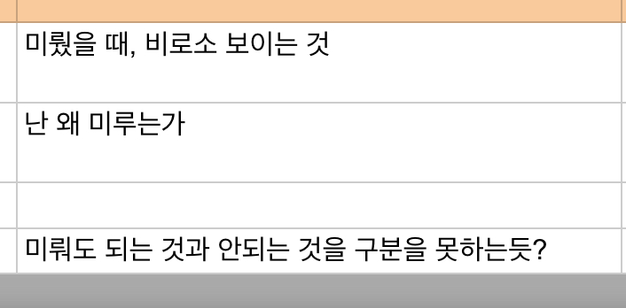
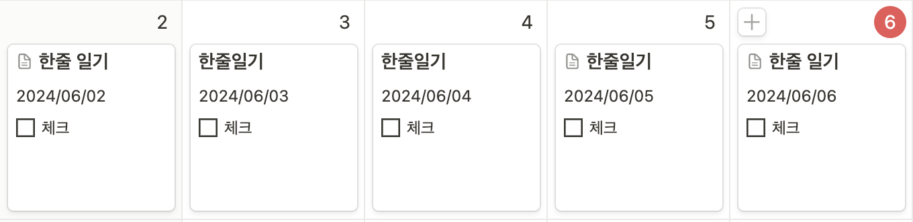

# 낭만 개발자 성장기 2 : 우리는 모두 알 속에 있다.

> __"내 속에서 솟아 나오려는 것. 바로 그것을 나는 살아 보려고 했다. 왜 그것이 그토록 어려웠을까?"__ - 헤르만 헤세, _데미안_

헤르만 헤세의 소설, 데미안은 선의 세계와 악의 세계 사이에서 갈등하며 '**참된 자아**'를 찾아가는 소년 싱클레어의 이야기를 담고 있습니다. 역사 속 많은 청년이 싱클레어에게 감동을 얻고 나 또한 자아를 찾아보리라 다짐했을 겁니다. 그러나 __내면의 각성을 위해 자신을 둘러싼 세계와 싸우는 것이 얼마나 어려운 일인지__, 그들이 깨달았는지는 모르는 일입니다.  

지난 글에는 **세상이 아닌 자신을 좇아가는 것이 즐거움이자 곧 낭만**이라는 이야기를 전했습니다. 그러나 동전에는 늘 양면이 존재하듯, 낭만을 좇는 삶이라는 게 항상 순탄할 수는 없는 노릇입니다. 이번 글에서는 나를 찾아가는 여정 속 시행착오를 함께 나눠보려 합니다. 

## 유연성 강화 목표: 기록과 친해지기?
우테코 레벨 2의 첫 번째 시련은 의외로 유연성 강화 목표 세우기였습니다. 스스로 이미 꽤 유연한 사람이라고 생각했거든요. 낭만을 좇기 시작하고 나서부터는 사람에게 상처받거나 주변과의 비교로 자존감이 떨어지거나 하는 일은 극도로 줄어들었어요. 물론 아예 없지는 않지만, 이전보다는 훨씬 빨리 회복할 수 있었습니다.  

고민 끝에 정한 겨우 목표는 [__기록과 친해지기__]였습니다(다시 보니 유연성 강화 목표의 취지에 부합하는 목표는 아니었네요). 저는 글로 무엇인가 기록하고 정리하는 것을 극도로 싫어합니다. 덕분에 평소에 자주 일정을 놓치거나 잊어버릴 때가 많았죠. 기왕 하는 김에 고치고 싶었던 나쁜 습관이나 고쳐보자는 생각이었습니다. 마침 레벨 1에서 일일 회고를 1달 이상 빠짐없이 기록하여 성장한 경험을 나누어준 크루도 있었기에 실천 목표도 쉽게 새워볼 수 있었어요. 매일 짧은 일일 회고 작성하기, 아주 어렵게 보이지도 않았습니다. 

  
  처참한 실천력

 
하루는 괜찮았습니다. 나름 얻는 것도 많았어요. 불특정했던 생각들과 감정들이 정리되었고, 맑은 정신으로 잠에 들 수 있었습니다. 문제는, 딱 하루까지였다는 거죠. 왜인지 도저히 이틀 이상 지속하기가 어렵더군요.

> 역시 나랑 글은 잘 안 맞아, 난 원래 회고 없이도 잘 성장해 왔어.

이게 결론이었습니다. 깊게 고민하지도 않았습니다. 결론적으로 유연해지지도, 성장하지도 못하는 방향으로 마무리 짓고 만 거죠. ~~이쯤 되니 왜 유연성 강화를 하라는 건지 코치님들이 원망스럽더군요.~~

## 나는 왜 미루는가?
그렇게 유강스 불량 학생으로 몇 주를 보내던 중 __레벨 2 글쓰기를 위한 유강스 핵심 메시지 뽑아내기 활동__ 을 맞이했습니다. 당연하게도 큰 기대는 없었습니다. 제대로 된 참여가 없었는데 핵심을 뽑아내기는 어렵다는 판단이었죠. 그런데 결과는 달랐습니다. 

레벨 1, 2에 걸쳐온 제 유강스 활동을 그렇게 한 번에 읽어보았던 적은 처음이었습니다. 그리고 곧 한 가지 공통점을 찾을 수 있었어요. 

> 그냥 자버리고 내일부터 하고 싶은 마음이 굴뚝같았다. 그러다 문득 자기관리를 위해 운동을 하는 크루들이 생각났고 뭐라도 하자는 생각으로 나가서 걸어봤다.

멀리서 본 제 모습은 '__미루는 것을 너무나도 좋아하는 사람__' 이었습니다. 지금 필요한 것이 무엇인지, 당장 해야 하는 일이 무엇인지 앎에도 불구하고 말입니다. 긍정적인 결과로 마무리한 유강스 경험은 전부 미루려는 마음을 꺾어내고 도전했던 일들이었죠.

저는 한 가지 궁금증에 도달했습니다. 

  
  나는 왜 미루는가?

 

대답하기 어려웠습니다. 저는 모든 일을 미루는 사람은 아니었거든요. 닥쳐서 하는 경우가 물론 많지만 그렇다고 모든 일을 미루지는 않았죠. 고민하는 제게 [한 크루가 건네준 영상](https://youtu.be/_j2lVYMmMLc?feature=shared)이 힌트가 되었습니다.

## 완벽주의 인식하기 

이동귀 연세대 심리학 교수님이 뽑은 한국 사람이 일을 미루는 가장 큰 유형은 (특히 한국 사람) '**완벽주의 형**'입니다. 처음에는 긴가민가했지만 이내 수긍할 수 있었죠. 

제가 미루었던 일과 미루지 않았던 일들은 근본적으로 한 가지 차이가 있었습니다. **자신감 혹은 익숙함**이라고 말할 수 있겠네요. 미루지 않았던 대부분의 일들은 이미 수차례의 경험으로 잘 알고 잘 해낼 자신이 있었습니다. 반면 미루었던 일들은 잘하지 못한다고 생각하거나 처음 겪어보는 일들이었죠.

[__기록과 친해지기__] 도 마찬가지입니다. 돌아보면, 웃기지만 첫 회고를 쓰기까지 첫 결심으로부터 무려 3일이 걸렸습니다. 그 사이 노션 템플릿을 만들고, 하루 중 언제가 좋을지 고민하고 또 못 쓰면 어떡해야 하나 미리 걱정했습니다. 회고조차도 완벽하고 싶었던 거죠. 

실제로 많은 크루들이 유연성 강화 목표로 선택했던 주제가 완벽주의였습니다만 사실 크게 공감하지는 못했습니다. 완벽주의쯤이야 이미 낭만을 좇은 시점에서 버린지 오래라고 생각했거든요. 굉장한 착각이었습니다. 사실 저 또한 오랜 기간 남들의 기대에 부응하기 위해 살았고, 습관은 깊이 뿌리내려 버리기 어렵기 마련입니다.

완벽해야 한다는 내재된 강박과 불안감은 이내 두려움으로 변합니다. 그리고 이내 **'완벽해야 하는 일'로 부터 자신을 격리**하려 합니다. 매일 회고를 작성하는 것은 분명 많은 도움이 되었고 그 사실을 물론 잘 알고 있었습니다. 다만, 익숙하지 않고 잘하지 못하니 두렵고 도망치게 되었습니다. 

세상에 완벽한 사람은 없고 저 또한 마찬가지입니다. 이 말은 즉, 누구도 완벽하지 못함으로 인해 상처받는 일로부터 벗어날 수 없음을 의미합니다. 그래서 우리는 다른 전략을 취해야만 하죠. 이동귀 교수님이 제시한 방법은 [__70%부터 시작하라__]입니다. 단번에 변화하고자 하는 것은 꿈보다는 허상에 가깝습니다. 그러니 내가 할 수 있는 능력의 70%만큼만 일을 완수하고 조금씩 늘려가는 거죠. 

## 작은 변화 만들기

그래서, 저의 [**하루**] 일기는 [**한 줄**] 일기 가 되었습니다. 템플릿은 없어졌고, 유려한 문장도 버렸습니다. 그리고 작은 변화는 긍정적인 영향력을 미치기에 충분했고, 더 가벼운 마음으로 감정을 기록하고 회고할 수 있었습니다.

## 몸부림치는 새

> __"새는 알에서 빠져나오려고 몸부림친다. 알은 세계다. 태어나려고 하는 자는 하나의 세계를 파괴하지 않으면 안 된다. 그 새는 신을 향해 날아간다. 그 신의 이름은 아프락사스다."__ - 헤르만 헤세, *데미안*

주입된 완벽주의는 새를 가두어 놓은 알과 같습니다. 그리고 알을 깨고 날아가려면 먼저, 알 속에 있다는 사실을 알아야겠죠. 그런데 문제가 있다면, 그게 생각보다 어려운 일이라는 사실입니다. 저만 해도 '내제된 완벽주의'를 인정하기까지 유연성 강화 스터디 시작을 기준으로 해도 4달이 넘게 걸렸으니까요.  

그래서 '깨는 것'보다 더 중요한 키워드는 '몸부림'일지 모릅니다. 산전수전 모두 겪은 싱클레어가 자신을 '끊임없는 구도자이며 지금도 그렇다' 고 소개하는 것처럼 우리 모두가 끊임없이 몸부림치는 새가 되기를 기대해 봅니다.
