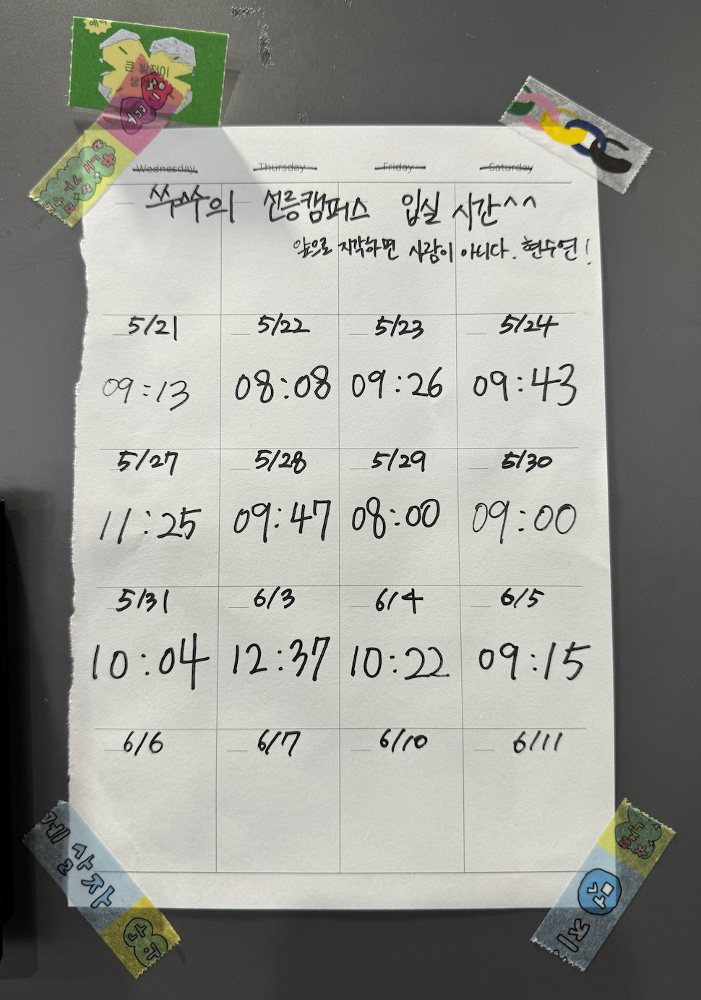

# 한다면 하는 여자

레벨 1 성장하는 괴물에 이어 레벨 2 한다면 하는 여자로 돌아온 쑤쑤입니다^^

솔직히 말씀드릴게요. 소재거리가 떨어졌습니다. 레벨 2 글쓰기는 진지하게 써 내려갈게요.

## 해야 할 일을 미루지 말자

레벨 2 유연성 강화 목표는 “해야 할 일을 미루지 말자”이다.

ISFP 특인가? 게으르고 미루는 게 습관화가 되어 버린 지 오래다. 미루고 미루다 보니 시간이 촉박하게 다가왔을 때 급급하게 시작한다. 글쓰기 미션 또한 제출 당일날 적고 있다. 시간에 쫓기며 하다 보니 당연히 퀄리티는 떨어질 수밖에…. 이런 생활에 익숙해지면서 점점 무뎌지고 있을 때 레벨 2를 마무리하며 뒤늦게 많은 걸 깨닫게 되었다. 크루들을 보면 나름 성장해 있고, 얻어가는 것, 배워가는 것이 많아 보였다. 솔직히 난 모르겠다. 누군가 나에게 레벨 1과 레벨 2 달라진 점을 묻는다면 크게 생각나는 게 없을 정도로 변화를 느끼진 못했다. 마인드 정도🤨

좋은 방향이든 나쁜 방향이든 변화를 가지고 싶어서 스스로에게 질문을 던져보았다.

> Q. 우테코에 들어온 이유는?

- 취업하려고.

> Q. 취업하려는 이유는?

- 돈 벌려고.

> Q. 돈 벌려는 이유는?

- 채무가 살짝 있다.

  - 3년 전 쌍꺼풀 수술(절개 + 윗트임) = 1,529,000원
  - 정확하게 반으로 나눠 각각 엄마, 아빠에게 송금해야 한다.

## 26살 채무 있는 여자

맞다. 난 채무가 있다. 변제를 위해서라도 반드시 취업을 해야 한다..😅

> 일단 취업을 가능하게 해줄 동작 가능한 가장 작은 버전이 무엇일까?

- 해야 할 일을 미루지 않는 것

> 그러면 해야 할 일을 미루지 않기 위해 당장 할 수 있는 가장 작은 버전이 무엇일까?

일단 레벨 2에서 가장 고쳤으면 하는 것 중 하나가 지각이었다. 늘 일찍 일어나지만, 행동이 느린 탓에 다급하게 나오다가 지하철을 놓치기 일쑤였다. 아침 일찍 입실해서 오전에 할 수 있는 일들을 하면 좋지 않을까? 그러면 지각도 해결되고 해야 할 일을 오전과 오후에 분담함으로써 알차게 시간을 보낼 수 있지 않을까?

그때부터 매번 입실 시간을 기록하면서 지각을 줄이고 아침마다 투두리스트를 보며 하나씩 해나가려고 노력했다.

## 쑤쑤의 선릉캠퍼스 입실 시간^^

매번 입실 시간을 기록하며 되돌아보자는 마인드로 진행했다. 효과는 놀라웠다. 우테코 인생 처음으로 "왔다감"에 "왔"도 해봤다! 매번 입실 시간을 기록하게 되니 지각하지 말아야지. 더 일찍 일어나야지. 행동을 좀 빠릿빠릿하게 움직여야지. 더 나은 방향으로 가기 위해 여러 생각들을 하게 된다.

2주 정도 하다 보니 지각은 해결된 것 같다! (5월 31일, 6월 4일 지각. 사람이 아니다 💢)

  

> 그러면 아침 일찍 와서 무얼 하느냐?

솔직히 생산성 있는 일들을 하고 싶었지만, 미션 조금 하다가 노션 정리하고 그러다가 핸드폰 하고 괜히 투두리스트 봤다가... 주로 이러면서 시간을 보냈다^^ 시간을 알차게 보내진 않았지만, 집으로 돌아가는 길에 "오늘 하루 열심히 살았다! 현수연!"을 마음속으로 되뇌이면서 스스로에게 작은 성취감을 안겨주었다.

미루는 게 습관이었던 내가 "한다면 하는 여자"가 된 걸까...??

나비의 작은 날갯짓이 큰 태풍을 불러온다는 말이 있다. 지금 내가 그런 게 아닐까. 큰 변화는 아니지만 소소하지만 작은 변화가 훗날 큰 변화를 이끌어낼지 그 누구도 모른다.
