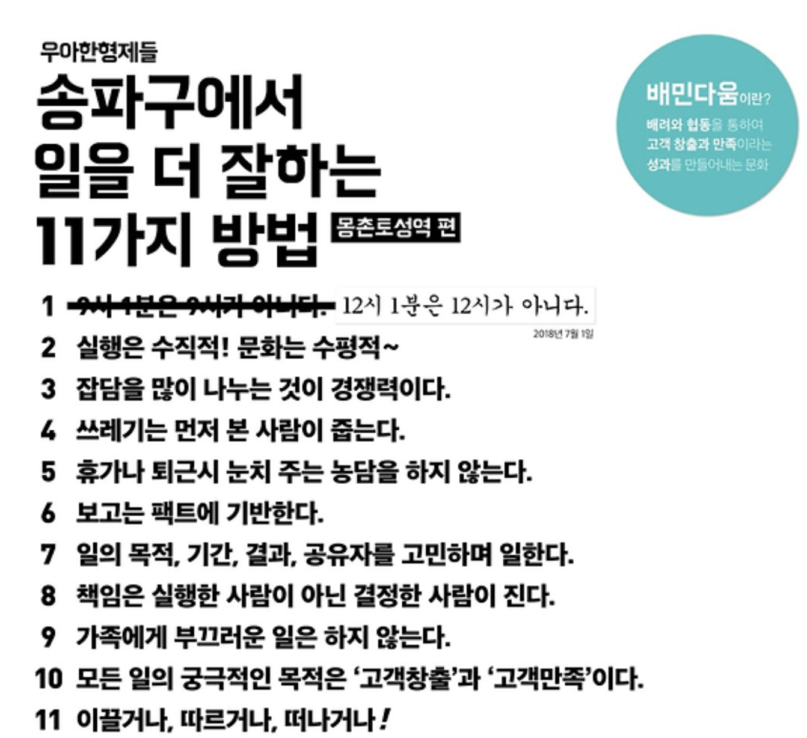

# 가족에게 부끄러운 일은 하지 않는다.

## 가족에게 부끄럽다.

영어 공부 시작은 레벨 2에 들어온 후 가장 큰 변화였다.
그러나 나는 시작하기도 전에 두려움에 휩싸여있었다. 학창 시절에 공부를 소홀히 한 탓에 아는 게 거의 없었다.
시작하고 나서도 두려움은 여전했다. 영어를 유창히 뱉는 크루들에 비해 나의 영어 실력은 형편없었다.

초등학교 4학년 때 있었던 일이 떠오른다. 이사를 해야 해서 다른 학교로 전학을 갔다.
나는 이방인이었고 모든 게 낯설었다. 아는 이 하나 없고 쓸쓸했다. 그때 느낀 감정이 다시 느껴진다.
영어 선생님인 아론이 한 말에 모두가 웃는다. 그냥 따라 웃어야 했다. 그래야만 모두에게 내 실력을 들키지 않고 쓸쓸함이 덜 느껴질 것이라고 생각했을까?

자신을 방어하기 위해서 웃음을 사용한다. 이건 어리석은 행동이다.
말수를 잃어 입술이 바짝 마른 나는 영어 수업 중에 문득 그런 생각이 들었다.
아무 말도 하지 않는 나를 가족들이 봤으면 어땠을까? 영어를 못한다는 사실 그 자체 보다, 영어를 못한다는 사실을 숨기는 자신이 가족들에게 떳떳하지 않다.
가족은 나에게 완벽함을 바라지 않는다. 어깨 펴고 당당하게 나아가라고 한다.
하지만, 지금과 같은 비겁한 모습은 가족들이 원치 않을 것이다.

## 가족에게 부끄러운 일은 하지 않는다.

유연성 강화 스터디 목표는 완벽해야 한다는 강박을 버리는 것이다. 레벨 1 글쓰기에서도 있는 그대로 내 모습을 보여주자고 다짐했었다.
하지만, 내 모습은 그렇지 않았다. 변화를 주어야 한다고 생각했다. 나는 영어 수업에서 작은 실험 계획들을 실천했다.
아론에게 바보 같은 질문이라도 던져봤고 기본적인 내용이라도 모르겠다면 주변 크루에게 도움을 구했다.

한 번은 호티와 함께 담배를 피우러 루터회관을 나가려 했는데 엘리베이터 앞에서 아론을 만났다.
영어 실력을 향상할 수 있는 기회가 찾아왔다고 생각했다.
하지만, 대화하다가 내 부족한 영어 실력으로 인해 차가운 분위기가 만들어지지 않을까 걱정이 들었다.
옆에 있는 호티에게 실력을 들키지 않을까 무섭기도 했다.

그런데도 아론에게 용기를 내어 말을 걸었다.
대화를 시도해 보지도 않은 내 모습이 비겁하다고 생각했기 때문이다.
이 일을 기점으로 아론에게 질문하는 게 편안해졌다.
비록 대단한 대화는 아닐지라도, 나에게는 큰 의미가 있었다.
용기 내어 질문하는 모습과 대화하는 모습을 가족들이 봤으면 어땠을까?
적어도 부끄럽지는 않을 것이다.
