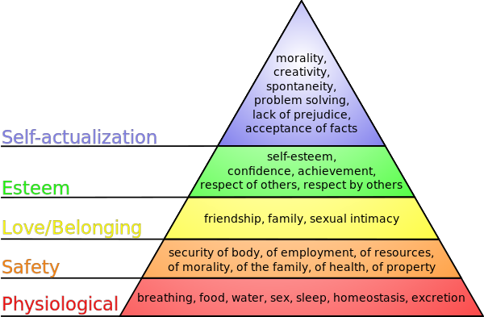

나에게 성장은 성과를 위한 수단이었다.
과정보다는 결과가 더 중요했고, 그 결과가 얼마나 가치 있는 것이냐에 대한 지표는 남들의 잣대였다.
이제는 성장을 위해 걸어가고 싶다. 그리고 그 과정을 더 즐기고 싶다. 우아한테크코스의 레벨 2는 나에게 그 시작의 첫걸음이다.

# 라는 내용을 적으려 했으나 ..

> "너는 왜 이렇게 생각이 많아? 하루하루 그렇게 성장을 얼마큼 했는지 따지면서 살면 피곤하지 않아?"

어떤 사람이 나에게 말했다. 성과보다 성장을 우선시하기로 결정한 후 떠오르는 갖은 고민들을 쏟아내던 나에게 돌아온 반문이다. 

성장, 성과, 그리고 그런 것들에 대한 나만의 기준을 만들기 위해 어지럽게 토해낸 단어들을 보며 살짝 진절머리가 나던 참이었다.
그 말을 듣고 생각했다. 그러게, 나 왜 이렇게 피곤하게 살고 있지? 내가 진짜 얻고 싶어 하는 게 뭘까?

성장하려고 집착하는 모습, 그 기저에 깔린 나의 진짜 욕구를 유심히 들여다보았다.

# 과거 이야기

그럴듯한 말들 뒤에 숨어 어둠 속에서 쉽사리 모습을 꺼내지 못하는 겁쟁이의 모습을 한 꼬마가 있었다.
타인으로부터 버려지지 않기 위해, 혹은 무시당하지 않기 위해 최선을 다해 행복해지려 노력하는 꼬마의 모습이었다.
그 소녀는 뭐든지 잘해야 했고 그렇지 않으면 존재 가치를 인정받지 못할까 두려워했다. 별거 아닌 존재가 될 수도 있다는 사실을 무서워했다.

몸과 마음은 자라고 자라 좋은 모습을 유지하려는 습관이 의식에 자리 잡았다. 반면에 그 습관의 원천인 `다른 사람들에게 인정받고 싶어하는 욕구`는 무의식 깊은 곳에 자리 잡았다.
그렇게 진짜 원하는 것이 무엇인지 잊은 채 그저 뭐든지 잘 해내려고만 하는 어른이 되었다.

자신의 현재 모습에 쉽게 만족하지 못했고 눈앞의 실패에 쉽게 무너졌다. 나보다 더 나아 보이는 사람이 있으면 불안해했다.
스스로 원하는 이상적인 모습은 높아져만 가는데 현실의 나는 그 이상을 따라가지 못했고, 현실과 이상의 괴리로 인해 죄책감만 커졌다.

# 시행착오

타인과의 비교로 인한 불안감, 작은 실패에도 쉽게 무너지는 감정, 누구보다 잘나야 한다는 완벽주의.

이러한 부정적인 감정들은 타인의 인정에 대한 무의식적인 집착이 낳은 부작용이었다.

내면 깊숙한 문제를 기반으로 생겨난 부수적인 부작용들을 내가 해결할 핵심 문제라고 착각했었다.

유연성 강화 스터디를 처음 시작한 레벨 1에는 남들과 나를 비교하며 조급해하는 습관이 고통의 주된 원인이라고 생각했다. 그래서 조급해지지 않고자 노력하였지만 실패하였다. 여전히 나보다 더 빨리 나아가는 것처럼 보이는 크루들을 보며 불안감을 느끼고 있었다. 

레벨 2에서는 성장이 아닌 성과를 목적으로 하기에 생기는 고통이라고 생각해 보았다. 그래서 성장을 지향하다 보면 불안감이 해소될 것이라고 생각했다. 하지만 여전히 성장에 있어서마저 타인을 기준으로 삼았고 그 기준에 미치지 못했을 때 괴로움을 느꼈다. 

여러 가지 시도를 통해 내면의 고통을 해결해 보려 했지만 더 혼란스러워졌다. 문제를 끄집어내고 풀어내려 할수록 엉킨 실타래 같은 머릿속은 더 복잡해졌다.
포비와의 면담이 있기 전날 처음으로 그 모든 것들에 대해 의문을 가져보았다. 

'나는 정말로 성장을 원하기 때문에 유연성 강화 목표를 성장으로 정한 걸까? 내가 정말 원하는 것은 뭐지?'

시간을 많이 거슬러 어린 시절로 돌아가고 나서야 진짜 나의 모습을 마주할 수 있었다.
나는 '타인에게 인정받고 싶어하는 욕구'라는 것을 무의식에서 의식으로 꺼내 옮겼다. 그리고 이것을 유심히 관찰한 결과 이것이 나의 여러 문제의 근본적인 원인임을 알 수 있었다.
타인으로부터의 인정 욕구는 나의 주된 성장 동력이었다. 그렇기 때문에 남들보다 뒤처질까 불안해하였고 실패 앞에서 쉽게 좌절하였다.

이러한 결론을 마주하니 많은 게 명료해졌다. 양파 껍질을 벗기듯 나를 둘러싼 표면적인 욕구들을 조금씩 벗겨내고서야 그 속에 웅크리고 있던 핵심 욕구를 마주할 수 있었다.

# 방어기제

나는 진짜 성장하기 위해 성장을 원하고 있던 것이 아니었다. 진짜 행복하기 위해 행복을 원하던 것이 아니었다.
그저 다른 사람들의 눈에 더 괜찮아 보이는 사람이 되고자 하였다. 그리고 이 욕구를 충족하는 과정에서 성장을 하였고 행복을 느낀 것일지도 모른다.

이제는 행복을 위한 행복, 성장을 위한 성장을 하고자 한다.
타인을 위한 성장 동력은 나를 병들게 한다. 타인이 아닌 온전히 나에게서 비롯된 동력을 삼아 자아를 실현하고 싶다.

녹이 슨 내면의 방어 기제를 기어코 내 손으로 부수어야 초라하고 애틋한 내 모습이 드러난다. 나의 가장 아픈 곳을 건드려야 진짜 나를 바라볼 수 있다니, 조금은 잔인하다고 느껴지기도 한다.
그럼에도 불구하고 작고 하찮은 꼬마를 알아보기 위해 모른 체 하지 않은 나에게 감사하다. 

# 앞으로의 이야기

"나의 성장 동력은 타인의 인정이었다."라는 결론을 내리는 것은 스스로도 마음이 아픈 과정이었다.  지난 수년간의 노력을 그릇된 욕망으로 얼룩지게 하는 결론일 수 있기 때문이다.
하지만 앞으로의 남은 인생을 더 가치 있는 동기로 만들어 나가기 위한 용기 있는 자아 성찰이라고 생각한다.

포비와의 상담에서 이 이야기에 대해 나누었다.
나눈 여러 가지 이야기 중 매슬로의 욕구 5단계 설에 대한 이야기가 기억에 남는다.

위에서 두 번째에 위치한 욕구가 눈에 띈다. 타인에게 인정받고 싶어 하는 욕구이다. 지금이 이 욕구를 뛰어넘어 그 상위 단계인 자아실현의 단계로 성장해 나가는 터닝 포인트라고 생각한다.
타인의 인정에서 완전히 벗어나야 한다는 것은 아니다. 하지만 내가 정말로 원하는 것이 가장 높은 우선순위가 되어야 한다. 그래야 나의 중심이 잡히고 여러 가지 실패 앞에서 더 단단해질 수 있다고 생각한다.

말은 거창하게 했지만, 아직 내가 무엇을 원하는지 모르겠다. 하지만 하나 확실한 것은 언젠가는 그것을 찾을 것이고 지금보다는 더 안정적인 모습으로 나아갈 것이라는 점이다.

진정한 나를 찾기 위한 고민은 프로그래밍을 잘 하기 위한 고민만큼이나 중요하다. 나는 우아한테크코스를 개발자로서의 성장 뿐만 아니라 진정한 나를 찾아가는 목적으로 이용할 예정이다.
우아한테크코스에는 자신만의 가치를 실현하기 위해 몰입하며 성장하는 크루들이 많다. 프로그래밍을 사용해서 이루고 싶은 것이 무엇인지, 그들만의 성장 동력은 무엇인지 그 생각들을 배우고 싶다.

# 마무리하며

나의 가장 아픈 곳을 꺼내어 용기 있게 글로 옮겨보았다.

유의미한 깨달음은 한순간에 나오지 않는다. 스스로를 성찰하고자 했던 잦은 시도들이 있었기에 나에게 더 솔직해질 수 있었고 나의 진짜 모습에 가까워질 수 있었다.

예전에는 더 멋진 사람이 되어야지, 하고 하루하루 나를 어제의 나와 비교했다. 하지만 좋은 삶이라는 것도 없고 정답으로 정해진 삶도 없는 것처럼 나 역시 더 나은 사람일 필요도, 더 행복한 사람일 필요도 없다.
그저 나는 나일 뿐이고 내가 가장 솔직한 나일 때 비로소 완전해진다.

아직은 이 모든 걸 내 삶 속 일상과 결부시키기 어려울 것 같다.
하지만 다른 사람들의 인정과 시선에서 벗어나 내가 원하는 것을 좇으며 나 자체로 행복한 미래의 내 모습을 어렴풋이 그려본다.

오래된 흔적들을 덜어내고 빈 도화지에 그려나갈 나만의 이야기가 기대된다.
