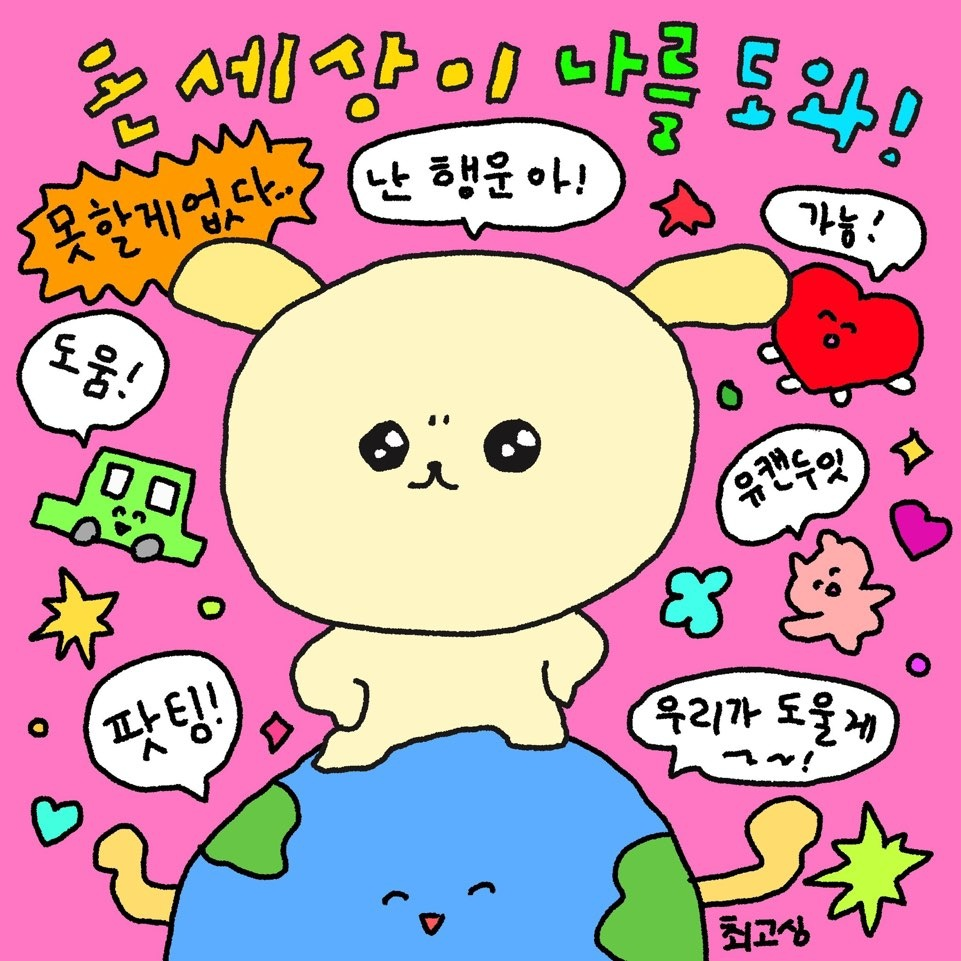

# Love myself

## 레벨 1 : 개발자 모드 off

레벨 1 우테코를 표현하자면 바쁘게 돌아다니는 시계 토끼를 따라서 낯설고 재미있는 세상을 정신없이 구경한 앨리스가 된 기분이었다. 눈뜨면 온보딩, 미션이 끝나있고 때때로 벽에 부딪히기도 했다. 그 과정에서 나를 체력적으로 힘들게 한 것은 ‘과도한 몰입’이었다.

첫 미션을 진행하면서 본능적으로 ‘아! 전부터 고민하던 몰입과 스스로를 챙기는 것의 균형을 잡는 법을 터득해야겠다.’라는 생각을 했다. 요동치는 파도에 휩쓸리지 않으려면 말이다.

다행히 휩쓸리더라도 그 속에서 숨구멍을 만드는 법을 찾았다.

## 새로운 고민: 개발자로서의 자존감 챙기기

레벨1에서 새로운 고민이 생겼다. 리뷰어의 피드백을 받으면서 ‘언젠가는 이보다 더 직설적인 리뷰를 받게 될 텐데, 리뷰에 상처받는 순간이 온다면 어떻게 해야 할까?’라는 생각이 들었다.

공원에게 이에 대해 면담을 신청했다.

> ‘어떤 부분에서 상처를 받을까요?’
>
> ‘약점이라는 것은 어쩌면 내가 중요하게 생각하는 부분일 수도 있어요.’
>
> ‘약점이라고 생각하는 부분을 마주하게 될 때, 스스로를 보호할 수 있는 방법을 찾아보는 것도 좋아요.’

레벨1 방학 때 스스로를 보호할 방법에 대해 생각해 봤다.

그때 떠올린 것은 개발자로서의 자존감을 올리는 것이다. 자존감이 높은 사람은 타인의 평가에 잘 휘둘리지 않는다. 받아들여야 하는 것과 그렇지 않은 것을 잘 구분한다. 개발자로서의 자존감이 높다면 날카로운 피드백도 유연하게 잘 받아들일 수 있지 않을까 생각한다.

## 시도

> 개발자로서의 자존감을 높이는 방법에는 무엇이 있을까?
> 레벨 1에서 하지 못했고, 레벨2에서 시도할 수 있는 것은 무엇일까?

레벨 1에서는 주어지는 미션을 수행하는 것에 바빠서 다른 크루들과 개발에 관해 이야기하는 시간이 적었다. 그래서 레벨 2에서는 개발에 대한 생각을 다른 크루들과 많이 놔누고 싶었다.

본인의 의견을 표현하는 것을 자주 하고 그 과정에서 타인의 긍정적인 반응을 받는 것은 자존감을 높일 수 있다고 생각한다. 그래서 크루들과 개발에 관해 이야기 하는 것이 개발자로서의 자존감을 높여주거라 생각했다. 그래서 레벨 2에서 리액트 스터디,알고리즘 스터디를 시작했다. 테코톡도 하게 되었다.

## TDD적 사고와 자기 최면

스터디, 테코톡, 미션을 동시에 진행하다 보니 빠르게 미션을 끝내고 해야할 것들이 계속 끊임없이 밀어닥쳤다. 생애 처음으로 해야 하는 일들에 정신이 아득해졌다.

> 그런데 어쩌겠어? 안 할거야? 해야지

그때 선택한 방법은 TDD적 사고와 자기 최면이었다.

테스트 단위로 작은 기능을 구현하듯이, 해야 하는 일들의 작은 단위부터 해나갔다.

그러다 지치거나 잘해 나갈 자신이 없을 때에는 자기 최면을 걸었다.

> 그 므시라꼬!!! 내가 제일 잘해!!

 

  

 
TDD적 사고와 자기 최면 덕에 좋은 평을 들으며 테코톡을 잘 마무리했다.

## 위기 그리고 긍정

이렇게 해피엔딩이면 좋겠지만, 인생은 동화가 아니다.

빌드 문제를 해결하기 위해 다른 크루에게 가다가 발을 삐끗해서 깁스를 차게 되었다. (글쓰고 있는 현시점으로 뼈가 잘 아물고 있고 아프지 않으니 너무 걱정하지 말기를 바란다.)

웃긴 게 깁스를 하고 나올 때 든 생각은 ‘잊지 말고 실비 청구하자.’였다. 이 문장이 현실적이면서도 긍정적인 성격을 대변하는 듯하다.

불편하지 않다거나 그로 인해 기분이 내려앉는 일이 없는 것은 아니다. 그래도 어떡하겠나? 이미 벌어진 일인 것을. 고민을 파고들어서 힘들었던 과거에서 배운 것은 지금 할 수 있는 거를 하는 거였다. 바쁘게 지내는 삶에서 느려지는 시간인가 보다 하고 생각하고 지내고 있다.

> 아침에 일찍 나오고, 퇴근 좀 늦게 하지 뭐.

> 몸이 불편하니까, 다른 시점이 보이기도 하네.

## Love myself

유강스에서 테코톡과 깁스를 한 일을 이야기했다. 혼잡하고 힘든 상황을 긍정적으로 바라보는 태도를 굉장히 높게 평가해 주었다. 힘든 상황에서 긍정적일 수 있다는 것은 마음이 튼튼해야만 할 수 있는 일이라고 말해주었다. 그러면서 어떻게 그럴 수 있는지 궁금해했다.

그 기반은 아마 내가 힘들 때 위로와 응원을 준 **Love myself**라는 말이다. 스스로를 사랑하는 것은 가장 어렵지만 스스로를 사랑한다면 타인도 그리고 세상도 사랑할 수 있다는 의미의 말이다. 유약하고 못난 스스로를 대면해 보는 것은 아프고 어렵다. 하지만 분명한 것은 스스로를 마주할 수 있다면 생각보다 꽤 괜찮은 사람일 수 있다.

일상에서 적용하는 Love myself를 개발자로서의 모습에도 적용해 보는 중이다. 테코톡을 잘 들었다는 크루들의 좋은 평을 들었다. 스터디를 준비하기 바쁘지만 스터디를 하면서 사고가 깊어지는 부분도 좋다. 또한 스스로 걸었던 자기최면의 효과가 계속 이어져 우테코 기간 중 가장 마음이 평온하다. 이전에는 개발 시 부족한 부분이 99%로 눈에 띄었다면 이제는 나름 괜찮은 부분도 보인다. 우테코 수료 때 우테코를 들어오기 전보다 더 내면이 단단한 개발자가 되어있으면 좋겠다.
