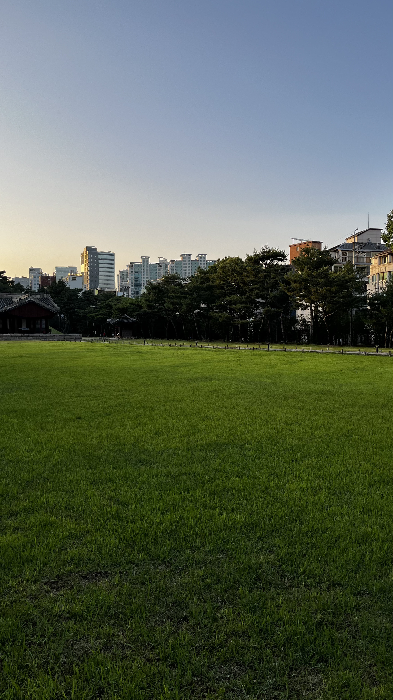

## 반갑습니다~ 🍀🧚

안녕하세요, 우아한테크코스 6기 FE 해리라고 합니다.

저의 레벨 2 유연성 강화 목표는 **"현재 내가 처한 상황에 적응하는 능력 키우기"** 입니다.

지금까지의 저는 낯설고 새로운 환경이나 상황에 놓였을 때, 이에 적응하는 데까지 꽤 많은 시간이 필요했고, 적응해가는 과정을 힘들어했었던 것 같아요.

그래서 **환경이 변할 때마다 몸의 색을 바꿔가며 유연하게 환경에 적응해가는 카멜레온처럼**, 저도 새로운 환경, 상황에 유연하게 적응해가는 사람이 되고 싶어 위와 같은 유연성 강화 목표를 정하게 되었습니다.

편하게 읽어주세요 ㅎㅎ 😊

(참고차, 레벨 1 글쓰기도 같이 링크 첨부해 봅니다.)

[레벨 1 글쓰기 미션](https://github.com/hwinkr/woowa-writing/blob/level1/README.md)  
[레벨 1 전체 회고(개인 블로그)](https://hwinkr.tistory.com/4)

그럼 이야기를 시작해 보겠습니다.

## 결국 적응한다, 해낸다. 어떻게든

이 글은, "우아한테크코스"라는 경험해 보지 못했던 새로운 환경에 놓인 제가 어떻게 적응해갔는지에 대한 기록에 가깝습니다.

우테코가 끝나고 앞으로 살아가면서 또 다른 새로운 환경에 놓이게 될 제가, 적응하느라 힘들어하고 있다면 이 글로 돌아와서 **"결국 적응한다, 해낸다. 어떻게든"** 이라는 메시지와 힘을 얻어 가면 좋겠다는 생각으로 써봅니다.

또 저 뿐만이 아닌, 저의 글을 리뷰해 주실 분들, 우연히 지나가다 제 글을 읽으실 분들 모두 **'결국 적응한다, 해낸다. 어떻게든'** 이라는 말과 함께 힘을 얻어 가셨으면 좋겠습니다.

### 레벨 1 기억 더듬어보기

우테코를 시작한 지 얼마 되지 않았던, 2~3월은 우테코라는 낯선 환경에 적응해 보기 위해서 허우적댔던 기억이 대단히 많습니다.

어느 정도 적응하기 전, 삐걱(?)댔던 제 모습을 몇 가지 기록해 봅니다..ㅋㅋㅋ

#### 1) 뭘 먹어도 소화가 안 돼요

지금은 주로 도시락을 싸다니지만, 연극을 준비하던 온보딩 기간에는 연극조, 데일리 조와 함께 밖에서 밥을 먹었습니다.

우테코라는 새로운 환경도 낯설고, 선릉도 낯설고, 처음 본 크루들도 낯설고,,,그러다보니 뭘 먹든 소화가 잘되지 않았습니다.

평소 밀가루, 유제품류 같은 음식들은 잘 소화하지 못해서 웬만하면 잘 먹지 않으려고 하는 편이었는데 이런 음식들을 먹는 날이면... 하루 종일 가스가 차고 속이 더부룩하고 난리가 나더군요.

예민한 피부를 타고나서, 하루는 피부가 엄청나게 뒤집어졌던 기억도 있네요.

하지만, 이 문제는 레벨 2에 와서 말끔히 해결됩니다!

어떤 음식을 먹느냐보다, **편안함 속에서 밥을 먹을 수 있냐 없냐**가 더 중요하더라고요.

우테코에서 어느 정도 적응하고, 편안해졌다는 것을 느낀 뒤로 무엇을 먹든 대부분 소화를 잘하는 제 모습을 발견했습니다~! 😊

#### 2) 해리...집 갈 때 인사해도 돼?

레벨 1 데일리 미팅을 하던 중, 실제로 제가 받았던 질문입니다... ㅎ

평소 캠퍼스에서 노이즈 캔슬링 헤드셋을 끼고 있어, 집중해서 코딩하고 있다면 옆에서 누가 지나가는지 잘 모르겠더라구요.

거기다가 레벨 1 초반에는 우테코에 잘 적응하지 못해서 허우적대기도 했고, 크루들과 어색하고 서먹하던 시기라서 인사를 잘 하지 않았던 것 같습니다. (제가 극 I라 죄송...ㅎ)

저에게 인사를 하고 싶었던 한 크루가 제가 너무 집중하는 것 같아서 전날 인사를 못했는지, 다음 날 혹시 집 갈 때 인사해도 되겠냐고 질문을 하더군요.

그런 질문을 받아본 적은 처음이라 질문을 받고 되게 당황스러웠던 기억이 나네요.

레벨 1 담당 코치였던 공원이, 장난으로 "두 분 뭔 일 있나요? 데일리 미팅 끝나면 저한테 오세요..ㅋㅋㅋ" 했던 기억이 납니다.

지금은 인사해도 되겠냐고 질문을 했던 크루 분과 아주 밝게 인사를 주고받으면서 잘 지내고 있습니다. 😊  
(혹시나 이 글을 읽는다면 그렇다고 해주세요~)

#### 3) 해리가 생각하는 우테코 생활은 어떤 거죠? ㅋㅋ

레벨 1 생활을 하면서, 가장 많이 했던 말이 있습니다.

'이건 제가 생각했던 우테코 생활이 아니에요...'
ㅌ1
이런 말을 할 때마다, 공원은 '그럼 해리가 생각하는 우테코 생활은 어떤 거죠? ㅋㅋ 질문해 주셨고, 저는 '일단 이건 아닙니다...'라고 대답했던 기억이 납니다.

너무나도 자유롭고 편안한 분위기 속에서, 또 한편으로는 야생 같은 환경 속에서 학습과 성장을 해가는 우테코에 잘 적응하지 못했었기 때문에 레벨 1 때는 저 말을 많이 하지 않았나 싶습니다.

레벨 2에서는 저 말을 한 번도 한 적이 없습니다~ ㅎㅎ 😊

## 나의 레벨 2 적응기

레벨 1 환경에 적응하기 위해서 때로는 허우적대며, 또 때로는 삐걱(?)대기도 했던 제가 레벨 2 환경에 어떻게 적응해 갔는지 이야기를 시작해 볼까 합니다.

### 서울 지옥철 돌파구 찾기

아침 8시 30분부터 9시 사이에 2호선 지하철을 탔을 때, 놀라지 않았던 적이 없습니다.

**'사람이 왜 이렇게 많은 거지?'**, **'부산 지하철보다 분명히 훨씬 더 넓은데, 저 넓은 공간을 어떻게 다 채우는 거지?'** 라는 생각을 하며 사람들 속에 끼여 힘들게 출근했던 기억이 나네요.

특히, 지하철이 도착하고 문이 열렸음에도 공간이 가득 차서 들어가지 못하고 눈앞의 지하철에 타지 못하고 보내야 했던 순간은 정말 충격이었습니다.

저는 이 상황에 적응해 보고자 했습니다.

아시는 분은 아시겠지만, 레벨 1에서 저는 11시까지 남아있던 **왔다 감 고정 멤버** 였습니다.
(참고 : [왔다감 고정 멤버입니다만...?](https://github.com/hwinkr/woowa-writing/blob/level1/README.md#%EC%99%94%EB%8B%A4%EA%B0%90-%EA%B3%A0%EC%A0%95-%EB%A9%A4%EB%B2%84%EC%9E%85%EB%8B%88%EB%8B%A4%EB%A7%8C))

하지만, '곧 여름이라서 굉장히 더워질테고, 나는 몸에 열도 굉장히 많은 편이고, 출근할 때 편하게 오고 싶은데... 어떻게 할 수 있을까?'라는 생각을 했고, 그럼 **레벨 2는 새벽러가 돼서 왔다 감의 "왔"을 담당해 보자!** 라는 결론을 내리게 되었어요.

이 생각을 하기 전, 저는 대부분 새벽 1 - 2시 사이에 잠들었었기 때문에 평소에 유지했던 수면 패턴을 바꾸기 위해서 특별한 트리거(?)가 필요했습니다.

그래서 저는, 레벨 1 방학이 끝날 무렵 갔던, MT를 이용해 보기로 했습니다! 😎😎😎

'MT에 가서는 마음 편하게 밤새워 놀고, **밤을 새운 다음에도 잠을 자지 않고 쌓아둔 다음 일찍 잠에 들고 새벽에 일어나보자!**'라고 생각했고, 실제로 적용했습니다.

그래서, 레벨 2부터는 8시에서 8시 20분 사이에 도착하는 것을 목표로 하고 "왔"을 담당하며 생활하고 있습니다!

<div style="display: flex; justify-content: space-between;">
  
  
  
</div>

제가 생각한 목표 시간에 도착하려면 적어도 6시 30분에는 일어나야 해서 달라진 수면 패턴에 적응하느라 캠퍼스에 도착하고 나서도 졸기도 하고 아예 자기도 했어요.

이럴 때마다, '다시 "감"을 담당하고 원래 자던 데로 잘까...'하며 흔들리기도 했지만 '지옥철만은 피하겠어!🔥 나는 적응할 수 있다, 나를 믿어보자'하며 졸더라도, 자더라도 이 수면 패턴을 유지해 보고자 했어요.

지금은 어느 정도 적응을 한 것 같아서 알람 없이도 6시 30, 40분 사이에 눈을 뜨고 있네요 하하 😊

### 우테코 야생에 적응하기 (Feat. TDD)

레벨 2에 와서, 이유는 잘 모르겠지만 정말 '붕~ 떠 있는 것 같다'라는 생각을 많이 했습니다. 💭💭💭

선릉 캠퍼스를 떠다니는 공기처럼, 붕~ 떠다니면서 오늘 하루해야 하는 일에 집중도 잘 못하고, 외면하고 있는 제 모습을 발견했습니다.

최근에서야 그 이유를 알게 되었는데 '제가 생각했던 레벨 2의 학습 방향과 실제 학습 방향이 일치하지 않아서' 이 부분에서 약간의 괴리감을 느끼고 있어서였습니다.

레벨 1은 자바스크립트를 '깊이 있게' 학습하고 다뤄보는 것이 학습 목표였기 때문에, 레벨 2는 리액트를 '깊이 있게' 학습하고 다루는 것이 학습 목표이지 않을까 생각하며 레벨 2를 맞이했지만 실제로는 **리액트와 TDD 사고방식을 활용해서 주어진 문제를 "잘" 해결하는 것이 목표**안 듯했습니다.

'문제를 잘 정의하고, 문제를 해결해 가기 위한 작업 순서를 정하고, 테스팅 도구를 사용해서 **빠른 피드백**을 받는다...?' 도대체 이게 무슨 말인가 싶었습니다.

레벨 1에도 TDD 수업이 있었는데, **'실패하는 테스트 코드를 먼저 작성한다'** 는 것이 너무나도 어색하고 와닿지 않아서 외면했던 기억도 함께 떠올랐습니다.

TDD가 주제였던 미션에서 페어에게 "왜 실패하는 코드를 먼저 짜야 할까요...?"라는 반란군과도 같은 질문을 하기도 했습니다... ㅎ

너무 어렵게 느껴지고, 추상적으로 느껴지고, 학습 목표에 다가가기 위해서 어떻게 해야 할지 전혀 감이 잡히지 않아서 적응하지 못하고 붕~ 떠 있는 것만 같다고 생각하게 되더군요.

어느 날, '레벨 2가 끝날 때까지, 계속 붕 떠 있을 수만은 없다...!'고 생각하게 되었습니다.

<div style="display: flex; justify-content: space-between;">
  
  
</div>

[출처](https://www.youtube.com/watch?v=3-1kfqoUcpo&t=2s)

**6기-잡담** 채널에 솔라께서 공유해주신 영상을 보고 나서 TDD에 도전해보기로 마음 먹었습니다.

> 학습의 70%는 그냥 나가서 해보는 거예요.  
> 실패하는 것을 받아들일 준비가 되어 있어야 해요.

해당 문장을 보고 용기를 얻어 장바구니 미션 스텝 2에서 TDD에 도전해 보기로 했습니다. 단, 저의 방식대로...!

TDD와 관련된 블로그 글, TDD 책, 유튜브 영상을 보지 않고 **제가 생각하는 TDD를 직접 미션에 적용해 보기로 했습니다.**

레벨 1을 진행하면서 크루, 리뷰어 분들과 **미션이 끝날 때마다**, **피드백 요청과 응답이 끝날 때마다** 피드백을 주고받으면서 피드백의 중요성에 대해서 알게 되었습니다.

또, 레벨 1 방학 때 "함께 자라기" 책을 읽으면서 **빠른 피드백**의 중요성에 대해서도 알게 되었습니다.

그래서 TDD의 T를 TEST로 바라보기보다는 피드백으로 바라보기로 했습니다...!

TDD를 '실패하는 테스트 코드를 먼저 작성하고, 통과하기 위해서 코드를 구현해 가는 것'이라고 생각하지 않고, '문제를 해결하기 위한 사고 과정과 그 결과인 코드에 대해서 **빠르게 피드백**을 받는 것'이라고 생각하기로 했습니다.

```text
장바구니 미션 스텝 2 기능 요구 사항 중

다음과 같은 4가지 유형의 쿠폰을 사용할 수 있어야 한다,
각 쿠폰의 특성을 잘 이해하고, 해당 쿠폰을 적용했을 때의 할인 효과를 정확히 계산할 수 있도록 구현한다.
...
```

위와 같은 핵심 기능 요구 사항을 구현해 가기 위해서, 쿠폰이 딱 하나만 있다고 스스로 가정하고 하나의 쿠폰 로직 작성이 끝나면 테스팅 도구를 활용해서, 빠르게 피드백을 받는 방식으로 구현했습니다.

이런 방식으로 미션을 진행하니 **적어도 하나의 기능은 사용자에게 안전하게 제공해 줄 수 있겠다**는 생각이 들어 안도감이 느껴졌고, 하나의 기능과 그 기능에 대한 테스트 한 세트를 완료해 갈 때마다 끝을 향해서 조금씩 나아가고 있다는 느낌도 받았습니다.

이렇게 미션을 끝내고 PR을 제출한 후, 처음 한 생각은 '아 TDD 사고방식, 무슨 느낌인 줄 알겠다! 왜 그렇게 강조하시는지 알겠다!'였습니다.

이 생각이 든 후부터는, 붕~ 떠다니던 감정들이 많이 가라앉았고 다시 제가 해야 하는 일에 집중을 잘하는 제 모습을 발견할 수 있었어요.

해당 미션의 PR도 같이 첨부해 봅니다. ㅎ ([장바구니 미션 스텝 2 미션 PR](https://github.com/woowacourse/react-shopping-cart/pull/296))

### 달라진 내 모습에 적응하기

레벨 2에 들어와서 스스로 가장 많이 했던 생각이 있습니다.

바로 '우테코 생활하면서 가장 많은 시간을 함께 보내는 크루들이랑 어떻게 하면 더 의미 있게 시간을 보낼 수 있을까?' 입니다.

내년에 우테코 생활을 다시 돌아봤을 때, '~해볼걸', '~아 이건 왜 하지 않았지?' 이라는 생각이 조금이라도 덜 들려면(우테코 생활을 어떻게 하든 후회는 남겠지만요) 내가 뭘 할 수 있을까에 대한 생각을 했을 때, 크루들이랑 더 의미 있게 시간을 보내보자!라는 나름대로 결론을 내렸었습니다.

즐겁게 학습해 가는 우테코에서의 하루하루가 너무나도 소중하게 느껴지더라고요.

그래서 뭘 했냐면,,, 바로 회고와 피드백을 할 수 있는 질문지들을 만들어보고 그 질문에 답을 같이하고, 답을 공유해보는 시간을 마련했습니다!

솔직히 레벨 1때에만 해도, 너무 많은 회고와 피드백에 갇혀서 적응하느라 힘들었습니다. 하지만 회고와 피드백 사이클에 적응을 하고, 장점을 깨달은 후 이를 더 '잘'할 수 있는 방법에 대해서 고민해 보는 시간을 가졌어요. 그 고민의 결과로, 질문지들을 만들고 '이거 같이 해보실래요~?'라며 권유해 보는 '회고와 피드백 문화'를 만들기 위한 시도를 했습니다!

같이 해보자고 말하기에는 '아, 거절당하면 어떡하지?', '안 그래도 바쁜 크루들에게 할 일을 더 쥐여주는 건 아닐까?'라는 생각이 들어서 망설여졌지만, 의외로 지금 같이 하고 있는 크루들이 긍정적인 반응을 해주셔서 너무 뿌듯했습니다.


레벨 1 전체 회고 글에서도 확인할 수 있듯이, 회고와 피드백 문화에 대해서 잘 적응하지 못해서 허우적댔지만 적응을 한 후, 문화를 만들어가고자 했던 제 모습에 놀라서 오히려 이런 제 모습에 적응해야 했습니다..ㅎ 😊

### 즐거움과 일상을 잘 느끼고 싶어요

우테코를 시작하기 전, 저는 굉장히 번아웃을 자주 느끼며 살아가던 사람이었습니다.

이와 관련해서, 레벨 1 방학식 날 공원과 면담을 했고

> _즐거움을 느껴야, 학습이든 무엇이든 오래 지속할 수 있을 것 같아요._  
> _일상을 잘 느끼면서 살아가는 것도 중요합니다._

위와 같은 말씀을 해주셨고, 레벨 2에 적용해 보고자 했습니다.

어떻게 하면 '자연스럽게', '잘' 저의 레벨 2 생활에 적용할 수 있을까를 고민하다가 스스로 즐거움이 느껴지는지, 일상이 잘 느껴지는지에 대한 질문을 하고 답변을 해가면 쉽게 적용할 수 있을 것 같았습니다.

그리고, **달라진 내 모습에 적응하기** 문단에서 말한 것처럼, 우테코 생활을 같이하는 크루들에게 같이 이 질문에 답을 해보자고 제안 했습니다.

혼자 질문에 답을 하고, 기록해 가는 것이 아니라 같이 해보자고 제안했던 것도 어쩌면 '크루들과 함께 시간을 보내는 제 일상'을 더 잘 느껴보기 위한 작은 시도가 아니었나 하는 생각을 해봅니다.

레벨 2에서 진행했던 스터디, 유강스 시간에 아래와 같은 질문들에 답을 해가며 즐거움과 일상을 잘 느끼려고 했던 것 같습니다.

#### 1) 대성리(대성공 리액트 딥다이브 스터디)

```
1. 대성리 스터디원으로써 스스로의 모습에 만족하고 있는가?
2. 현재 대성리 스터디가 나에게 도움이 되고 있는가, 스터디를 하기 위해 오는 길이 즐거운가?
3. 대성리 스터디를 더 의미있게 진행할 수 있다면 어떤 방법이 있을까?
```

#### 2) 유강스 - '미션을 의미있게 진행해 보기 위한 질문지들'

```
미션 시작 전

1. 이번 미션에서 가장 이루고 싶은게 무엇인가요?
2. 학습 목표 중에서 이것 만큼은 꼭 가져가고 싶다고 생각한게 있나요? (이유도 함께 적어주면 좋아요!)
3. 코치분들이 해당 미션을 만든 의도는 무엇일까요, 어떤 메시지를 저희한테 전달해주고 싶었을까요?

미션 중간중간

1. 혹시 지금 미션이 재미가 없나요? 만약, 재미가 없다면 왜 그런 감정이 느껴지는 것 같나요?"

2. 혹시 미션하다가 지금 막혔나요? 어디서 막혔나요? 공유해봐요!

미션을 제출한 후

1. 페어 프로그래밍을 하면서 개발적인 부분이 아니더라도 재밌었던 순간을 공유해봐요!

ex) 시모와 해리의 페어프로그래밍
시모 : 해리 저번 리뷰어 누구였어요?
해리 : 저 피터요
시모 : 피터지게 리뷰 주고 받았겠네요
해리 : 🤣🤣🤣🤣🤣🤣

2. 이번 미션을 진행한 후, 본인에게 점수를 준다면 몇 점을 주고 싶나요? 점수 옆에 간단한 이유를 공유해봐요!

5점: (내가 생각했을 때, 내 기준에 의한)완벽에 가까운 미션을 했다.
4점: 나름 만족할만한 미션을 진행했다.
3점: 보통이다.
2점: 뭔가 씁....아쉽다.
1점: 너무 아쉽다! 미션 다시 하고싶다."
```

스터디원들과 질문들에 답해보는 시간을 가지고, 그 답을 공유하면서 많은 의견을 나눌 수 있었고 확실히 혼자 하는 것보다 같이 하니 더 즐거웠고 일상도 더 잘 느껴졌던 것 같습니다.  
(안 그래도 바쁜 레벨 2 생활에서 저의 권유에 흔쾌히 응해준 스터디원들에게 감사드립니다. 😊)

## 결국 적응한다, 해낸다. 어떻게든

인간은 **적응의 동물**이라고 합니다.

사람마다 다르겠지만, 충분한 시간이 주어진다면 어느 환경에 속하든 결국 적응은 할 수 있지 않을까 하는 생각이 들기도 합니다.

그런데도, 레벨 1, 2에서 발견한 제 모습은 '적응하기 위해서 의식적으로 노력하는 모습'이었기 때문에 '적응'을 주제로 기록해 보고자 하는 마음이 컸던 것 같습니다.

유강스 시간에 진행했던, 유수타(유연한 수다 타임)에서 저희 조의 주제는 '왜 유연해야 할까요?' 였고, 이에 대한 제 답은 **'일상을 더 잘 느끼기 위해서' 였습니다.**

위에서 언급한 내용 이외에도, 매일 산책을 다니려고 시간을 내서 **제가 좋아하는 초록색 나무들과 꽃**을 보려고 하기도 하고, 매일 작성하는 일기에도 **한 줄로 오늘 하루를 요약하고 요약 문장에 어울리는 이모티콘을 붙여보는** 등 일상을 더 잘 느껴보기 위한 의식적인 노력을 하고 있어요.

사진을 잘 찍지는 못하지만, 산책하러 다니며 찍었던 사진들도 공유해 봅니다. 😊

<div style="display: flex; justify-content: space-between;">
  
  
  
</div>
<br/>
<div style="display: flex; justify-content: space-between;">

  
  
</div>

레벨 2의 끝자락인 지금, 제가 유강스 조원들이나 다른 크루들에게 자주 하는 말이 있습니다.

> _**"개발이 나의 일상 자체가 되는 것이 아니라, 일상 속에 개발이 있었으면 합니다."**_

이 글을 읽어주고 계신 여러분들은 일상을 잘 느끼고 계신가요~?

일상을 보내면서 잘 먹고, 이쁜 풍경도 많이 보고, 주변 사람들과 재미있는 대화도 많이 하고, 많이 웃고, 푹 잘 잤으면 좋겠습니다. 💚

긴 글 읽어주셔서 감사합니다.
