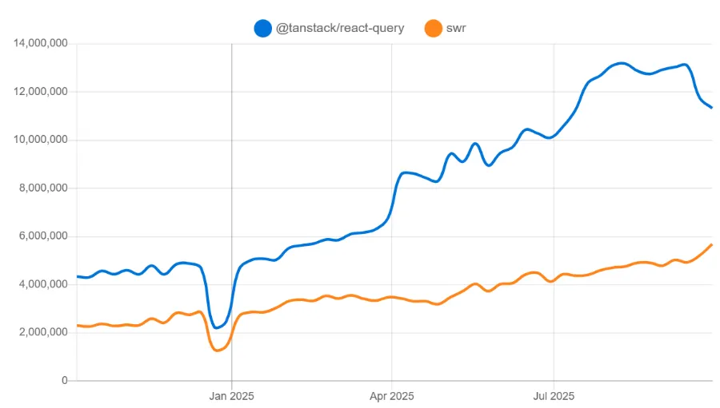
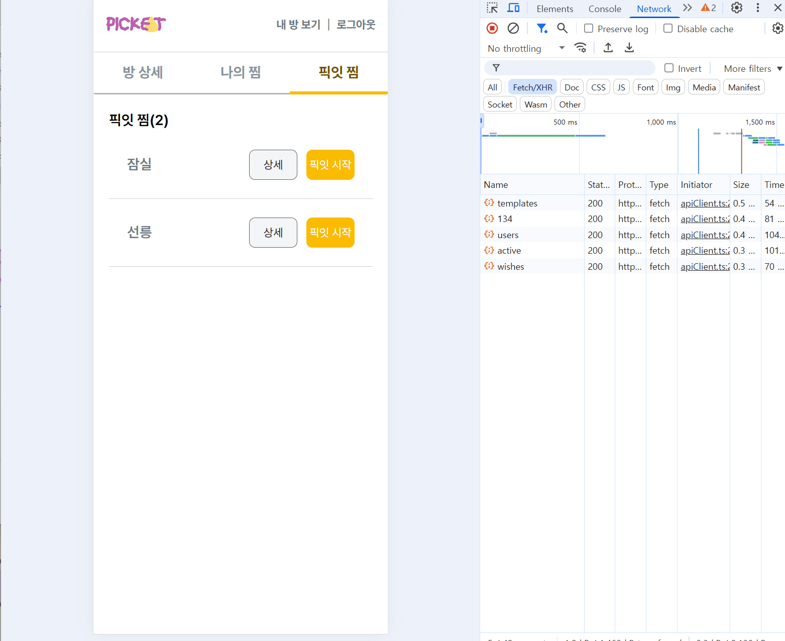

# TanStack Query 도입을 통한 픽잇 프로젝트의 서버 상태 관리

## 1. 들어가며: 서버 상태 관리의 중요성 및 TanStack Query 도입 배경

### 1.1. 서버 상태 관리 라이브러리 검토

- 프론트엔드 개발에서 서버와의 데이터 통신은 매우 중요한 역할을 하며, 데이터가 복잡할수록 효율적인 서버 상태 관리가 필수적입니다.
- 대표적인 서버 상태 관리 라이브러리는 SWR, TanStack Query, Apollo Client 등이 있습니다.
- 픽잇 프로젝트는 GraphQL을 사용하지 않으므로 Apollo Client는 제외하였고, npm trends를 통해 TanStack Query가 높은 인기를 보임을 확인했습니다.



### 1.2. TanStack Query의 주요 이점

- TanStack Query는 단순 데이터 요청 이상의 기능을 제공하며, 캐싱, 자동 갱신, 중복 요청 방지 등으로 개발 업무를 수월하게 만들어줍니다.
- 픽잇 프로젝트는 기존 데이터 통신의 불편함을 경험하며 TanStack Query 도입을 결정하게 되었습니다.

---

## 2. 픽잇 프로젝트의 기존 데이터 통신 방식 분석

### 2.1. 기존 방식 개요 (React Suspense, use, fetch)

- React Suspense와 use 훅, fetch 함수를 조합해 데이터를 페칭하며 Error Boundary를 통해 에러 처리.
- Suspense는 데이터 로드 완료 전까지 로딩 UI를 표시해 로딩 상태 관리 부담 감소.
- Error Boundary는 컴포넌트 내 발생 예외를 잡아 대체 UI를 제공.

```jsx
function RoomDetail() {
  const getWish = useMemo(() => wishlist.getWishTemplates(), []);
  return (
    <ErrorBoundary>
      <Suspense fallback={<LoadingSpinner />}>
        <TemplatesTab wishGroup={getWishGroup} />
      </Suspense>
    </ErrorBoundary>
  );
}

function TemplatesTab({ wishGroup }: Props) {
  const wishes = use(wishGroup);
  return (
    <S.Container>
      <S.Description>픽잇 찜({wishes?.length})</S.Description>
      {/* ... 위시리스트 맵핑 */}
    </S.Container>
  );
}
```

### 2.2. 기존 방식의 장점 및 한계

- useEffect 없이 데이터 페칭 가능, error/data/loading 상태 정의 불필요.
- 그러나 불필요한 재요청 발생, 폴링·리페치·낙관적 업데이트 등 수동 구현의 번거로움 존재.
- 단순 상태 정의 해소 목적에는 부적합하나, 복잡한 비동기 로직 해결에는 TanStack Query가 선호됨.

---

## 3. TanStack Query 도입 필요성 및 문제 해결 방안

### 3.1. 데이터 캐싱을 통한 리소스 낭비 해소

- 위시 상세 모달 열 때마다 이미지 포함 데이터 반복 fetch로 시간이 소요.
- 위시리스트는 변동이 적은 공용 데이터로 클라이언트 캐시 재사용이 효율적.
- TanStack Query 캐시 기능 활용 예정.



### 3.2. 폴링 로직 간결화

- 프로젝트 내 3초 주기 직접 fetch polling 구현 중.
- TanStack Query의 `refetchInterval` 옵션 사용 시 코드 간결·유지보수 용이.

```jsx
usePolling(fetchRestaurantList, {
  onData: handleUpdateRestaurantList,
  interval: 3000,
  immediate: false,
  enabled: true,
  errorHandler: (error: Error) => {
    showToast({
      mode: 'ERROR',
      message: '식당 리스트를 불러오는데 실패했습니다.' + error.message,
    });
  },
});
```

### 3.3. 수동 상태 갱신 감소: 쿼리 무효화 (Invalidation)

- POST 요청 후 UI 반영 위해 별도 리페치 호출 및 로컬 상태 관리 필요.
- TanStack Query `useMutation`과 `invalidateQueries()`로 수동 상태 관리 제거.

```jsx
const { error, wishlistData, handleGetWish } = useManageWishlist(wishId);
const handleCreateWish = () => {
handleGetWish();
  handleUnmountModal();
};
export const useManageWishlist = (wishId: number) => {
  const [wishlistData, setWishlistData] = useState<Wishes[]>([]);
  const [error, setError] = useState<boolean>(false);
  const showToast = useShowToast();

  const handleGetWish = async () => {
    try {
         const response = await wishlist.get(wishId);
		     if (response) setWishlistData(response);
    } catch {
	      showToast({
	        mode: 'ERROR',
	        message: '찜 목록을 불러오던 중 에러가 발생했습니다.',
	      });
	      setError(true);
	    }
  };

  useEffect(() => {
    handleGetWish();
  }, []);

```

### 3.4. 사용자 경험 향상: 낙관적 업데이트 (Optimistic Update)

- 좋아요 버튼 등에서 서버 응답 기다리지 않고 즉시 UI 반영.
- TanStack Query로 낙관적 업데이트 간결하게 선언적 구현 가능.

### 3.5. 우아한 공통 에러 처리 로직

- QueryClient `onError` 콜백으로 mutate 에러는 토스트 메시지로 처리.
- 조회 쿼리는 Error Boundary로 공통 에러 처리 및 UX 개선.

---

## 4. TanStack Query 사용법 상세

### 4.1. 설치 및 기본 설정

[[참고]](https://github.com/ssi02014/react-query-tutorial?tab=readme-ov-file)

```jsx
npm i @tanstack/react-query
```

```jsx
import { QueryClient, QueryClientProvider } from '@tanstack/react-query';

const queryClient = new QueryClient();

function App() {
  return (
    <QueryClientProvider client={queryClient}>
      <div>블라블라</div>
    </QueryClientProvider>
  );
}
```

### **QueryClient**

- QueryClient를 사용하여 캐시와 상호 작용할 수 있다.
- QueryClient에서 모든 query 또는 mutation에 기본 옵션을 추가할 수 있다.
- react-query를 사용하기 위해서는 `QueryClientProvider`를 최상단에서 감싸주고 QueryClient 인스턴스를 client props로 넣어 애플리케이션에 연결해야 한다.

### 4.2. 개발 도구 (Devtools)

```jsx
npm i @tanstack/react-query-devtools
```

devtools를 사용하면 React Query의 모든 내부 동작을 시각화하는 데 도움이 되며 문제가 발생하면 디버깅 시간을 절약할 수 있다.

```jsx
import { ReactQueryDevtools } from '@tanstack/react-query-devtools';

function App() {
  return (
    <QueryClientProvider client={queryClient}>
      {/* The rest of your application */}
      <ReactQueryDevtools initialIsOpen={false} />
    </QueryClientProvider>
  );
}
```

### 4.3. 데이터 조회: useQuery

- `queryKey`(배열)와 `queryFn` (Promise 반환 함수) 필수.
- 반환 데이터: `data`, `error`, `status`, `isLoading`, `refetch` 등.

```jsx
const { data, isLoading } = useQuery({
  queryKey: ['fetchKey'],
  queryFn: fetchFn,
  // ...options ex) gcTime, staleTime, select, ...
});
```

### **queryKey**

- queryKey는 배열로 지정해 줘야 한다.
  - 이는 단일 문자열만 포함된 배열이 될 수도 있고, 여러 문자열과 중첩된 객체로 구성된 복잡한 형태일 수도 있다
- queryKey를 기반으로 쿼리 캐싱을 관리하는 것이 핵심이다.
- 만약, 쿼리가 특정 변수에 의존한다면 배열에다 이어서 줘야 한다.
  ex: ["super-hero", heroId, ...]

### **queryFn**

- queryFn는 Promise를 반환하는 함수를 넣어야 한다.

### **반환데이터**

- `data`: 쿼리 함수가 리턴한 Promise에서 resolved된 데이터
- `error`: 쿼리 함수에 오류가 발생한 경우, 쿼리에 대한 오류 객체
- `status`: data, 쿼리 결과값에 대한 상태를 표현하는 status는 문자열 형태로 3가지의 값이 존재한다.
  - pending: 쿼리 데이터가 없고, 쿼리 시도가 아직 완료되지 않은 상태.
  - error: 에러 발생했을 때 상태
  - success: 쿼리 함수가 오류 없이 요청 성공하고 데이터를 표시할 준비가 된 상태.
- `isLoading`: 캐싱 된 데이터가 없을 때 즉, 처음 실행된 쿼리일 때 로딩 여부에 따라 true/false로 반환된다.
  - 이는 캐싱 된 데이터가 있다면 로딩 여부에 상관없이 false를 반환한다.
- `isSuccess`: 쿼리 요청이 성공하면 true
- `isError`: 쿼리 요청 중에 에러가 발생한 경우 true
- `refetch`: 쿼리를 수동으로 다시 가져오는 함수.

### useQuery 주요 옵션: **staleTime / gcTime**

**staleTime: (number | Infinity)**

- staleTime은 데이터가 fresh에서 stale 상태로 변경되는 데 걸리는 시간, 만약 staleTime이 3000이면 fresh 상태에서 3초 뒤에 stale로 변환
- fresh 상태일 때는 쿼리 인스턴스가 새롭게 mount 되어도 네트워크 요청(fetch)이 일어나지 않는다.
- 참고로, staleTime의 기본값은 0이기 때문에 일반적으로 fetch 후에 바로 stale이 된다.

**gcTime: (number | Infinity)**

- 쿼리 인스턴스가 unmount 되면 데이터는 inactive 상태로 변경되며, 캐시는 gcTime만큼 유지된다.
- gcTime이 지나면 가비지 콜렉터로 수집된다.
- gcTime이 지나기 전에 쿼리 인스턴스가 다시 mount 되면, 데이터를 fetch 하는 동안 캐시 데이터를 보여준다.
- gcTime은 staleTime과 관계없이, 무조건 inactive 된 시점을 기준으로 캐시 데이터 삭제를 결정한다.
- gcTime의 기본값은 5분이다. SSR 환경에서는 Infinity이다.

### 4.4. 데이터 변경: useMutation

- 만약 서버의 data를 post, patch, put, delete와 같이 수정하고자 한다면 이때는 useMutation을 이용한다.

```jsx
const { mutate } = useMutation({
  mutationFn: createTodo,
  onMutate() {
    /* ... */
  },
  onSuccess(data) {
    console.log(data);
  },
  onError(err) {
    console.log(err);
  },
  onSettled() {
    /* ... */
  },
});

const onCreateTodo = (e) => {
  e.preventDefault();
  mutate({ title });
};
```

- useMutation의 반환 값인 mutation 객체의 mutate 메서드를 이용해서 요청 함수를 호출할 수 있다.
- mutate는 onSuccess, onError 메서드를 통해 성공했을 시, 실패했을 시 response 데이터를 핸들링할 수 있다.
- onMutate는 mutation 함수가 실행되기 전에 실행되고, mutation 함수가 받을 동일한 변수가 전달된다.
- onSettled는 try...catch...finally 구문의 finally처럼 요청이 성공하든 에러가 발생하든 상관없이 마지막에 실행된다.

## 5. 픽잇에서 사용될 주요 기능

### 5.1. 폴링

- `refetchInterval`: 주기적 데이터 갱신.
- `refetchIntervalInBackground`: 백그라운드 상태에서도 refetch.

```jsx
const {
  data,
  // ...
} = useQuery({
  queryKey: ['super-heroes'],
  queryFn: getAllSuperHero,
  refetchInterval: 2000,
  refetchIntervalInBackground: true,
});
```

### 5.2. 데이터 변환: select 옵션

- 쿼리 데이터 일부 변환 용이.
- 캐시 저장 내용엔 영향 없음.
- API 응답을 프론트엔드 입맛에 맞춰 `convert` 하여 사용하고 있음에 이 옵션으로 대체 가능

### 5.3. 쿼리 무효화

- 데이터 변경 후 화면 최신화 필요 시 사용.
- 쿼리 키 기준 빠른 리페치 실행.

```jsx
const useAddSuperHeroData = () => {
  const queryClient = useQueryClient();
  return useMutation(addSuperHero, {
    onSuccess() {
      queryClient.invalidateQueries({ queryKey: ['super-heroes'] });
    },
  });
};
```

### 5.4. 낙관적 업데이트

- mutate 전 쿼리 취소, 이전 데이터 저장.
- 즉시 캐시 업데이트 후, 실패 시 롤백.
- 요청 완료 시 쿼리 무효화로 최신 데이터 유지.

```jsx
const useAddSuperHeroData = () => {
  const queryClient = useQueryClient();
  return useMutation({
    mutateFn: addSuperHero,
    onMutate: async (newHero) => {
      await queryClient.cancelQueries({ queryKey: ['super-heroes'] });
      const previousHeroData = queryClient.getQueryData(['super-heroes']);
      queryClient.setQueryData(['super-heroes'], (oldData) => ({
        ...oldData,
        data: [...oldData.data, { ...newHero, id: oldData.data.length + 1 }],
      }));
      return { previousHeroData };
    },
    onError(error, hero, context) {
      queryClient.setQueryData(['super-heroes'], context.previousHeroData);
    },
    onSettled() {
      queryClient.invalidateQueries({ queryKey: ['super-heroes'] });
    },
  });
};
```

### 5.5. 기존 React 환경과의 통합: Error Boundary와 Suspense

**5.5.1 Error Boundary 및 에러 리셋**

- `useQueryErrorResetBoundary`와 `ErrorBoundary` 결합해 선언적 에러 처리.
- 페이지 전체 새로고침 없이 컴포넌트 단위 에러 복구 제공.

<details>
<summary>`seQueryErrorResetBoundary를 사용하지 않으면?</summary>
<div markdown="1">
  useQueryErrorResetBoundary 를 사용하지 않고 queryClient 옵션에다 { throwOnError: true }만 에러를 상위로 던질 수는 있으나, 에러 리셋과 재시도를 깔끔하게 구현하려면 useQueryErrorResetBoundary와 QueryErrorResetBoundary 컴포넌트를 사용하는 것이 권장된다.
  에러 바운더리 내에서 에러 발생 시 사용자에게 새로고침 버튼을 제공하고, 버튼 클릭 시 window.location.reload()를 호출하여 페이지 전체를 새로고침한다면 전체 앱을 초기 상태로 돌려보내므로, 에러 상태 뿐 아니라 모든 상태와 캐시가 초기화되어 자연스럽게 에러가 해제된다.
  다만, 이렇게 전체 페이지를 새로고침하는 UX는 사용자 입장에서 다소 불편할 수 있고, 특히 SPA의 장점인 빠르고 끊김 없는 사용자 경험이 저하될 수 있습니다. useQueryErrorResetBoundary와 함께 쓰면 사용자는 페이지 전체를 새로고침하지 않고도 컴포넌트 단위에서 에러 상태만 편리하게 초기화하며 재시도를 할 수 있어 더 나은 UX를 제공할 수 있다.
</div>
</details>

```jsx
import { useQueryErrorResetBoundary } from '@tanstack/react-query'; // (*)
import { ErrorBoundary } from 'react-error-boundary'; // (*)

interface Props {
  children: React.ReactNode;
}

const QueryErrorBoundary = ({ children }: Props) => {
  const { reset } = useQueryErrorResetBoundary(); // (*)

  return (
    <ErrorBoundary
      onReset={reset}
      fallbackRender={({ resetErrorBoundary }) => (
        <div>
          Error!!
          <button onClick={() => resetErrorBoundary()}>Try again</button>
        </div>
      )}
    >
      {children}
    </ErrorBoundary>
  );
};

export default QueryErrorBoundary;
```

**5.5.2 Suspense**

- v5부터 안정화된 `useSuspenseQuery` 활용.
- 최상단에 `QueryErrorBoundary`와 `Suspense` 조합 사용.

```jsx
const { data } = useSuspenseQuery({
  queryKey: ['groups'],
  queryFn: fetchGroups,
  select: (data) => data.data,
});
```

```jsx
function App() {
  return (
    <QueryErrorBoundary>
      <Suspense fallback={<Loader />}>{/* 하위 컴포넌트들 */}</Suspense>
    </QueryErrorBoundary>;
  );
}

```

---

## 7. 결론: 기대 효과 및 느낀 점

### 7.1. 도입 후 기대 효과 요약

1. **리소스 낭비 최소화 및 성능 향상**

   공용 위시리스트처럼 변동 낮은 데이터를 효율적으로 캐시 및 재사용하여 네트워크 요청과 로딩 시간 감소.

2. **선언적 폴링 구현 및 코드 간결화**

   기존 수동 폴링 로직을 `refetchInterval` 옵션으로 대체하여 코드 양 감소 및 가독성 향상.

3. **상태 갱신 로직 단순화 (쿼리 무효화)**

   Mutation 후 별도의 수동 리페치 없이 `invalidateQueries`로 최신 상태 유지.

4. **최적의 사용자 경험 제공 (낙관적 업데이트)**

   서버 응답 대기 없이 UI 즉시 반영, 복잡한 롤백도 표준화된 방식으로 안정적 처리.

5. **통합된 에러 및 로딩 처리**

   에러를 우아하게 관리하고, 컴포넌트 단위 에러 리셋 및 재시도를 통한 개선된 UX 제공.

### 7.2. 도입을 통해 느낀 점

- 초기에는 기존 React Suspense와 use 조합 방식의 장점을 누리고 있었기에 도입 필요성에 의문이 있었음.
- 점점 복잡해지는 비동기 데이터 로직 해결에 TanStack Query의 추상화 강력함을 체감.
- 보일러플레이트 감소 및 유지보수성 대폭 향상.
- 폴링, 낙관적 업데이트, 리페치 관련 수동 복잡 코드가 선언적 옵션으로 대체됨.
- TanStack Query는 단순 페칭 라이브러리가 아닌 클라이언트-서버 데이터 수명 주기 전반을 관리하는 강력한 매니저임을 확인.
- 픽잇 프로젝트에서 기술 부채 감소와 개발자 경험 개선에 크게 기여.
