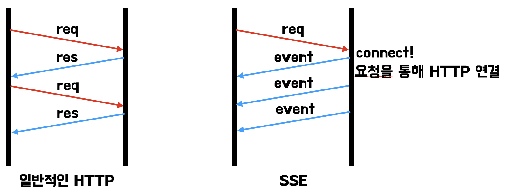
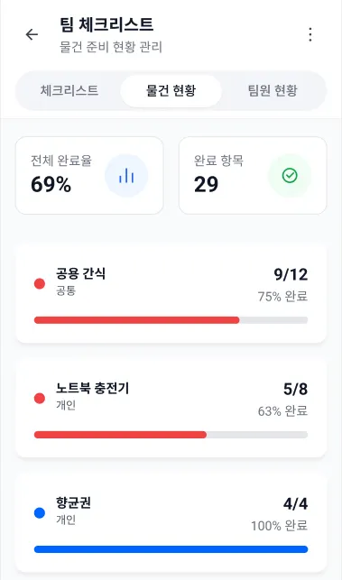
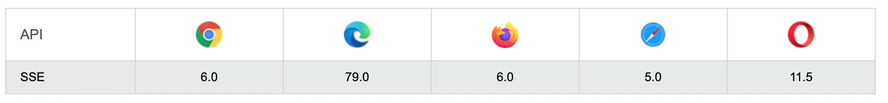
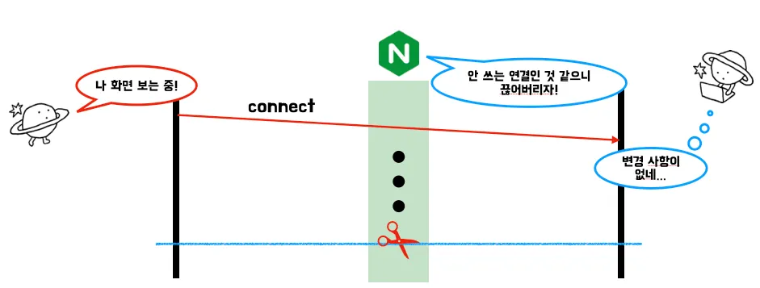
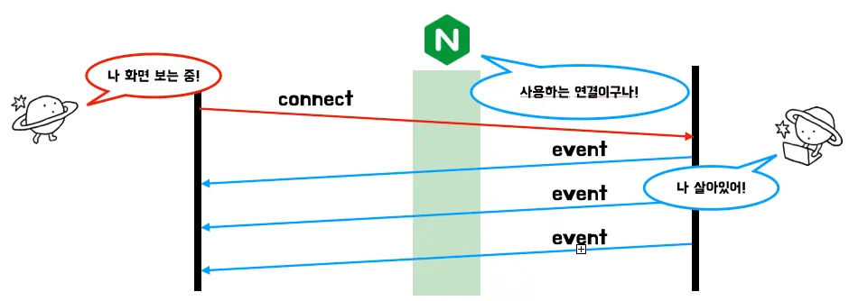
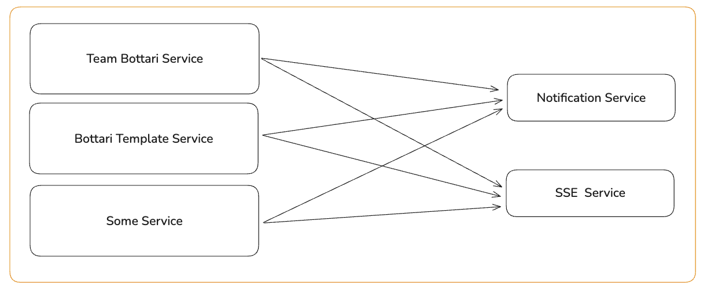
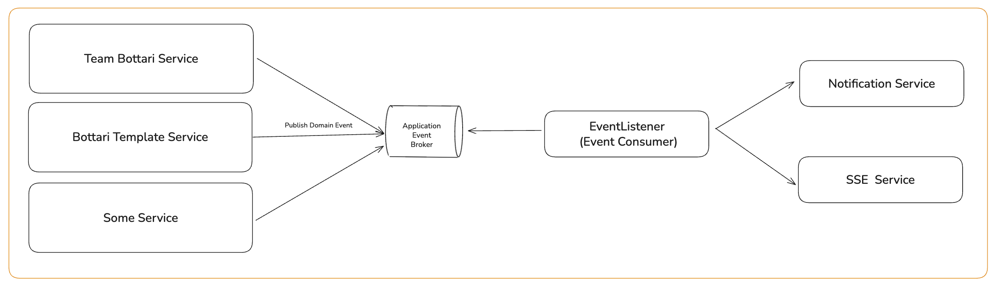
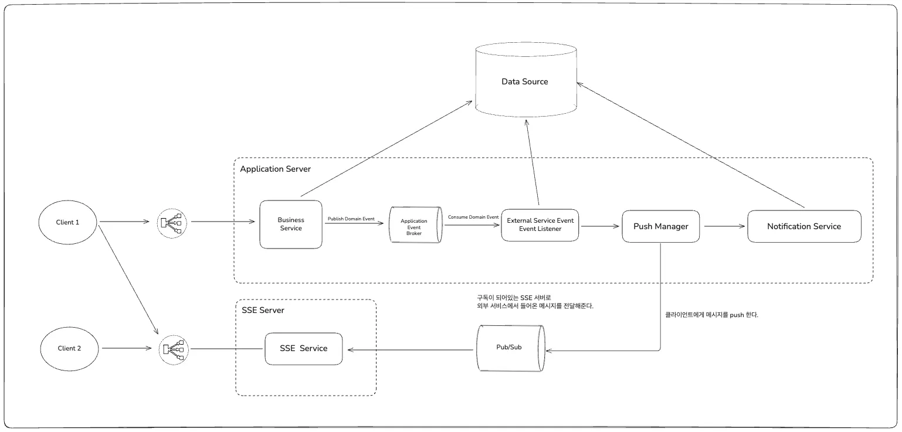

# Server-Sent Event (SSE)란?

**대상 독자**

SSE라는 기술에 대해서 알지 못하는 독자

- SSE라는 기술에 대해 잘 알지 못함
- Java Springboot를 사용해본 경험이 있거나, 지식이 있음
- 실시간 동기화 기능에 대해 관심이 있음
- 대략적인 SSE의 개념보다 깊은 측면까지 알고 싶음

## **Server-Sent Event란?**

### Server-Sent Event(SSE)의 정의

Server-Sent Event(SSE)는 ‘클라이언트가 HTTP 연결을 통해 서버로부터 자동 업데이트를 수신할 수 있도록 하는 [서버 푸시 기술](https://ko.wikipedia.org/wiki/%ED%91%B8%EC%8B%9C_%EA%B8%B0%EB%B2%95)’이라고 정의되어 있다. 서버 푸시 기술이란, ‘인터넷 상에서 어떤 전송 요청이 중앙 서버에서 시작되는 정보 전달 방식’이다. Server-Sent Event는 서버 중점 기술이다.

### 일반적인 HTTP 통신과 다른 점

‘Keep-Alive’ 헤더를 사용한 HTTP 통신은 TCP 연결을 오랜 시간 끊지 않고 통신할 수 있다. 하지만, 'Keep-Alive' 헤더만 사용한 일반적인 HTTP 통신은 한 번의 요청은 한 번의 응답만 가능하다. 그러나 SSE는 한 번의 요청으로 SSE 연결을 맺고, 이후 서버에서 클라이언트에게 여러 번의 SSE를 응답해준다.



### SSE는 어떻게 한 번의 요청으로 여러 번의 응답을 가능한가?

#### text/event-stream 타입

‘text/event-stream’ 미디어 타입을 지정해 SSE를 사용한다. 'text/event-stream' 미디어 타입을 지정하게 된다면, 클라이언트에서는 계속해서 응답을 받을 준비를 한다. 이 미디어 타입 덕분에 SSE는 한 번의 요청으로 여러 번의 응답이 가능하다.

'text/event-stream' 미디어 타입은 ‘텍스트 기반의 DOM 이벤트를 연결을 끊지 않고 흘려보낸다.’라는 의미다. DOM 이벤트란 ‘브라우저에서 키보드 입력, 버튼 클릭과 같은 이벤트’를 뜻한다. SSE가 ‘이벤트’라는 명칭이 붙는 이유다.

---

## 프로젝트에서 SSE를 선택한 이유

### 우리가 필요했던 기능

현재, ‘보따리’라는 프로젝트를 진행 중이다. ‘보따리’라는 프로젝트는 준비물 체크리스트 서비스다. 그 중, ‘팀 기능’에서 여러 사람이 체크리스트 목록을 공유하고, 체크 현황을 공유할 수 있다. 우리는 이 ‘팀 기능’에서 누군가가 물품을 추가, 수정, 삭제하거나 체크리스트에 체크를 하는 등 변경 사항이 발생한다면, 다른 팀원의 화면에 변경 사항이 실시간으로 반영되길 원했다. 이는 서버에서 클라이언트로 단방향 통신 위주의 기능이었다.



### 다른 실시간 기술들은?

SSE 외에도 Short-Polling, Long-Polling, Web-Socket과 같이 여러 실시간 기술들이 존재한다. 이 중, Short-Polling, Long-Polling은 실시간성을 보장하기 위해 CPU나 메모리와 같은 서버 자원을 점유한다. 사용자가 많이지는 경우 서버에 부하가 심해질 수 있다. 서버 자원을 효율적으로 사용하기 위해 Polling은 고려하지 않았다.

Web-Socket은 실시간성을 보장하는 기술 중 가장 잘 알려져있다. Web-Socket은 TCP 핸드 셰이크 과정에서 HTTP 프로토콜을 WS 프로토콜로 업그레이드한다. 이후, 업그레이드된 WS 프로토콜을 통해 클라이언트와 서버가 양방향으로 통신한다. Web-Socket은 양방향 실시간성을 보장하지만, 클라이언트와 서버 간의 양방향 통신까지 고려해야 한다. 우리는 단방향으로 충분했기 때문에, Web-Socekt이 아닌 SSE를 선택했다.

### SSE의 특징

SSE의 특성으로 자주 거론되는 것이 단방향성, 텍스트 기반, 내장된 재연결 기능이다.

#### 단방향성

앞서 설명한 것처럼, SSE는 서버 푸시 기술로 서버에서 클라이언트로의 응답 위주이다. 때문에, Web-Socekt과 같은 양방향성을 띄는 기술과는 달리 단방향성이 SSE의 특징이다. '양방향이 안 되고, 단방향밖에 안 되면 안 좋은 거 아니야?'라고 생각할 수 있다. 그러나, 단방향만 고려하면 되기 때문에 고려해야할 점이 줄어든다. 클라이언트의 요청은 서버에서 연결을 맺을 때에만 고려하면 되기 때문에 이에 대한 추가적인 구현이 필요하지 않다. 그리고, 전체적인 구조가 서버에서 클라이언트로의 방향만 고려하면 되기 때문에 단순해진다.

#### 텍스트 기반

SSE는 'text/event-stream'이라는 미디어 타입에서 볼 수 있듯, 텍스트 기반의 응답만 가능하다. JSON과 같은 텍스트만 사용해 기능을 구현할 수 있다면, SSE로 충분히 구현 가능하다. 하지만, 이미지와 같은 이진 데이터 위주의 통신이 필요하다면 SSE보다 Web-Socket과 같은 기술을 사용하는 것이 좋다. 본인의 기능이 어떤 데이터를 기반으로 통신하는지에 따라 선택하면 좋은 부분이다.

#### 내장된 재연결 기능

SSE를 구현할 때, 클라이언트에서 사용하는 'EventSource API'에서는 재연결 기능이 내장되어있다. 'EventSource API'는 연결이 끊어진다면 이를 인지하고 재연결 시도를 한다. 연결이 끊어졌을 때를 대비한 재연결 기능이 추가적인 구현 없이 제공된다는 것은 큰 장점이다.

### SSE 연결이 유지되는 동안, 우리는 스레드를 사용하는가?

SSE 연결 요청이 들어오면, 스레드를 할당 받아 클라이언트와 서버 간의 연결을 맺는다. 연결이 성공적으로 맺어지고, 서버에서는 스레드를 점유하고 있지 않고 스레드를 반납한다. 이후, SSE 응답이 필요한 경우 서버는 스레드를 잠시 할당 받아 SSE 응답을 클라이언트에게 전달한다. 전달한 뒤, 연결이 맺어진 이후처럼 스레드를 반납한다. SSE는 서버 자원을 계속해서 점유하는 것이 아닌 필요할 때에만 할당 받아서 사용한다.

### SSE의 한계

그러나, SSE의 한계 또한 존재한다.

하나의 브라우저에서 6개 이상의 SSE 연결이 불가능하다. 추가로, 너무 오래된 버전의 브라우저를 사용한다면 SSE 사용이 불가능하다.


지원되는 브라우저 버전

그러나, 평균적으로 2010년~2011년 이후 버전의 브라우저라면 지원된다. 현재 우리가 사용하고 있는 브라우저에서는 무리 없이 사용 가능하다.

### 프로젝트에서 선택한 이유

결론적으로 우리는 단방향 통신 위주의 기능이었으며, 이는 JSON을 통해 충분히 구현 가능했다. 또, 안드로이드 기반의 프로젝트였기 때문에 브라우저 버전은 문제가 되지 않았다. 이런 이유들을 고려해보았을 때, 우리 팀은 SSE를 선택했다.

---

# Spring에서는 SSE를 어떻게 사용할 수 있나?

Java Spring에서는 ‘SseEmitter’라는 객체를 사용한다. 클라이언트의 연결 정보는 OS에서 소켓을 통해 유지하고 있다. 이를 Spring에서 추상적으로 구현한 것이 ‘SseEmitter’이다. ‘SseEmitter’ 객체는 ‘클라이언트의 연결 정보를 담고 있는 객체’, ‘SSE 응답을 보내는 객체’라고 간단하게 이해하면 좋다. 

SseEmitter는 Spring MVC의 기본 의존성에 포함되어있다. SseEmitter를 사용하기 위해 별도의 의존성 추가 없이 사용할 수 있다.

```java
package org.springframework.web.servlet.mvc.method.annotation;

public class SseEmitter ... {

    ...

}
```

클라이언트로부터 SSE 연결 요청이 들어오면, 서버는 SseEmitter 객체를 생성하고 이를 List/Set/Map과 같은 컬렉션에 저장한 뒤 반환한다. 이후 SSE 응답을 보낼 때 해당 객체를 사용한다.

```java
@RestController
public class SseController {

    @GetMapping(path = "/sse", produces = MediaType.TEXT_EVENT_STREAM_VALUE)
    public SseEmitter connect() {
        final SseEmitter sseEmitter = new SseEmitter();

        // SseEmitter 저장 in List, Set, Map . . .

        return sseEmitter;
    }
}
```

이렇게 저장한 SseEmitter 객체를 사용해 이벤트를 전송할 수 있다.

```java
sseEmitter.send(
		SseEmitter.event()
				.name("name")
				.data("data")
);
```


## SSE를 사용하며, 고려하면 좋은 것

### 하트비트

웹 서버, 방화벽, 로드밸런서와 같은 네트워크 중간 계층들은 오랜 시간 응답이 존재하지 않으면 연결을 끊는다. SSE 연결 후, 서버에 변경 사항이 존재하지 않아 오랜 시간 응답이 없다면 네트워크 중간 계층들은 SSE 연결을 끊는다. 네트워크 중간 계층에서 SSE 연결을 끊은 후, 서버에 변경 사항이 발생해서 SSE 응답을 클라이언트에게 전달하려고 해도 실패한다.


NGINX에서 연결을 끊는 경우 

네트워크 중간 계층에서 SSE 연결을 끊지 않도록 하기 위해 ‘하트비트’라는 개념을 사용한다. ‘하트비트’는 일정 주기로 SSE 응답을 클라이언트에게 전달하는 것이다.


NGINX에서 연결을 끊지 않도록 하트비트를 사용하는 경우

### OSIV

SSE를 사용하며, OSIV 설정을 true로 켜두게 된다면 DB 커넥션이 고갈되는 문제가 발생할 수 있다.

SSE 연결이 맺어지고, 이 연결이 끊어지기 전까지 HTTP 연결은 계속 열려있는 상태를 유지한다. 만약 SSE 연결 API에서 JPA를 사용하고 있고, OSIV(open-in-view)가 true로 설정되어 있다면 DB 연결 또한 계속해서 열려있는 상태이다.

이 때 문제는 오랜 시간 HTTP 연결이 DB 커넥션을 점유하고 있기 때문에 DB 커넥션이 고갈될 수 있다. 만약, DB 커넥션 풀의 max 설정이 10개라면 SSE 연결이 10개 맺어지는 순간 DB 커넥션 풀에는 사용할 수 있는 커넥션이 존재하지 않는다. 이후, DB 커넥션을 사용하는 요청이 들어오게 된다면 예외가 발생한다.

따라서, SSE를 사용하는 경우 OSIV 설정을 false로 설정하는 것이 안전하다.

---

## 우리는 SSE를 어떻게 사용했을까?

우리는 SSE를 보따리 프로젝트의 ‘팀 기능’에서 사용했다. 다른 팀원의 변경 사항을 특정 화면을 보고 있다면 실시간으로 반영해주기 위해 SSE를 사용했다.

### 하트비트

우리는 30초 간격으로 하트비트 응답을 전달하고 있다.

네트워크 중간 계층에서 평균적으로 60초 동안 응답이 존재하지 않는다면, 연결을 끊게 된다. 실시간성이 중요하다면, 하트비트의 주기를 


### 서버 다중화

Spring에서 SSE 연결이 맺어진다면, SseEmitter 객체를 생성하고 이를 컬렉션에 저장한다. 결국, 서버에서는 상태를 유지해야 한다. 서버에서 상태를 유지한다면 서버의 확장성이 낮아진다. 그렇기 때문에 우리는 SSE 연결/응답만을 관리하는 서버를 분리했다.

#### 기존 구조



기존에는 비즈니스 서비스들에서 FCM과 SSE에 전송에 대한 클래스(객체)를 직접적으로 의존하고 있었다. 이로 인해 비즈니스 로직에 SSE에 대한 강한 결합도가 생겼다. 서버 다중화를 위해, 우리는 우선 비즈니스 로직과 SSE 로직 간의 결합도를 낮추고자 했다.

#### 비즈니스 로직과 SSE 로직 간의 결합도 낮추기



우리는 이를 비즈니스 로직에서는 Domain Event를 발행하고, Event Listener에서 이를 수신해 FCM/SSE를 전송하는 로직을 구현했다. 이를 통해, 비즈니스 로직과 SSE 로직 간의 결합도를 낮추었다.

#### SSE 서버 분리



최종적으로, SSE를 사용하는 부분의 서버를 분리할 수 있었다. 우리는 이 과정에서 Redis Pub/Sub(메시지큐)을 사용했다. SSE 서버에서는 클라이언트와 SSE 연결이 맺어지게 된다면 Redis Pub/Sub에 사용자의 채널을 구독한다.

애플리케이션 서버에서 Domain Event를 발행하고, Event Listener에서는 이벤트를 수신해 형태에 맞춘 메시지로 전환해, PushManager로 전달한다.

PushManager에서는 이것이 SSE 응답이라면 외부 서버로 보내기 위해 Redis Pub/Sub 메시지 큐에 전달한다. SSE 서버에서는 본인과 연결이 되어있는 사용자의 채널에 메시지가 전달되면, 이를 수신해 사용자에게 전달한다.

---

## 앞으로의 개선 방향

현재 SSE 구조는 안정적으로 운영되고 있지만, 
여전히 개선할 부분들이 남아있습니다:

- **모니터링 강화**: SSE 연결 수, 하트비트 실패율 등의 
  메트릭을 수집하고 알람을 설정할 예정입니다.
- **재연결 전략 고도화**: 네트워크 상태에 따른 
  exponential backoff 적용을 검토하고 있습니다.
- **부하 테스트**: 대규모 동시 접속 상황에서의 
  성능과 안정성을 검증할 계획입니다.

SSE는 단순해 보이지만, 실제 서비스에 적용하려면 다양한 엣지 케이스를 고려해야 합니다. 
이 글이 SSE를 도입하려는 분들에게 실질적인 도움이 되길 바랍니다.

---

### 참고 자료

[HTML Standard](https://html.spec.whatwg.org/multipage/server-sent-events.html)

[서버 푸시 기술](https://ko.wikipedia.org/wiki/%ED%91%B8%EC%8B%9C_%EA%B8%B0%EB%B2%95)

[Spring에서 Server-Sent-Events 구현하기](https://tecoble.techcourse.co.kr/post/2022-10-11-server-sent-events/)  (2025/08/31 19:23 검색)

[SSE 이벤트 푸쉬로 불필요한 Polling 제거하기](https://toss.im/slash-24/sessions/12) (2025/08/31 19:22 검색)
