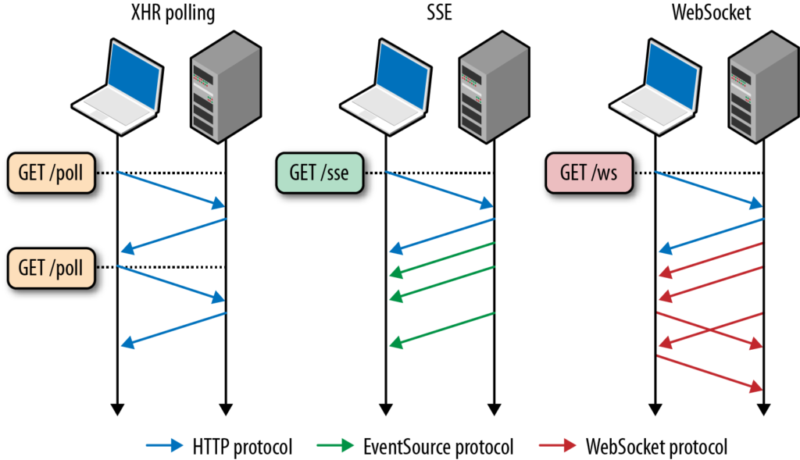
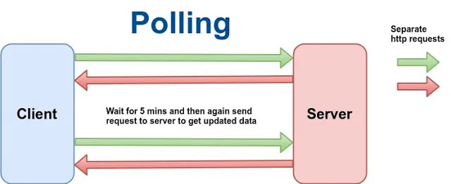
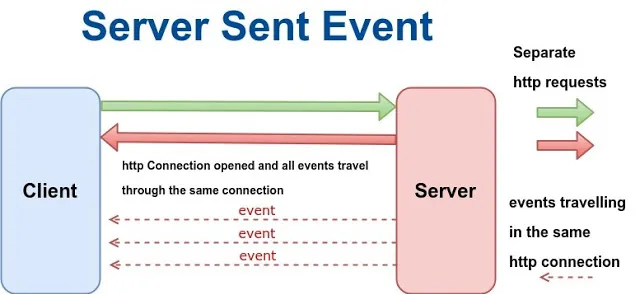
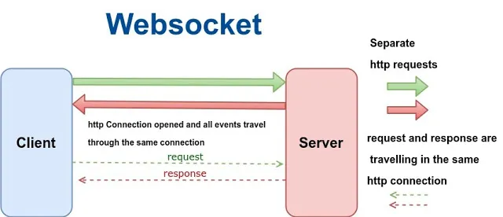
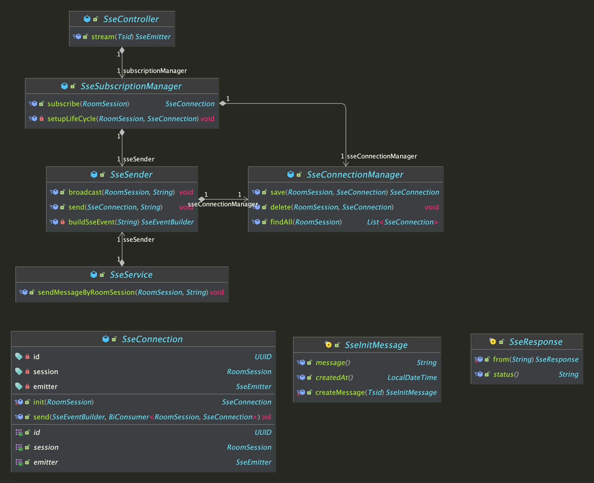

# 실시간 통신 기술: Polling부터 WebSocket, 그리고 아인슈타임 프로젝트의 SSE 적용기까지

## 들어가며

친구와 나누는 실시간 채팅, SNS의 새 댓글 알림, 동료와 함께 문서를 수정하는 협업 툴, 주식 시세 창까지. 이 모든 경험의 중심에는 '**실시간**(**Real-time**)'이라는 공통된 키워드가 있습니다. 이제 사용자는 정보를 얻기 위해 F5 키를 누르는 대신, 데이터가 발생하는 바로 그 순간, 화면에 자연스럽게 반영되는 것을 당연하게 여깁니다.

이러한 사용자 경험을 현실로 만들어야 하는 개발자에게는 "**어떻게 하면 서버와 클라이언트 간의 실시간 통신을 효율적이고 안정적으로 구현할까?**"라는 질문이 자연스럽게 주어집니다. 이 질문에 대한 '유일한 정답'은 없습니다. 서비스의 성격, 데이터의 흐름, 시스템의 제약 조건에 따라 최적의 해법은 달라지기 때문입니다.

이 글에서는 그 해답을 찾아가는 과정을 다룹니다. 실시간 통신을 구현하는 대표적인 네 가지 기술, **Polling, Long Polling, Server-Sent Events(SSE), WebSocket**의 원리와 장단점을 파헤쳐 보고, 어떤 상황에 무엇을 선택해야 할지 명확한 가이드를 제시합니다. 나아가, 저희 **아인슈타임 프로젝트**에서 어떻게 특정 요구사항을 해결하기 위해 **SSE를 선택하고 안정적인 구조를 구축했는지** 그 고민과 경험을 공유합니다.

---

## 실시간 데이터 전송 구현하기: 4가지 핵심 기술

### 1. Polling

**폴링**(**Polling**)은 실시간 통신을 구현하는 가장 고전적이고 직관적인 방법입니다. 클라이언트가 주기적으로, 예를 들어 2초마다 한 번씩, 서버에게 "혹시 새로운 데이터 있나요?"라고 계속해서 HTTP 요청을 보내는 방식입니다. 서버는 새로운 데이터의 유무와 상관없이 매번 요청에 대한 응답을 반환합니다.

이 방식의 가장 큰 **장점**은 구현이 매우 간단하며 HTTP 요청/응답이라는 웹의 가장 기본적인 모델을 따르기 때문에 아주 오래된 브라우저를 포함한 거의 모든 환경에서 완벽하게 동작한다는 것입니다. 하지만 그 단순함은 명백한 **단점**을 동반합니다. 실제 데이터의 변경이 없는 대부분의 시간에도 클라이언트는 불필요한 요청을 계속해서 보내야 합니다. 이는 네트워크 대역폭을 낭비하고, 서버는 끊임없이 들어오는 요청을 처리하느라 상당한 리소스를 소모하게 됩니다. 또한 데이터가 발생한 시점과 다음 폴링 주기가 돌아오는 시점 사이에 필연적으로 **지연**(latency)이 발생하여 진정한 의미의 실시간성을 제공하기 어렵습니다.

### 2. Long Polling

**롱 폴링**(**Long Polling**)은 기본 폴링의 비효율성을 개선하기 위해 등장한 기법입니다. 클라이언트는 폴링과 마찬가지로 서버에 데이터를 요청하지만 여기서 핵심적인 차이가 발생합니다. 서버는 새로운 데이터가 발생할 때까지 즉시 응답하지 않고 **연결을 열어둔 채로 기다립니다.** 그러다 마침내 서버에서 새로운 이벤트가 발생하면 그제야 클라이언트에게 응답을 보내 연결을 종료합니다. 클라이언트는 응답을 받는 즉시 새로운 요청을 다시 서버로 보내 다음 이벤트를 기다리는 과정을 반복합니다.

이 방식은 불필요한 요청-응답 주기를 대폭 줄여주므로 폴링에 비해 훨씬 효율적입니다. 또한 일반적인 HTTP 프로토콜 위에서 동작하기 때문에 방화벽이나 프록시 서버로 인해 연결이 막힐 가능성이 적다는 **특징**이 있습니다. 하지만 이 역시 **한계**는 존재합니다. 수많은 클라이언트가 동시에 연결을 유지하고 대기해야 하는 상황이라면 서버의 부담이 기하급수적으로 늘어날 수 있으며 데이터 변경이 매우 빈번하게 일어나는 환경에서는 사실상 폴링과 다를 바 없는 동작을 보일 수 있습니다.

### 3. Server-Sent Events (SSE)

**서버-전송 이벤트**(**Server-Sent Events, SSE**)는 이름에서 알 수 있듯이 **서버에서 클라이언트로 데이터를 밀어주는(push) 단방향 스트리밍** 기술입니다. 클라이언트가 최초에 한 번 연결을 요청하면 서버는 그 연결을 계속 유지하면서 필요할 때마다 클라이언트에게 데이터를 스트림 형태로 전송합니다. 마치 라디오 방송국이 청취자에게 계속해서 방송을 송출하는 것과 같습니다.

SSE의 가장 큰 **장점**은 WebSocket에 비해 훨씬 구현이 간단하고 가볍다는 점입니다. 기존 HTTP 프로토콜을 그대로 사용하며 클라이언트는 브라우저에 내장된 `EventSource` API를 통해 단 몇 줄의 코드로 서버 이벤트를 구독할 수 있습니다. 또한 네트워크 문제 등으로 연결이 일시적으로 끊어졌을 때 자동으로 재연결을 시도하는 표준 메커니즘이 내장되어 있어 안정성 확보에 유리합니다.

하지만 명백한 **단점**도 존재합니다. 데이터 흐름이 오직 서버에서 클라이언트로만 향하는 **단방향(one-way)** 통신이라는 점입니다. 클라이언트가 서버로 데이터를 보내려면 별도의 HTTP 요청(예: POST)을 사용해야 합니다. 또한 Internet Explorer(IE)와 같은 일부 구형 브라우저에서는 지원되지 않는다는 호환성 제약이 있습니다.

### 4. WebSocket

**웹소켓**(**WebSocket**)은 실시간 통신 기술의 '끝'으로 불리는 기술로, 서버와 클라이언트 간의 **완전한 양방향 전이중(Full-Duplex) 통신 채널**을 제공합니다. 최초 연결 시에는 HTTP 프로토콜을 통해 "이 연결을 웹소켓으로 전환하고 싶습니다"라는 신호를 보내는 핸드셰이크(handshake) 과정을 거칩니다. 일단 연결이 성공적으로 수립되면 통신 프로토콜은 HTTP에서 독립적인 웹소켓 프로토콜(`ws://` 또는 `wss://`)로 업그레이드됩니다.

이렇게 수립된 채널을 통해 서버와 클라이언트는 마치 전화 통화를 하듯, 누가 먼저랄 것도 없이 필요할 때마다 서로에게 메시지를 자유롭게 보낼 수 있습니다. 이 방식은 HTTP 헤더와 같은 불필요한 오버헤드가 거의 없어 매우 적은 데이터로 통신이 가능하며 **대량의 트래픽을 처리**하고 **지연을 최소화**하는 데 극적인 효과를 보입니다. 이러한 특성 덕분에 실시간 채팅, 멀티플레이어 온라인 게임, 구글 독스와 같은 공동 편집 애플리케이션 등 가장 까다로운 실시간 요구사항을 가진 서비스에 최적화되어 있습니다.

물론 **단점**도 있습니다. 기존 웹 인프라와 다른 별도의 프로토콜을 사용하므로 서버 및 방화벽, 로드밸런서 등의 인프라 구성에 추가적인 고려가 필요하며 구현의 **복잡도**가 다른 기술들에 비해 높은 편입니다.

---

## 한 눈에 기술 비교하기

| 구분 | Polling | Long Polling | Server-Sent Events (SSE) | WebSocket |
| --- | --- | --- | --- | --- |
| **연결 방식** | 비연속적 연결 | 비연속적 연결 (대기) | 단일 지속적 연결 | 단일 지속적 연결 |
| **방향성** | 클라이언트 → 서버 | 클라이언트 → 서버 | **서버 → 클라이언트 (단방향)** | **양방향** |
| **프로토콜** | HTTP | HTTP | HTTP | WebSocket (ws/wss) |
| **브라우저 지원** | 모든 브라우저 | 모든 브라우저 | 대부분 (IE 미지원) | 대부분의 최신 브라우저 |
| **구현 난이도** | 쉬움 | 쉬움 | 보통 | 다소 복잡 |
| **서버 부담** | 높음 | 보통 | 낮음 | 낮음 (연결 수립 후) |
| **주요 활용 사례** | 간단한 상태 업데이트, 레거시 시스템 호환 | 실시간 알림 (구형) | **실시간 알림, 뉴스 피드, 로그 스트리밍** | **채팅, 온라인 게임, 협업 툴, 금융 시세** |

---

## 언제 무엇을 선택할까?

그렇다면 이 다양한 기술들 중 우리는 무엇을 선택해야 할까요? 정답은 '서비스의 요구사항'에 있습니다.

- **Polling**은 실시간성이 그다지 중요하지 않고 몇 분 단위의 **간단한 주기적 데이터 확인**이 필요하거나(예: 5분마다 날씨 정보 업데이트) 오래된 브라우저와의 **레거시 호환성**이 최우선 순위일 때 고려할 수 있는 최후의 보루입니다.
- **Server-Sent Events** (**SSE**)는 **서버에서 발생하는 이벤트를 클라이언트로 밀어주는 기능**이 핵심일 때 가장 빛을 발합니다. 예를 들어 새로운 댓글이나 '좋아요' 알림, 최신 뉴스 기사 피드, 실시간 서버 로그 전송과 같이 클라이언트의 개입 없이 서버가 주도적으로 정보를 전달하는 시나리오에 완벽하게 부합합니다. WebSocket의 복잡성을 피하면서 효율적인 단방향 푸시를 구현하고 싶을 때 적절한 선택입니다.
- **WebSocket**은 클라이언트와 서버가 **끊임없이 정보를 주고받아야 하는** 고도의 상호작용이 필요할 때 사용해야 합니다. **실시간 채팅**, 사용자의 모든 움직임이 즉각적으로 다른 플레이어에게 전달되어야 하는 **멀티플레이어 게임**, 여러 사용자가 동시에 하나의 문서를 편집하는 **공동 편집 툴**과 같이, 지연에 극도로 민감하고 양방향 통신이 필수적인 서비스를 개발한다면 WebSocket을 선택해야 합니다.

---

## 아인슈타임 프로젝트에 SSE 적용하기

아인슈타임 프로젝트에서는 '특정 세션(방)에 참여한 사용자들에게 갱신된 투표 현황을 실시간으로 알려주는 기능'이 필요했습니다. 이 요구사항을 분석한 결괴, 데이터의 흐름이 대부분 서버에서 클라이언트로 향하는 **단방향**이었고, 클라이언트가 서버로 보내는 데이터는 기존의 RESTful API(HTTP POST/PUT 등)로 충분히 처리 가능했습니다. WebSocket의 양방향 통신은 오버엔지니어링이라 판단했고, 가볍고 안정적인 HTTP 기반의 SSE가 최적의 솔루션이라는 결론에 도달했습니다.

### 1. 실시간 통신 기술: SSE

SSE는 앞서 설명했듯 서버에서 클라이언트로의 단방향 데이터 푸시를 위한 기술입니다. 클라이언트는 브라우저의 `EventSource` API를 통해 특정 엔드포인트를 '구독'하고, 서버는 `Content-Type`을 `text/event-stream`으로 지정한 응답을 통해 연결을 계속 유지하며 원할 때마다 이벤트를 전송합니다.

이 단순한 원리 뒤에는 안정적인 운영을 위해 반드시 해결해야 할 문제들이 존재합니다. 예를 들어 수많은 클라이언트 연결을 어떻게 효율적으로 관리할 것인가? 클라이언트의 연결이 비정상적으로 끊겼을 때 서버의 리소스 누수를 어떻게 막을 것인가? 데이터베이스 트랜잭션과 SSE 이벤트 전송의 시점은 어떻게 동기화할 것인가? 저희는 이 문제들을 **‘역할과 책임의 분리**'라는 객체 지향의 기본 원칙을 통해 해결했습니다.

### 2. SSE 아키텍처: 역할과 책임의 분리

SSE 관련 로직을 `com.estime.common.sse` 패키지 내에서 여러 컴포넌트로 명확하게 분리하여 각 컴포넌트가 오직 자신의 책임에만 집중하도록 설계했습니다.

#### 주요 컴포넌트와 역할

- `SseController` (Presentation Layer): 이 컨트롤러의 유일한 책임은 **HTTP 요청을 받아 SSE 구독 흐름을 시작시키는 것**입니다. `GET /api/v1/sse/rooms/{session}/stream` 엔드포인트를 통해 클라이언트의 구독 요청을 받고, 실제 구독 처리는 `SseSubscriptionManager`에게 위임한 뒤 반환된 `SseEmitter` 객체를 클라이언트에 전달하는 역할만 수행합니다.
- `SseSubscriptionManager` (Application Layer): **구독 프로세스의 총괄 관리자**입니다. 클라이언트의 구독 요청이 들어왔을 때 새로운 `SseConnection` 객체를 생성하고 `SseConnectionManager`에 저장을 요청하는 등 구독에 필요한 모든 절차를 조율합니다. 가장 중요한 역할 중 하나는 `SseEmitter`의 생명주기(`onCompletion`, `onTimeout`, `onError`) 콜백을 설정하는 것입니다. 이 콜백들은 어떤 이유로든 연결이 종료될 경우, `SseConnectionManager`에서 해당 연결 정보를 안전하게 삭제하도록 하여 **메모리 누수를 원천적으로 방지**합니다. 또한 초기 연결이 성공했음을 클라이언트에게 알리기 위해 `SseSender`를 통해 "connected" 이벤트를 전송합니다.
- `SseConnectionManager` (Application Layer): **활성화된 연결들의 저장소** 역할을 합니다. 내부적으로 `Map<RoomSession, Map<UUID, SseConnection>>` 형태의 `ConcurrentHashMap`을 사용하여 수많은 연결들을 스레드-안전(thread-safe)하게 관리합니다. 연결들을 `RoomSession` 별로 그룹화하여 특정 방에 속한 모든 클라이언트에게 메시지를 보내는(broadcast) 연산을 매우 효율적으로 처리할 수 있습니다. 또한 연결이 삭제될 때 만약 해당 `RoomSession`에 더 이상 활성 연결이 없다면 외부 Map에서 `RoomSession` 키 자체를 삭제하여 불필요한 리소스를 완전히 정리합니다.
- `SseSender` (Application Layer): **이벤트 발송 책임**을 전담합니다.
    - `send()`: 단일 `SseConnection`에 메시지를 보냅니다. 여기서 핵심적인 설계는 메시지 전송 중 `IOException`이 발생하면(클라이언트 연결 끊김 등) 즉시 저장소에서 해당 연결을 삭제하는 로직(`sseConnectionManager::delete`)을 실패 시 콜백(`onFailure`)으로 전달한다는 점입니다. 이를 통해 죽은 연결(dead connection)에 불필요한 메시지를 보내려는 시도를 막고 리소스를 즉각 회수합니다.
    - `broadcast()`: 특정 `RoomSession`에 속한 모든 연결을 `SseConnectionManager`에서 찾아 각각에 대해 `send()`를 호출합니다.
- `SseService` (Application Layer): SSE 모듈 외부의 다른 서비스(예: `RoomApplicationService`)가 사용할 수 있는 **단순하고 명확한 인터페이스**(**Facade**)를 제공합니다. 다른 서비스는 SSE의 복잡한 내부 구조를 전혀 알 필요 없이 `SseService.sendMessageByRoomSession(...)` 메서드 호출 하나만으로 특정 방에 있는 모든 클라이언트에게 이벤트를 보낼 수 있습니다.
- `SseConnection` (Domain Layer): **SSE 연결 하나를 추상화한 도메인 객체**입니다. 고유 ID(UUID), 소속된 `RoomSession`, 그리고 실제 통신 주체인 `SseEmitter`를 상태로 가집니다. `send()` 메서드는 `try-catch` 로직을 내부에 캡슐화하여, 예외 발생 시 외부에서 주입받은 `onFailure` 콜백을 실행하는 구조를 가집니다.

### 3. 트랜잭션과 예외 처리: 안정성을 위한 핵심 전략

#### 견고한 예외 및 생명주기 관리

연결이 시작될 때부터 끝날 때까지 발생할 수 있는 모든 예외 상황을 고려했습니다. `SseSubscriptionManager`가 등록한 생명주기 콜백(`onCompletion`, `onTimeout`, `onError`)은 정상적인 종료든, 타임아웃이든, 에러로 인한 종료든 어떤 경우에도 연결 리소스가 반드시 정리됨을 보장합니다. 또한 `SseSender`와 `SseConnection`의 협력을 통해 데이터 전송 실패가 감지되면 해당 연결을 즉시 저장소에서 제거하여, 시스템이 죽은 연결에 불필요한 리소스를 낭비하지 않도록 합니다.

#### 트랜잭션 동기화를 통한 데이터 정합성 보장

SSE를 프로젝트에 도입하며 겪었던 문제 중 하나는 '언제' 이벤트를 보내야 하는가였습니다. 예를 들어 사용자가 투표를 하고 데이터베이스에 투표 내용이 저장되는 트랜잭션이 아직 커밋되지 않았는데, 다른 사용자에게 "투표 현황이 갱신되었습니다!"라는 SSE 이벤트를 먼저 수신하며 클라이언트는 갱신되지 않은 않는 데이터에 대한 알림을 받은 셈이 됩니다.

이러한 데이터 불일치 문제를 해결하기 위해 스프링 프레임워크가 제공하는 `TransactionSynchronizationManager`를 활용했습니다. 이 매니저를 사용하면 현재 진행 중인 데이터베이스 트랜잭션의 생명주기에 동기화되는 콜백을 등록할 수 있습니다. `afterCommit` 콜백을 사용하여, **데이터베이스 트랜잭션이 성공적으로 커밋되었음이 확인된 후에만** `SseSender`를 통해 이벤트를 발송하도록 구현했습니다. 이로써 클라이언트에게 전송되는 모든 실시간 이벤트가 항상 영속화된 데이터와 일치함을 보장할 수 있었습니다.

---

## 마치며

프로젝트에 SSE를 도입하며 얻은 교훈은 처음부터 가장 복잡하고 강력한 기술을 쫓기보다는, 문제의 본질을 파악하고 가장 단순하고 적합한 기술부터 시작해야 한다느 것입니다. 그리고 그 기술을 선택했다면, 발생할 수 있는 예외 상황과 엣지 케이스를 철저히 고려하여 안정적인 아키텍처를 구축해 나가는 것이 중요하다는 것을 깨달았습니다.

지금까지 실시간 웹 기능을 구현하기 위한 네 가지 대표적인 기술을 살펴보고, 프로젝트의 구체적인 SSE 적용 사례까지 들여다보았습니다. Polling의 단순함부터 WebSocket의 양방향성까지, 각 기술마다  분명한 장단점이 있습니다. 완전한 기술이란 존재하지 않으며, **기능의 요구사항**과 시스템이 처한 **기술적 제약 조건**을 종합적으로 고려하여 최적의 도구를 선택해야 합니다.

---

## 참고 자료

- [MDN Web Docs: Server-Sent Events](https://developer.mozilla.org/en-US/docs/Web/API/Server-sent_events)
- [MDN Web Docs: WebSocket](https://developer.mozilla.org/en-US/docs/Web/API/WebSockets_API)        
