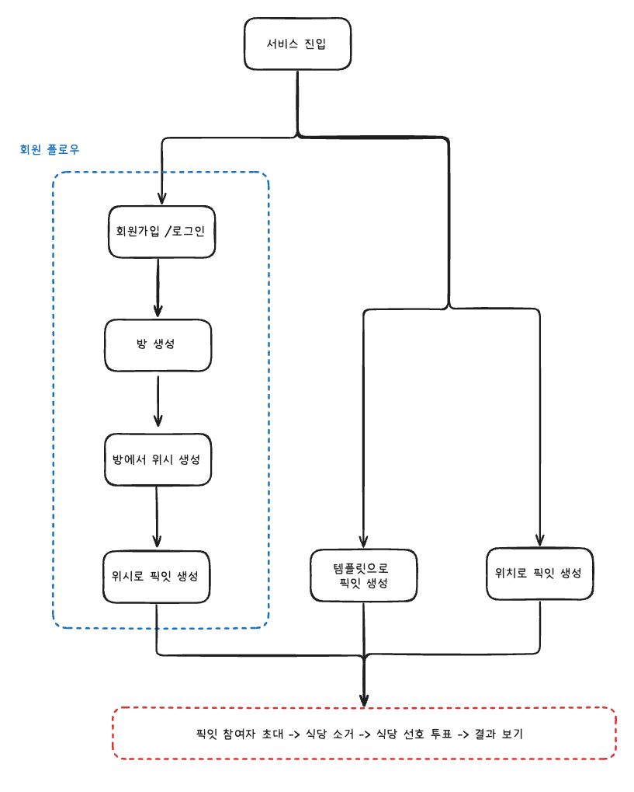
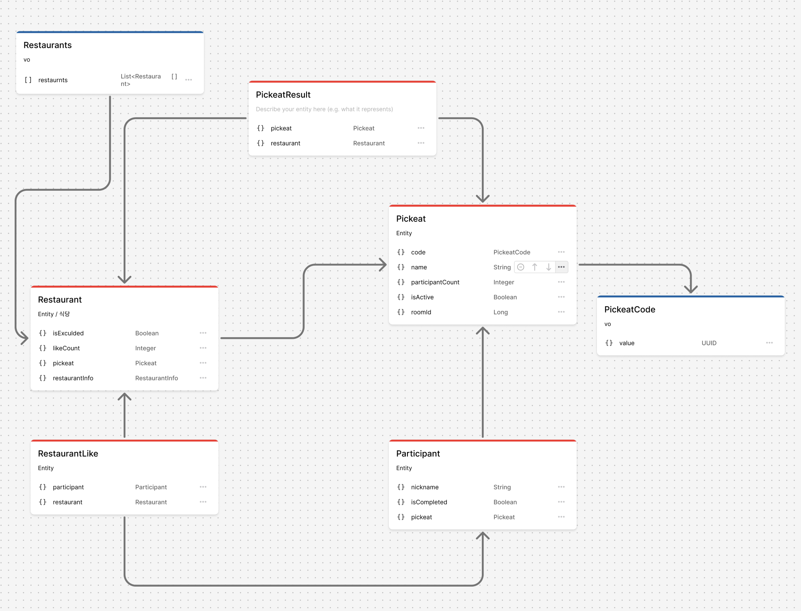
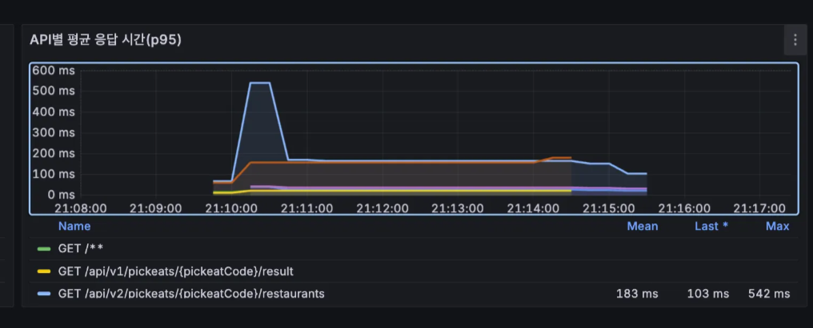

# 모든 데이터에 영속성이 필요할까?

어떤 서비스를 개발할 때 우리는 일반적으로 도메인 엔티티를 데이터베이스에 **영구 저장(persistence)**하는 것을 당연하게 생각합니다. 
하지만 과연 **모든 데이터가 영구적인 생명주기**를 가질 필요가 있을까요?

일부 데이터는 사용되는 순간에만 의미 있고 그 이후로는 가치가 사라질 수 있습니다.                                         
이런 **일시적 데이터(ephemeral data)**까지 영속적으로 보관하면 오히려 불필요한 부하를 초래할 수 있습니다.

이번 글에서는 이러한 의문을 가지고, 실제 서비스 사례를 통해 영속성이 꼭 필요하지 않은 데이터와 효율적인 관리 방법에 대해 살펴보겠습니다.

### 대상 독자

- **DB 병목이나 커넥션 풀 한계**를 경험하고 근본적인 구조 개선을 모색 중인 개발자
- 단순히 캐시를 성능 보조 수단으로 보는 것이 아니라, **인메모리 설계(in-memory architecture)** 관점에서 시스템을 바라보고 싶은 개발자
- **영속성(Persistence)**보다 **데이터의 생명주기(Lifecycle)**에 초점을 맞춰 도메인을 설계하고 싶은 사람

## 배경 서비스: 협업 식당 투표 서비스 픽잇(Pickeat)

**픽잇(Pickeat)**은 여러 명이 함께 식당을 선택하기 위해 **투표하는 협업형 서비스**입니다.

Spring Boot 3.5.3(Java 21)과 MySQL 9.4를 기반으로 개발되었으며, 다음과 같은 핵심 기능을 제공합니다.



(파란 점선으로 표시된 부분이 **회원 플로우**, 빨간 점선으로 표시된 부분이 **투표 플로우**를 나타냅니다.)

- **방 생성 및 위시리스트 관리**:

  회원은 자신만의 “방”을 만들어 평소 가고싶었던 식당 리스트(위시 리스트)를 저장 해둘 수 있습니다. 
  이 데이터는 RDB에 영구 저장되며, 이후 투표를 생성할 때 재사용됩니다.

- **비회원 사용**:

  비회원은 로그인 없이도 빠르게 투표를 시작할 수 있으며, 두 가지 방식 중 하나를 선택할 수 있습니다.

    1. **템플릿 기반 생성**

       픽잇 팀이 미리 큐레이션한 지역별 맛집 목록을 불러와 투표를 시작하는 방식입니다.

       예를 들어 “잠실역 근처 인기 맛집” 같은 템플릿이 이에 해당합니다.

       이러한 템플릿 데이터는 RDB에 영구 저장되어 모든 사용자에게 공통으로 제공됩니다.

    2. **위치 기반 생성**

       사용자의 현재 위치를 기반으로 외부 API(Kakao Map)를 호출해 주변 식당 정보를 가져오는 방식입니다.

       조회된 데이터는 일회성으로만 사용되며, 정책상 매일 자정에 스케줄링을 통해 삭제(soft delete)하고있습니다.

- **실시간 투표 진행**:

  여러 참여자가 가기 싫은 식당 후보를 소거하고 가고 싶은 식당 후보에 투표하며 최종 식당을 결정합니다. 
  결과는 모든 참여자에게 동일하게 공유됩니다.


### 픽잇의 전체 플로우

픽잇의 투표 과정은 크게 두 단계로 나뉩니다.

첫 번째 단계에서는 식당 후보 목록을 생성하고, 두 번째 단계에서는 동일한 흐름으로 투표가 진행됩니다.

1. **식당 후보 목록 생성 단계**
    - **위시 선택**: 회원의 개인 위시리스트 기반
    - **템플릿 선택**: 픽잇팀이 제공하는 지역별 맛집 목록
    - **위치 선택**: 외부 API를 통해 주변 식당 조회
2. **공통 투표 진행 단계**

   어떤 방식으로 식당 후보를 생성했든, 내부적으로 동일한 식당 도메인 객체들로 변환되어 관리됩니다.

    ```
    참여자 초대 -> 식당 후보 소거 -> 투표 진행 -> 결과 확인
    ```

   투표 진행 중에는 식당 목록이 지속적으로 참여자들에게 표시되고,

   실시간 상호작용(소거, 투표)에 따라 각 식당의 상태(소거 여부, 투표수)가 변경됩니다.

   모든 참여자는 이러한 변동이 반영된 **일관된 최신상태**를 실시간으로 확인해야합니다.

   


## 문제 상황: 모든 데이터를 DB에 저장했을 때 발생한 병목

처음 개발 당시에는 투표에 사용되는 식당 객체도 다른 엔티티처럼 매 요청 시 **DB에서 조회**하고 변경 사항을 **DB에 저장**하는 방식을 취했습니다. 
위시나 템플릿을 통해 변환된 식당도 모두 DB에 저장했고 투표 중의 소거/투표 상태 변경도 모두 DB를 통해 관리했습니다. 
소규모 사용자 환경에서는 큰 문제가 없었습니다.

그러나 **부하테스트**를 진행하면서 병목 현상이 드러났습니다. 
1분간 10명의 참여자가 속한 투표 프로세스가 동시에 1000개가 진행되는 테스트 시나리오(Peak RPS 약 439)를 돌려보니, 
식당 목록을 조회하는 API의 **p95 지연 시간이 542ms**에 달해, 응답이 0.5초 이상 지연되는 문제가 나타났습니다.



### 관찰 결과

- 애플리케이션 로직 병목 여부:

  식당 조회 API는 단순히 DB에서 SELECT하는 것이 전부라 애플리케이션 레벨에서는 특별한 연산 지연이 없었습니다.

- DB 쿼리 성능:

  쿼리는 외래 키로 인덱스 조회하는 간단한 형태였고, EXPLAIN 결과도 Index Range Scan으로 양호하게 나왔습니다. 
  (1건 조회에 Key Lookup, rows=1로 예측)

- **DB 커넥션 부족:**

  결국 주요 원인은 식당 조회 요청마다 **DB 커넥션을 사용**한다는 점이었습니다. 
  짧은 주기로 다수의 사용자가 동시에 조회하다 보니, **DB Connection Pool(기본 10개)**이 고갈되어 대기 상태가 발생하였고 
  그 결과 응답 지연이 커졌습니다.


그렇다면 단순히 DB Connection Pool 크기를 늘리면 될까요? 
풀을 튜닝하면 일시적으로는 지연을 줄일 수 있습니다.
픽잇 팀에서는 이것이 **근본적인 해결책이 아니라고 판단**했습니다. 
풀을 늘리고 서버의 CPU 코어수를 늘려도 데이터베이스에 모든 요청이 집중되는 구조 자체는 변하지 않습니다.
즉 사용자가 늘어날수록 같은 병목이 반복될 수 밖에 없기 때문입니다.

### 영속성 재고

정말 모든 식당 데이터를 DB에 영구 저장해야했을까요?

근본적인 문제를 해결하기 위해 픽잇 팀은 **데이터의 본질적인 필요성**을 다시 돌아봤습니다. 
한 투표 세션 내내 DB에 저장하며 관리했던 식당 데이터의 생명주기를 따져보니, 
사실 이 데이터는 투표 안에서만 의미가 있고, 투표가 끝나면 가치가 사라지는 일시적 정보였습니다.

투표 세션 중 변동되는 정보들—**어떤 식당이 제거되었는지**, **식당 별 득표 현황은 어떤지**—은 투표가 완료되면 더 이상 사용할 일이 없습니다. 
이미 재사용되는 **원본 데이터**(위시리스트나 템플릿에 있는 정보)는 별도의 엔티티로 영구 저장되어있고, 
투표 과정에서 생성된 식당 엔티티들은 재사용되지 않는 일회성 데이터였습니다. 
오히려 내부 정책에 따라 하루에 한 번 스케줄러가 작동해 해당 데이터를 삭제(soft delete) 처리하고 있었습니다. 

결국, 식당 엔티티의 실제 생명주기는 식당이 속한 투표 세션의 생명주기와 동일했습니다.
즉 영속성이 필요 없는 데이터를 매번 **RDB에서 읽고 쓰는 방식으로 관리했던 것**이 병목의 핵심 원인이었습니다. 

이 분석을 통해 픽잇 팀은
> "모든 데이터가 영속성을 가져야하는 것은 아니다.<br>
> 의미가 일시적이거나 서비스 전반적으로 재사용 되지 않는 데이터는 필요한 동안만 존재하도록 설계해야한다."

라는 결론에 이르게 되었습니다.

이후 식당같은 **단명(short-lived) 데이터**에 대해서는 영속성을 제거하고, **인메모리 기반으로 필요한 동안만 관리하는 방향**으로 구조를 전환하기로 했습니다.

---
(이후 내용은 아직 프로젝트 적용중에 있어서 보완 필요)

## 인메모리 전환: 로컬 메모리에서 Redis로 확장

DB 병목을 해결하기 위해 우선 **로컬 메모리 기반 구조**를 적용했습니다.
투표 중에만 유효한 식당 데이터는 영속성이 필요하지 않았기 때문에, WAS 프로세스 내부에서 직접 관리해도 충분했습니다.
이 방식은 DB 접근 없이 메모리에서 바로 읽고 쓰기 때문에 응답 속도가 크게 향상되었습니다.

하지만 한계도 분명했습니다. WAS를 재배포하거나 장애로 재시작할 경우,  진행 중이던 투표의 식당 데이터가 모두 휘발되는 문제가 발생했습니다.
이 상태에서는 투표 세션을 복원할 방법이 없었고, 로컬 메모리만으로는 안정적인 운영이 어렵다는 결론에 도달했습니다.

이 문제를 해결하기 위해 **Redis를 추가 저장소로 도입**했습니다.

Redis는 단순한 캐시가 아니라, 식당 상태를 저장하는 **주 저장소**(Source of Truth)로 사용했습니다.
변경이 잦은 도메인을 DB-캐시 구조로 운영하면 캐시 무효화와 DB 재조회가 반복되어 오히려 부하가 커집니다.
이에 따라 원본 저장소를 Redis로 전환하고, 모든 읽기와 쓰기를 인메모리에서 처리하도록 구조를 변경했습니다.

## 2계층 인메모리 구조 설계

Redis를 주 저장소로 사용하더라도, 네트워크를 거치는 I/O가 존재하기 때문에 지연을 최소화할 방법이 필요했습니다.
이에 따라 **로컬 캐시**(Local Cache)를 추가하여 2계층 구조로 설계했습니다.

- **1차 캐시 (L1, Caffeine 기반 로컬 캐시)**

  각 WAS 인스턴스 내부 메모리에 존재하며,

  동일 인스턴스 내 요청은 Redis를 거치지 않고 즉시 처리합니다.

  네트워크를 타지 않기 때문에 응답 속도가 가장 빠릅니다.

- **2차 캐시 (L2, Redis)**

  모든 인스턴스가 공유하는 저장소이며,

  로컬 캐시 간의 불일치를 조정하고 변경 사항을 동기화합니다.

  한 인스턴스에서 상태가 변경되면 Redis에 반영되고,

  Pub/Sub을 통해 다른 인스턴스의 로컬 캐시가 무효화됩니다.

  로컬 캐시가 비어 있으면 Redis에서 다시 데이터를 불러와 채웁니다.


이 구조를 통해 “로컬의 응답 속도”와 “Redis의 안정성”을 동시에 확보했습니다.

로컬 캐시가 재배포로 사라지더라도 Redis에 저장된 데이터를 다시 불러와 복원할 수 있으며,

향후 다중 인스턴스 환경에서도 동일한 구조로 확장할 수 있습니다.

## 확장성 고려 및 데이터 일관성 전략

현재는 단일 인스턴스 환경이지만, Redis는 향후 다중 인스턴스로 확장될 것을 전제로 설계되었습니다.
각 인스턴스는 독립된 로컬 캐시를 가지지만, Redis가 중앙 허브 역할을 하며 상태를 동기화합니다.
일관성 측면에서는 **즉각적 반영(Strong Consistency)** 대신
**단기적 비일관성을 허용하는 Eventual Consistency** 전략을 선택했습니다.

Redis Pub/Sub 기반의 무효화 신호가 전파되는 짧은 시간 동안 일부 인스턴스 간 상태 차이가 발생할 수 있지만,
사용자가 인지할 정도의 지연은 발생하지 않습니다. 이를 통해 서비스의 핵심 경험인 “실시간 투표 결과 공유”를
안정적인 수준으로 유지할 수 있었습니다.

## 정리

이번 인메모리 구조 전환의 핵심은 **데이터의 수명주기에 맞는 저장 방식을 적용했다는 점**입니다.
세션이 끝나면 의미를 잃는 데이터를 DB에 저장할 필요는 없습니다. 

영속성이 필요한 정보(회원, 위시리스트, 템플릿)는 RDB에, 
일시적인 상태 데이터(투표 진행 중의 식당 상태)는 인메모리에 두는 방식으로 역할을 명확히 분리했습니다.

핵심 원칙은 다음과 같습니다.
- **변경이 잦은 데이터는 인메모리에서 관리한다.**

  DB 접근 없이 빠른 상태 변경을 처리할 수 있다.

- **로컬 캐시와 Redis를 함께 사용한다.**

  로컬은 초저지연 응답을, Redis는 복구와 동기화를 담당한다.

- **데이터는 필요할 때만 존재한다.**

  수명이 다하면 자연스럽게 만료되도록 설계한다.


결과적으로, 픽잇은 DB 병목을 제거하면서도 데이터 일관성과 성능을 함께 확보할 수 있었습니다.

이번 개선은 단순한 성능 최적화가 아니라, **데이터의 생명주기에 기반한 구조적 전환**이었습니다.