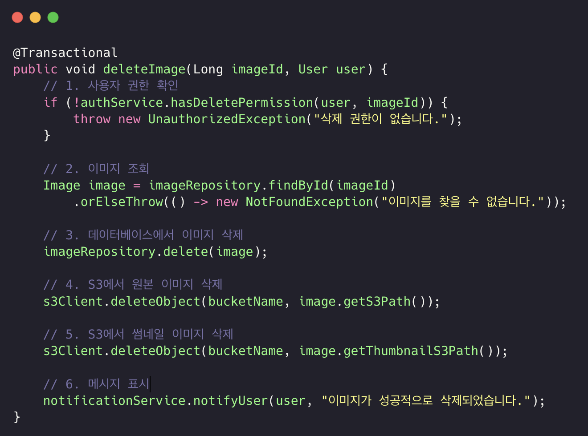
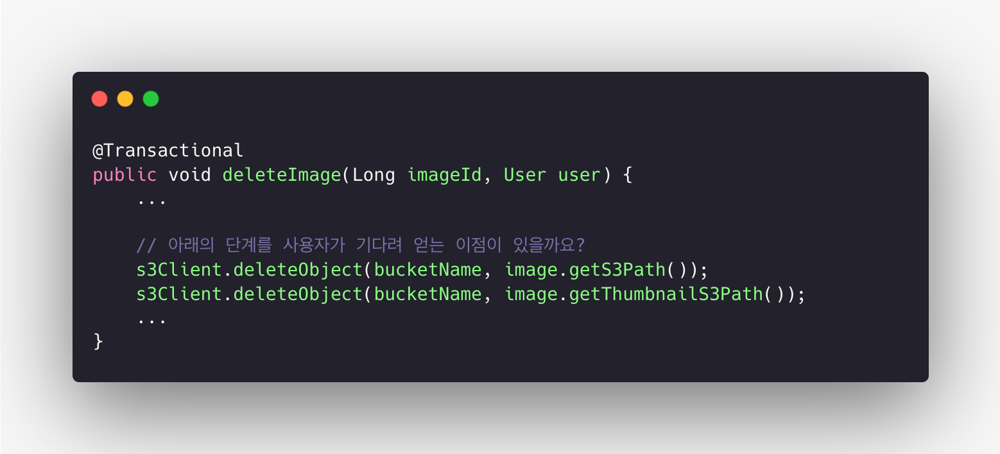
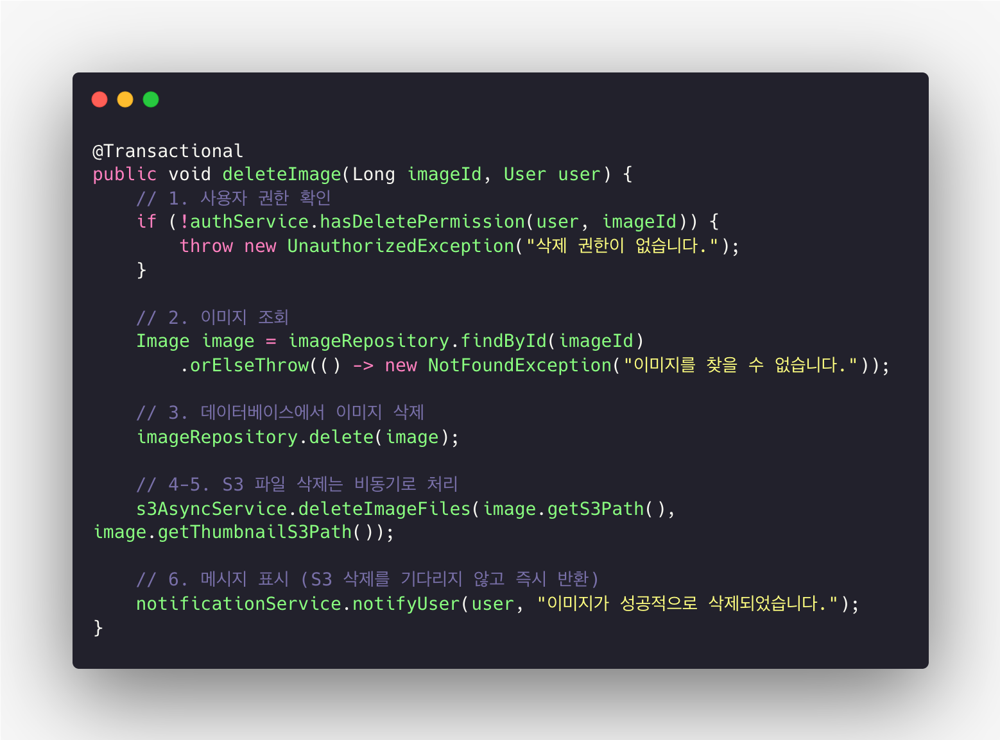
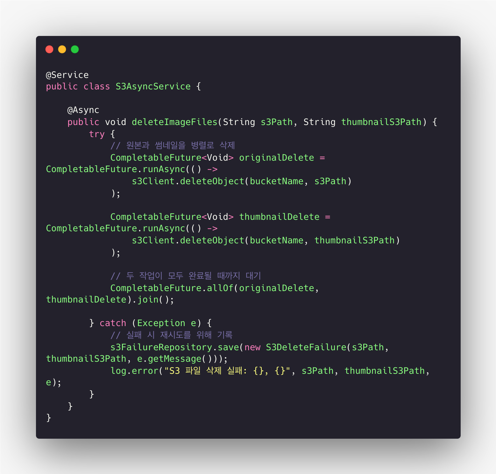
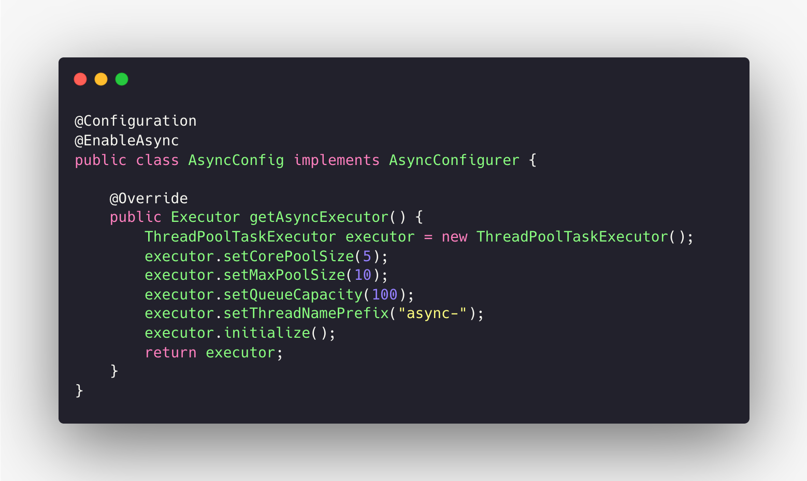

# 동기와 비동기 프로그래밍의 이해

## 들어가며

이 글은 웹 애플리케이션이나 서버 애플리케이션을 개발하는 백엔드 개발자, 프런트엔드 개발자, 그리고 시스템 설계자를 대상으로 합니다.
특히 I/O(입출력) 작업이 많은 환경에서 성능 최적화와 사용자 경험 향상을 고민하는 개발자에게 도움이 될 내용입니다.
이 글에서는 동기(synchronous)와 비동기(asynchronous) 프로그래밍의 개념적 차이, 실제 코드 동작 방식, 그리고 실무 적용 사례를 구체적으로 설명합니다.
또한 “언제 비동기 처리를 고려해야 하는가”라는 실무적인 질문에 대한 판단 기준을 함께 제시합니다.

## 동기 방식의 기본 동작 원리

개발자는 요구사항을 받으면 순차적인 처리를 먼저 고려합니다. 요구사항을 완성하기 위해 필요한 단계를 쌓아 나가면서 기능 개발을 진행합니다. 이는 가장 직관적이고 이해하기 쉬운 방식이기 때문입니다.
동기 방식에서는 각 작업이 순서대로 실행됩니다. 첫 번째 작업이 완료되면 두 번째 작업을 시작하고, 두 번째 작업이 끝나면 세 번째 작업을 시작합니다. 마치 계단을 한 칸씩 올라가듯이 단계별로 진행됩니다.

다음과 같은 요구사항이 개발자에게 전달됐습니다.

```text
사용자가 이미지 삭제 버튼을 클릭하면 다음 작업을 수행한다:
1. 사용자의 삭제 권한을 확인한다
2. 데이터베이스에서 삭제 요청이 들어온 이미지를 조회한다
3. 데이터베이스에서 삭제 요청이 들어온 이미지를 삭제한다
4. S3에서 원본 이미지를 삭제한다
5. S3에서 썸네일 이미지를 삭제한다
6. 사용자에게 삭제 완료 메시지를 표시한다
```

개발자는 이 요구사항을 보고 자연스럽게 순차적인 코드를 작성합니다. 각 단계를 함수로 만들고 순서대로 호출하면 됩니다. 코드의 흐름이 요구사항의 흐름과 일치하므로 이해하기 쉽고 유지보수도 간편합니다.



### 동기 방식의 실행 과정

동기 방식에서 위 요구사항을 처리하는 과정을 살펴보겠습니다.

1. **사용자 권한 확인 (100ms 소요)**: 프로그램은 인증 시스템에 사용자의 삭제 권한을 확인합니다. 권한 확인이 완료될 때까지 프로그램은 다른 작업을 하지 않습니다.

2. **이미지 조회 (100ms 소요)**: 권한이 확인된 후 데이터베이스에서 삭제할 이미지 정보를 조회합니다. 이미지의 S3 경로, 파일명, 썸네일 정보 등을 가져올 때까지 기다립니다.

3. **데이터베이스에서 이미지 삭제 (100ms 소요)**: 이미지 정보를 받은 후 데이터베이스에서 해당 이미지 레코드를 삭제합니다. 삭제가 완료될 때까지 기다립니다.

4. **원본 이미지 삭제 (400ms 소요)**: 데이터베이스 삭제가 완료된 후 S3에 원본 이미지 삭제를 요청합니다. AWS S3 API가 삭제를 완료할 때까지 기다립니다. 외부 API 호출이므로 가장 시간이
   오래 걸립니다.

5. **썸네일 이미지 삭제 (300ms 소요)**: 원본 이미지 삭제가 완료된 후 S3에 썸네일 이미지 삭제를 요청합니다. 썸네일은 원본보다 작아 삭제 시간이 상대적으로 짧습니다.

6. **메시지 표시**: 모든 작업이 끝난 후 사용자에게 삭제 완료 메시지를 보여줍니다.

전체 처리 시간은 100ms + 100ms + 100ms + 400ms + 300ms = 1000ms(1초)입니다. 각 단계가 끝나야 다음 단계를 시작하므로 모든 대기 시간이 누적됩니다.
실제 프로젝트 모니터링 결과 S3 API 호출이 전체 시간의 약 70%(700ms)를 차지하며, 나머지 30%(300ms)는 권한 확인과 데이터베이스 작업에 소요됩니다.

## 동기 방식의 문제점

동기 방식은 직관적이고 이해하기 쉽지만 몇 가지 중요한 문제점을 가지고 있습니다. 특히 I/O 작업이 많거나 네트워크 요청을 자주 하는 경우 이 문제점들이 두드러집니다.

- **긴 처리 시간**

각 작업이 완료될 때까지 기다려야 하므로 전체 처리 시간이 길어집니다. 위의 이미지 삭제 예시에서 전체 처리에 1초가 걸렸습니다. 1초는 짧아 보이지만 사용자는 이 시간 동안 아무것도 할 수 없고 화면만 바라봐야 합니다.
현대의 사용자들은 500ms 이상 기다리면 지연을 느끼기 시작하고, 1초 이상 기다리면 답답함을 느낍니다. 특히 여러 이미지를 순차적으로 삭제하는 경우 대기 시간이 누적되어 사용자 경험이 크게 나빠집니다.

- **자원 낭비**

작업을 기다리는 동안 CPU는 거의 사용되지 않습니다. S3 API 응답을 기다리는 400ms 동안 CPU는 할 일이 없지만 다른 작업을 처리할 수도 없습니다. 서버에서 동기 방식을 사용하면 한 번에 처리할 수 있는 요청 수가 크게 제한됩니다.
100명의 사용자가 동시에 이미지를 삭제하면 일부 사용자는 다른 사용자의 삭제가 끝날 때까지 기다려야 합니다. 특히 S3와 같은 외부 API 호출은 네트워크 대기 시간이 대부분을 차지하므로 CPU 자원 낭비가 심각합니다.

- **블로킹으로 인한 응답성 저하**

사용자 인터페이스에서 동기 방식을 사용하면 화면이 멈춘 것처럼 보입니다. 네트워크 요청을 보내고 응답을 기다리는 동안 사용자가 버튼을 클릭하거나 스크롤을 해도 반응이 없습니다. 브라우저에서는 "페이지가 응답하지 않습니다"라는 메시지가 나타날 수 있습니다. 이는 매우 나쁜 사용자 경험을 만듭니다.

- **병렬 처리 불가능**

여러 작업을 동시에 처리할 수 없습니다. 권한 확인, 이미지 조회, 데이터베이스 삭제는 순서대로 처리해야 하지만, S3 원본 이미지 삭제와 썸네일 이미지 삭제는 서로 독립적인 작업이므로 동시에 실행해도 문제가 없습니다.
하지만 동기 방식에서는 원본 이미지 삭제가 끝나야 썸네일 이미지 삭제를 시작할 수 있습니다. 이렇게 순차적으로 처리하면 불필요하게 시간을 낭비하게 됩니다.

- **확장성 제한**

서버 애플리케이션에서 동기 방식을 사용하면 동시 접속자 수에 제한이 생깁니다. 각 요청마다 스레드(thread)를 하나씩 할당해야 하는데, 스레드는 생성 비용이 크고 메모리를 많이 사용합니다.
스레드가 100개만 있다면 101번째 사용자는 다른 사용자가 작업을 마칠 때까지 기다려야 합니다. 트래픽이 증가하면 서버를 수평적으로 확장하기 어렵습니다.

이미지 공유 서비스에서 동기 방식을 사용한다고 가정해봅시다. 사용자가 여러 이미지를 선택하여 일괄 삭제하는 기능을 제공합니다. 이미지 10개를 삭제하는데 각 이미지마다 1초가 걸린다면 총 10초가 필요합니다.
서버가 동시에 100개의 요청만 처리할 수 있다면, 101번째 사용자는 다른 사용자의 작업이 끝날 때까지 기다려야 합니다. 특히 모바일 환경에서는 네트워크 지연이 추가로 발생하여 실제 체감 시간은 더 길어집니다. 
이러한 대기 시간은 사용자 경험을 크게 해칩니다.

## 비동기 방식의 필요성

동기 방식의 이러한 문제점들을 해결하기 위해 비동기 방식이 등장했습니다. 비동기 방식을 사용하면 작업을 기다리는 동안 다른 작업을 처리할 수 있어 전체 처리 시간을 크게 줄일 수 있습니다.
앞서 살펴본 이미지 삭제 예시에서 S3 원본 이미지 삭제와 썸네일 이미지 삭제는 서로 독립적인 작업입니다. 비동기 방식을 사용하면 두 작업을 동시에 시작할 수 있습니다. 원본 이미지 삭제에 400ms, 썸네일 이미지 삭제에 300ms가 걸린다면 순차 처리에서는 700ms가 필요하지만 동시 처리에서는 400ms만 필요합니다.
이처럼 비동기 방식은 전체 처리 시간을 1000ms에서 700ms 수준으로 단축할 수 있습니다. 300ms의 개선은 약 30%의 성능 향상을 의미하며, 사용자가 체감할 수 있는 수준의 개선입니다.
하지만 비동기 방식을 제대로 이해하고 사용하려면 먼저 관련된 핵심 개념들을 이해해야 합니다. 블로킹(Blocking)과 논블로킹(Non-Blocking), 그리고 동기(Synchronous)와 비동기(Asynchronous)라는 네 가지 개념이 있으며, 이들은 서로 다른 관점에서 작업 처리 방식을 설명합니다.

## 블로킹 I/O와 논블로킹 I/O

블로킹과 논블로킹은 호출된 함수가 제어권을 즉시 반환하는지 여부를 기준으로 구분합니다. 제어권이란 프로그램의 실행 흐름을 제어할 수 있는 권한을 의미합니다. 제어권을 가진 쪽이 다음에 실행할 코드를 결정할 수
있습니다.

### 블로킹(Blocking) 방식

블로킹 방식에서는 프로그램이 작업을 진행하다가 다른 작업을 호출하면 해당 작업이 완료될 때까지 기다립니다. 예를 들어 파일을 읽는 작업을 호출하면 파일 읽기가 끝날 때까지 프로그램은 다음 코드를 실행하지 않습니다. 이때 호출된 함수가 제어권을 가지고 있어 호출한 쪽은 대기 상태가 됩니다.
일상생활에 비유하면 은행 창구에서 업무를 보는 상황과 같습니다. 고객이 창구 직원에게 업무를 요청하면 직원이 업무를 완료할 때까지 고객은 창구 앞에서 기다려야 합니다. 고객은 다른 일을 할 수 없고 직원의 업무가 끝나야만 다음 행동을 할 수 있습니다.
블로킹 방식의 특징은 다음과 같습니다. 작업이 완료될 때까지 프로그램 실행이 멈춥니다. 코드의 흐름을 이해하기 쉽습니다. 하지만 대기 시간 동안 CPU 자원을 효율적으로 사용하지 못하며, 단순한 작업 흐름에만 적합합니다.

### 논블로킹(Non-Blocking) 방식

논블로킹 방식에서는 다른 작업을 호출하더라도 즉시 제어권을 돌려받아 자신의 작업을 계속 진행할 수 있습니다. 호출된 작업이 완료되지 않았더라도 프로그램은 다음 작업을 수행할 수 있습니다.
예를 들어 논블로킹 방식으로 파일을 읽으면 파일 읽기 작업이 진행되는 동안에도 프로그램은 다른 코드를 실행할 수 있습니다.
은행 업무로 비유하면 번호표를 받고 대기하는 상황과 같습니다. 번호표를 받은 후 고객은 자리에 앉아 휴대폰을 보거나 다른 일을 할 수 있습니다. 자신의 차례가 되면 호출을 받아 창구로 갑니다.
논블로킹 방식의 특징은 다음과 같습니다. 작업 완료 여부와 관계없이 즉시 제어권을 받습니다. 대기 시간 동안 다른 작업을 수행할 수 있어 CPU 자원을 효율적으로 활용할 수 있습니다. 하지만 코드 구조가 복잡해질 수 있습니다.

### 핵심 차이점

블로킹과 논블로킹의 핵심 차이는 **호출된 함수가 제어권을 언제 반환하는가**입니다. 블로킹은 작업이 끝난 후 제어권을 반환하고, 논블로킹은 작업 완료 여부와 관계없이 즉시 제어권을 반환합니다.

## 동기와 비동기

동기와 비동기는 작업의 완료 시점과 결과 처리 방식을 기준으로 구분합니다.

### 동기(Synchronous) 방식

동기 방식에서는 작업을 순차적으로 실행합니다. 하나의 작업이 끝나야 다음 작업을 시작하며, 작업의 결과를 즉시 확인할 수 있습니다. 예를 들어 데이터베이스에 데이터를 저장한 후 그 결과를 확인하고 다음 작업을
진행하는 경우가 동기 방식입니다.
식당에서 음식을 주문하는 상황에 비유하면 주문한 음식이 나올 때까지 기다렸다가 음식을 받고 다음 주문을 하는 것과 같습니다. 각 주문의 결과를 확인한 후에 다음 행동을 결정합니다.
동기 방식의 특징은 다음과 같습니다. 작업이 순서대로 실행됩니다. 이전 작업의 결과를 즉시 받아 다음 작업에 사용할 수 있습니다. 코드의 실행 순서를 예측하기 쉽습니다. 하지만 여러 작업을 동시에 처리할 때 전체
처리 시간이 길어질 수 있습니다.

### 비동기(Asynchronous) 방식

비동기 방식에서는 작업의 시작과 종료 시점이 일치하지 않습니다. 한 작업이 끝나기 전에 다른 작업을 시작할 수 있으며, 작업의 완료 순서가 호출 순서와 다를 수 있습니다. 예를 들어 여러 API를 호출한 후 각 API의 응답이 도착하는 대로 처리하는 경우가 비동기 방식입니다.
식당에 비유하면 여러 음식을 한꺼번에 주문하고 완성되는 대로 받는 것과 같습니다. 조리 시간이 짧은 음식이 먼저 나올 수 있고, 각 음식이 준비되는 대로 서빙됩니다.
비동기 방식의 특징은 다음과 같습니다. 여러 작업을 동시에 진행할 수 있습니다. 전체 처리 시간을 단축할 수 있습니다. 하지만 결과가 언제 도착할지 예측하기 어렵고, 콜백 함수나 프라미스(Promise) 등으로 결과를 처리해야 합니다.

### 핵심 차이점

동기와 비동기의 핵심 차이는 **작업 완료 시점과 결과 처리에 대한 관심 여부**입니다. 동기는 작업이 순서대로 완료되는 것에 관심을 가지며 결과를 즉시 받아 처리합니다. 비동기는 작업의 완료 순서에 관심을 두지 않으며 나중에 결과를 받아 처리합니다.

## 네 가지 개념의 조합

실제 프로그래밍에서는 블로킹/논블로킹과 동기/비동기가 조합되어 사용됩니다. 각 조합은 서로 다른 특성을 가지며 상황에 따라 적절한 조합을 선택해야 합니다.

- **동기 + 블로킹:** 작업을 호출하고 결과를 받을 때까지 기다립니다. 가장 직관적이고 이해하기 쉬운 방식입니다. 코드의 흐름이 명확하지만 대기 시간 동안 다른 작업을 수행할 수 없어 효율이 떨어집니다.
  이미지 삭제처럼 순서가 중요한 작업이나 사용자 로그인 처리처럼 단순하고 순차적인 작업에 적합합니다.

- **동기 + 논블로킹:** 작업을 호출한 후 제어권은 즉시 받지만 결과를 계속 확인합니다. 다른 작업을 하면서도 주기적으로 결과를 확인해야 합니다. 게임에서 네트워크 패킷을 받으면서도 화면을 계속 렌더링하는
  경우에 사용됩니다. 결과를 반복적으로 확인해야 하므로 CPU 자원을 낭비할 수 있습니다.

- **비동기 + 논블로킹:** 작업을 호출하고 제어권을 받아 다른 작업을 합니다. 결과는 나중에 콜백이나 이벤트로 받습니다. 가장 효율적인 방식입니다. 웹 브라우저에서 여러 이미지를 동시에 다운로드하거나,
  S3에서 여러 파일을 동시에 삭제하는 경우처럼 I/O가 많은 작업에 적합합니다. CPU와 네트워크 자원을 가장 효율적으로 사용하지만 코드가 복잡해지고 디버깅이 어려워질 수 있습니다.

- **비동기 + 블로킹:** 작업을 호출하고 기다리지만 결과는 나중에 받습니다. 실무에서는 거의 사용되지 않는 조합입니다. 블로킹의 단점과 비동기의 복잡성을 모두 가지므로 효율성이 떨어지고 코드도 이해하기
  어렵습니다.

# 언제 비동기를 고려해야 할까?

## 외부 연동과 기능 실패의 구분

외부 시스템과 연동하는 기능을 개발할 때 먼저 고려해야 할 점이 있습니다. 외부 연동의 실패가 전체 기능의 실패를 의미하는지 판단해야 합니다. 이 질문에 대한 답변에 따라 동기 방식과 비동기 방식 중 어떤 것을 선택할지 결정할 수 있습니다.
우리 프로젝트의 이미지 삭제 기능을 예로 들어보겠습니다. 데이터베이스에서 이미지 정보를 삭제한 후 S3에서 실제 파일을 삭제하는데, S3 삭제가 실패하면 전체 기능을 실패로 처리해야 할까요?
사용자가 이미지를 삭제하고 싶어 하는 핵심 이유는 무엇일까요? 앱에서 해당 이미지가 보이지 않게 하려는 것입니다. 데이터베이스에서 삭제되면 이미 사용자는 그 이미지를 볼 수 없습니다.
물론 S3에 파일이 남아있으면 저장 공간을 불필요하게 차지합니다. 하지만 이는 즉시 해결해야 하는 치명적인 문제는 아닙니다. S3 파일 삭제는 별도로 기록하고 나중에 처리할 수 있습니다.

## 이미지 삭제 기능의 처리 흐름

앞서 현재 프로젝트의 이미지 삭제 기능을 동기 방식으로 구현했습니다.
이 흐름에서 DB삭제까지 완료되면 사용자가 원하는 핵심 기능은 이미 완료된 것입니다. 데이터베이스에서 이미지가 삭제되었으므로 사용자는 더 이상 그 이미지를 조회하거나 접근할 수 없습니다. S3 파일 삭제는 저장 공간 정리를 위한 부가적인 작업입니다.
실제 모니터링 데이터를 보면 전체 처리 시간 1초 중 S3 작업이 700ms를 차지합니다. 이 시간 동안 사용자는 화면에서 아무것도 할 수 없습니다. 하지만 데이터베이스 삭제까지만 완료되어도 사용자 관점에서는 삭제가 완료된 것과 같습니다.



S3 삭제가 완료될 때까지 메서드가 반환되지 않으므로, 사용자는 S3 API 응답을 모두 기다려야 합니다. 사용자를 매우 불편하게 만드는 요소입니다.

## S3 삭제를 비동기로 처리하기

S3 파일 삭제를 비동기로 처리하면 사용자 경험을 크게 개선할 수 있습니다. 데이터베이스 삭제까지만 동기로 처리하고, S3 파일 삭제는 백그라운드에서 처리하는 방식입니다.
동기 방식으로 모든 단계를 처리하면 1000ms가 걸립니다. 하지만 데이터베이스 삭제까지만 완료하면 300ms만 소요됩니다. 사용자는 300ms 후 즉시 삭제 완료 메시지를 받고 다른 작업을 진행할 수 있습니다.
S3 파일 삭제는 백그라운드에서 700ms 동안 진행되지만 사용자는 이를 기다릴 필요가 없습니다.
더 나아가 S3 원본 이미지와 썸네일 이미지 삭제를 병렬로 처리하면 S3 작업 시간을 400ms로 단축할 수 있습니다. 전체적으로 사용자는 300ms만 기다리고, 백그라운드에서 400ms 동안 S3 정리 작업이 진행됩니다.

### 비동기 방식 코드

Spring의 `@Async` 어노테이션을 사용하여 S3 삭제를 비동기로 처리할 수 있습니다.



S3 삭제를 담당하는 별도 서비스를 만들어 `@Async`로 처리합니다.



`@Async`를 사용하려면 Spring 설정에서 비동기 처리를 활성화해야 합니다.



이렇게 비동기로 처리하면 데이터베이스 삭제 후 즉시 사용자에게 응답을 반환합니다. S3 파일 삭제는 백그라운드 스레드 풀에서 처리되며, 실패 시 자동으로 기록됩니다. 원본과 썸네일 삭제를
`CompletableFuture`로 병렬 처리하여 S3 작업 시간도 단축합니다.

### 동기 방식과 비동기 방식 비교

동기 방식에서는 모든 작업이 순차적으로 실행됩니다. 권한 확인(100ms) -> 이미지 조회(100ms) -> DB 삭제(100ms) -> S3 원본 삭제(400ms) -> S3 썸네일 삭제(300ms)로 총 1000ms가 소요됩니다. 사용자는 1000ms 동안 대기해야 하고, 이 시간 동안 다른 작업을 할 수 없습니다.

비동기 방식에서는 DB 삭제까지만 동기로 처리합니다. 권한 확인(100ms) -> 이미지 조회(100ms) -> DB 삭제(100ms)로 300ms만 소요되고 즉시 사용자에게 응답을 반환합니다.
S3 파일 삭제는 백그라운드에서 처리되며, 원본과 썸네일을 병렬로 삭제하여 400ms에 완료됩니다. 사용자는 300ms만 기다리면 되고, 나머지 400ms는 백그라운드에서 처리되므로 체감 시간이 70% 단축됩니다.

## S3 삭제 실패 시 처리 방안

S3 파일 삭제를 비동기로 처리하면 실패 상황을 따로 관리해야 합니다. 하지만 이는 충분히 대응 가능한 문제입니다.

### 실패 내역 기록과 재시도

S3 삭제가 실패하면 실패 내역을 별도 테이블에 기록합니다. 이미지 ID, S3 경로, 실패 시각, 실패 사유 등을 저장합니다. 배치 작업을 통해 주기적으로 실패 내역을 조회하고 재시도합니다.

예를 들어 매 시간마다 실패한 S3 삭제 작업을 조회하여 다시 시도할 수 있습니다. 네트워크 일시적 장애나 S3 서비스 지연으로 인한 실패는 재시도하면 대부분 성공합니다. 재시도 횟수와 마지막 시도 시각도 함께
기록하여 무한히 재시도하는 것을 방지합니다.

### 고아 파일 정리

데이터베이스에는 없지만 S3에만 존재하는 파일을 고아 파일(orphan files)이라고 합니다. S3 삭제가 계속 실패하면 이런 파일들이 쌓이게 됩니다.

주기적으로 S3 버킷을 스캔하여 데이터베이스에 없는 파일들을 찾아내는 배치 작업을 운영할 수 있습니다. 예를 들어 매주 한 번씩 실행하여 일정 기간 이상 된 고아 파일들을 정리합니다. 이 작업은 사용량이 적은 새벽
시간대에 실행하여 서비스에 영향을 주지 않도록 합니다.

### 수동 처리 도구

자동 재시도와 배치 작업으로도 해결되지 않는 경우를 위해 관리자 도구를 제공할 수 있습니다. 관리자 페이지에서 실패한 S3 삭제 내역을 조회하고, 수동으로 재시도하거나 삭제할 수 있는 기능입니다.

특정 이미지의 S3 파일이 삭제되지 않는다는 고객 문의가 들어오면, 관리자가 직접 해당 파일을 찾아 처리할 수 있습니다. 이런 경우는 드물게 발생하지만, 발생했을 때 대응할 수 있는 수단이 있으면 안정적인 서비스
운영이 가능합니다.

## 비동기 처리 시 주의사항

S3 파일 삭제를 비동기로 처리할 때 몇 가지 주의할 점이 있습니다.

### 데이터 정합성 순서

반드시 데이터베이스 삭제가 먼저 일어나야 합니다. S3 파일을 먼저 삭제하고 데이터베이스 삭제에 실패하면, 데이터베이스에는 정보가 남아있는데 실제 파일은 없는 상황이 발생합니다. 사용자가 이미지를 조회하려 할 때
파일을 찾을 수 없어 오류가 발생합니다.

반대로 데이터베이스를 먼저 삭제하고 S3 삭제에 실패하면, S3에 파일은 남아있지만 사용자는 그 이미지에 접근할 수 없습니다. 저장 공간은 낭비되지만 사용자 경험에는 영향이 없고, 나중에 정리할 수 있습니다. 따라서
데이터베이스 삭제를 먼저 수행하는 것이 안전합니다.

### 실패 모니터링

비동기로 처리하더라도 실패율을 지속적으로 모니터링해야 합니다. S3 삭제 실패율이 급격히 증가하거나 특정 시간대에 집중된다면 근본 원인을 파악하고 해결해야 합니다.

예를 들어 S3 삭제 실패율이 1% 미만으로 유지된다면 정상 범위입니다. 하지만 10%를 넘어가면 네트워크 설정, S3 권한, API 호출 방식 등을 점검해야 합니다. 알림 시스템을 구축하여 실패율이 임계치를 넘으면 담당자에게 알리도록 설정하면 좋습니다.

## 비동기 처리 결정 체크리스트

이미지 삭제 기능을 통해 살펴본 것처럼, 비동기 방식을 적용할지 결정할 때 다음 질문들을 고려해야 합니다.

- **외부 연동 실패가 핵심 기능의 실패인가?** S3 파일 삭제는 저장 공간 정리를 위한 것이지, 사용자가 이미지를 보지 못하게 하는 핵심 기능은 데이터베이스 삭제입니다. 외부 연동이 부가 기능이라면 비동기로 처리할 수 있습니다.

- **외부 서비스의 응답 시간이 사용자 경험에 영향을 주는가?** S3 API 호출이 전체 시간의 70%를 차지합니다. 사용자는 이 시간 동안 아무것도 할 수 없습니다. 응답을 기다리지 않아도 되는 상황이라면 비동기로 처리하여 대기 시간을 줄일 수 있습니다.

- **실패했을 때 재시도하거나 수동 처리할 수 있는가?** S3 삭제 실패는 재시도하거나 배치 작업으로 정리할 수 있습니다. 관리자 도구로 수동 처리도 가능합니다. 복구 방안이 있다면 실패를 허용하고 비동기로 처리할 수 있습니다.

- **일시적인 실패를 허용할 수 있는가?** S3에 파일이 남아있어도 사용자는 그 이미지를 볼 수 없으므로 서비스 사용에는 문제가 없습니다. 저장 공간 낭비는 점진적으로 정리하면 됩니다. 일시적 실패가 허용된다면 비동기 처리가 적합합니다.

이런 질문들에 대한 답변을 바탕으로 동기와 비동기 중 적절한 방식을 선택하면 더 나은 사용자 경험과 안정적인 서비스를 제공할 수 있습니다.
