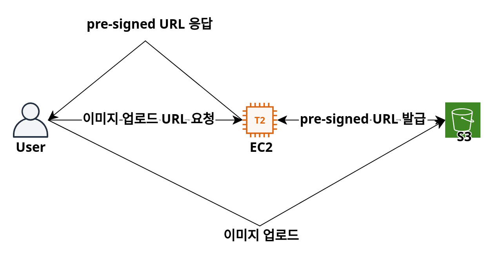
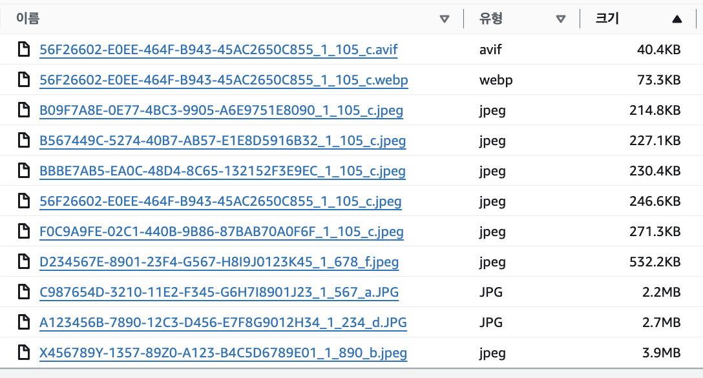
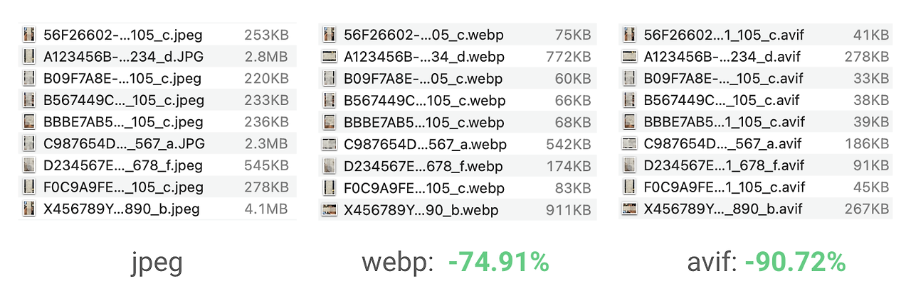
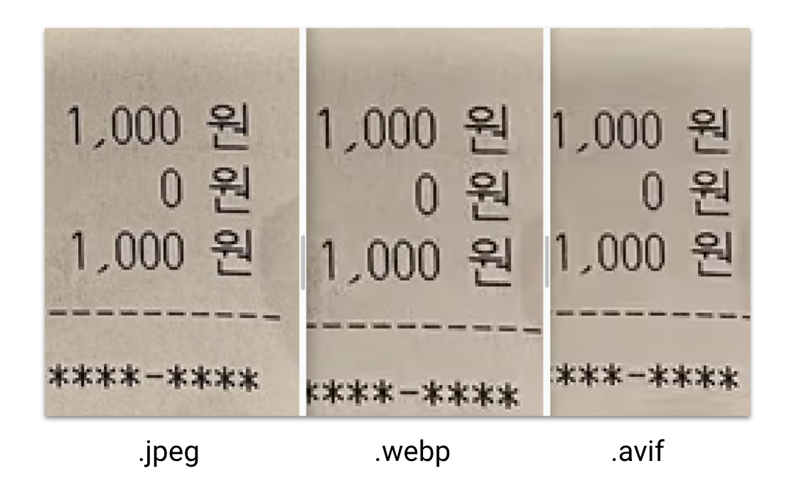
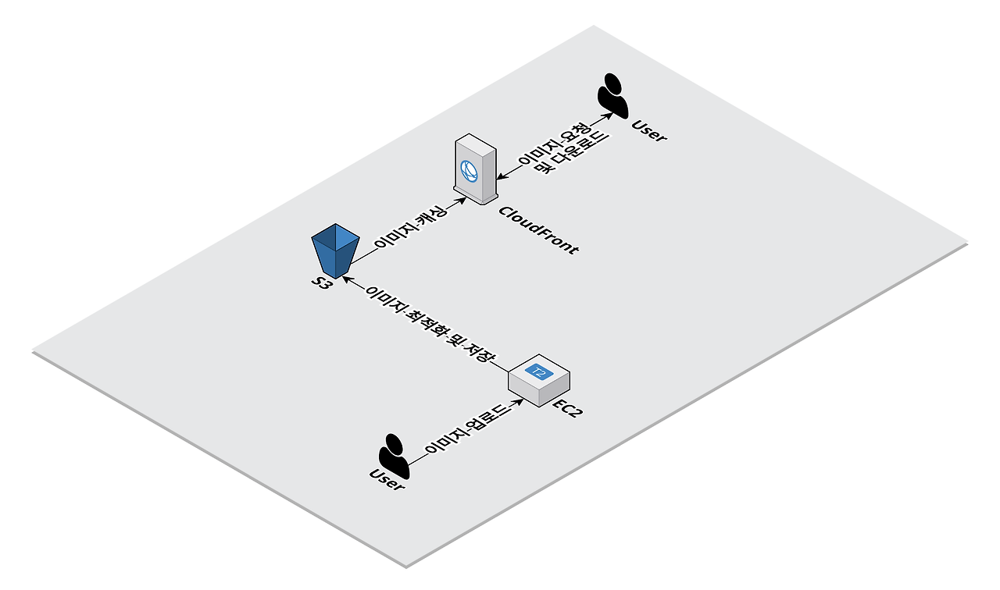
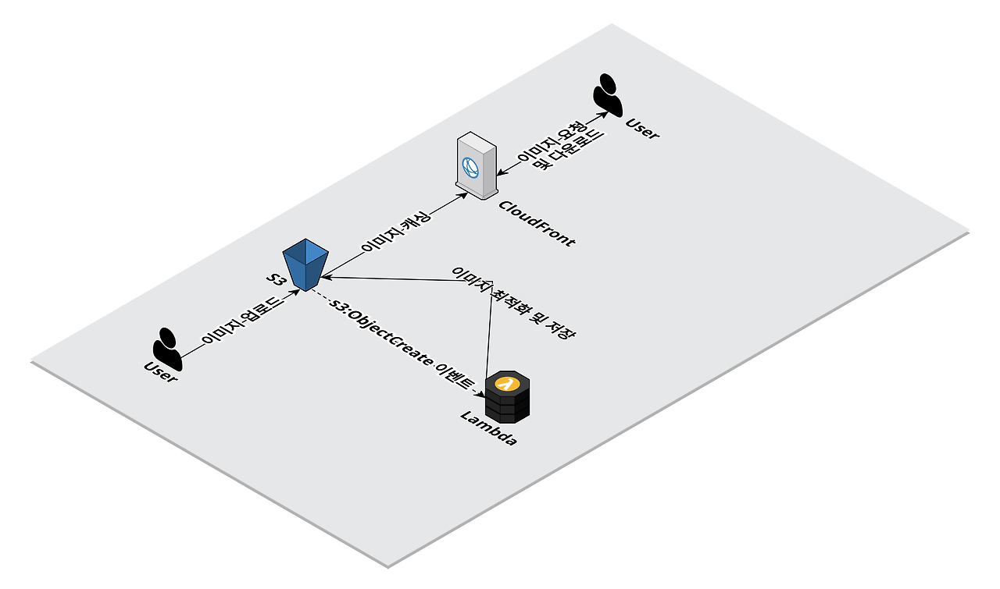
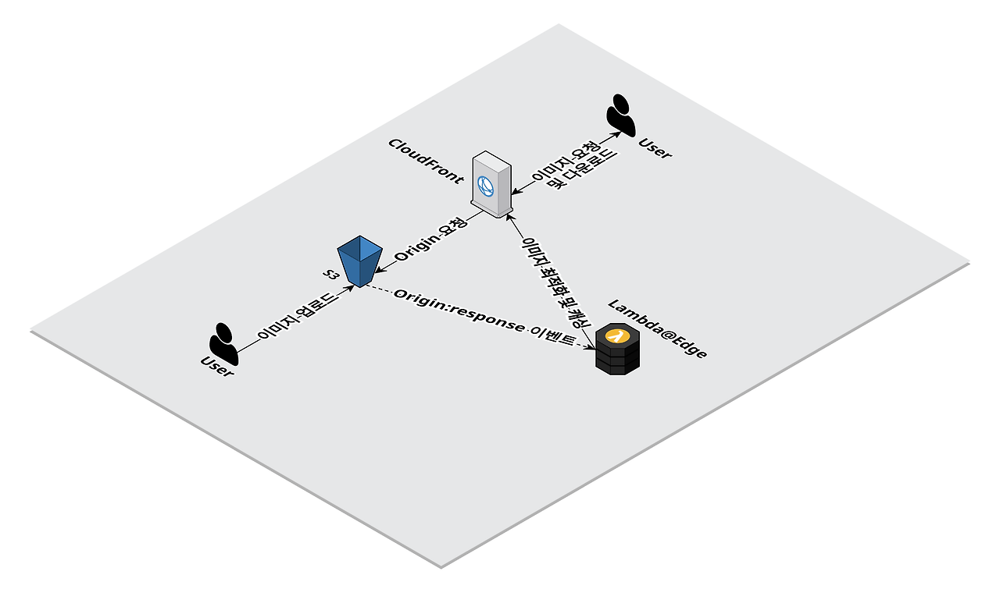

# 영수증 이미지 최적화 방법과 여러 구현 방식

## 배경

행동대장 서비스에 영수증을 첨부하는 기능이 추가되었다. 정산자가 영수증을 업로드하면 참여자가 확인할 수 있고, 정산의 투명성을 보장할 수 있다. 정산자가 올린 영수증 이미지, 서버에서는 어떻게 관리되고 있을까? 이 글에서는 행동대장 팀이 영수증 이미지를 어떻게 최적화했는지 소개한다. 

## 문제 상황

영수증 첨부 기능을 만들었을 때는 사용자가 올린 영수증 이미지를 그대로 S3에 저장했다. 이미지 업로드는 S3의 pre-signed URL 방식을 사용했다. 클라이언트가 서버에 이미지를 업로드할 URL을 요구하면 서버는 S3에서 URL을 받아서 클라이언트에 전달한다. 클라이언트는 pre-signed URL로 S3에 직접 이미지를 업로드할 수 있다. 

클라이언트가 영수증 이미지를 요청하면 CloudFront를 통해 S3 버킷에 저장된 영수증 이미지를 받을 수 있다. 사용자가 업로드한 이미지 파일 그대로 저장하고 응답했다. S3 버킷 내부를 보면 사용자가 업로드한 영수증이 그대로 저장되어 있다. 

이렇게 이미지를 관리하면 두 가지 문제가 발생할 수 있다. 먼저, png, jpeg와 같이 용량이 큰 포맷의 파일을 사용자에게 전달한다. 용량이 큰 이미지를 응답할 경우 어떤 문제가 있을까? 행동대장 서비스의 정책으로 업로드할 수 있는 이미지 크기 제한은 5mb이고, 한 행사에 최대 10개의 이미지를 첨부할 수 있다. 행사에 포함된 전체 이미지 크기 최대 50mb이고 사용자가 영수증을 조회할 때마다 50mb의 트래픽이 발생한다. [여러 번 테스트한 결과](https://3juhwan.tistory.com/44), 50mb 이미지를 다운로드하는 데에 평균 1000ms가 걸린다. 물론 한 번 조회하면 브라우저에 캐시되지만 50mb가 네트워크를 통해 전송되는 건 불필요한 네트워크 비용을 발생하고 대역폭을 낭비한다. 

이 문제를 해결하는 간단하면서 효과적인 방법은 저용량 이미지 포맷을 변경하는 것이다. 현재 사용자가 업로드하는 이미지의 대부분은 png와 jpeg이다. 이것을 저용량, 고효율 포맷인 webp와 avif로 변경해 보자. 

jpeg를 webp로 변경하면 용량이 74.91% 감소했고, avif로 변경하면 90.72% 감소했다. 또한, 이미지 해상되는 사람이 체감하기 어려운 정도의 변화가 있었다. 이런 이유로 행동대장 팀은 사용자가 업로드한 영수증 이미지를 avif 포맷으로 변경하여 제공하기로 결정했다. 

또 다른 문제는 큰 사이즈의 원본 이미지를 응답하는 것이다. UI에 따라 필요한 이미지 사이즈는 다르다. 똑같은 이미지도 배경 이미지로 쓸 때가 있고, 썸네일 이미지로 쓸 때가 있다. 다른 상황에 동일한 사이즈의 이미지를 전송하는 것은 네트워크 낭비로 이어질 수 있다. 사용자가 업로드하는 이미지의 크기는 다양하다. 업로드하는 이미지의 대부분은 모바일로 촬영되는데, 설정에 따라 이미지의 해상도는 제각각이다.

이 문제는 이미지를 리사이징해서 해결할 수 있다. 행동대장 서비스 사용자의 99%는 모바일로 접속한다. 모바일 UI에 필요한 이미지의 최대 가로폭은 600px로 결정했고, 이에 맞춰 리사이징하기로 했다. 

## 해결 방법

- 이미지를 avif 포맷으로 변환해서 전송하기
- 이미지 가로폭 최대를 600px로 리사이징해서 전송하기
 

## 언제, 어디에서 최적화할까? 

위의 두 가지 문제를 해결하기 위해선 사용자가 업로드한 이미지를 후처리하는 작업이 필요하다. 언제, 어디에서 하는 게 좋을까? 행동대장 팀은 다음 3가지 방식으로 고민했다. 

- 이미지 업로드와 최적화 작업하는 별도의 작업 서버 구성
- 이미지를 업로드한 직후 최적화 작업 진행
- 이미지를 요청한 시점에 최적화 작업 진행
 
## 이미지 업로드와 최적화 작업하는 별도의 작업 서버 구성

 

이미지를 업로드하고 최적화하는 별도의 작업 서버를 구성하는 방법이다. 이미지 업로드와 최적화하는 과정은 다음과 같다. 

1. 사용자가 작업 서버에 이미지를 전송한다. 
2. 작업 서버에서 이미지를 최적화한다. 
3. 최적화한 사본 이미지를 S3에 업로드한다. 
4. 사용자가 CloudFront에 이미지를 요청한다. 
5. CloudFront는 S3에 저장된 이미지를 응답한다.  

이 방법은 영수증 업로드를 구현하던 초기에 논의됐다. 이 방법대로 구현하기 위해서 서버에서 이미지를 직접 받아서 업로드해야 한다. 이 업로드 방식은 SpringBoot를 이용한 Multipart 업로드와 Stream을 이용하는 방법이 있는데, 각 방식의 단점으로 인해 행동대장 팀은 pre-signed URL 방식을 선택했다. 업로드 방식의 차이로 이 최적화 방법은 사용하기 어렵다. 

더 큰 문제는 비용이다. 이 방식에서는 이미지를 최적화하고 업로드하는 서버를 구현해야 한다. 장애가 발생했을 때의 재시도와 롤백도 고려해야 한다. 서버를 지속적으로 유지보수해야 하는 것도 큰 비용이다. 

행동대장 팀은 현재 이미지 업로드 방식과 잘 맞고 비용이 적게 드는 방식을 택하고 싶었고, 이 방식을 포기했다. 

## 이미지를 업로드한 직후 최적화

다음은 이미지를 업로드한 직후 최적화하는 방식이다. 이미지 업로드와 최적화하는 과정은 다음과 같다. 

1. 사용자가 S3에 이미지를 업로드한다. pre-signed URL 방식을 사용한다. 
2. S3에 이미지가 생성된 이벤트가 발생하고, 이것을 트리거로 Lambda 함수를 실행한다. 
3. Lambda 함수는 이미지를 최적화해서 S3에 사본을 저장한다. 
4. 사용자가 CloudFront에 이미지를 요청한다. 
5. CloudFront는 S3에서 이미지를 가져와서 응답하고 캐싱한다.  

이 방식은 Lambda를 이용한 서버리스로 관리할 별도의 서버가 필요하지 않다. 이미지를 최적화하는 스크립트만 간단하게 작성하면 끝이다. 구현할 서버가 없고, 관리할 서버가 없어서 비용이 크게 절감할 수 있다. 조심할 점은, 원본과 사본의 저장 위치가 구분되어야 한다는 점이다. 만약, 원본 이미지에 사본을 덮어쓴다면 트리거가 무한 루프를 돌며 무수히 많은 이미지를 생성한다. 

단점도 있다. 사용자가 이미지를 요청하는 시점에 이미지가 없을 수 있다. 행사 정산자가 이미지를 업로드하고 최적화 작업을 진행하는 중에 참여자가 이미지를 조회하면 404 Not Found를 응답 받는다. 또한 사본 이미지가 S3 버킷에 저장되어 버킷 크기가 증가하는 문제가 있다. 이 방식은 모든 원본 영수증에 대해 사본을 만드는데, 만약 UI 정책 변경으로 인해 다른 사이즈의 이미지가 필요한 경우 버킷에 저장되어 있는 모든 원본 이미지에 대해 사본을 생성해야 한다. 

행동대장 팀은 위의 문제를 해결할 방법으로 세 번째 방식을 고려했다. 

## 이미지를 요청한 시점에 최적화 작업 진행

 

다음은 사용자가 이미지를 요청하는 시점에 최적화하는 방식이다. 이미지 업로드와 최적화하는 과정은 다음과 같다. 

1. 사용자가 S3에 이미지를 업로드한다. pre-signed URL 방식을 사용한다. 
2. 사용자가 CloudFront에 이미지를 요청한다. 
3. CloudFront는 S3에 원본 이미지를 요청하고, S3는 원본 이미지를 응답한다. 
4. S3가 원본 이미지를 응답하는 이벤트를 트리거로 Lambda@Edge가 동작한다. 
5. Lambda@Edge는 응답을 가로채서 이미지를 최적화하고 CloudFront에 전달한다. 
6. CloudFront는 응답을 캐싱하고 사용자에 전달한다. 

이 방법은 사용자가 이미지를 요청하면 즉시 최적화를 진행하는 방식으로 on-demand 또는 on the fly라고도 불린다. 다른 방법과 다르게 이미지 사본을 저장하지 않는다. S3에 원본 이미지만 저장한다는 장점이 있고, 사용자의 요청이 들어온 시점에 바로 처리하기에 별 다른 오류가 없다면 사용자의 요청에 항상 응답할 수 있다. 

단점도 존재하는데, 처음 이미지를 요청하는 사용자는 느린 응답을 받는다. 캐싱이 되기 전에 여러 번 최적화 작업이 진행되기도 한다. 이미지를 처음 요청에 lambda@Edge에서 최적화 작업이 진행되는데, 작업이 끝나고 캐싱되기 전에 다른 사용자가 동일한 이미지를 요청할 수 있기 때문이다. UI의 변경으로 이미지를 다른 사이즈로 변경해야 하면 어떻게 될까? CloudFront의 모든 캐시는 쓸모 없게 되고 대규모 캐시 미스가 발생한다. 사용자의 모든 요청은 최적화 작업이 필요하고 높은 부하로 인해 이미지 변환에 실패할 수 있다. 

## 정리

| 방식           | 별도의 작업 서버                                                                                                                                       | 이미지 업로드 시점에 최적화                                                           | 이미지 요청 시점에 최적화                                                                                                   |
| -------------- | ------------------------------------------------------------------------------------------------------------------------------------------------------ | ------------------------------------------------------------------------------------- | ---------------------------------------------------------------------------------------------------------------------------- |
| **장점**       | - 단순한 구조                                                                                                                                          | - 서버리스                                                                            | - 이미지 요청 시점에 항상 사본이 존재함 - 사본 이미지를 저장하지 않음                                                    |
| **단점**       | - pre-signed URL 업로드 불가 - 서버 구현과 관리 비용이 큼                                                                                           | - 이미지 요청 시점에 사본이 생성되지 않을 수 있음 - 모든 이미지의 사본을 저장해야 함 | - 첫 요청의 응답 시간이 긂 - 캐싱되기 전에는 최적화 작업이 여러 번 실행됨 - 이미지 요구사항이 변경되면 대규모 캐시 미스 발생 |
 

## 행동대장 팀의 선택

2번째 방식인 업로드한 시점에 바로 최적화하여 최적화된 사본을 생성하고 응답하기로 했다. 앞서 설명한 것처럼 별도의 서버를 구축하는 것은 너무 큰 비용이 든다. pre-signed URL 방식을 선택할 수도 없기에 초기에 배제되었다. 이미지를 요청한 시점에 최적화하는 방식은 매력적으로 보였지만, 현재 서비스의 상황에서는 단점이 두드러졌다. 사용자가 정말 많은 서비스라면 S3에 수많은 사본을 저장하는 것보다 CloudFront에 캐싱하는 것이 비용 측면에서 유리하다. 지금 행동대장 서비스는 사용자가 많지 않기에 이 방식을 도입하면 캐시로 얻는 이점보다 응답 지연 시간이 증가하는 것이 훨씬 치명적이다. 

## 참고 자료
[[우아한 기술 블로그] Spring Boot에서 S3에 파일을 업로드하는 세 가지 방법](https://techblog.woowahan.com/11392/)  
[[Geek News] avif는 웹이미지의 미래다.](https://news.hada.io/topic?id=13927)  
[[INFCON 2024] 인프런 아키텍처](https://www.inflearn.com/course/%EC%9D%B8%ED%94%84%EC%BD%982024-%EB%8B%A4%EC%8B%9C%EB%B3%B4%EA%B8%B0)  
[[당근마켓 기술 블로그] AWS Lambda@Edge에서 실시간 이미지 리사이즈 & WebP 형식으로 변환](https://medium.com/daangn/lambda-edge%EB%A1%9C-%EA%B5%AC%ED%98%84%ED%95%98%EB%8A%94-on-the-fly-%EC%9D%B4%EB%AF%B8%EC%A7%80-%EB%A6%AC%EC%82%AC%EC%9D%B4%EC%A7%95-f4e5052d49f3)  
[[당근마켓 블로그] AWS Lambda를 이용한 이미지 썸네일 생성 개발 후기](https://medium.com/daangn/aws-lambda%EB%A5%BC-%EC%9D%B4%EC%9A%A9%ED%95%9C-%EC%9D%B4%EB%AF%B8%EC%A7%80-%EC%8D%B8%EB%84%A4%EC%9D%BC-%EC%83%9D%EC%84%B1-%EA%B0%9C%EB%B0%9C-%ED%9B%84%EA%B8%B0-acc278d49980)  

