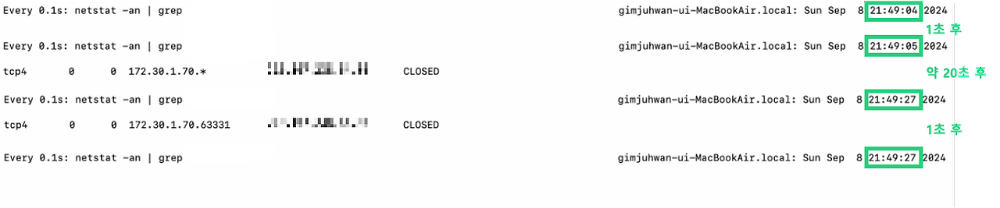
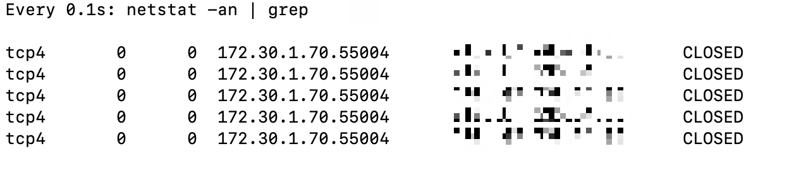
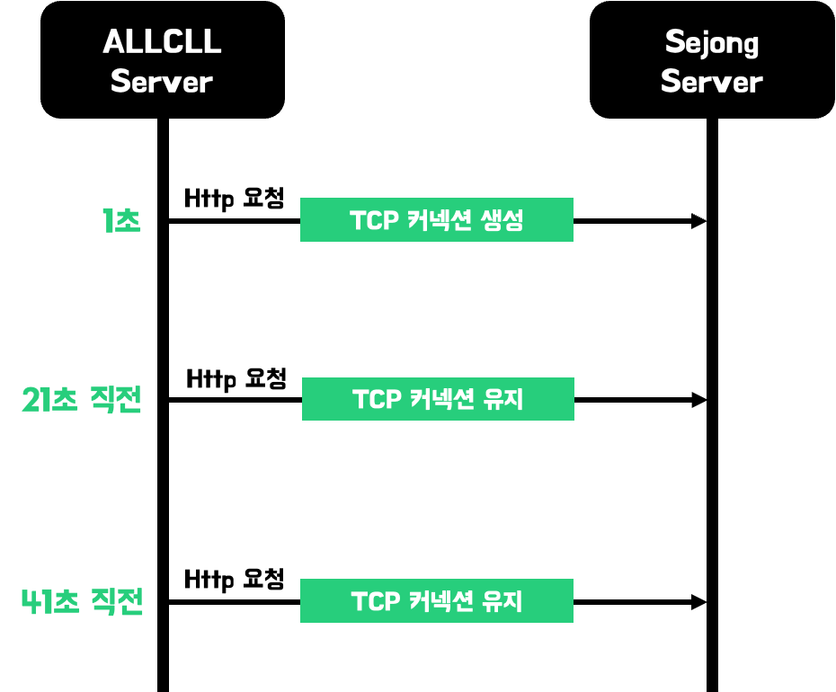
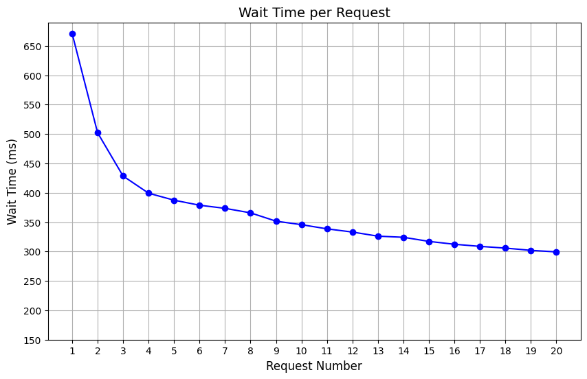
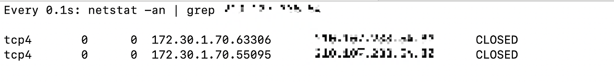
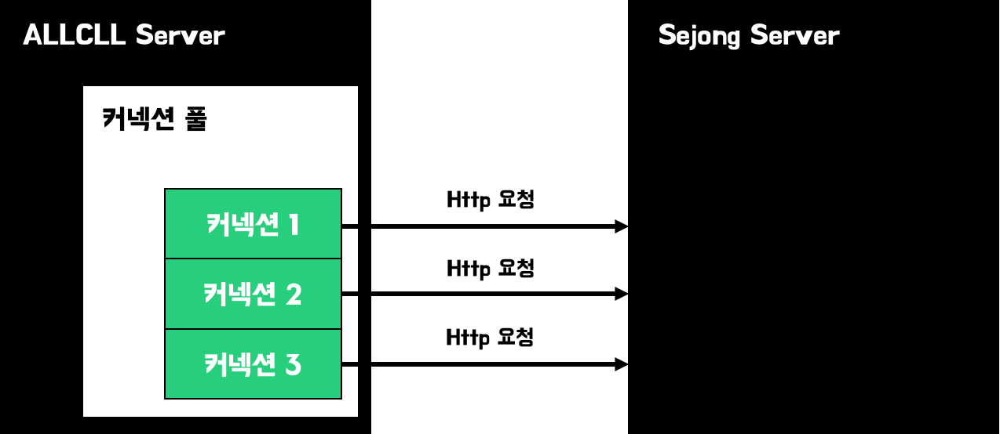
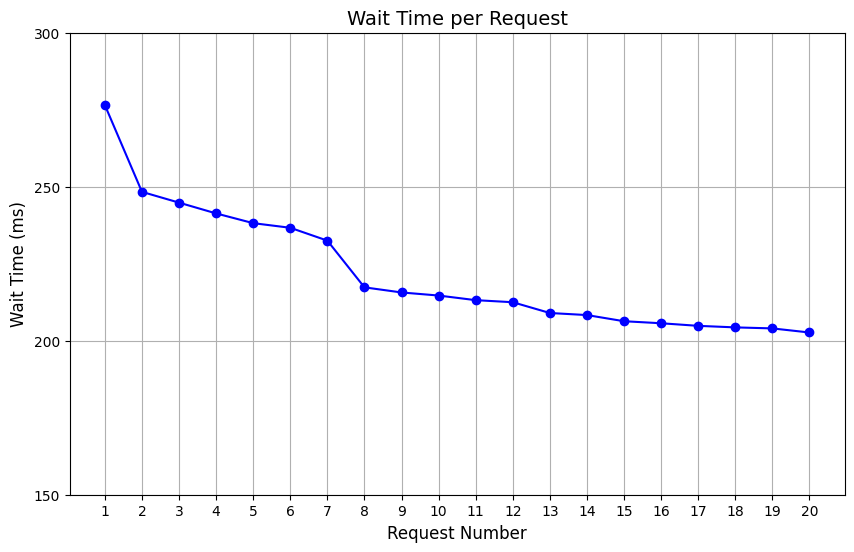
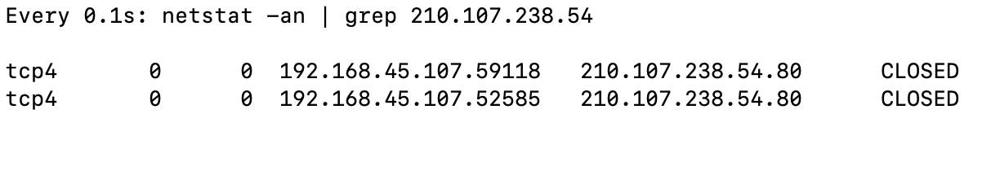

# 서비스 진입점으로의 첫 번째 요청이 지연되는 문제와 해결하기

서비스의 진입점은 사용자 요청의 시작점을 의미한다. 진입점에서 응답 속도가 느리면 사용자 경험에 부정적인 영향을 미칠 수 있다. 예시로, 로그인 페이지의 응답이 느리거나 페이지 로딩 시간이 길어지면, 사용자는 불편을 느끼고 서비스 이탈할 가능성이 높아진다. 실제로 개인 프로젝트인 '올클' 서비스를 운영하면서 비슷한 문제를 겪었고, 이를 해결한 방법을 이 글에서 다루고자 한다.

## 로그인 API 응답이 지연되는 문제

### 문제 상황

올클 서비스의 진입점은 로그인 API다. 종종 운영 중인 서비스에 로그인하면 평균 3초를 기다리는 상황이 발생했다. 특히, 서버 배포하거나 일정 시간 동안 사용자가 없었던 유휴 상태에서의 첫 번째 요청에서만 이 현상이 발생했다. 3초의 시간을 기다리는 동안 머릿 속에 여러 생각이 들었다. '서버가 꺼졌나?', 'DB에 문제가 생겼나?' 개발자인 나조차 문제가 생긴 게 아닌지 의심하게 된다. 이러한 로그인 API의 첫 응답 속도를 다른 API처럼 빠르게 개선하여, 사용자들이 불편함을 느끼지 않도록 하자. 

### 로그인 API 응답 속도 측정

테스트하기 쉬운 로컬에서 서버를 실행하고, 로그인 API를 반복 호출하며 응답 시간을 측정했다. 로컬은 MacBook Air M2 8GB RAM 환경이고, 측정은 cURL 명령어를 사용했다. 

| 순서 | 첫 번째 요청 응답 시간 (ms) | 두 번째 요청 응답 시간 (ms) |
|------|------------------------------|------------------------------|
| 1    | 1303                         | 572                          |
| 2    | 1291                         | 484                          |
| 3    | 1323                         | 529                          |
| 4    | 1317                         | 587                          |
| 5    | 1427                         | 528                          |

위 결과에서 볼 수 있듯이 평균적으로 **첫 번째 요청이 두 번째 요청에 비해 2.5배 느리다.** 첫 번째 요청과 두 번째 요청 간의 분명한 차이를 확인할 수 있다. 

### 로그인 API의 내부 동작 

로그인 API는 사용자의 학번과 비밀번호로 인증하는데, 이 과정에 외부 API인 세종대학교 서버에 요청을 보내는 로직이 포함되어 있다. 

### 병목 찾기

병목 현상의 원인을 분석하기 위해서는 서버의 모든 리소스를 종합적으로 살피는 것이 일반적이다. CPU 사용률, 메모리 사용률, 트래픽 상태, 커넥션 수, DB 트래픽 등을 분석해야 한다. 그러나 이 문제는 사용자가 매우 적은 시기에 발생했고, 서버 리소스보다는 애플리케이션 문제로 추측했다. 실제 모니터링 결과, 당시 CPU 사용률은 평균 13%, 메모리 사용률은 60% 이하로 유지되었으며, 트래픽도 거의 없어 대부분의 리소스는 여유가 있었다. 이를 통해 애플리케이션의 문제일 가능성이 더욱 커졌다.

유휴 상태의 서버가 첫 번째 요청을 처리하는 게 느린 이유로 두 가지를 추측했다. 

- JVM Warm-up으로 인한 지연
- TCP 커넥션으로 인한 지연

이를 테스트하여 실제로 문제를 일으킨 원인인지 확인하고, 적절한 해결책을 적용하여 지연 시간을 줄여보자. 

## 원인1: JVM을 Warm Up으로 인한 지연

### JVM Warm Up이란?

JVM warm up은 Java 애플리케이션의 초기 실행 시 발생할 수 있는 성능 저하를 방지하고, 전반적인 성능을 최적화하기 위한 과정이다. 애플리케이션이 처음 구동될 때, API 호출에 필요한 클래스들이 로드되지 않은 상태이다. JVM의 Lazy Loading으로 첫 번째 호출에서 지연이 발생한다. JVM Warm Up은 필요한 클래스들을 미리 로드하여 초기 API 호출 시 응답 시간을 개선할 수 있다. 또한, JVM은 실행 초기에 Just-In-Time (JIT) 컴파일러를 사용해 자주 사용되는 코드들을 바이트코드에서 네이티브 코드로 변환한다. 애플리케이션 초기 실행 시, JIT 컴파일러가 네이티브 코드를 캐싱하지 못해 성능이 최적화되지 않은 상태로 시작될 수 있다. Warm Up 과정은 이러한 초기 성능 저하를 최소화하고 애플리케이션의 전반적인 실행 속도를 높인다. 

### JVM Warm Up하고 응답 속도 테스트

JVM warm up을 통해, 진입점 응답 지연 문제를 해결할 수 있는 두 가지 방법은 다음과 같다. 

- 로그인 API에 필요한 클래스를 미리 메모리에 로드하도록 유도하는 방법
- JIT 컴파일러가 로그인 API에 필요한 코드를 캐싱하도록 유도하는 방법

현재 상황에서는 첫 번째 방법이 더 적합하다. JIT 컴파일러가 코드를 캐시에 저장하게 하려면 로그인 관련 코드를 기본 임계값인 1500회 이상 호출해야 하는데, 이러한 호출이 오히려 불필요한 외부 API 호출을 초래한다. JIT 컴파일러 코드 캐싱으로 얻는 이점보다 외부 API 1500회의 비용이 더 크다. 반면에 클래스 로딩은 한 번의 메서드 또는 API 호출로 완료되므로 더 효율적이다.

그럼, 어떤 클래스를 미리 로딩하는 것이 좋을까? 서버가 로그인 API를 직접 호출하여 end-to-end 로직을 수행하면, 로그인 서비스와 관련된 클래스들이 모두 로딩될 수 있다. 하지만 로컬 네트워크를 타기에 오버헤드가 발생하여 오히려 응답 시간이 늦어질 수도 있겠단 생각이 들었다. 

로그인 로직 전체가 아닌 일부만 로딩하는 방법은 어떨까? 예를 들어, RestTemplate을 사용하여 외부 API 호출 관련 클래스를 로딩하는 방법이 있다. 

본인 서버의 로그인 API에 직접 요청을 보내거나 RestTemplate을 사용하여 세종대학교 API를 호출하는 방식으로 실제 응답 시간을 테스트해보자. 클래스 로딩은 ApplicationRunner를 활용하여 수행할 수 있다. 

로컬 환경에서 5회 측정한 결과는 다음과 같다. 표는 서버 재실행 후 {첫 번째 요청 응답 시간} → {두 번째 요청 응답 시간}을 나타낸다. 

| 순서 | Warm Up 하지 않은 경우 | RestTemplate으로 외부 API만을 호출 | 자신의 로그인 API를 호출 |
|------|------------------------|-----------------------------------|--------------------------|
| 1    | 1991 ms → 434 ms      | 606 ms → 319 ms                   | 779 ms → 661 ms          |
| 2    | 1761 ms → 300 ms      | 694 ms → 422 ms                   | 998 ms → 142 ms          |
| 3    | 1711 ms → 557 ms      | 386 ms → 192 ms                   | 587 ms → 232 ms          |
| 4    | 2306 ms → 344 ms      | 382 ms → 162 ms                   | 736 ms → 484 ms          |
| 5    | 1510 ms → 283 ms      | 694 ms → 300 ms                   | 420 ms → 379 ms          |

웜업을 하지 않았을 때와 비교하여 **첫 요청의 응답 시간이 약 3배 정도 단축된 것을 확인할 수 있다.** 자신의 로그인 API를 호출하는 방법과 RestTemplate으로 외부 API만을 호출하는 방법 중 확연히 차이가 보이지 않는다. 두 방법 중 하나만 선택하면 될 것 같다. 

Warm Up을 적용한 경우, 첫 번째와 두 번째 요청의 응답 시간 차이가 줄어들긴 했지만, 여전히 **첫 번째 요청과 두 번째 요청 사이에 응답 시간은 평균 2배의 차이가 있다.** Warm Up을 적용한 상태에서 또 다른 원인을 분석하고 응답 시간을 줄여보자. 

## 원인2: TCP 커넥션으로 인한 지연

JVM warm up을 적용했음에도 불구하고 첫 번째 요청과 이후 요청 사이에 응답 속도는 분명한 차이가 있다. RestTemplate으로 외부 API만 호출했을 때에도 응답 지연 문제는 여전했다. 이로 인해 올클 서버와 세종대학교 서버 간의 TCP 커넥션 문제를 의심하게 되었다. 

### 현재 외부 API 호출 커넥션 관리

현재는 서버에서 외부 API를 호출할 때, 특별한 설정을 하지 않은 상태이다. 올클 서버에서 세종대학교 서버 사이의 TCP 커넥션은 어떻게 관리될까? 올클 서버는 Spring RestTemplate 클라이언트를 사용하여 세종대학교 API를 호출하고 있으며, HttpClient의 기본 설정에 따라 커넥션이 관리된다. 

TCP 커넥션이 20초 후에 끊기는 것은 `netstat` 명령어를 통해 로컬의 TCP 커넥션 상태를 모니터링하여 직접 확인할 수 있다. 약 20초 후에 TCP 커넥션이 사라지며, 20초 안에 새로운 요청이 발생하면 TCP 커넥션은 추가로 20초 동안 연결을 유지한다. 즉, 20초 안에 요청이 들어오면 커넥션이 갱신되는 형태이다. 또한, 하나의 요청에 대해 1개의 커넥션만 생성되는 것으로 보인다. 

만약 사용자가 몰려서 동시에 여러 요청이 발생하면 커넥션은 어떻게 관리될까? 이를 확인하기 위해 Apache Bench를 사용하여 5개의 동시 요청을 반복하는 테스트를 진행했다.

동시 요청 수만큼 외부 서버와 커넥션을 맺는 것을 확인할 수 있다. 이는 문제가 될 수 있는데, 많은 커넥션 생성과 요청은 외부 API 서버에 DDos 공격을 초래할 수 있으며, 커넥션의 TIME_WAIT 문제가 발생할 수 있다. 따라서, 외부 서버와 소통하는 커넥션을 잘 관리하는 것이 중요하다. 

### TCP 커넥션을 재사용하자

웹 애플리케이션에서 요청을 보내고 응답을 받기까지 대부분의 시간은 네트워크에서 발생하며, 이 네트워크 시간의 대부분은 TCP 연결에서 발생한다. TCP 커넥션을 재사용할 경우 여러 장점이 있다. 대표적으로 커넥션을 맺는 시간이 단축된다. 또한, TCP는 slow start라는 특징이 있어 처음에는 요청을 조금씩 처리하다가, 한 커넥션에서 요청이 반복될수록 더 많은 요청을 처리하도록 설계되어 있다. 따라서 커넥션을 재사용할수록 지연 시간을 대폭 줄일 수 있다. 

외부 서버와의 커넥션을 재사용하기 위해 다음 두 가지 방법을 고려했다. 

- 커넥션의 생명 주기인 20초 안에 외부 API를 재호출하는 방법
- 커넥션 풀을 사용하여 커넥션을 관리하는 방법

두 방법의 응답 시간을 테스트해보자. 테스트는 실제 상황과 유사하게 진행할 예정이다. 지난 수강신청 기간 동안 올클 서비스에 초당 2~3명이 로그인하였으므로, 로그인 API의 TPS(초당 처리 요청 수)는 2TPS이다.

### 새로운 커넥션을 생성하는 방식의 응답 시간 테스트

위에서 언급한 것처럼 HttpClient의 커넥션 유지 시간은 20초이고 그 안에 새로운 요청을 보내서 커넥션을 갱신할 수 있다. 커넥션을 유지하기 위해 20초마다 외부 API를 요청하면 커넥션을 유지할 수 있다. 

Apache Bench를 사용하여 동시에 2개의 요청을 30초 동안 발생시켜 응답 시간을 테스트해보자. 테스트는 로컬 서버에서 진행되므로, 클라이언트와 올클 서버 간의 네트워크 지연 시간은 거의 0에 가까워진다. 따라서, 올클 서버와 세종대학교 서버 간의 네트워크 지연 시간은 응답 시간 테스트에 영향을 미치지 않는다. 

10번 테스트한 결과는 다음과 같다. 첫 번째 요청은 평균 671ms가 소요되었고, 이후 요청들은 차례로 502ms, 428ms, 399ms로 응답 시간이 점차 줄어드는 것을 확인할 수 있다. 응답 시간은 3번째 요청까지 가파르게 감소하며, 이후에는 비슷한 기울기로 감소하는 경향을 보인다. 첫 번째 요청의 평균 응답 시간이 두 번째 요청보다 1.3배 밖에 더 걸리지 않았다. 기존에 2.5배에 비하면 큰 폭으로 차이가 감소했다. 

또한, 2개의 동시 요청으로 테스트를 진행했기에 2개의 TCP 커넥션만 생성되었다가 삭제되는 걸 확인할 수 있다. 

이 방식은 첫 요청의 응답이 매우 느리다는 단점이 있다. 이를 해결하기 위해, 앞서 설명한 Warm-up을 통해 미리 커넥션을 생성할 수 있지만, 이 방법의 더 큰 문제는 20초마다 불필요한 외부 API 호출이 발생한다는 점이다. 사용자가 적은 유휴 기간에도 계속해서 요청이 발생하게 된다. 또한, 동시 요청에 따른 커넥션 생성 개수를 제한할 수 없어 DDoS를 유발할 수 있는 한계가 있다.

### 커넥션 풀을 사용하는 방식의 응답 시간 테스트

다른 방법으로는 커넥션 풀을 사용하여 커넥션을 관리하는 것이 있다. 이 방식은 커넥션 유지를 위해 일정 주기마다 재요청을 보낼 필요가 없으며, 커넥션 수를 적절히 관리할 수 있어 DDoS 문제를 방지할 수 있다. 또한, Warm-Up을 통해 커넥션 풀을 미리 생성하면 여러 이점을 누릴 수 있다. 

커넥션 풀로 관리할 때, 지연 시간을 테스트해 보자. 이전과 동일하게 Apache Bench를 사용하여 동시에 2개의 요청을 30초 동안 발생시켰다. Warm-Up으로 관련 클래스 및 커넥션 풀에 2개의 커넥션이 생성된 상태에서 테스트를 진행했다.  

10번 테스트한 결과는 다음과 같다. 첫 번째 요청은 평균 281ms가 소요되었고, 이후 요청들은 응답 시간이 점차 줄어드는 것을 확인할 수 있다. 이전 방식에 비해 첫 번째 요청과 두 번째 요청 간의 응답 시간이 눈에 띄게 감소했다. 평균 응답 시간이 첫 번째 요청의 281ms에서 두 번째 요청의 247ms로 응답 시간이 1.1배의 차이로 감소했다. 

또한, 커넥션 풀에 TCP 커넥션이 2개 유지되는 것을 확인할 수 있다. 설정한 대로 20초가 지나도 풀의 커넥션은 유지된다. 

## 정리

서버 배포 시 또는 서버 유휴 상태에서 첫 번째 요청과 두 번째 요청 사이에 약 2.5배 이상의 응답 시간 차이가 발생했다. 이 차이를 줄여서 첫 번째와 두 번째 요청 사이의 응답 시간을 비슷하게 만들고자 했다. JVM Warm-Up을 통해 응답 시간 차이를 2배로 줄일 수 있었으나, 이로는 충분하지 않았다. 따라서 TCP 커넥션 재사용과 커넥션 풀을 도입하여 응답 시간 차이를 1.1배로 추가로 줄일 수 있었다.

