# 스레드풀과 커넥션풀 관리하기

> 우아한테크코스 7기 BE 모다 🌱

스프링부트 개발자라면 톰캣 스레드풀과 HikariCP  톰캣이 스레드 생명주기를 적절히 관리하고 있고, hikaricp 커넥션이 커넥션의 생명주기를 적절히 관리하고 있다. 이로 인해 커넥션이나 스레드의 생성 지연 시간이 절감되고 적절한 유휴 커넥션을 유지해 자원 낭비를 줄일 수 있다.

정말 그럴까? 톰캣과 hikaricp의 기본 설정이 최상의 조건인 환경이, 과연 당신의 서버의 환경과 동일할까?

‘잘 돌아가니까 문제없겠지’ ‘웬만하면 기본값이 최선의 값이겠지’라는 믿음으로 튜닝하지 않을 수 있다. 그러나 스레드와 DB 커넥션도 쿼리 튜닝과 같다. 미리 조금씩 다듬지 않으면 나중에 트래픽이 커졌을 때 감당할 수 없을 것이다.

따라서 톰캣과 DB 커넥션 튜닝을 통해 서버의 성능을 점진적으로 개선한 경험과 팁을 공유하고자 한다.

---

### 글의 목표
- 스레드풀, 커넥션풀을 관리(튜닝)했을 때와 하지 않았을 때 어떤 성능적 차이가 있는지 직접 K6 부하테스트 지표로 보여준다.
- 내 서버의 사양, 서비스의 특성, 톰캣과 hikaricp의 커넥션 관리 방법을 종합적으로 고려해 튜닝할 수 있는 방법을 소개한다.

### 대상 독자
- Spring Tomcat Thread Pool, HicariCP Connecton Pool에 대해 이론적으로 학습해본 경험이 있지만, 실제로 실습하여 관리할 일은 없었던 스프링부트 개발자
- 지금 당장 서버가 잘 돌아가니까, ‘괜찮겠지~’ 하고 서버를 더 튜닝할 생각은 하지 않고 있는 서버 개발자

---

### 우리 서버가 어디까지 버틸 수 있는가?

튜닝을 하려면 어느지점이 개선되어야 하는지를 알아야 한다. 우리 서버의 취약점을 파악하기 위해서 우리는 부하테스트를 선택했다.

성능테스트에는 여러 목적이 있지만, 서버가 특정 수치의 부하를 견딜 수 있는지 확인할 경우 부하테스트(Load Test)를 한다. 부하 테스트를 하여 우리 서버가 동시에 처리할 수 있는 요청의 수를 확인할 수 있고, 이를 rps라고 한다. 목표 사용자수와 목표 동시접속 트래픽 수를 정할 수 있다면, 목표 rps를 정할 수 있다.

우리 팀의 경우 우테코 8기 프리코스 지원자들을 대상으로 집중 홍보할 예정이었기 때문에, 목표 총 사용자를 `3000`명으로 잡았다.

부하 테스트 도구의 경우 기존에 모니터링 인프라로 채택한 prometheus & grafana & loki를 재활용하기 위해 **K6**를 사용했다. 기존의 인프라를 사용할 수 있어 러닝커브가 낮았으며 단일 프로세스로도 초당 30만 건 이상의 요청을 보낼 수 있었다.

부하테스트에서 우리 서버의 취약점을 정의할 수 있는데, 절대적인 취약점은 없다. 실패한 요청이 될 수도 있고, 스레드풀 포화상태일 수도 있고, hikaricp 커넥션풀 타임아웃일 수도 있고, CPU 과부화가 될 수도 있다. 이중 더 중요한 것과 덜 중요한 것을 트레이드오프할 수도 있다. 부하를 조금씩 늘리면서 문제지점을 찾는다.

**우리 팀의 부하 시나리오**
- 목표치인 3000명 사용자를 고려했을 때 동시 접속자 `300`명부터 시작한다.
- 서비스에서 가장 빈번하게 조회되면서도 api 호출 횟수가 많은 메인 페이지 조회를 기준으로 테스트한다.
- 10분동안 0명에서 300명의 가상 유저가 점진적으로 서버에 진입하고, 한 명의 가상유저는 메인 페이지를 10초에 한 번씩 새로고침(재호출)한다.

아래는 K6 부하테스트 시 실행한 부하 시나리오 스크립트이다.

```javascript
import http from 'k6/http';
import { sleep, group } from 'k6';

export const options = {
    stages: [
        { duration: '10m', target: 300 }
    ]
};

export default function () {
    group('메인 페이지 진입 시 API 일괄 호출', function () {
        http.get('https://todoktodok.com/api/v1/notifications/unread/exists');
        http.get('https://todoktodok.com/api/v1/discussions/hot?period=7&count=5');
        http.get('https://todoktodok.com/api/v1/members/1/discussions?type=PARTICIPATED');
        http.get('https://todoktodok.com/api/v1/members/1/discussions?type=CREATED');
        http.get('https://todoktodok.com/api/v1/discussions/active?period=7&size=15');
        http.get('https://todoktodok.com/api/v1/discussions/hot?period=7&count=5');
        http.get('https://todoktodok.com/api/v1/members/1/discussions?type=CREATED');
        http.get('https://todoktodok.com/api/v1/members/1/discussions?type=PARTICIPATED');
        http.get('https://todoktodok.com/api/v1/discussions?size=15&cursor=');
    });
    sleep(10);
}
```

<br> 

**문제가 발생하는 부하 정도 확인하기**

300명 가상유저의 경우 테스트가 안정적으로 종료되었다.

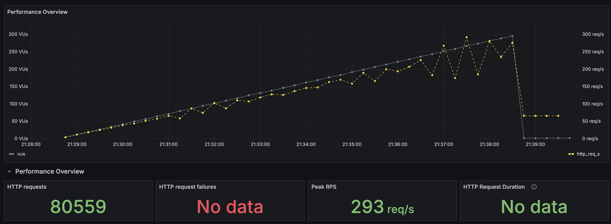
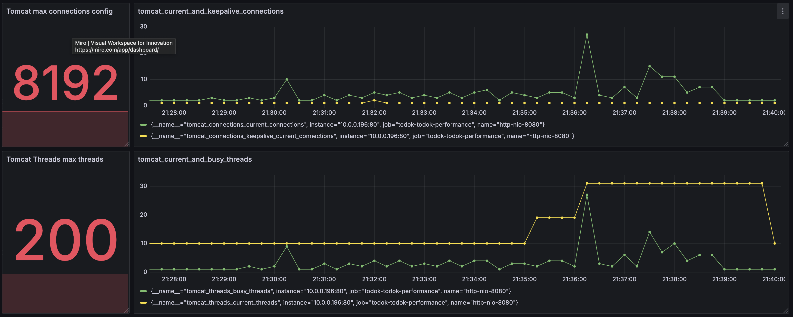
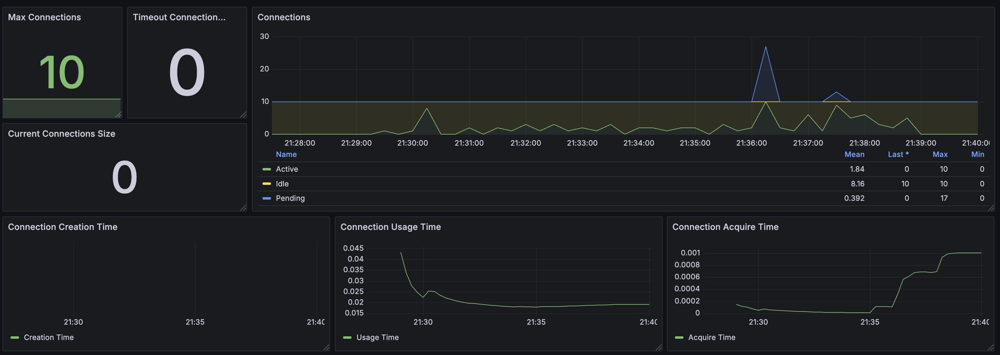
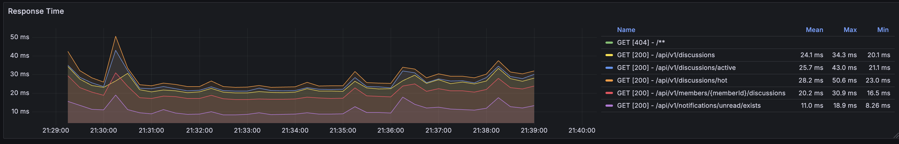
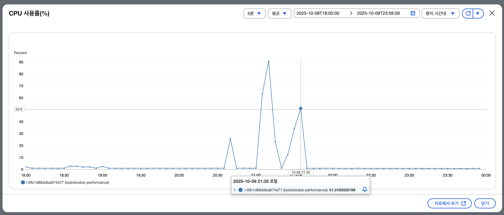

이후 점진적으로 가상유저의 수를 증가시켰다. `1000`명의 가상 유저 테스트에서부터 요청 실패 및 서버 병목이 발견되기 시작했다.

취약점을 찾은 후에는 해당 결과의 원인을 찾아낸다. 원인을 찾아내는 이유는 테스트의 결과의 신뢰성을 보장할 수 있기 때문이다. 부하테스트의 경우 스프링 설정, 서버 하드웨어, 네트워크, 테스트 시나리오 등이 약간 달라지면 크게 변화할 수 있기 때문에 정확한 원인을 찾아내면 테스트 결과에 대한 신뢰도가 올라간다.

테스트는 약 `600`명의 vus 지점에서부터 모든 요청이 실패했고, 실패 원인은 **Connection reset by peer(톰캣, Nginx 등 서버단에서 소켓을 먼저 종료시킴)** 였다. 실패한 요청이 발생하기 시작하는 시점의 공통적인 특징은 아래와 같았다.

- 톰캣 커넥션 약 250개 유지
- 톰캣 스레드풀 200(max) 유지
- HikariCP 커넥션풀 Pending(10) + Active Connection(188) = 200 유지

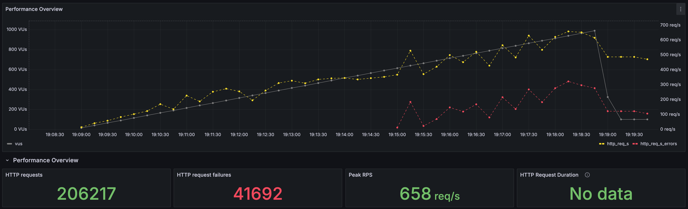
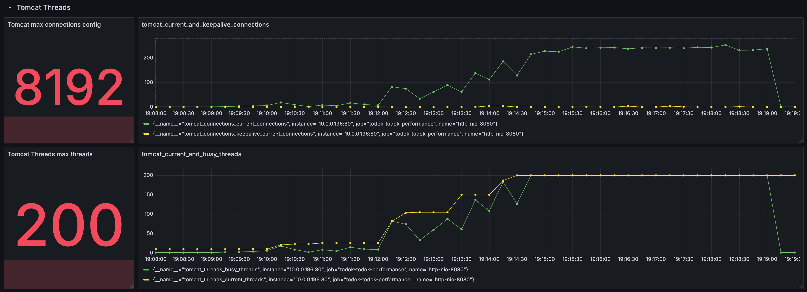
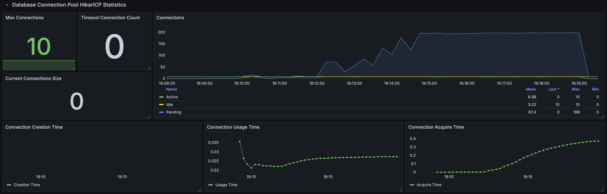
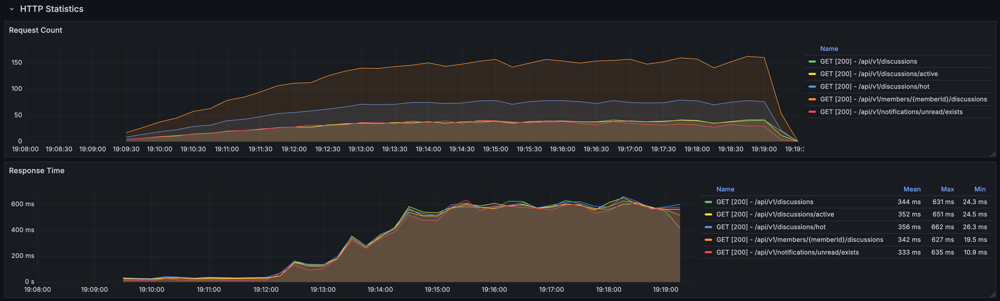

vus가 늘어나도 더이상 요청이 성공하지 않고 스레드풀, TCP커넥션, 커넥션풀이 유지된다는 것은 그 지점에서 **병목이 생겼다**는 것이다. 따라서 병목지점의 설정값을 튜닝하면 병목이 해소될 수 있다.

### 본격적인 튜닝하기

병목은 여러 지점에서 발생할 수 있고, 우리 서버에서 병목이 발생 가능한 지점 후보는 아래와 같았다.

1. Nginx 커넥션
2. Tomcat 스레드풀
3. HikariCP 커넥션풀

`Tomcat Connection`은 고려하지 않았다. max-connection 사이즈가 8192인데 Tomcat 커넥션은 최대 250개로 한참 여유있었기 때문이다.

또한 Tomcat의 스레드풀이 다 찼을 때 요청들을 대기시키는 `OS backlog`도 고려하지 않았다. 테스트 서버의 OS backlog의 포화 상태 연결의 개수를 확인했지만 아무것도 잡히지 않았다. 또한 Tomcat connection에 연결되어야만 OS backlog로 대기할 수 있는데, connection 수가 tomcat max thread 수 + tomcat acceptCount인 300을 넘지 않기 때문에 accept 큐에 병목이 생기지 않았다고 판단했다.

<br>

**1. Tomcat Thread Pool 튜닝**

가장 튜닝하기 쉬운 것은 **Tomcat 스레드풀**이었다. 이는 서버의 CPU 코어 수에 맞게

```
MaxThreads ≈ 코어 수 × (1 + (I/O 대기 시간 / CPU 사용 시간)
```

서버의 CPU 코어 수보다 훨씬 많은 수의 스레드를 설정하는 것은 오히려 성능 저하와 서비스 장애(Connection reset)를 유발한다. 이는 특히 CPU 리소스가 제한적인 우리 서버의 `t4g.small` 같은 환경에서 두드러진다.

만약 대부분의 요청이 I/O(DB 쿼리, 외부 API 호출 등)를 기다리는 I/O Bound 작업이라면 코어 수보다 약간 많게 설정할 수 있다.

우리 애플리케이션의 CPU 점유시간을 보았을 때, user 모드 또는 system 모드의 사용시간이 IO 대기 시간보다 2~4배가량 길었다.

따라서 I/O 작업의 비율이 높지 않은 환경이라 코어 수 2개를 고려해 max_thread 수를 `3`개로 잡았다.

이후 테스트를 해봤을 때 아래와 같은 메트릭이 대폭 개선되었다.

- 톰캣 busy thread 및 max thread 감소 및 안정화
- peek rps 감소
- 컨텍스트 스위칭 비용 감소
- cpu 사용량 대폭 감소 및 안정화
- system load (cpu 처리량 대비 대기 프로세스 비율) 안정화
- 응답 시간 대폭 감소 및 안정화
- DB 커넥션풀 사용 개수 감소 및 안정화

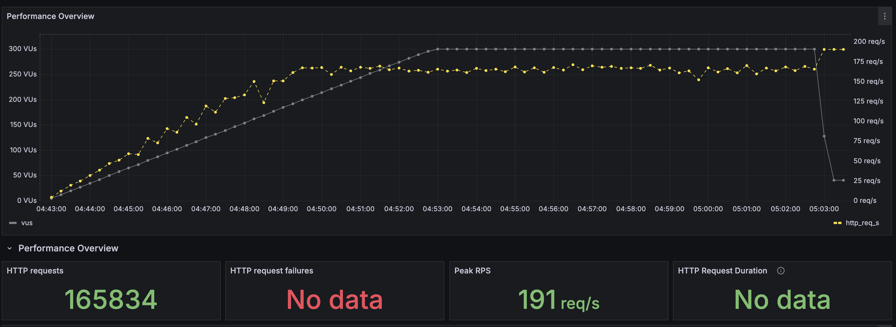

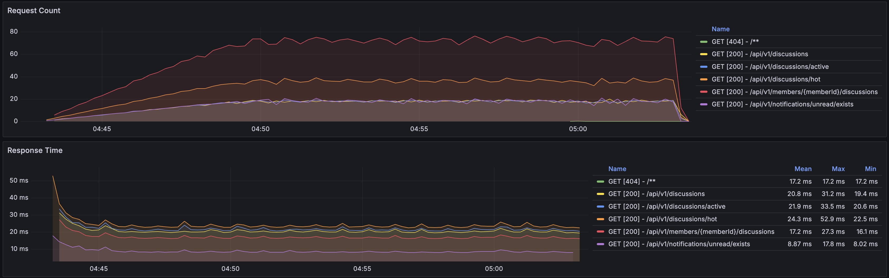
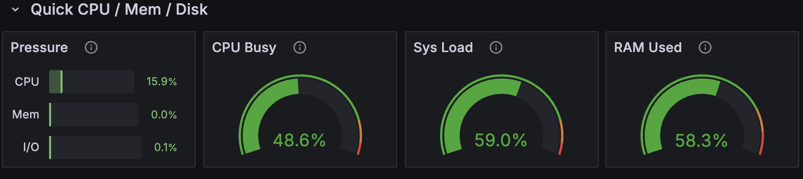

<br>

**2. HikariCP Connection Pool 튜닝**

다음으로 HikariCP 커넥션풀 크기를 튜닝했다.

일반적으로 커넥션 풀을 사용하는 애플리케이션은 데드락 가능성을 방지하기 위해 풀 사이즈의 최솟값을 아래와 같이 설정한다고 한다.

```
Pool Size = (Max_Thread 수) × ((단일 스레드가 동시에 필요한 최대 연결 수) − 1) + 1
```

그러나 우리 서버와 같은 일반적인 웹 애플리케이션은 하나의 스레드에서 보통 하나의 커넥션만 사용한다. 따라서 Tomcat의 최대 스레드수와 비슷하게 유지하여 `2`개로 설정했다. 만약 최대 커넥션풀 사이즈가 스레드풀 사이즈보다 크거나 같다면, DB 서버가 견딜 수 있는 수준을 초과할 위험이 높고, 불필요한 컨텍스트 스위칭으로 인해 오히려 성능이 저하될 수 있다.

이로 인해 아래와 같은 성능 개선이 가능했다.

- 커넥션풀 및 스레드풀 병목 해소 : Pending 커넥션 개수가 감소하여 점유 스레드를 감소시켰다
- DB 커넥션 획득 시간 감소

<br>

**3. Nginx Worker Connection 튜닝**

커넥션풀과 스레드풀을 튜닝해도 여전히 600vus의 부하를 주면 실패(Connection Reset by Peer)가 떴고, 심지어 500vus에서도 실패가 떴다.

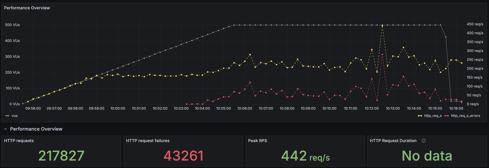

우리는 이러한 현상을 병목 지점의 범위를 넓혀야 하는 것이라고 해석했다. 우리 서버는 모든 사용자들이 Nginx로 구동되는 WAS 서버로 요청을 보내고, WAS 서버가 애플리케이션 서버로 요청을 프록시한다. 따라서 클라이언트 요청이 거치는 모든 구간의 커넥션에 병목이 없는지 확인해야 한다.

따라서 요청의 진입점인 Nginx 커넥션을 튜닝했다.

우리는 nginx를 따로 모니터링하지 않고 있어서, 임시로 로컬호스트에서 nginx의 active connections를 확인할 수 있는 엔드포인트를 열어 모니터링했다. active connections는 다음과 같이 관찰할 수 있었다.

```yaml
# curl http://127.0.0.1:8080/nginx_status
Active connections: 200
server accepts handled requests
 914720 892528 3251508
Reading: 0 Writing: 17 Waiting: 183
```

요청을 읽는 Reading 커넥션, 요청을 전달중인 Writing 커넥션과 유휴 커넥션인 Waiting 커넥션을 관찰할 수 있었다.

실패한 요청이 뜨기 시작했던 지점인 500vus를 기준으로 테스트해봤을 때, 요청이 실패하기 직전인 400vus대 지점에서 Waiting 커넥션이 0으로 급락했고, 이후로 지속적으로 Waiting 커넥션은 0이 되었다.

동시에 Nginx 로그를 확인했다. 요청 실패의 에러메세지가 512개의 worker_connection이 포화상태라는 것을 확인했다.

```
512 worker_connections are not enough while connecting to upstream
```

우리는 이 현상이 Nginx의 `worker_connections`가 다 차서 모든 유휴 커넥션을 종료한 것으로 해석했다.

worker_connections는 Nginx의 하나의 Worker Process가 처리할 수 있는 최대 커넥션 개수로, Tomcat의 maxConnections와 유사한 Nginx의 핵심 성능 제약 사항이다.

우리 서버의 Nginx는 리버스 프록시로 Client와 Backend와 각각 다른 연결을 맺고 있다. 따라서 하나의 요청당 두개의 연결을 맺기 때문에 하나의 워커 프로세스가 처리할 수 있는 최대 동시 클라이언트 요청 수는 일반적으로 worker_connections 값을 2로 나눈 값 정도가 된다.

일반적인 Nginx의 worker_connections는 1024가 기본이지만, 일부 구버전에서 512개의 worker_connections를 두고 있었다. 이 경우 약 리버스 프록시를 하고 있는 Nginx는 약 250개의 요청을 동시처리할 수 있다. 그러나 250개 이상의 요청이 Nginx 커넥션풀에 있어 worker_connections 512개가 모두 포화상태면, Nginx는 커넥션을 끊어버린다. 클라이언트는 RST를 응답받으며 Connection reset by peer 에러를 받는다.

그래서 몇개의 요청을 붓더라도 요청 실패가 발생한 이후로는 톰캣 커넥션은 250개를 유지했던 것이다.

이를 해결하기 위해 Nginx의 worker_connections를 `1024`로 증가시켰다. 낮은 WAS서버의 CPU 사양을 고려해 CPU에 과부하를 일으키지 않는 안정적인 수치이기 때문이다. 또한 Nginx의 keepalive 커넥션 수를 32로 정했다. 이는 클라이언트 또는 백엔드와 TCP연결을 재사용하여 커넥션을 생성하고 해제하는 오버헤드를 감소시켰다.

튜닝 이후에 500vps로 재테스트를 했을 때 약 500개의 커넥션을 안정적으로 사용하며 모든 요청이 성공적으로 처리되었다. 리버스 프록시를 한다는 걸 가정했을 때 약 512개까지의 커넥션은 동시처리 가능하기 때문이다.

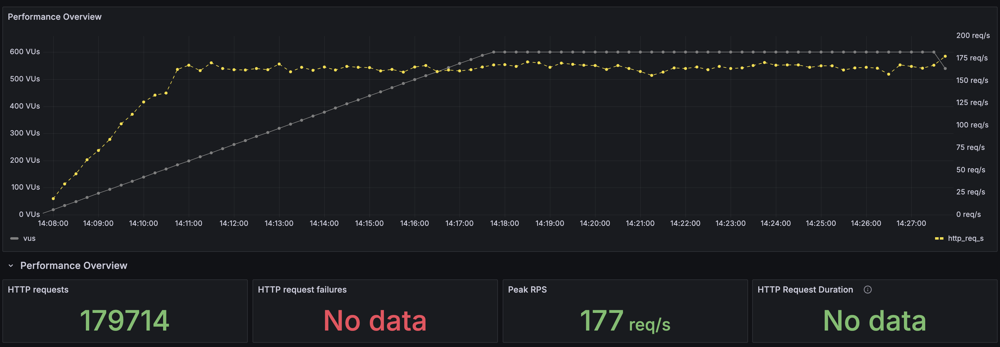
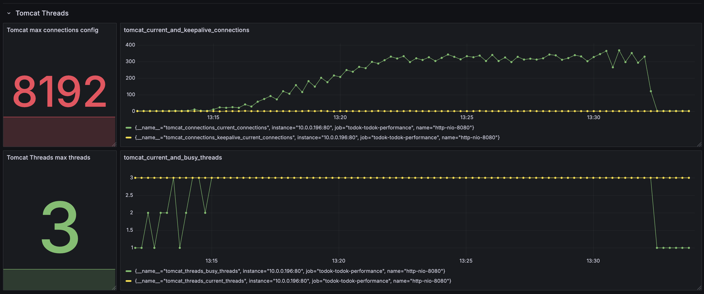

600vps로 테스트를 했을 때에도 실패한 요청이 발생하지 않았다. 적절한 커넥션 재사용 덕분에 600개의 요청이 와도 약 500~550개의 커넥션풀 안에서 요청 처리가 가능했다. 대신 사용하는 커넥션풀의 크기가 불안정하게 바뀌었기 때문에 해당 트래픽이 임계점임을 알 수 있었다. 따라서 700vps로 테스트했을 때는 요청 실패가 발생했다.

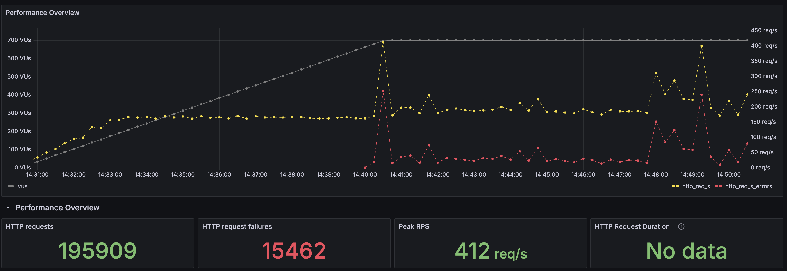

Nginx의 worker_connections 튜닝을 통해 아래와 같은 개선을 했다.

- 톰캣 커넥션 대기열에 들어올 수 있는 커넥션의 수를 늘려, Nginx 커넥션 대기열의 병목을 해소하고 톰캣의 커넥션 대기열의 낭비를 줄였다.
- 서버가 감당할 수 있는 동시 접속자 수 증가 및 rps 유지

---

### 결론

본 글에서는 톰캣 스레드풀, HikariCP 커넥션풀, 그리고 Nginx 커넥션 설정 튜닝을 통해 서버의 성능을 개선하는 과정을 상세히 다룬다. 부하 테스트 도구인 K6를 사용하여 서버의 병목 지점을 식별하고, 각 컴포넌트의 설정값을 서버 사양과 애플리케이션 특성에 맞게 조정했다.

초기 부하 테스트에서 톰캣 스레드풀과 HikariCP 커넥션풀이 포화 상태에 이르며 요청 실패가 발생하는 것을 확인했다. 이에 CPU 코어 수와 I/O 대기 시간을 고려하여 톰캣의 `max-threads`를 `3`으로, HikariCP의 커넥션풀 크기를 `2`로 조정하여 컨텍스트 스위칭 비용을 줄이고 CPU 사용량을 안정화시켰다.

하지만 여전히 특정 부하 이상에서 `Connection reset by peer` 오류가 발생하여, 요청의 진입점인 Nginx까지 범위를 넓혀 분석했다. 그 결과, Nginx의 `worker_connections` 설정이 낮아 병목이 발생하고 있음을 발견했다. `worker_connections`를 `1024`로 상향하고 `keepalive` 설정을 추가하여, Nginx 단에서의 커넥션 병목을 해소하고 서버가 처리할 수 있는 동시 사용자 수를 성공적으로 늘릴 수 있었다.

#### 기술적 의의

이 글은 다음과 같은 기술적 의의를 가진다.

1.  **데이터 기반의 체계적인 성능 튜닝 방법론 제시**: '기본 설정이 최적일 것'이라는 막연한 가정에서 벗어나, K6와 같은 부하 테스트 도구를 활용하여 실제 데이터를 기반으로 병목 지점을 정확히 진단하고 개선하는 체계적인 접근법을 보여준다. 이는 감에 의존하는 튜닝이 아닌, 신뢰성 있는 성능 개선 방법론을 제시했다는 점에서 의미가 있다.

2.  **전체 요청 흐름을 고려한 End-to-End 최적화의 중요성 강조**: 성능 문제는 단일 컴포넌트가 아닌 여러 시스템의 상호작용 속에서 발생하는 경우가 많다. 이 글에서는 애플리케이션 서버(Tomcat)와 데이터베이스 커넥션풀(HikariCP)뿐만 아니라, 앞단의 리버스 프록시(Nginx)까지 전체 요청 흐름을 종합적으로 분석하고 튜닝해야만 근본적인 병목을 해결할 수 있음을 실증적으로 보여준다.

3.  **제한된 리소스 환경에서의 실질적인 튜닝 가이드 제공**: `t4g.small`과 같이 제한된 하드웨어 환경에서 각 설정값(스레드, 커넥션)이 시스템에 미치는 영향을 구체적인 지표(CPU 사용량, 컨텍스트 스위칭 등)를 통해 설명한다. 이는 비슷한 환경의 개발자들이 자신의 서버 특성에 맞게 스레드풀과 커넥션풀을 설정할 때 참고할 수 있는 실질적이고 구체적인 가이드를 제공한다.
