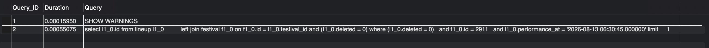

# 개요

Spring Data JPA와 MySQL을 사용하는 프로젝트에서 SQL 쿼리 성능 측정 과정을 정리한 글입니다. 
이 글은 MySQL의 MDL과 인덱스, Spring Data JPA에 대한 기본적인 이해가 필요합니다.

# 미션 등장

**'핵심 테이블에 대량의 데이터 생성 및 성능 테스트'** 미션을 받았습니다.

미션을 완료하기 위해 다음 작업을 계획했습니다.

1. 데이터베이스에 100만건의 데이터를 넣습니다.
2. 데이터를 넣고 성능을 측정 합니다.
3. 데이터베이스 인덱스를 설정합니다.
4. 인덱스 설정 후 개선된 성능을 측정합니다.

더미 데이터는 SQL 프로시저나 프로그래밍 언어로 삽입할 수 있습니다.

성능 측정 방법은 MySQL의 EXPLAIN과 EXPLAIN ANALYZE 명령어 사용하여 측정할 계획입니다.

다양한 소요 시간 측정 방식 중 MySQL의 EXPLAIN과 EXPLAIN ANALYZE 명령어 사용하는 방식을 선택한 이유는 다음과 같습니다.

정확한 MySQL 쿼리 성능 분석을 위해서는 순수한 쿼리 실행 소요 시간을 알아야 합니다.

웹 어플리케이션 서버 요청 후 응답까지의 시간 측정 방식은 네트워크 소요 시간, 서버 동작 시간, MySQL 쿼리 동작 시간이 포함되어 측정됩니다.

MySQL에 접속하여 쿼리 요청 후 응답까지의 시간 측정 방식은 네트워크 소요 시간과 MySQL 쿼리 동작 시간이 포함되어 측정됩니다.

네트워크 소요 시간은 변동성이 크기 때문에 시간 측정마다 일정하지 않은 결과를 보일 수 있습니다.
따라서 MySQL의 순수한 쿼리 실행 소요 시간을 알기 위해서는 네트워크 지연을 제외해야 합니다.

MySQL의 `EXPLAIN`은 실행 계획을 알려줍니다.
`EXPLAIN ANALYZE`는 실제 실행한 동작과 실행 시간을 알려줍니다.

따라서 순수한 쿼리 실행 소요 시간을 알 수 있는 방식인
MySQL의 `EXPLAIN`과 `EXPLAIN ANALYZE` 방식을 선택했습니다.

# Spring Data JPA 실제 쿼리 확인

Spring Data JPA를 사용하여 개발자가 쿼리를 작성하지 않고 있습니다.

따라서 데이터베이스에 요청하는 쿼리를 보려면 어플리케이션 설정 값을 변경해야 합니다.

```sql
spring:
  jpa:
    show-sql: true
    properties:
      hibernate:
        format_sql: true          # 자동 줄바꿈 + 들여쓰기
        use_sql_comments: true
```

show-sql: true 사용 시 **Hibernate가 생성하는 모든 SQL 쿼리**를 콘솔에 출력합니다.

format_sql: true 콘솔에 출력하는 **SQL 문을 보기 좋게 줄바꿈과 들여쓰기를 사용하여 포맷(format)합니다.**

use_sql_comments: true **Hibernate가 생성하는 SQL에 주석을 추가합니다.**

위 설정은 웹 어플리케이션 서버 성능을 사용하므로 필요한 경우에만 사용해야 합니다.

이후 웹 어플리케이션 서버에서 데이터베이스에 쿼리를 순간 다음 처럼 콘솔에 SQL이 표시됩니다.

```sql
select
    l1_0.id 
from
    lineup l1_0 
left join
    festival f1_0 
        on f1_0.id=l1_0.festival_id 
        and (f1_0.deleted = 0) 
where
    (
        l1_0.deleted = 0
    ) 
    and f1_0.id=? 
    and l1_0.performance_at=? 
limit
    ?
```

위 방식으로 데이터베이스에 사용되는 쿼리를 파악할 수 있습니다.

# **EXPLAIN은 무엇인가?**

EXPLAIN 명령어는 MySQL이 쿼리를 실행하는 방법에 대한 정보를 제공합니다.

사용 방법은 쿼리 접두로 EXPLAIN을 붙이면 됩니다.

```sql
# EXPLAIN 예시
EXPLAIN
SELECT * FROM festabook.lineup;
```

EXPLAIN 접두가 붙은 쿼리는 실제로 동작하지 않습니다.

따라서 쓰기 작업인 INSERT, UPDATE, DELETE 쿼리 또한 실제 데이터베이스에 영향 없이 EXPLAIN을 사용할 수 있습니다.

EXPLAIN 명령어는 사용된 테이블을 행(Row)으로, 정해진 열(Column) 데이터에 쿼리가 실행될 방법이 채워져 결과를 반환합니다.



성능과 밀접하게 연관된 열은 type과 Extra입니다.

## Type

type 값은 데이터에 접근하는 방식을 알려줍니다.

이 값으로 인덱스를 얼마나 잘 사용하는지, 개선 필요성을 파악할 수 있습니다.

### Type 값

system: 데이터가 하나만 있거나 없는 경우. 

const: PRIMARY KEY, UNIQUE INDEX의 모든 컬럼을 상수 값으로 검색하는 경우. 1개의 행만 읽음.

eq_ref: JOIN에서 인덱스를 사용해 단 하나의 행만 찾는 경우. PRIMARY KEY나 UNIQUE NOT NULL 인덱스를 사용한 경우 나온다.

ref: JOIN이나 WHERE 절에서 인덱스를 사용해 모든 행을 찾는 경우. 

index_merge: 여러 인덱스를 동시에 사용하여 결과를 병합하는 경우. (개선 고려)

range: 인덱스를 사용해서 특정 범위의 행을 찾는 경우.

index: 풀 인덱스 스캔, 정렬이나 커버링 인덱스에서 발생함. (개선 필요)

ALL: 풀 테이블 스캔 (개선 필요)

## Extra

extra 값은 쿼리가 효율적으로 실행되는지 판단하는 정보를 알려줍니다.

이 값으로 개선 필요성을 파악할 수 있습니다.

### Extra 값

EXPLAIN에서 MySQL이 추가적으로 수행하는 작업에 대한 정보 제공.

인덱스가 사용 되는지, 비용이 큰 작업인지 확인 가능.

- Using index: 커버링 인덱스
- Using index condition: WHERE절에 인덱스 사용
- Using where: WHERE절에 필터링 작업이 수행됨. 인덱스가 일부 사용 된 경우도 포함. (개선 필요)
- Using filesort: ORDER BY 정렬을 수행함. (개선 필요)
- Using temporary: GROUP BY, ORDER BY, DISTINCT  작업을 위해 임시 테이블 생성 (개선 필요)
- Using join buffer (Block Nested Loop): 조인 데이터가 커서 메모리를 사용함 (개선 필요)

## 결론

실제 사용하는 쿼리를 EXPLAIN 명령어로 분석하여 type의 값과 extra의 값을 확인하여 인덱스 도입과 같은 개선 여부를 파악할 수 있습니다. 

# **EXPLAIN ANALYZE는 무엇인가?**

**EXPLAIN 명령어로 type 값과 extra값이 개선이 필요한 값이 나오더라도, 테이블 데이터가 적다면 실행 시간이 짧을 수 있습니다.**

MySQL 8.0 부터 쿼리의 실행 시간을 확인 할 수 있도록 EXPLAIN ANALYZE가 추가됐습니다. ([https://dev.mysql.com/blog-archive/mysql-explain-analyze](https://dev.mysql.com/blog-archive/mysql-explain-analyze/))

EXPLAIN ANALYZE는 쿼리를 실행하고 쿼리의 각 영역별 동작 시간을 확인할 수 있습니다.

사용 방법은 EXPLAIN과 유사하게 쿼리 접두로 EXPLAIN ANALYZE를 붙이면 됩니다.

```sql
# EXPLAIN ANALYZE 예시
explain analyze
select l1_0.id
from lineup l1_0
         left join festival f1_0 on f1_0.id = l1_0.festival_id and (f1_0.deleted = 0)
where (l1_0.deleted = 0)
  and f1_0.id = 2911
  and l1_0.performance_at = '2026-08-13 06:30:45.000000' limit     1;
```

```sql
-> Limit: 1 row(s)  (cost=7.09 rows=0.45) (actual time=0.0262..0.0262 rows=1 loops=1)
    -> Filter: ((l1_0.performance_at = TIMESTAMP'2026-08-13 06:30:45') and (l1_0.deleted = 0))  (cost=7.09 rows=0.45) (actual time=0.0255..0.0255 rows=1 loops=1)
        -> Index lookup on l1_0 using FK_LINEUP_ON_FESTIVAL (festival_id=2911)  (cost=7.09 rows=9) (actual time=0.0236..0.0236 rows=1 loops=1)

```

EXPLAIN ANALYZE는 계층 구조로 이루어진 데이터를 응답합니다.

계층 구조의 아래쪽 노드가 먼저 수행됩니다.

따라서 위쪽 노드가 최종 결과입니다.

```sql
-> Index lookup on l1_0 using FK_LINEUP_ON_FESTIVAL (festival_id=2911)  (cost=7.09 rows=9) (actual time=0.0236..0.0236 rows=1 loops=1)

```

actual 앞에 있는 부분은 예상했던 실행 계획입니다 (cost=7.09 rows=9)

예상되는 비용은 7.09, 예상되는 반환 행 수는 9개입니다.

actual이 붙은 부분은 실제 결과를 나타냅니다. (actual time=0.0236..0.0236 rows=1 loops=1)

actual time은 `0.0236..0.0236` 처럼 .. 을 구분자로 2개의 시간 값이 나타납니다.

앞쪽 시간은 첫 번째 행을 찾는 데 걸린 시간입니다.

뒤쪽 시간은 모든 행을 찾는 데 걸린 시간입니다.

실제로 1개의 행을 반환했기 때문에 앞쪽 시간과 뒤쪽 시간이 동일합니다.

rows는 실제 반환한 행의 수, loop는 모든 행을 찾는데 작업을 수행한 횟수입니다.

actual time은 누적되기 때문에 가장 위쪽 노드의  actual time 뒤쪽 시간이 쿼리에 사용된 실제 시간입니다.

EXPLAIN ANALYZE 주의사항은 실제 쿼리가 실행되기 때문에 쓰기 작업과 오토 커밋(Auto Commit)명령어는 주의해야 합니다.

쓰기 작업의 성능을 측정하기 위해서는 트랜잭션을 사용하여 데이터베이스에 반영 되지 않도록 해야 합니다.

```sql
START TRANSACTION;
explain analyze
INSERT INTO `lineup` (
    `created_at`,
    `updated_at`,
    `deleted`,
    `deleted_at`,
    `festival_id`,
    `name`,
    `image_url`,
    `performance_at`
) VALUES (
    '1970-01-01 00:00:00.000000',
    '2025-08-22 13:04:21.068731',
    0,
    NULL,
    1,
    '제임스',
    'https://kr.object.ncloudstorage.com/matilda/4.png',
    '2025-10-13 20:00:00.000000'
    );
ROLLBACK;
```

이 방법을 사용하면 쓰기 DML 작업도 데이터베이스 반영 없이 쿼리 실행 시간을 분석할 수 있습니다.

오토 커밋 명령어는 DDL, 락(Lock) 등의 명령어가 있습니다.

# **SHOW PROFILING**

EXPLAIN ANALYZE는 쿼리들의 실행 시간만 측정합니다.

따라서 쿼리 요청부터 응답까지 걸리는 MySQL 내부 시간을 측정하려면 다른 방법을 사용해야 합니다.

파싱, 실행, 정리 등 모든 오버헤드 포함하는 MySQL의 쿼리 시작부터 응답까지의 시간을 측정하라면 **SHOW PROFILING를 사용해야 합니다.**

EXPLAIN ANALYZE는 **쿼리 자체의 효율의 개선을 확인하는 지표로 사용합니다.**

SHOW PROFILING는 MySQL에서 쿼리 실행 전후의 **부가적인 단계**에 병목이 없는지 확인하는 지표로 사용합니다.

사용 방법은 SET profiling = 1;, SET profiling = 0; SHOW PROFILES; 를 사용합니다.

```sql
# 쿼리 기록 시작 (이전 쿼리 기록이 사라집니다.)
SET profiling = 1;

select l1_0.id
from lineup l1_0
         left join festival f1_0 on f1_0.id = l1_0.festival_id and (f1_0.deleted = 0)
where (l1_0.deleted = 0)
  and f1_0.id = 2911
  and l1_0.performance_at = '2026-08-13 06:30:45.000000' limit     1;

# 쿼리 기록을 종료합니다.
SET profiling = 0;
```

```sql
# 쿼리 기록을 확인합니다.
SHOW PROFILES;
```


Duration값이 초(Second) 단위의 값입니다.

쿼리 기록을 삭제하려면 쿼리 기록 종료 후 다시 쿼리 기록을 시작하면 됩니다.

```sql
# 쿼리 기록 종료
SET profiling = 0;

# 새로운 쿼리 기록 시작 (이전 쿼리 기록 사라짐)
SET profiling = 1;
```

주의할 점은 SHOW PROFILING에 네트워크 전송 속도와 웹 어플리케이션 서버 처리 시간은 포함하지 않습니다.

# 마무리

EXPLAIN, EXPLAIN ANALYZE, SHOW PROFILES를 사용하여 개선할 쿼리를 찾고, 동작 시간을 파악하여 개선하는 방법을 알아봤습니다. 

MySQL 내부에서 동작하는 시간을 확인했습니다.

실제 웹 어플리케이션 응답 시간을 확인하기 위해서는 K6, JMeter 와 같은 웹 성능 분석 도구를 사용해야 합니다.