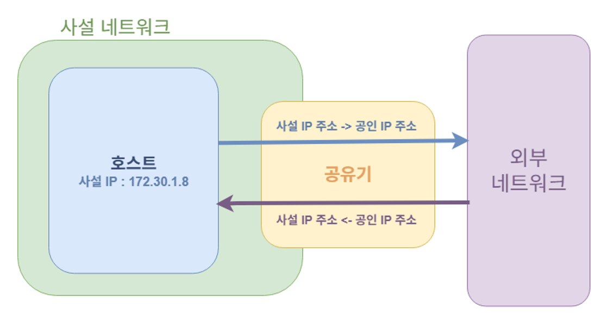
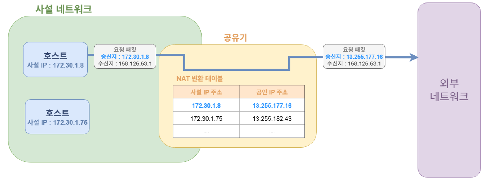
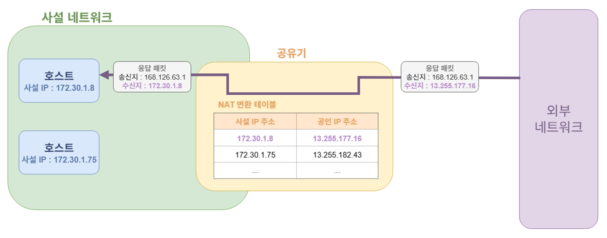
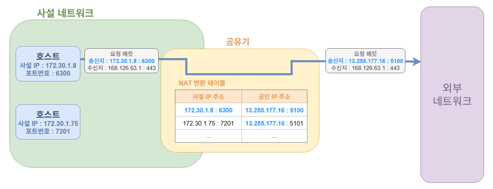
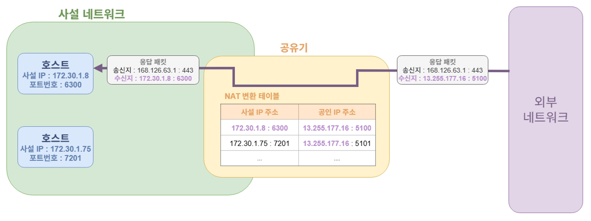
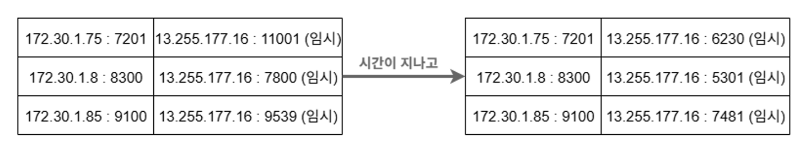
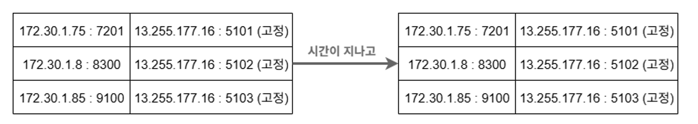

# **동일한 WIFI에서 발생한 동일한 IP주소의 요청**

## **프로젝트를 진행하며 발생한 문제**

### **문제 상황**

이번 우테코 3\~4 레벨동안 백엔드 파트를 맡아 웹서비스를 개발하고 있습니다. 그러던 중에 저희 프로젝트는 중간 점검 때 코치님으로부터 트래픽 공격을 받게 되었습니다. 이후 코치님은 서비스 상황에서 문제가 발생했을 때 모니터링과 로깅을 통해 문제점을 빠르게 찾아낼 수 있는지 그리고 많은 트래픽에도 프로젝트가 얼마나 버틸 수 있는지 점검하는 목적으로 트래픽 공격을 하셨다는 것을 알게 되었습니다. 하지만 저희 팀은 위와 같은 목적에서 한발 더 나아가 트래픽 공격에 대한 최소한의 기초적인 대처가 되어있어야 한다는 피드백을 서로 주고받았고 이를 구현하기로 마음먹었습니다.  

모니터링과 로깅을 제외했을 때 저희 프로젝트의 운영환경은 아래와 같이 간단하게 정리할 수 있습니다.   

저희는 현재 프로젝트의 운영환경 구조에 맞추어 트래픽 공격에 대한 최소한의 대처를 하기로 결정했습니다. 저희가 선택한 방식은 Nginx의  limit\_req 모듈을 활용하여 IP주소마다 트래픽 속도 제한을 걸어놓고, 이후 Nginx의 access 로그를 토대로 Fail2ban을 활용하여 악의적인 패턴의 요청을 보내는 IP주소를 차단하는 것이었습니다.  

하지만 여기서 문제가 발생하게 되었습니다. 분명히 Nginx의 limit\_req 모듈을 통해  IP 주소마다 트래픽 속도 제한을 걸 때 제한 기준을 매우 넉넉하게 설정했음에도 불구하고 제한 기준을 넘는 트래픽 상황이 반복적으로 발생하는 것이었습니다. 제한 기준을 넘는 요청에 대한 응답인 429 상태코드를 담은 응답이 반복적으로 발생했다는 피드백을 받게 되었습니다.  

### **문제의 원인**

문제의 원인을 찾아보기 위해 Nginx의 access 로그를 확인했습니다. 그 결과 서로 다른 호스트로 보낸 요청들이 모두 동일한 IP주소로 기록되어 요청이 들어온 것을 발견할 수 있었습니다.

“””  
{ "time\_local":"13/Oct/2025:13:18:15 \+0900",  "remote\_addr":"218.39.176.142",    
"request\_method":"GET",  "request\_uri":"/api/v1/templates",  "status":200,  "body\_bytes\_sent":81,    
"request\_time":0.006,  "upstream\_response\_time":"0.007",    
"http\_referrer":"https://dev.api.pickeat.io.kr/swagger-ui/index.html",    
"http\_user\_agent":"Mozilla/5.0 (Windows NT 10.0; Win64; x64) AppleWebKit/537.36 (KHTML, like Gecko) Chrome/141.0.0.0 Safari/537.36",    
"host":"dev.api.pickeat.io.kr" }

{ "time\_local":"13/Oct/2025:13:17:56 \+0900",  "remote\_addr":"218.39.176.142",    
"request\_method":"GET",  "request\_uri":"/api/v1/templates",  "status":200,  "body\_bytes\_sent":81,    
"request\_time":0.006,  "upstream\_response\_time":"0.007",    
"http\_referrer":"https://dev.api.pickeat.io.kr/swagger-ui/index.html",    
"http\_user\_agent":"Mozilla/5.0 (Linux; Android 10; K) AppleWebKit/537.36 (KHTML, like Gecko) Chrome/141.0.0.0 Mobile Safari/537.36",    
"host":"dev.api.pickeat.io.kr" }  
“””

디버깅 과정을 통해 동일한 WIFI에 연결된 호스트들이 모두 동일한 IP주소를 가지고 요청을 보냈다는 것을 확인할 수 있었습니다. 그렇다면 동일한 WIFI에 연결된 호스트들은 모두 동일한 IP 주소를 가지고 요청을 보내는 것일까요? 이에 대한 물음을 해결하기 위해 여러 조사와 학습을 진행했고 그 결과를 정리해 보려고 합니다\!

## **공인 IP주소와 사설 IP 주소**

### **들어가며**

우선 들어가기에 앞서 배경지식을 정리해 보려고 합니다. 동일한 WIFI에 연결된 호스트들이 동일 IP 주소로 요청을 보내는 직접적인 원인이 되는 NAT과 NAPT에 대해 설명하기에 앞서 사설 IP 주소와 공인 IP 주소가 무엇인지 알아보겠습니다.  
### **공인 IP 주소 (Public IP Address)**

공인 IP란 무엇일까요? 공인 IP 주소는 전 세계에서 유일한 IP주소를 의미합니다. 즉, 전 세계에서 특정 호스트를 고유하게 식별하기 위해 호스트에 부여한 고유한 IP 주소라고 할 수 있습니다\! 이러한 공인 IP 주소는 IANA(Internet Assigned Numbers Authority) 인터넷 할당 번호 관리 기구에 의해 관리되며, ISP(Internet Service Provider) 인터넷 서비스 공급자에 의해 할당받을 수 있습니다.  

우리나라의 대표적인 ISP로는 KT, U+, SKT 등이 있고, 실제로 저희는 이러한 통신사로부터 공인 IP주소를 할당받아 인터넷을 사용하게 됩니다. 실제로 ISP와 인터넷 계약을 할 경우 제공되는 공유기에 공인 IP 주소가 할당되게 됩니다.  

실제로 ISP로부터 할당받은 공인 IP주소는 어떻게 확인할 수 있을까요? 일반적인 가정용 공유기에 할당된 공인 IP 주소를 확인하기 위해서는 해당 ISP에서 제공하는 공유기 관리 페이지에서 확인할 수 있습니다. 실제로 공유기 관리 페이지에서 확인을 해볼 수 있었습니다.   

한가지 알아두면 좋을 점은 가정용 공유기는 일반적으로 DHCP라는 프로토콜을 통해 공인 IP 주소를 동적으로 할당받고 있다는 점입니다. 그렇기에 시간에 따라 공유기에 할당된 공인 IP 주소는 언제든 변경될 수 있습니다.  

### **사설 IP 주소 (Private IP Address)**

그렇다면 사설 IP주소는 무엇일까요? 사설 IP 주소는 사설 네트워크 내에서 사용하기 위해 만들어진 IP 주소를 말합니다. 사설 네트워크상에서 내부에 연결된 호스트들을 고유하게 구분하기 위해서 만들어진 IP주소라고 할 수 있습니다. 이러한 사설 IP 주소는 사설 네트워크 내부에서만 유효한 IP 주소이기 외부 네트워크에서는 사용할 수 없다는 점과 다른 사설 네트워크상의 사설 IP와 중복이 발생할 수 있다는 점을 알아두어야 합니다.  

이러한 사설 IP 주소가 필요한 이유는 무엇일까요? 우선은 공인 IP 주소는 한정된 자원이라는 점을 생각해 볼 수 있습니다. 사설 네트워크 내의의 호스트들에게 공인 IP 대신 사설 IP를 할당해 사용함으로써 사용되는 전체 공인 IP 주소의 개수를 줄일 수 있습니다. 두 번째로는 공인 IP 주소를 할당받아 사용하기 위해서 비용이 든다는 점입니다. 사설 네트워크 내의 모든 호스트에게 공인 IP 주소 대신 사설 IP 주소를 할당함으로써 네트워크 비용을 줄일 수 있습니다.  

그렇다면 호스트에게 할당된 사설 IP 주소는 어떻게 확인할 수 있을까요? 실제로 공유기가 구성하는 사설 네트워크에 연결된 호스트들은 공유기로부터 사설 IP 주소를 할당받습니다. 그렇기에 공유기에 연결된 컴퓨터나 핸드폰이 할당받은 사설 IP 주소는 해당 호스트의 네트워크 설정을 통해 쉽게 확인할 수 있습니다\!  
(컴퓨터에 할당된 사설 IP 주소)  
   
(핸드폰에 할당된 사설 IP 주소)  

한가지 중요하게 알아두어야 할 점은 RFC 1918를 통해 사설 IP 주소로 사용할 IP 주소 범위가 명확하게 정해져 있다는 점입니다. RFC 1918에 명시된 사설 IP 주소의 범위는 다음과 같습니다.  

- 10.0.0.0/8 (10.0.0.0 \~ 10.255.255.255)
- 172.16.0.0/12 (172.16.0.0 \~ 172.31.255.255)
- 192.168.0.0/16 (192.168.0.0 \~ 192.168.255.255)

사설 IP 주소 범위가 위와 같기 때문에 해당하는 범위의 IP주소를 본다면 사설 IP 주소라는 점을 한눈에 파악할 수 있습니다.  

## **NAT과 NAPT를 활용한 공인/사설 IP주소 변환**

### **들어가며**

지금까지 사설 IP와 공인 IP에 대해서 알아보았습니다. 사설 IP 내용을 읽으면서 한 가지 궁금한 점이 생기셨을 것 같습니다. 사설 네트워크의 호스트들에게 공인 IP 대신 사설 IP를 할당해 사용함으로써 공인 IP 주소를 절약하고, 네트워크 비용을 절약한다는 점입니다. 사설 IP는 사설 네트워크에서만 유효한 IP주소로 외부 네트워크에서는 사용할 수 없습니다. 그렇다면 호스트에서 사설 IP를 할당하게 되었을 때 해당 호스트는 어떻게 외부와 통신할 수 있을까요? 이를 가능하게 하는 기술이 바로 NAT과 NAPT 기술입니다.  

### **NAT(Network Address Transition)**

NAT 기술은 사설 네트워크 내에서 사용되는 사설 IP 주소를 공인 IP주소로 변환하는 기술을 의미합니다. 실제로 NAT은 다음과 같은 변환 과정을 수행하는 기술이라고 이해할 수 있습니다.  
  
이러한 변환 과정은 사설 네트워크를 구성하고 있는 공유기에서 수행되며, 사용되는 공인 IP 주소는 공유기에 할당된 공인 IP 주소를 사용하게 됩니다.  

NAT 변환에 대한 자세한 원리는 다음과 같이 정리할 수 있습니다.  

\- 호스트에서 외부로 요청을 보내는 경우 (사설 IP 주소 \-\> 공인 IP 주소 변환)
: 사설 네트워크의 호스트로부터 공유기로 요청 패킷이 전달  
: 공유기에서는 요청 패킷에 송신지 주소에 명시된 사설 IP 주소 확인  
: 사설 IP 주소에 매핑시킬 공인 IP 주소를 선택  
: 사설 IP 주소와 공인 IP 주소 쌍을 NAT 변환 테이블에 저장  
: 요청 패킷의 송신지 주소를 공인 IP 주소로 변환해서 외부 네트워크에 전달  

\- 외부에서 호스트로 응답을 보내는 경우 (공인 IP 주소 \-\> 사설 IP 주소 변환)
: 외부 네트워크로부터 공유기로 응답 패킷이 전달  
: 공유기에서는 응답 패킷의 수신지 주소에 명시된 공인 IP 주소 확인  
: NAT 변환 테이블을 참조해서 공인 IP 주소에 해당하는 사설 IP 주소 확인  
: 응답 패킷의 수신지 주소를 사설 IP 주소로 변환해서 내부 사설 네트워크에 전달  

이러한 NAT 기술을 통해 사설 IP 주소를 가진 호스트라도 외부와 통신이 가능하도록 할 수 있습니다. 하지만 궁금한 점이 하나더 생겨버립니다. 현재 NAT 변환 테이블을 보면 사설 IP 주소와 공인 IP 주소가 1:1로 매핑되는 것을 확인할 수 있습니다. 사설 IP를 사용하는 이유는 공인 IP의 사용을 줄이기 위해서 인데 사설 IP 주소 1개마다 공인 IP 주소를 하나씩 소비하게 되면 NAT 기술과 사설 IP를 사용하는 의미가 퇴색되어 버립니다. 이러한 문제를 해결하기 위해서 새롭게 개발된 변환 기술이 NAPT(Network Address Port Translation) 기술입니다.

### **NAPT(Network Address Port Transition)**

NAT이 사설 IP 주소와 공인 IP 주소를 1:1로 매핑하는 기술이라면 NAPT는 사설 IP 주소와 공인 IP 주소를 N:1으로 매핑하는 기술이라고 할 수 있습니다. NAT 변환 테이블에 사설 IP 주소와 공인 IP 주소 쌍을 저장할 때 IP주소에 추가로 포트번호까지 저장함으로써 사설 IP 주소와 공인 IP 주소가 N:1 구조로 매핑이 되도록 구현한 기술입니다.  

실제로 다음과 같은 과정을 통해 NAPT의 매핑과 변환 과정이 이루어지게 됩니다.  

\- 호스트에서 외부로 요청을 보내는 경우 (사설 IP 주소 \-\> 공인 IP 주소 변환)
: 사설 네트워크의 호스트로부터 공유기로 요청 패킷이 전달  
: 요청 패킷에 송신지 주소에 명시된 “사설 IP 주소 : 포트번호” 확인  
: “사설 IP 주소 : 포트번호”에 매핑시킬 “공인 IP 주소 : 포트번호”를 선택  
: “사설 IP 주소 : 포트번호”와 “공인 IP 주소 : 포트번호” 쌍을 NAT 변환 테이블에 저장  
: 요청 패킷의 송신지 주소와 포트번호를 “공인 IP 주소 : 포트번호”로  변환  
: 변경된 요청 패킷을 외부 네트워크에 전달  

\- 외부에서 호스트로 응답을 보내는 경우 (공인 IP 주소 \-\> 사설 IP 주소 변환)
: 외부 네트워크로부터 공유기로 응답 패킷이 전달  
: 공유기에서는 응답 패킷의 수신지 주소와 포트번호에 명시된  
“공인 IP 주소 : 포트번호” 확인  
: NAT 변환 테이블을 참조해서 “공인 IP 주소 : 포트번호”에 해당하는  
“사설 IP 주소 : 포트번호” 확인  
: 응답 패킷의 수신지 주소와 포트번호를  “사설 IP 주소 : 포트번호”로 변환  
: 변경된 응답 패킷을 내부 사설 네트워크에 전달  

NAPT 기술은 사설 IP 주소와 공인 IP 주소를 N:1로 매핑함으로써 NAT 기술의 한계점을 보완했습니다. 그렇다면 NAPT 기술의 한계점은 무엇이 있을까요? 가장 먼저 생각해 볼 수 있는 것은  
P2P 통신이 어려워질 수 있다는 점입니다. NAPT 기술 특성상 사설 네트워크의 내부 호스트는 사설 IP 주소가 할당되어 있고 외부에서는 이 주소를 확인할 수 없기에 외부에서 내부 호스트로 접근이 어렵습니다. 이러한 특징으로 인해 호스트와 호스트 사이의 직접 통신을 수행해야 하는  P2P 방식의 통신은 이루어지기 어렵습니다. 호스트가 다른 호스트로 접근할 주소를 알 수 없기 때문입니다. 이러한 문제를 해결하기 위해 정적 NAPT, 포트포워딩, UpnP 등의 추가적인 기술이 필요하다고 합니다. 이 외에도 포트가 부족해질 가능성이 존재하는 문제, 공인 IP 공유로 인해 디버깅과 추적이 어려운 문제 등이 있습니다. 하지만 이러한 문제가 있어도 이를 보완 가능한 추가 기술이 존재하고, 내부 IP 주소를 자유롭게 설계할 수 있다는 점과 IPv4와 완벽하게 호환된다는 점 그리고 이미 널리 사용되고 있어 쉽게 적용이 가능하다는 이점으로 NAPT 기술이 현재에도 널리 사용 중입니다\!  

### **(추가) 동적 NAPT와 정적 NAPT**

동적 NAPT는 내부 호스트가 외부로 통신을 시작할 때마다 “공인 IP 주소 :  새로운 임시 포트번호”를 동적으로 할당하는 방식을 말합니다. 다시 말해 통신 시작할 때마다 다른 포트번호로 매핑되는 방식을 의미합니다. 이러한 동적 NAPT 방식은 포트를 효율적으로 사용할 수 있다는 점과 외부에서 내부 호스트의 주소를 알 수 없기 때문에 외부 접근을 차단할 수 있다는 점에서 이점이 있습니다. 반면에 외부에서 내부로 접근이 불가능하기 때문에 P2P 통신 등이 불가능하다는 단점도 존재합니다. 이러한 특징으로 인해 가정용 공유기에는 일반적으로 NAPT 방식을 많이 사용한다고 합니다.  

반면에 정적 NAPT는 “사설 IP 주소 : 포트번호”와 “공인 IP 주소 : 포트번호” 쌍을 미리 고정시켜 설정해 놓는 NAPT 방식을 의미합니다. 다시 말해 특정 호스트는 항상 동일한 “공인 IP 주소 : 포트번호”로 매핑되는 방식이라고 할 수 있습니다. 해당 방식은 외부에서 내부 호스트로 접근이 가능하다는 주요한 이점이 있습니다. 외부에서 바라보았을 때 “공인 IP 주소: 특정 포트”로 접근하면 특정한 내부 호스트로 접근할 수 있다는 것을 알 수 있기 때문입니다. 하지만 관리자가 미리 세팅해야 한다는 점과 외부에서 내부로 접근할 수 있어 보안에 취약할 수 있다는 단점도 존재합니다. 이러한 특징으로 인해 외부에서 내부 호스트로 안정적인 접근이 필요한 회사 내부 서버에서는 정적 NAPT를 사용하기도 한다고 합니다.  

### **NAPT가 적용된 모습을 확인해보자**

실제로 현재 대부분의 가정용 공유기에는 NAPT 기술이 적용되어 있다고 합니다. 아쉽게도 가정용 공유기의 관리자 페이지에서는 보안상의 이유로 NAPT 기술에 사용된 NAT 변환 테이블을 직접 확인할 수 없었습니다. 하지만 Nginx의 커스텀 access 로그를 통해 NAPT 변환을 간접적으로 확인해 볼 수 있었습니다.  

우선은 Nginx의 설정을 변경해서 access 로그로 요청에 대한 IP주소와 포트번호를 모두 확인할 수 있도록 로그 구성을 변경하였습니다. 실제로 nginx.conf에 아래와 같은 로그 구성 설정 코드를 추가하였습니다.  

“””  
log\_format custom '$remote\_addr:$remote\_port \- $remote\_user \[$time\_local\] '   
'"$request" $status $body\_bytes\_sent '   
'"$http\_referer" "$http\_user\_agent"';

access\_log /var/log/nginx/access.log custom;  
“””

동일한 WIFI에 연결된 핸드폰과 노트북으로 nginx에 요청을 보냈을 때 다음과 같은 로그가 출력되는 것을 확인할 수 있었습니다.

“””  
211.195.240.180:64133 \- \- \[13/Oct/2025:16:02:35 \+0000\]   
"GET /dsf HTTP/1.1" 200 2 "-"   
"Mozilla/5.0 (Windows NT 10.0; Win64; x64) AppleWebKit/537.36 (KHTML, like Gecko) Chrome/141.0.0.0 Safari/537.36"

211.195.240.180:58410 \- \- \[13/Oct/2025:16:03:58 \+0000\]   
"GET /dsf HTTP/1.1" 200 2 "android-app://com.slack/"   
"Mozilla/5.0 (Linux; Android 10; K) AppleWebKit/537.36 (KHTML, like Gecko) Chrome/141.0.0.0 Mobile Safari/537.36"  
“””

다른 호스트로 접속했음에도 동일한 IP주소 \+ 서로 다른 포트번호로 요청이 보내진 것을 보아 NAPT 기술이 적용되었다는 것을 간접적으로 알 수 있었습니다.

## **정리하면**

### **동일한 WIFI에 연결된 호스트들이 모두 동일한 IP주소로 요청을 보내는 이유**

공유기는 공인 IP 주소의 사용을 최소화하고 네트워크 비용을 최소화하기 위해 연결된 호스트들에게 사설 IP 주소를 할당하고 있습니다. 또한 공유기는 NAPT 기술을 활용하여 사설 IP 주소가 할당된 내부 호스트들도 외부와 통신을 할 수 있도록 지원하고 있습니다. 이러한 NAPT를 활용한 네트워크 구조 덕분에 해당 공유기에 연결된 호스트들이 요청을 보내도 외부 호스트 입장에서는 동일한 IP 주소로 요청이 오는 것처럼 보이게 되었다고 결론을 내리게 되었습니다.  

### **해당 트러블 슈팅 과정에서 새롭게 배운 점**

이번 트러블슈팅 과정을 통해 사설 IP와 공인 IP의 차이를 확실하게 이해하게 되었습니다. 또한, 사설 네트워크에 속한 호스트의 요청이 실제로 어떻게 이루어지는지 확실하게 이해하게 되었습니다. 그리고 웹서버에 요청을 보내는 모든 호스트들이 모두 각기 다른 IP 주소로 요청을 보낼 것이라는 고정관념을 확실히 깨부술 수 있었습니다.

이번에 배운 지식들은 이후 프로젝트의 네트워크 작업을 하는데 유용하게 활용할 수 있었습니다. 예를 들어 AWS의 리소스에 할당되는 Public IP와 Private IP가 무엇을 의미하는지 확실히 이해하게 되었고, AWS의 VPC와 Private IP에 대해 사설 네트워크와 사설 IP의 개념을 대입해 다시 한번 생각해 보게 되었습니다. 그리고 Docker 컨테이너에게 할당된 IP주소 범위가 사설 IP 범위인 것을 보고 Docker 내부에서 구성하는 가상 네트워크도 일종의 사설 네트워크였다는 점과 컨테이너에게 할당된 IP주소는 모두 사설 IP 주소였다는 것을 깨닫게 되었습니다. 이처럼 네트워크에 대한 기초 지식을 쌓는 좋은 경험이 되었다고 생각합니다\!  

그리고 진행하던 악의적인 트래픽을 제한하는 작업은 팀 차원에서 잠시 중지하게 되었습니다. 조사를 진행하면서 해당 작업이 보안 분야와 관련되어 생각보다 깊이 있는 작업이라는 것을 깨닫게 되었기 때문입니다. 또한 사용자 경험 개선, 도메인 구조 변화에 따른 마이그레이션, DB 최적화, 부하 테스트를 통한 성능 체크 등 중요도가 높은 작업들이 계획되어 있어 해당 작업은 잠시 뒤로 미루게 되었습니다. 차근차근 프로젝트를 진행하며 레벨 막바지에 다시 한번 도전해 볼 예정입니다\!  
