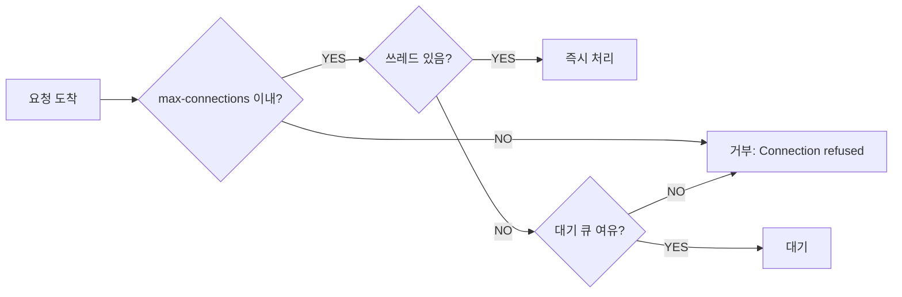
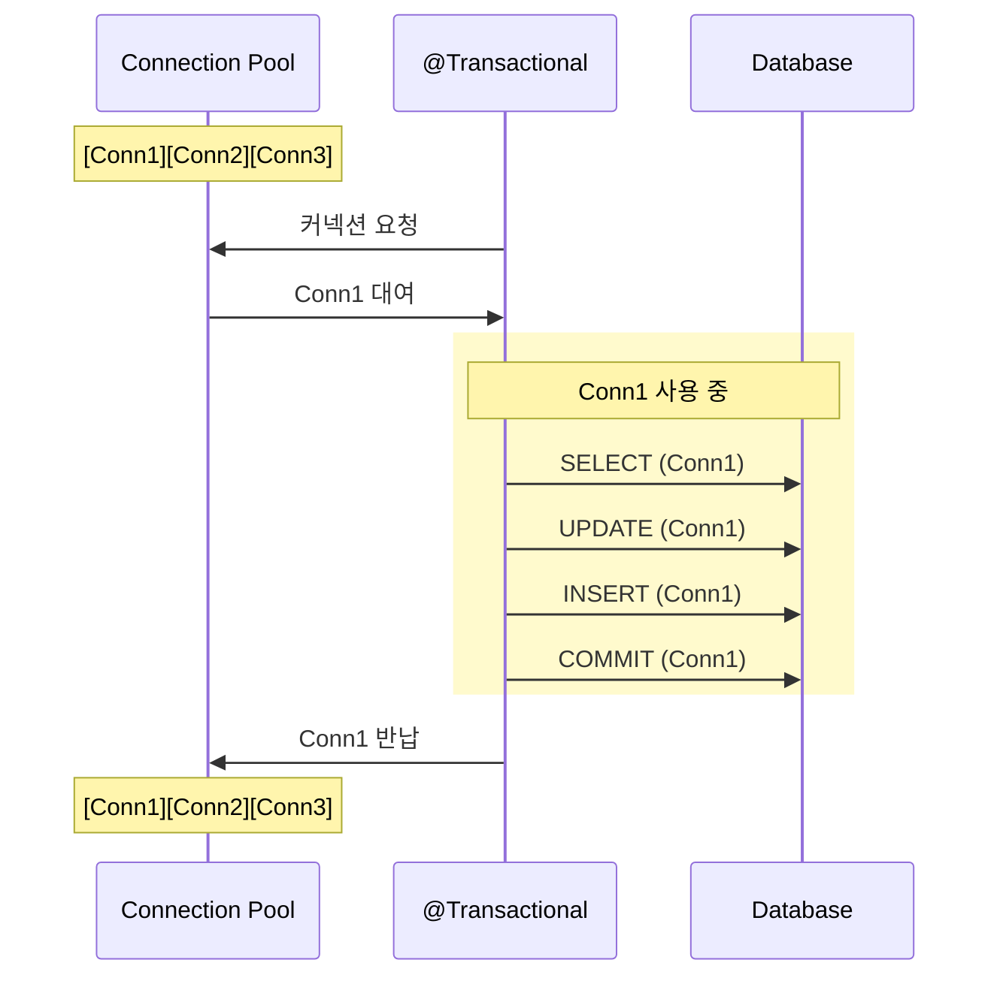
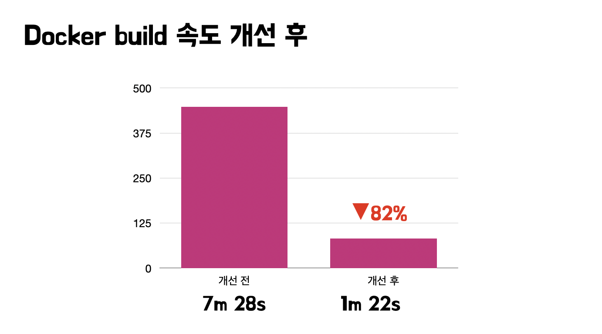

# 1. Thread Pool 이란?


## 1.1 Tomcat Thread Pool 이해하기
Tomcat은 들어오는 요청(Task)을 처리하기 위해 Thread Pool이라는 개념을 사용합니다. 
Thread는 생성 및 컨텍스트 스위칭 비용이 비싸기 때문에 잘못하면 메모리 누수와 CPU 오버헤드가 발생할 수 있습니다. 
따라서 Thread를 미리 적정량 만들어두고 사용하게 되는데 이를 Thread Pool이라고 합니다.



웹 요청이 들어오면 Tomcat의 Connector가 Connection을 생성하고,요청된 작업을 Thread Pool의 쓰레드에 연결합니다.
Thread에 여유가 있으면 Queue에 들어온 요청은 바로 전달되지만, 모든 Thread가 사용 중이면 새로 발생한 요청은 Queue에 쌓이면서 지연이 발생 합니다.

## 1.2 Thread Pool 설정 값 이해하기
### server.tomcat.threads.max
- 기본값 200
- 생성할 수 있는 최대 쓰레드 개수
- 동시에 처리 가능한 요청의 수를 결정
- 이 값을 넘어서면 요청은 대기 큐에 

---

### server.tomcat.threads.min-spare
- 기본값 10
- 항상 활성화(idle)되어 있는 최소 쓰레드 개수

---

### server.tomcat.accept-count
- 기본값 100
- 모든 쓰레드가 사용 중일 때 대기 큐에 넣을 수 있는 요청 개수
- 대기 큐마저 가득 차면 새로운 연결은 거부됨

---

### server.tomcat.max-connection
- 기본값 8192
- 동시에 수립 가능한 connection의 총 개수
- 실질적인 서버의 동시 처리 능력을 나타냄


## 1.3 메인 작업 종류에 따른 Thread Pool 크기 결정하기
### server.tomcat.threads.max

#### CPU-bound 작업 (애플리케이션 레벨에서의 연산)
- **권장**: CPU 코어 수 × (1~2)
- **이유**: CPU보다 많은 쓰레드는 오히려 컨텍스트 스위칭 오버헤드만 증가
- **예시**: 8코어 서버 → 약 16

#### I/O-bound 작업 (DB 조회, 외부 API 호출)
- **권장**: CPU 코어 수 × (10~25)
- **이유**: 쓰레드가 I/O 대기 중일 때 다른 쓰레드가 CPU를 사용할 수 있기 때문
- **예시**: 8코어 서버 → 약 100~200

---

### server.tomcat.threads.min-spare

#### CPU-bound 작업 (애플리케이션 레벨에서의 연산)
- **권장**: max의 1/2 정도
- **이유**: CPU 작업은 처리 속도가 빠르므로 즉시 대응 가능한 쓰레드 많이 확보
- **예시**: 8코어 서버 → 약 8

#### I/O-bound 작업 (DB 조회, 외부 API 호출)
- **권장**: max의 1/10 ~ 1/5 정도
- **이유**: I/O 대기가 많아 유휴 쓰레드를 과도하게 유지할 필요 없음
- **예시**: 8코어 서버 → 약 10~20

---

### server.tomcat.accept-count

#### CPU-bound 작업 (애플리케이션 레벨에서의 연산)
- **권장**: max × (2~3)
- **이유**: 처리 속도가 빠르므로 큰 대기 큐 불필요
- **예시**: 8코어 서버 → 약 30~50

#### I/O-bound 작업 (DB 조회, 외부 API 호출)
- **권장**: max × (0.5~1)
- **이유**: I/O 대기로 처리 시간이 길어 적절한 대기 큐 필요
- **예시**: 8코어 서버 → 약 50~200

---

### server.tomcat.max-connections

#### CPU-bound 작업 (애플리케이션 레벨에서의 연산)
- **권장**: 보수적으로 설정 (200~500)
- **이유**: CPU 집약적이므로 과도한 동시 연결은 성능 저하
- **예시**: 8코어 서버 → 약 200

#### I/O-bound 작업 (DB 조회, 외부 API 호출)
- **권장**: 넉넉하게 설정 (5000~10000)
- **이유**: I/O 대기 중인 연결들을 충분히 받아들일 수 있어야 함
- **예시**: 8코어 서버 → 약 10000

### 1.4 Thread Pool 모니터링 (추가 예정)

# 2. Connection Pool 이란?

## 2.1 Connection Pool 이해하기
DB 커넥션을 미리 만들어 두고 재사용하는 방법 입니다. 1 트랜잭션 = 1 커넥션 이며, application.yml 파일에
애플리케이션에서 DB로 연결할 수 있는 최대 갯수를 설정할 수 있습니다.

```java
@Transactional  // 트랜잭션 시작
public void transferMoney(Long fromId, Long toId, int amount) {
    // ← 여기서 커넥션 풀에서 커넥션 1개 획득
    
    Account from = accountRepository.findById(fromId);  // 같은 커넥션 사용
    Account to = accountRepository.findById(toId);      // 같은 커넥션 사용
    
    from.withdraw(amount);      // 같은 커넥션 사용
    to.deposit(amount);         // 같은 커넥션 사용
    
    accountRepository.save(from);  // 같은 커넥션 사용
    accountRepository.save(to);    // 같은 커넥션 사용
    
    // ← 여기서 커넥션 풀에 반납 (트랜잭션 종료)
}
```


- 애플리케이션 시작 시 설정된 개수만큼 커넥션 생성
- 요청이 들어오면 풀에서 idle 상태 커넥션 대여
- 트랜잭션 완료(close) 후 커넥션 반납
- 풀에 idle 상태 커넥션이 없으면 대기하거나 새로 생성(설정에 따라)


## 2.2 Connection Pool 크기 설정 방법

```yaml
# 커넥션 풀 크기
spring.datasource.hikari.maximum-pool-size=10 # 최대 커넥션 수
spring.datasource.hikari.minimum-idle=5 # 최소 유휴 커넥션 수

# 타임아웃 설정
spring.datasource.hikari.connection-timeout=30000 # 커넥션 대기 시간 (30초)
spring.datasource.hikari.idle-timeout=600000 # 유휴 커넥션 유지 시간 (10분)
spring.datasource.hikari.max-lifetime=1800000 # 커넥션 최대 수명 (30분)
```

### spring.datasource.hikari.maximum-pool-size
- **의미**: 동시에 사용 가능한 최대 커넥션 개수
- **기본값**: 10
- **주의** : 너무 크면 DB 서버 부하, 너무 작으면 대기 발생

### spring.datasource.hikari.minimum-idle
- **의미** : 항상 유지할 최소 유휴 커넥션 수
- **기본값** : maximum-pool-size와 동일
- **주의** : minimum-idle < maximum-pool-size 설정 시 동적으로 크기 조정

### spring.datasource.hikari.connection-timeout
- **의미** : 커넥션을 얻기 위해 대기하는 최대 시간
- **기본값** : 30000(30초)
- **주의** : 너무 짧으면 불필요한 에러, 너무 길면 응답 지연

### spring.datasource.hikari.idle-timeout
- **의미** : 유휴 커넥션이 풀에 유지 되는 시간
- **기본값** : 600000(10분)
- **주의** : minimum-idle를 제외한 커넥션만 정리됨

### spring.datasource.hikari.max-lifetime
- **의미** : 커넥션의 최대 수명
- **기본값** : 1800000(30분)
- **주의** : 0으로 설정 시 무제한 (권장하지 않음)


## 2.3 Connection Pool 모니터링


(내용 추가 예정)


# 3. Thread Pool, Connection Pool 조율 하기 with 부하테스트


HikariCP 커넥션 풀
- Active : 10개 <- 커넥션 풀의 모든 커넥션 사용 중
- Idle : 0개 <- 남은 커넥션 없음
- Pending 110개 <- 110개 요청이 커넥션 대기 중



RDS CPU 사용률
- 약 95% 이상 <- DB가 포화 상태

## 문제 분석

Tomcat Thread Pool의 max는 기본갑 200으로 설정이 되어 있습니다. HiKariCp를 보면 Active 10, Pending 110 인데 이는 120개의 요청을 수용했고,
110개는 팬딩이 된 상태를 의미 합니다.

10개의 커넥션만으로 DB CPU가 95%에 도달했다는 것은 쿼리 자체가 매우 비효율적이라는 증거 입니다.
인덱스가 없거나, N + 1 문제가 발생하거나, Full Table Scan이 일어나고 있을 가능성이 높습니다.


(내용 추가 예정)
