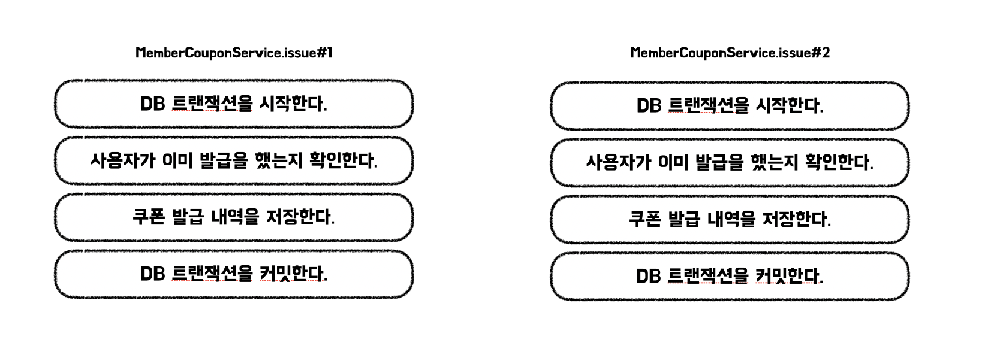

# 쿠폰 발급 기능으로 알아보는 동시성 문제와 해결방법

<!-- TOC -->

* [쿠폰 발급 기능으로 알아보는 동시성 문제와 해결방법](#쿠폰-발급-동시성-문제를-슬기롭게-막아보자)
    * [1. 쿠폰 발급 API로 알아보는 동시성 문제](#1-쿠폰-발급-api로-알아보는-동시성-문제)
        * [동시성 문제란 무엇인가?](#동시성-문제란-무엇인가)
        * [동시성 문제 사례 - 쿠폰 발급 API](#동시성-문제-사례---쿠폰-발급-api)
        * [쿠폰 발급 API 원인 부검](#쿠폰-발급-api-원인-부검)
    * [2. 해결책을 저울질하자](#2-해결책을-저울질하자)
        * [동시성 문제를 처리율 제한으로 해결하려는 접근 방식](#동시성-문제를-처리율-제한으로-해결하려는-접근-방식)
        * [동시성 문제를 자바에서 제공하는 동기화 도구로 해결하려는 접근 방식](#동시성-문제를-자바에서-제공하는-동기화-도구로-해결하려는-접근-방식)
        * [동시성 문제를 트랜잭션 격리 수준으로 해결하려는 방식(READ_UNCOMMITED편)](#동시성-문제를-트랜잭션-격리-수준으로-해결하려는-방식read_uncommited편)
        * [동시성 문제를 트랜잭션 격리 수준으로 해결하려는 방식(SERIALIZABLE편)](#동시성-문제를-트랜잭션-격리-수준으로-해결하려는-방식serializable편)
        * [동시성 문제를 비관적 락으로 해결하려는 방식](#동시성-문제를-비관적-락으로-해결하려는-방식)
        * [동시성 문제를 유니크 인덱스로 해결하려는 방식](#동시성-문제를-유니크-인덱스로-해결하려는-방식)
        * [동시성 문제를 분산락으로 해결해보자 (MySQL 네임드락편)](#동시성-문제를-분산락으로-해결해보자-mysql-네임드락편)
        * [동시성 문제를 분산락으로 해결해보자 (Redis 활용편)](#동시성-문제를-분산락으로-해결해보자-redis-활용편)
    * [3. 고민해볼 지점](#3-고민해볼-지점)
    * [참고](#참고)

<!-- TOC -->

동시성은 성능을 높이는 기술이기도 하지만, 제대로 알고 사용하지 않으면 독이 되기도 합니다.
저는 우아한테크코스 6기 데벨업 프로젝트를 진행하면서 이 동시성 때문에 난항을 겪었었는데요.
설명의 편의를 위해 모두에게 친숙한 쿠폰 발급 예제로 어떤 문제였는지, 어떻게 해결해볼 수 있는지 이야기해보려 합니다.
문장의 간결함을 위해 높임말은 생략할게요.

## 1. 쿠폰 발급 API와 동시성 문제

### 동시성 문제란 무엇인가?

동시성(Concurrency)이란 여러 작업들이 빠르게 전환되면서 실행되어 마치 동시에 실행되는 것처럼 보이는 것을 일컫는다.
예를 들어, 손은 2개이지만 저글링을 하면 3개의 공을 한 번에 다룰 수 있는 것과 비슷한 이치이다. 동시성은 스레드로 달성할 수 있다.
동시에 여러 스레드가 실행되는 경우 데이터 정합성이 맞지 않는 문제가 발생할 수 있는데 이를 동시성 문제라고 한다.

### 동시성 문제 사례 - 쿠폰 발급 API

쿠폰 발급 기능을 구현하려고 한다. 쿠폰 발급 기능의 가장 중요한 요구사항은 1명의 사용자는 1개의 쿠폰만 발급받을 수 있다는 것이다. 만약, 그렇지 않는다면 쿠폰을 발급한 회사는 처참하게 파산할 것이다.
쿠폰 발급 API는 다음과 같이 쿠폰 발급 서비스의 기능을 사용한다.

```java

@RestController
@RequiredArgsConstructor
class MemberCouponApi {

    private final MemberCouponService memberCouponService;

    @PostMapping("/member-coupon")
    public ResponseEntity<Void> issueCoupon(@RequestBody IssueCouponRequest request) {
        memberCouponService.issue(request.memberId(), request.couponId());

        return ResponseEntity.noContent().build();
    }
}
```

그리고 쿠폰 발급 서비스는 사용자가 1개의 쿠폰만 발급받을 수 있도록 다음과 같이 검증 메서드를 추가했다.

```java

@Slf4j
@Service
@RequiredArgsConstructor
public class MemberCouponService {

    // ... 중략 ...

    @Transactional
    public Long issue(Long memberId, Long couponId) {
        validateAlreadyIssued(memberId, couponId);
        Member member = memberRepository.findById(memberId).orElseThrow();
        Coupon coupon = couponRepository.findById(couponId).orElseThrow();
        MemberCoupon memberCoupon = MemberCoupon.issue(member, coupon);
        memberCouponRepository.save(memberCoupon);

        return memberCoupon.getId();
    }

    private void validateAlreadyIssued(Long memberId, Long couponId) {
        if (memberCouponRepository.existsMemberCouponByMemberIdAndCouponId(memberId, couponId)) {
            throw new IllegalStateException("해당 사용자는 이미 쿠폰을 발급했습니다.");
        }
    }
}
```

하지만, 사용자가 동시에 API에 요청을 보내게 된다면 1명의 사용자는 1개 이상의 쿠폰을 발급 받을 수 있게 된다.

### 쿠폰 발급 API 원인 부검

<p align="center">

</p>


만약 사용자가 동시에 API에 요청을 보내게 된다면, 1개 이상의 스레드가 동시에 MemberCouponService의 issue 메서드를 읽게 된다. 이때, 각 스레드는 데이터베이스 트랜잭션을 커밋하기 이전이기
때문에 각 스레드는 모두 검증에 통과하고 결과적으로 1개 이상의 쿠폰을 발급 받을 수 있게 되는 것이다.

## 2. 해결책을 저울질하자

위 문제를 해결하기 위해서는 동시성을 희생시키는 모든 방식을 고려해볼 수 있다.
하지만, 여러 방식 중에서 현재 상황에 맞는 가장 효율적인 방식을 선택하는 것이 중요하다. 이를 위해서 다양한 접근 방식을 생각해보고 비교해 볼 필요성이 있다.

### 동시성 문제를 처리율 제한으로 해결하려는 접근 방식

#### 가설

처리율 제한 장치의 장점은 근본적으로 다음과 같다.

- DOS 공격에 의한 자원 고갈과 서버 과부하(사용자의 잘못된 사용 패턴, 봇 트래픽)를 방지한다.
- 서드파티 API 사용료 뻥튀기를 예방한다.

그렇다면 위와 같은 장점을 취하면서 동시성 문제를 해결하면 일석이조이지 않을까라는 생각을 했다.
아이디어는 다음과 같다.

- 기본적으로 동시성 문제는 서버의 동시 처리 능력과 연관이 있다.
- 극단적으로 생각했을 때, 서버의 스레드를 한 개로 제한하면 동시성 문제는 절대 발생하지 않는다.
- (가설) 특정 API의 동시 처리 능력을 희생시키면 동시성 문제가 발생하지 않고, 처리율 제한의 이점도 얻어갈 수 있을 것이다.

#### 적용

- 쿠폰 발급 API에 처리율 제한을 설정한다. (Guava 라이브러리의 처리율 제한 기능을 사용)
- Guava를 이용하였기 때문에, 처리율 제한은 각 was에서 처리한다.
- 100개 스레드에 같은 사용자와 같은 쿠폰의 ID로 동시에 쿠폰 발급 API에 요청한다.
- 처리율 제한에 막히는 경우 429 (Too Many Request) 응답을 내려주고 요청을 무시한다.
- 사용자는 쿠폰을 단 한번만 발급할 수 있다.

#### 장점과 한계

장점 :

- 이미 시스템에 처리율 제한 장치가 있다면 적용이 유리할 수 있다.
    - 예를 들어, 한 시스템에서 처리율 제한 장치가 이미 존재한다고 가정하자.
    - 1초에 한 IP를 가진 사용자는 쿠폰 발급 API를 1번만 요청하도록 처리율을 제한할 수 있다.
- 커넥션을 사용하지 않는다.
    - 처리율 제한에 막히는 경우 spring trasaction aop 프록시를 호출하지 않으니 커넥션을 점유하지 않고 동시성 문제를 해결한다.
    - 하지만, 이는 처리율 제한 장치만의 이점은 아니다. 자바 동기화 방식으로도 커넥션을 점유하지 않을 수 있을 것이다

한계 :

- 분산 환경에서 동시성 문제가 발생한다.
    - 가령, 동시 요청 [1, 2]가 있을 때, 1은 a was, 2는 b was로 가는 경우 무용이다.
    - 이런 경우, 처리율 제한 장치가 레디스와 같은 카운터 저장소를 사용하도록 할 수 있지만, 유지보수대상이 증가한다.
    - 이 경우 차라리 분산락을 도입하는 것이 합리적이다.
- 단순 동시성 문제를 해결하기 위해서 도입하기에는 애매한 지점이 있다.
    - 처리율 제한 장치 설계에 대한 고려가 필요하다.
    - 동시성 문제 해결을 위한 처리율 제한 수치와 근본적으로 사용해야하는 처리율 제한의 수치가 다를 수 있다.

### 동시성 문제를 자바에서 제공하는 동기화 도구로 해결하려는 접근 방식

#### 가설

- (가설) 자바에서 제공하는 동기화 도구를 사용해서 동시성 문제를 해결하면 데이터베이스 커넥션을 점유하지 않으면서, 문제를 해결할 수 있지 않을까?

#### 적용

- 암묵적인 락을 사용하거나, 명시적인 락을 사용할 수 있다.
- 명시적인 락
    - memberId와 couponId를 Map의 키로 관리한다.
    - Map의 값은 ReentrantLock을 사용한다.
    - Map은 ConcurrentHashMap을 사용한다.
    - MemberCouponIssueLock 인터페이스를 구현하는 JavaMemberCouponIssueLock에서 Map을 관리한다.
    - MemberCouponIssueLock은 응용 계층에 존재하여 다른 개발자가 제어할 수 있고, 구현체를 변경할 수 있다.
    - finally 구문에서 lock을 릴리즈해줘야 한다.

- 암묵적인 락
    - synchronized 키워드를 이용한다.

#### 적용 시 주의사항

- 데이터베이스 트랜잭션의 시점을 주의해야 한다.
- 데이터베이스 트랜잭션이 커밋하기 이전에 락을 릴리즈하면 동시성 문제가 다시 발생한다.
    - 이를 위해서 상위 계층 코드(파사드 같은)에서 락을 릴리즈하거나, synchronized를 설정해야 한다.
- 만약 부모 트랜잭션에 합류하고 있는 경우에는 부모 트랜잭션이 종료되는 경우 커밋이 된다. 즉, 커밋을 수행하기 이전에 락을 릴리즈하여 동시성 문제가 발생한다.
    - 이 경우에는 트랜잭션 전파 옵션(ex. REQUIRES_NEW)으로 해결할 수 있다. 하지만, 스레드가 두 개 이상의 커넥션을 동시에 점유하려는 경우, 부하 환경에서 히카리 커넥션 풀 데드락이 발생할 수
      있다.
- 명시적인 락의 경우에는 락을 릴리즈해야한다. 릴리즈하지 않으면 다른 스레드가 대기 상태로 머무르고, 예기치 못한 동작이 발생할 수 있다.

#### 장점과 한계

- lock을 사용하는 경우, 애플리케이션 레이어에서 동시성을 제어할 수 있기 때문에 확장성있는 코드를 작성할 수 있다.
    - 가령, MemberCouponIssueLock 인터페이스의 구현체를 분산락이나 다른 것으로 대체 가능하다.
- synchronized를 사용하는 경우, 락 릴리즈에 대한 걱정을 덜어낼 수 있다.
- 두 방식 모두 트랜잭션 없는 상위 계층에서 락 획득 시도를 하면 데이터베이스 커넥션을 점유하지 않고 스레드가 대기한다.
- (한계) 두 방식은 서버가 다중화되어있는 환경에서 다시 동시성 문제가 발생할 수 있다.
    - (가설) 스티키 세션을 이용하면 한 사용자에 대한 동시 호출 문제는 예방할 수 있을 것이다.

### 동시성 문제를 트랜잭션 격리 수준으로 해결하려는 방식(READ_UNCOMMITED편)

#### 가설

- 데이터베이스를 활용하여 풀 수 있는 방법 중에서 트랜잭션 격리 수준이 생각났다.
- 다른 트랜잭션이 커밋하기 이전이라 기존재 여부 검증에 실패한다.
- (가설) 그렇다면, 다른 트랜잭션이 무슨 작업을 하고 있는지 알고 있다면 풀어볼 수 있지 않을까?

#### 적용

- @Transactional 어노테이션에 isolation 속성을 READ_UNCOMMITED로 설정한다.
- 더티 리드와 spring data jpa의 repository을 이용한다.

```java

@Transactional(isolation = Isolation.READ_UNCOMMITTED)
public Long issue(Long memberId, Long couponId) {
    log.info("신규 쿠폰 발급 coupon = {}, member = {}", couponId, memberId);

    Member member = memberRepository.findById(memberId).orElseThrow();
    Coupon coupon = couponRepository.findById(couponId).orElseThrow();
    MemberCoupon memberCoupon = MemberCoupon.issue(member, coupon);

    // 1. IDENTITY에 의한 채번 insert 쿼리가 발생한다.
    memberCouponRepository.save(memberCoupon);
    validateAlreadyIssued(memberId, couponId);

    log.info("쿠폰 발급 종료 member = {}", memberId);
    return memberCoupon.getId();
}

// 2. 더티 리드를 이용해서 다른 트랜잭션에서 삽입한 데이터 알 수 있다.
private void validateAlreadyIssued(Long memberId, Long couponId) {
    try {
        // 3. 가장 먼저 insert를 수행하고 조회를 한 스레드는 1개를 반환할 것이고, 나머지는 그 이상의 데이터를 반환하니 예외가 발생
        memberCouponRepository.findByMemberIdAndCouponId(memberId, couponId);
    } catch (IncorrectResultSizeDataAccessException e) {
        // 4. 예외가 발생한 트랜잭션은 롤백된다.
        throw new IllegalStateException("해당 사용자는 이미 쿠폰을 발급했습니다.");
    }
}
```

#### 장점과 한계

장점 :

- WAS가 분산되어 있는 환경에서도 동작한다.(일반적인 방식은 아니다.)
- 동시성 제어 구간을 축소할 수 있다. 가령, memberId = 1, couponId = 1과 memberId = 2, couponId = 2는 동시에 수행할 수 있다.

한계 :

- 정확하게 여러 스레드가 동시에 save를 호출하고, find를 수행하는 경우, 접근한 모든 스레드가 실패한다.
- repository.save 시점에 insert 쿼리가 바로 전송되어야 한다.
- 연산의 순서가 일반적이지 않아 다른 개발자가 이해하기 어려울 수 있다. -> 왜 validate가 아래에 있지? -> 위로 올린다. -> 동시성 문제가 발생한다.

### 동시성 문제를 트랜잭션 격리 수준으로 해결하려는 방식(SERIALIZABLE편)

#### 가설

- 트랜잭션 격리수준 serializable을 사용하면 내부적으로 단순 읽기 작업인 경우에도 락을 획득한다.
- (가설) 이를 잘 이용하면 동시처리능력을 희생시켜 동시성 문제를 해결할 수 있지 않을까?

#### 적용

- `@Transactional`의 격리 레벨 설정을 serializable로 변경한다.

- validate 로직에서 다음과 같은 쿼리가 발생한다.

```mysql
 select mc1_0.id
 from member_coupon mc1_0
 where mc1_0.`member_id` = ?
   and mc1_0.coupon_id = ?
 limit ?
```

- serializable인 경우 발생하는 레코드 잠금을 재연하기 위해 다음과 같은 쿼리를 작성한다.

```mysql
select member_coupon.id
from member_coupon
where member_id = 2
  and coupon_id = 2
limit 1;
```

- 이 경우 S,GAP 잠금을 확인할 수 있다. (넥스트 키락이 아닌 Shrared Gap Lock)
- 만약 member_coupon(memberId, couponId) 조합이 (1, 2), (6, 2) 두 개 존재하는 경우에는
- 2(존재하지 않은 member_id)보다 큰 6을 기준으로 S,GAP(gap lock) 이 걸린다.
- member_id가 5인 경우까지 갭락을 건다.
- 위 예시의 경우 member_id 인덱스를 사용하는데, 세컨더리 인덱스 member_id에서 1,6 순서로 저장되어 있다.
- 이때 반복 읽기를 보장하려면 member_id 1부터 5까지는 모두 막아야 1,6 순서를 보장한다.
- 즉, member_id가 1부터 5까지 들어가는 member_coupon을 막으면, member_coupon(1, 2), member_coupon(6, 2) 사이에 새로운 값이 insert되는 것을 막을 수
  있다.
- 핵심은 락으로 인해 다른 트랜잭션에서 경합이 발생해 동시성 문제를 해결할 수 있다는 것이다.

#### 장점과 한계

장점 :

- WAS가 분산되어 있는 환경에서도 동작한다.
- 적용이 간단하다.

한계 :

- 불필요한 공간까지 잠금하기 때문에 상대적인 성능 저하와 데드락을 야기할 수 있다.
    - 상대적인 성능 저하라는 의미는 동시성 문제를 해결하는 모든 방식의 아이디어가 처리량을 희생하는 방법이기 때문이다.

### 동시성 문제를 비관적 락으로 해결하려는 방식

#### 가설

- 트랜잭션 격리수준 serializable을 사용하는 것은 내부적으로 락을 사용하기 때문에 명시적으로 레코드 잠금을 구하는 방식과 원리는 동일하다.
- 다만, serializable은 한 트랜잭션에서 불필요한 부분까지 잠금을 구하기 때문에(모든 조회가 락을 잡고 조회된다.) 비효율적이다.
- (가설) 비관적 락을 사용하면 serializable 보다는 상대적으로 효율적으로 동시성 문제를 해결할 수 있을 것이다.

#### 적용

- repository에서 다음과 같이 lock을 설정한다.

```java

@Lock(LockModeType.PESSIMISTIC_READ)
@QueryHints({@QueryHint(name = "javax.persistence.lock.timeout", value = "10000")})
boolean existsMemberCouponByMemberIdAndCouponId(Long memberId, Long couponId);
```

- validate 로직에서 다음과 같은 쿼리가 발생한다.

```mysql
    select mc1_0.id
    from member_coupon mc1_0
    where mc1_0.`member_id` = 2
      and mc1_0.coupon_id = 2
    limit 1
    for
    share
```

- 위 경우에도 serializable과 마찬가지로 gap락을 이용해 insert를 막는다.

#### 장점과 한계

장점 :

- WAS가 분산되어 있는 환경에서도 동작한다.
- serializable에 비해 불필요한 레코드에 잠금을 설정하지 않는다.

한계 :

- 불필요한 공간까지 잠금하기 때문에 상대적인 성능 저하와 데드락을 야기할 수 있다.
    - 여기서 말하는 불필요한 공간이란 충돌이 나는게 어색한 구간에도 gap락에 의해 insert가 불가능한 부분이다.
    - 가령, `insert into member_coupon(is_used, coupon_id, member_id)
    values (false, 3, 12);` 과 같은 쿼리는 coupon_id와 member_id가 전혀 다르다.
    - 하지만 gap락에 의해서 위 쿼리 또한 막히게 되니 동시 처리 능력이 상당히 희생된다.

데드락 예시 - 세션 1

```mysql
begin;

## 1. coupon 4, member coupon 4 gap == coupon 1 ~ 3 충돌
select id
from member_coupon
where member_id = 2
  and coupon_id = 2
    for share;

## 3. 세션 2 gap락 대기
insert into member_coupon(is_used, coupon_id, member_id)
values (false, 2, 2);

rollback;
```

데드락 예시 - 세션 2

```mysql
begin;

### 2. coupon 4, member coupon 4 gap == coupon 1 ~ 3 충돌
select id
from member_coupon
where member_id = 2
  and coupon_id = 2
    for share;

## 4. 세션 1 gap락 대기 = 데드락
insert into member_coupon(is_used, coupon_id, member_id)
values (false, 2, 2);

rollback;
```

### 동시성 문제를 유니크 인덱스로 해결하려는 방식

#### 가설

- 유니크 제약조건을 사용하면 중복 저장이 불가능하다.
- (가설) 유니크 제약조건을 도입하면 간단하게 동시성 문제를 해결할 수 있지 않을까?

#### 적용

- JPA에서는 다음과 같이 인덱스 제약조건을 추가할 수 있다.
- 중복 저장이 불가하므로 한 사용자는 쿠폰을 한 번만 지급받을 수 있게 된다.

```java

@Entity
@Getter
@Table(uniqueConstraints = {
        @UniqueConstraint(
                name = "unique_member_coupon",
                columnNames = {"member_id", "coupon_id"}
        )
})
@AllArgsConstructor
@NoArgsConstructor(access = AccessLevel.PROTECTED)
public class MemberCoupon {
}
```

#### 장점과 한계

장점 :

- 적용이 간단하다.
- 추가적인 작업(잠금, 지연, 잠금 해제)이 필요없다.

한계 :

- 기획적인 한계가 있을 수 있다.
    - 가령 member_coupon에 used 컬럼이 있다고 가정하자.
    - member_id(2), coupon_id(2), used
    - member_id(2), coupon_id(3), used
    - member_id(2), coupon_id(4), not_used
    - 위 경우에서 used는 여러개를 가질 수 있고, not_used는 1개만 가질 수 있다면 어떨까?
    - 데벨업의 경우는 mission_id, solution_id, status 조합으로 solution 레코드를 삽입한다.
    - 이때, 동시 호출시 문제가되는 경우는 in_progress status가 동시에 2개가 생기는 경우이다.
    - 그리고, solution status가 completed인 경우는 과거 내역 관리를 위해서 중복을 허용한다.
- 비즈니스 제약 조건이 DB에 의존적인 것은 단점일 수 있다.
    - (고민해볼 지점) DB를 다른 저장소로 변경해야하는 경우는 어떻게 되는가?

### 동시성 문제를 분산락으로 해결해보자 (MySQL 네임드락편)

#### 가설

- MySQL에 네임드락을 이용하면 임의의 문자열에 잠금을 걸 수 있다.
- (가설) 네임드락을 이용한 분산락을 구현하면, 레코드 잠금에 비해 적은 공간을 잠금하고 동시성 문제를 해결할 수 있을 것이다.

#### 적용

```mysql
select get_lock('mylock', 2);
select is_free_lock('mylock');
select is_used_lock('mylock');
select release_lock('mylock');
select release_all_locks();
```

- 네임드락은 위와 같은 쿼리로 얻거나, 릴리즈할 수 있다.
- 응용 계층에 MembercouponIsusueLock을 정의한다.(java-lock 참고)
- 인프라 계층에서 이를 구현하는 MySqlMemberCouponIssueLock을 만든다.
- MySqlMemberCouponIssueLock은 네임드락을 사용하는 MySqlLockRepository를 사용한다.

```java
public interface MySqlLockRepository extends JpaRepository<MemberCoupon, Long> {

    @Query(value = "select get_lock(:key, 3000)", nativeQuery = true)
    void getLock(String key);

    @Query(value = "select release_lock(:key)", nativeQuery = true)
    void releaseLock(String key);
}
```

#### 적용 시 주의사항

```java
public Long issue(Long memberId, Long couponId) {
    memberCouponIssueLock.lock(memberId, couponId);
    try {
        return memberCouponIssuer.issue(memberId, couponId);
    } finally {
        memberCouponIssueLock.unlock(memberId, couponId);
    }
}
```

- 데이터베이스 트랜잭션의 시점을 주의해야 한다.
- 데이터베이스 트랜잭션이 커밋하기 이전에 락을 릴리즈하면 동시성 문제가 다시 발생한다.
    - 이를 위해서 상위 계층 코드(파사드 같은)에서 락을 릴리즈하거나, synchronized를 설정해야 한다.
- 만약 부모 트랜잭션에 합류하고 있는 경우에는 부모 트랜잭션이 종료되는 경우 커밋이 된다. 즉, 커밋을 수행하기 이전에 락을 릴리즈하여 동시성 문제가 발생한다.
    - 이 경우에는 트랜잭션 전파 옵션(ex. REQUIRES_NEW)으로 해결할 수 있다. 하지만, 스레드가 두 개 이상의 커넥션을 동시에 점유하려는 경우, 부하 환경에서 히카리 커넥션 풀 데드락이 발생할 수
      있다.
- 네임드 락의 경우에는 락을 얻은 세션에서 릴리즈해야한다. 만약, OSIV가 꺼져있는 환경이라면 lock을 점유한 커넥션과 릴리즈한 커넥션이 다를 수 있다. 이 경우 예기치 못한 동작이 발생할 수 있다.

#### 장점과 한계

장점 :

- WAS가 분산되어 있는 환경에서도 동작한다.
- 응용 계층에서 추상화된 Lock 인터페이스를 사용할 수 있어, 다른 방식으로 전환할 수 있다.
- serializable이나 비관적락보다 상대적으로 적은 수의 잠금을 사용한다.
- 기존에 MySQL을 운영하고 있는 경우 추가 비용 없이 구축이 가능하다.

한계 :

- MySQL 기능에 의존적인 방식이며, 다른 DB로 변경되는 경우 한계가 있다.
- 커넥션을 점유하고 스레드가 대기하는 비효율이 생긴다. 이 경우, 커넥션 풀을 분리하거나 락을 점유하지 못하는 경우 빠른 실패를 유도할 수 있다. 빠른 실패를 유도하는 경우, 최초에 락을 점유한 스레드가 실패한
  경우 모든 동시 요청이 실패한다. 락 타임 아웃을 짧게 가져가는 경우에도 빠른 실패와 비슷하다.
- 데이터베이스를 한 번 더 찍어야 하므로 Redis를 이용한 분산락이나 레코드 잠금보다 지연이 발생한다.
- (고민해볼 지점) 레코드 잠금을 사용해 불필요한 동시성 제어까지 수행 vs 제어 구간은 핏하지만, 데이터베이스 왕복 시간과 커넥션 점유 대기 시간에서 비효율이 발생하는 네임드락
    - 전자의 경우 데드락 발생 위험이 있고, 후자는 없다.
    - 전자의 경우도 커넥션 점유 및 대기는 존재한다.
    - db 응답 시간은 db를 상대적으로 적게 요청하는 레코드 잠금 쪽이 우세하다.
    - 다만 서버의 동시 처리 능력은 후자를 선택하는 경우가 우세하다. 왜냐하면, 특정 api 요청 내부에서 member_id, coupon_id 조합으로 동시성을 제어하는 것과 대기하지 않아도 괜찮은 부분에서도
      대기하는 레코드 잠금 중에서 전자가 더 많은 요청을 처리할 수 있기 때문이다.
    - 전자의 경우에는 member-coupon issue api가 아닌 다른 api와도 충돌이 발생할 수 있다.

### 동시성 문제를 분산락으로 해결해보자 (Redis 활용편)

#### 가설

- (가설) Redis를 이용하면 DB 커넥션을 점유하지 않고 동시성 문제를 해결할 수 있을 것이다.

#### 적용

```java

public Long issue(Long memberId, Long couponId) {
    // 락을 획득하지 못했는데, 락을 릴리즈하는 것을 경계해야 한다.
    memberCouponIssueLock.lock(memberId, couponId);
    try {
        return memberCouponIssuer.issue(memberId, couponId);
    } finally {
        memberCouponIssueLock.unlock(memberId, couponId);
    }
}
```

- Redis Client인 Lettuce와 Redisson을 사용하는 방식이 대표적이다.
- Lettuce의 경우에는 따로 지원해주는 것이 없기 때문에 SETNX 명령어를 이용해 직접 구현해야 한다.
- Redisson의 경우에는 RLock이라는 클래스를 통해서 분산락을 사용할 수 있도록 지원한다.

#### Lettuce 분산락

Lettuce 적용 방식은 다음과 같다. (MemberCouponIssueLock의 구현체인 LettuceMemberCouponIssueLock)

```java

@Override
public void lock(Long memberId, Long couponId) {
    int tryCount = 10;

    tryLockWithSpin(memberId, couponId, tryCount);
}

private void tryLockWithSpin(Long memberId, Long couponId, int tryCount) {
    while (!requestLock(memberId, couponId)) {
        if (tryCount-- == 0) {
            // lock 획득 실패 처리
            throw new RuntimeException();
        }

        try {
            // redis에 너무 많은 부하를 주지 않기 위해 sleep을 설정
            Thread.sleep(100);
        } catch (InterruptedException e) {
            throw new RuntimeException(e);
        }
    }
}

private boolean requestLock(Long memberId, Long couponId) {
    Boolean result = redisTemplate
            .opsForValue() // opsForX는 커맨드를 호출할 수 있는 기능을 모은 인터페이스를 반환
            .setIfAbsent(generateKey(memberId, couponId), "empty", Duration.ofSeconds(3));

    return Boolean.TRUE.equals(result);
}
```

#### Lettuce 주의 사항

- 락을 획득하는데 필요한 타임아웃을 직접 구현해야한다.
- 스핀락 방식으로 Redis에 부하를 준다.

#### Redisson 분산락

```java

@Override
public void lock(Long memberId, Long couponId) {
    RLock lock = redissonClient.getLock(generateKey(memberId, couponId));
    try {
        boolean acquired = lock.tryLock(5, TimeUnit.SECONDS);
        if (!acquired) {
            // 락 획득 실패
            throw new RuntimeException();
        }
    } catch (InterruptedException e) {
        throw new RuntimeException(e);
    }
}
```

- Redisson은 RLock을 제공한다. 이는 락에 대해 타임아웃과 같은 설정을 지원한다.
- Pub/Sub 방식으로 락이 해제되면 락을 구독하는 클라이언트에게 신호를 전달한다.

#### 장점과 한계

장점 :

- WAS가 분산되어 있는 환경에서도 동작한다.
- 응용 계층에서 추상화된 Lock 인터페이스를 사용할 수 있어, 다른 방식으로 전환할 수 있다.
- 기존에 Redis를 운영하고 있는 경우 추가 비용 없이 구축이 가능하다.
- DB 커넥션을 점유하고 대기하지 않아도 된다.

한계 :

- 단순히 동시성 문제를 해결하기 위해서 도입하는 것은 애매한 지점이 있다. Redis에 대한 학습 비용과 인프라 비용, 유지보수 비용이 추가로 발생한다.

## 3. 고민해볼 지점

동시성 문제를 해결하기 위해서 여러 대안을 생각해봤다. 하지만, 동시성 문제를 해결하기 위해서는 몇 가지 추가적으로 고민해볼 부분들이 존재한다.

- 추가적인 인프라 구축 비용을 발생 시킬 수 있다.
- 병목지점을 만들 수 있다.
- 상황에 따라서 데드락을 발생 시킬 수 있다.
- 코드의 복잡도를 증가시킬 수 있다.
- 막지 않아도 괜찮을 수도 있다.

위와 같은 부분들을 충분히 고민해봤는데도 꼭 막아야하는 경우도 있을 것이다. 이러한 경우에는 오늘 접근해본 방식보다 나은 대안이 있을 것이라 생각하고 끊임없이 탐구하는 자세가 필요하다.

## 참고

도서

- 데이터베이스 개론
- Real Mysql 8.0
- 자바 병렬 프로그래밍
- 자바 성능 튜닝 이야기
- 자바의 정석
- 자바 ORM 표준 JPA 프로그래밍
- 가상 면접 사례로 배우는 대규모 시스템 설계 기초

공식 문서

- MySQL 공식 문서
- Guava 공식 문서
- Spring Data Redis 공식 문서

기술 블로그

- [와디즈 기술 블로그 - 분산 환경 속에서 ‘따닥’을 외치다](https://blog.wadiz.kr/%EB%B6%84%EC%82%B0-%ED%99%98%EA%B2%BD-%EC%86%8D%EC%97%90%EC%84%9C-%EB%94%B0%EB%8B%A5%EC%9D%84-%EC%99%B8%EC%B9%98%EB%8B%A4/)
- [채널톡 기술 블로그 - Distributed Lock 구현 과정](https://channel.io/ko/blog/distributedlock_2022_backend)
- [요기요 기술 블로그 - DB Concurrency 어디까지 알고 있니](https://techblog.yogiyo.co.kr/db-concurrency-%EC%96%B4%EB%94%94%EA%B9%8C%EC%A7%80-%EC%95%8C%EA%B3%A0-%EC%9E%88%EB%8B%88-559bfc4f59ee)
- [우아한 기술 블로그 - MySQL을 이용한 분산락으로 여러 서버에 걸친 동시성 관리](https://techblog.woowahan.com/2631/)
- [우아한 기술 블로그 - WMS 재고 이관을 위한 분산 락 사용기](https://techblog.woowahan.com/17416/)
- [우아한 기술 블로그 - HikariCP Dead lock에서 벗어나기 (이론편)](https://techblog.woowahan.com/2664/)
- [우아한 기술 블로그 - HikariCP Dead lock에서 벗어나기 (실전편)](https://techblog.woowahan.com/2663/)
- [당근 기술 블로그 - MySQL Gap Lock 다시보기](https://medium.com/daangn/mysql-gap-lock-%EB%8B%A4%EC%8B%9C%EB%B3%B4%EA%B8%B0-7f47ea3f68bc)
- [당근 기술 블로그 - MySQL Gap Lock (두번째 이야기)](https://medium.com/daangn/mysql-gap-lock-%EB%91%90%EB%B2%88%EC%A7%B8-%EC%9D%B4%EC%95%BC%EA%B8%B0-49727c005084)
- [컬리 기술 블로그 - 풀필먼트 입고 서비스팀에서 분산락을 사용하는 방법 - Spring Redisson](https://helloworld.kurly.com/blog/distributed-redisson-lock/)
- [하이퍼커넥트 기술 블로그 - 레디스와 분산 락(1/2) - 레디스를 활용한 분산 락과 안전하고 빠른 락의 구현](https://hyperconnect.github.io/2019/11/15/redis-distributed-lock-1.html)
