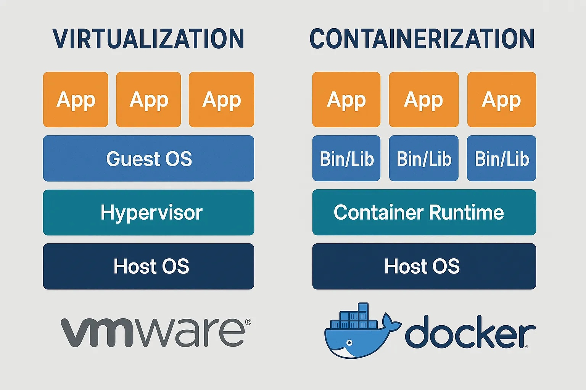
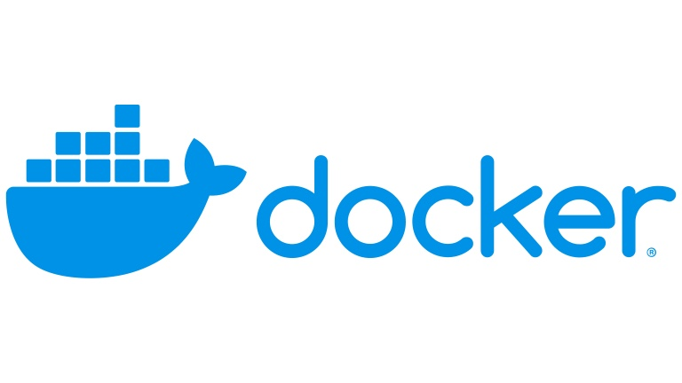
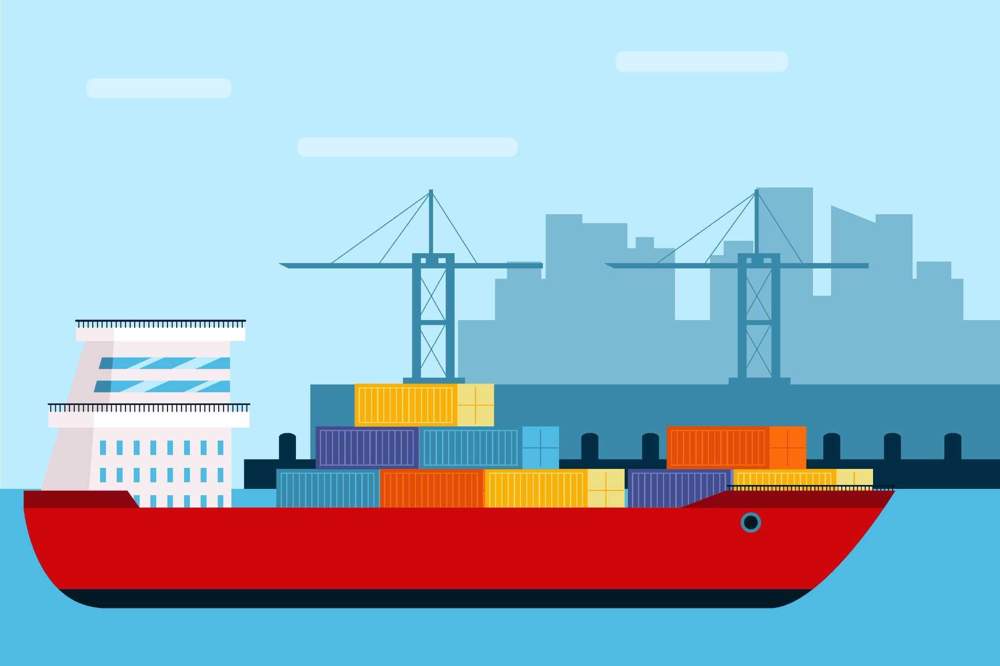
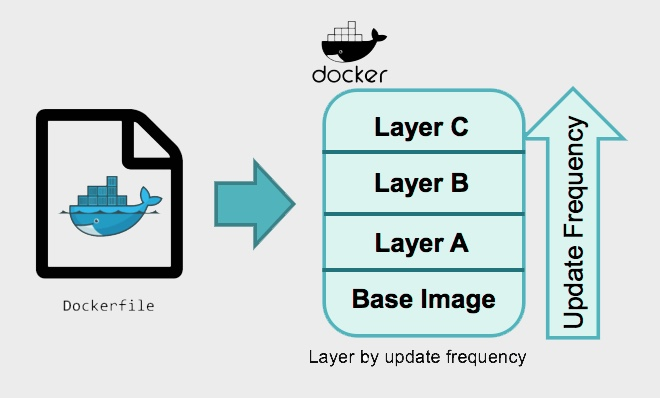

# 왜 우리는 도커를 써야만 할까?

## 도커를 사용하게 된 계기

팀 프로젝트를 진행하며 CI/CD 기반 배포 자동화를 구축하는 과정에서, 중요한 과제 하나를 마주하게 되었습니다.
바로 **개발, 테스트, 운영 환경에서 애플리케이션이 동일하게 동작하도록 보장하는 것**이었습니다.

이 문제를 해결하기 위해 **도커(Docker)** 를 도입했습니다.
덕분에 애플리케이션을 손쉽게 패키징하고, 어디서든 동일하게 배포할 수 있는 경험을 얻을 수 있었습니다.

---

## 도커에 대한 오해

도커라고 하면 많은 사람들이 가벼운 가상머신(VM) 을 떠올립니다.
기존의 가상머신처럼 격리된 환경을 제공하면서도 더 가볍고 빠르다는 인상 때문이죠.

실제로 서버나 데이터베이스를 명령어 한 줄로 만들어내는 경험은
이런 생각을 더욱 굳히게 만듭니다.

하지만 이는 절반만 맞는 이야기입니다.
도커가 가상머신처럼 격리된 환경을 제공하는 것은 사실이지만, 동작 원리는 근본적으로 다릅니다.

---

## 무엇이 다른가? : ‘Guest OS의 유무’



가장 결정적인 차이는 게스트 운영체제(Guest OS) 를 포함하는지 여부에 있습니다.

- **가상머신(VM)**  
  호스트 OS 위에 하이퍼바이저를 통해 가상의 하드웨어를 만들고,  
  그 위에 **독립된 OS(게스트 OS)** 를 통째로 설치합니다.  
  즉, 'OS 위의 OS 구조'라 무겁고 느릴 수밖에 없습니다.


- **도커 컨테이너**  
  별도의 OS를 설치하지 않습니다.  
  대신 **호스트 OS의 커널을 공유하며**,  
  프로세스를 논리적으로 분리해 격리합니다.  
  필요한 애플리케이션과 라이브러리만 담기 때문에 매우 가볍고 빠릅니다.


### 용어 정리

- **호스트 OS**: 건물이 세워진 땅입니다. 우리가 사용하는 운영체제(Windows, macOS 등).
- **하이퍼바이저**: 땅 위에 여러 집을 지을 수 있게 해주는 건축 기술.  
  CPU, 메모리 같은 하드웨어 자원을 나누어 가상 공간을 만드는 소프트웨어입니다.
- **게스트 OS**: 그렇게 만들어진 집. 즉, 가상 공간 안의 또 하나의 운영체제입니다.



이처럼 도커는 OS를 통째로 빌려쓰는 ‘단독 주택’이 아니라,  
건물의 기반 시설(커널)은 공유하되 각 세대가 완벽히 분리된 ‘아파트(컨테이너)’와 같습니다.  
도커의 로고에 고래가 여러 개의 컨테이너를 싣고 있는 모습은 이러한 특징을 잘 보여줍니다.

---

## 그렇다면 ‘컨테이너’란 무엇일까요?

이제 왜 도커가 ‘가벼운 가상머신’이라는 표현만으로는 부족한지 명확해졌을 겁니다. 도커는 가상머신을 만드는 기술이 아니라, 
앞서 설명한 방식으로 애플리케이션을 격리하는 ‘컨테이너’ 기술을 편리하게 사용하도록 돕는 플랫폼입니다.

그렇다면 이 ‘컨테이너’란 정확히 무엇일까요?



‘컨테이너’라는 단어를 들으면 거대한 항구의 화물선에 실린 컨테이너가 떠오릅니다. 소프트웨어의 컨테이너도 이와 비슷한 개념입니다. 
화물 컨테이너가 가구, 전자제품, 의류 등 내용물과 상관없이 규격화되어 어디서든 동일하게 운송될 수 있는 것처럼,
소프트웨어 컨테이너는 애플리케이션이 어떤 환경으로 옮겨가더라도 똑같이 실행될 수 있도록 격리된 실행 공간 그 자체를 의미합니다.


이렇게 격리된 컨테이너 덕분에, 우리는 "제 컴퓨터에선 잘 됐는데요?"라는 고질적인 문제를 해결할 수 있습니다.

---

## 도커 이미지

앞서 컨테이너가 격리된 실행 공간이라고 이야기했습니다. 그렇다면 이 컨테이너는 어떻게 만들어지는 걸까요?  
바로 그 설계도 역할을 하는 것이 **‘이미지(Image)’** 입니다.

이미지는 컨테이너를 실행하기 위해 필요한 모든 것을 담고 있는 **읽기 전용 템플릿**입니다.

Java와 Spring Boot를 기준으로 이미지에 어떤 것이 담겨 있는지 살펴보겠습니다.


1. **애플리케이션 실행 파일 (JAR/WAR)**   
  가장 핵심적인 내용물로, Maven이나 Gradle로 빌드하여 생성된 실행 가능한 .jar 파일 (또는 .war 파일)이 포함됩니다. 
  (예: my-application-0.0.1-SNAPSHOT.jar)


2. **자바 런타임 (JVM)**   
  .jar 파일을 실행하기 위해 반드시 필요한 자바 가상 머신(JVM)입니다. 이미지에는 특정 버전의 JDK 또는 JRE가 설치되어 있습니다. (예: OpenJDK 21)


3. **운영체제 파일 및 시스템 도구**   
  JVM이 동작하는 데 필요한 최소한의 운영체제 파일들입니다. Java 애플리케이션은 OS 의존성이 낮은 편이라, 
  아주 가벼운 Alpine Linux나 distroless 같은 최소한의 OS 이미지를 베이스로 사용하는 경우가 많습니다.


4. **설정 파일 및 환경 변수**   
  Spring Boot 애플리케이션의 동작을 제어하는 application.properties 또는 application.yml 파일이 포함됩니다.
  데이터베이스 접속 정보, 서버 포트, 외부 API 키 등 컨테이너 외부에서 주입받을 수 있도록 환경 변수로 설정된 값들도 여기에 해당합니다.


5. **시작 명령어 (Startup Command)**   
  컨테이너가 시작될 때 자동으로 .jar 파일을 실행하는 명령어에 대한 정보입니다.
  보통 java -jar my-application-0.0.1-SNAPSHOT.jar 와 같은 명령어가 여기에 담겨 있습니다. 
  이런 이미지를 다운 받고 실행하는 것만으로도 하나의 컨테이너를 실행할 수 있습니다.

---

## 레이어(Layer) 구조



도커 이미지가 효율적인 이유는 레이어(Layer)라는 독특한 구조 때문입니다. 
이미지는 하나의 거대한 통파일이 아니라, 여러 개의 얇은 층이 겹겹이 쌓여있는 형태를 가지고 있습니다.

이것은 **유니온 파일 시스템(Union File System)**이라는 기술을 통해 구현되는데, 각 레이어는 바로 아래 레이어로부터 변경된 부분만을 담고 있습니다.

### Dockerfile과 레이어의 관계

Dockerfile의 각 명령어(FROM, COPY, RUN 등)는 기본적으로 하나의 레이어를 생성합니다.

```  
# 1. 베이스 이미지 레이어
FROM openjdk:21-jdk

# 2. 빌드 시 사용할 변수 정의
ARG JAR_FILE=/build/libs/*.jar

# 3. JAR 파일을 app.jar로 복사하는 레이어
COPY ${JAR_FILE} app.jar

# 4. 컨테이너 시작 명령어 설정
ENTRYPOINT ["java","-Dspring.profiles.active=prod","-Djava.net.preferIPv4Stack=true","-jar","/app.jar"]
```  

*<토독토독 서비스의 Dockerfile.prod>*

위 Dockerfile로 이미지를 빌드하면, 각 단계가 별도의 필름처럼 쌓여 하나의 완성된 이미지처럼 보이게 됩니다. 
각 명령어가 레이어를 어떻게 만드는지 조금 더 자세히 살펴보겠습니다.

### Dockerfile 명령어와 레이어 구조 이해하기

`FROM openjdk:21-jdk`
FROM 명령어는 openjdk:21-jdk 이미지가 이미 가지고 있는 모든 레이어들을 그대로 가져와 기초 공사를 하는 것과 같습니다. 
이 위에 우리가 직접 만든 레이어를 쌓아 올리게 됩니다.

`COPY ${JAR_FILE} app.jar` 
COPY 명령어는 파일 시스템에 실질적인 변경(파일 추가)을 가하므로, 
openjdk:21-jdk 레이어들 위에 새로운 레이어를 하나 생성합니다. 이 새로운 레이어에는 오직 app.jar 파일 하나만 포함되어 있습니다.

`레이어를 만들지 않는 명령어들 (ARG, ENTRYPOINT)` 
모든 명령어가 레이어를 만드는 것은 아닙니다. ARG는 빌드 과정에서만 사용될 변수이고, 
ENTRYPOINT는 이미지의 실행 방법을 정의하는 메타데이터(metadata)입니다. 
이처럼 파일 시스템을 직접 바꾸지 않는 명령어들은 새로운 레이어를 생성하지 않습니다.


이러한 레이어 구조 덕분에, 만약 소스 코드가 변경되어 COPY 명령어만 다시 실행해야 할 경우, 
도커는 FROM 단계의 기존 레이어를 그대로 **재사용(캐싱)** 하고 변경된 COPY 단계부터 새로운 레이어를 만들기 때문에 빌드 속도가 매우 빨라집니다.

### 컨테이너 실행

이렇게 만들어진 이미지는 여러 개의 읽기 전용 레이어로 구성된 효율적인 '설계도'입니다. 그런데 여기서 한 가지 궁금증이 생깁니다. 
읽기만 가능한 이미지로부터, 어떻게 애플리케이션이 로그를 남기거나 파일을 수정하는 '실행'이 가능할까요?

그 비밀이 바로 컨테이너가 실행될 때 추가되는 마지막 한 겹의 레이어에 있습니다.

### 컨테이너 실행: 쓰기 가능한 레이어 추가와 CoW

이미지로 컨테이너를 실행(docker run)하면, 도커는 쌓여있는 읽기 전용 이미지 레이어들 위에 마지막으로 얇은 '쓰기 가능한(Writable) 레이어'를 하나 더 올립니다.

- 읽기: 컨테이너가 파일을 읽을 때는 아래쪽의 '읽기 전용 레이어'들에서 데이터를 가져옵니다.

- 쓰기/수정: 컨테이너 안에서 파일을 수정하거나 새로운 파일을 생성하면, 그 변경 사항은 오직 맨 위의 '쓰기 가능한 레이어'에만 기록됩니다.

이 방식을 Copy-on-Write (CoW)라고 부릅니다. 원본 이미지 레이어는 절대 건드리지 않고, 
변경이 필요할 때만 해당 파일을 쓰기 가능한 레이어로 복사(Copy)한 뒤 수정(Write)하는 것입니다. 
덕분에 원본 이미지는 항상 그대로 보존되며, 원본 이미지로부터 수백 개의 컨테이너를 실행해도 원본은 오직 하나만 존재하게 됩니다.

---
## 토독토독 서비스 도커 적용기

저희 서비스는 배포 자동화를 위해 GitHub Actions를 사용했습니다. 아래는 저희 프로젝트의 실제 CI/CD 스크립트 전체입니다. CI Job에서는 코드를 테스트하고 빌드하여 Docker 이미지로 만들어
Docker Hub에 올리고, CD Job에서는 서버에서 그 이미지를 받아 실행시킵니다.

```
name: Backend CI/CD


on:
 push:
   branches: [ "main" ]
   paths:
     - 'backend/**'


jobs:
 ci:
   runs-on: ubuntu-latest


   defaults:
     run:
       shell: bash
       working-directory: ./backend


   permissions:
     contents: read


   steps:
     - name: Checkout repository
       uses: actions/checkout@v4
       with:
         fetch-depth: 0
         submodules: recursive
         token: ${{ secrets.SECRETS_SUBMODULE_ACCESS_TOKEN }}


     - name: Set up JDK 21
       uses: actions/setup-java@v3
       with:
         java-version: '21'
         distribution: 'temurin'
         cache: gradle


     - name: Grant execute permission to gradlew
       run: chmod +x gradlew


     - name: Clean Project
       run: ./gradlew clean


     - name: Run Unit Tests
       run: ./gradlew test


     - name: Assemble Build
       run: ./gradlew build


     - name: Login to Docker Hub
       uses: docker/login-action@v3.3.0
       with:
         username: ${{ secrets.DOCKERHUB_DEPLOY_USERNAME }}
         password: ${{ secrets.DOCKERHUB_DEPLOY_TOKEN }}


     - name: Docker Image Build & Push
       run: |
         docker buildx build -f Dockerfile.prod --platform linux/arm64 -t woowajeff/todoktodok:prod --push .


 cd:
   needs: ci
   runs-on: [self-hosted, prod]
   steps:
     - name: Cleanup backend log and promtail data directory before checkout
       run: |
         sudo rm -rf backend/promtail_data || true
         sudo rm -rf backend/log || true


     - name: Checkout repository
       uses: actions/checkout@v4
       with:
         token: ${{ secrets.SECRETS_SUBMODULE_ACCESS_TOKEN }}


     - name: Login to Docker Hub
       uses: docker/login-action@v3.3.0
       with:
         username: ${{ secrets.DOCKERHUB_DEPLOY_USERNAME }}
         password: ${{ secrets.DOCKERHUB_DEPLOY_TOKEN }}


     - name: Stop running Container (without removing)
       run: |
         echo "prod 컨테이너 중지 중..."
         docker stop prod && echo "prod 컨테이너 중지 완료" || echo "prod 컨테이너 없음"
         echo "promtail_prod 컨테이너 중지 중..."
         docker stop promtail_prod && echo "promtail_prod 컨테이너 중지 완료" || echo "promtail_prod 컨테이너 없음"


     - name: Docker Compose Pull & Up (no-build)
       env:
         ENV_ID: ${{ github.run_id }}
       run: |
         cd backend
         echo "ENV_ID: $ENV_ID"
         docker compose -f config/docker-compose-prod.yml pull
         docker compose -f config/docker-compose-prod.yml up -d --no-build
         echo "docker compose-prod up"


     - name: Docker image Prune
       run: |
         echo "24시간 이상 사용되지 않은 Docker 이미지 정리 중..."
         sudo docker image prune -f --filter "until=24h"
         echo "이미지 정리 완료"


```

<backend-ci-cd-prod.yml>

도커를 도입한 덕분에 스크립트를 보다 간결하게 작성할 수 있었습니다.

### 도커가 없었다면 CI/CD 스크립트는 어떻게 변할까요?

만약 도커를 사용하지 않고 오직 .jar 파일만으로 배포한다면, 현재 스크립트의 CD job은 다음과 같은 복잡한 작업을 수행해야 합니다.


#### 1. 빌드 결과물 전달 방식의 변경

현재 CI 잡은 빌드가 끝난 환경 전체(jar + JVM + OS)를 `docker push` 명령어로 Docker Hub에 올리면 끝입니다. 매우 간단하죠.

도커를 사용하지 않는다면 CI job 마지막에 `.jar` 파일을 `upload-artifact`를 사용해 GitHub 저장소에 업로드해야 합니다.  
그리고 CD job에서는 `download-artifact`로 이 파일을 서버에 직접 다운로드해야 합니다.


#### 2. 서버 환경의 완벽한 동기화 문제

현재 Dockerfile에 `FROM openjdk:21`이 명시되어 있으므로, 어떤 서버에서 실행하든 항상 JDK 21 환경임이 100% 보장됩니다.

도커를 사용하지 않는다면 CD를 실행하는 self-hosted 서버에 JDK 21이 반드시 미리 설치되어 있어야 합니다.  
만약 실수로 JDK 17이 설치되어 있거나, 다른 시스템 라이브러리 버전이 맞지 않으면 배포는 즉시 실패합니다.

나중에 Java 버전을 22로 올리려면, 코드 수정뿐만 아니라 서버의 Java부터 수동으로 업그레이드해야 하는 추가 작업이 발생합니다.


#### 3. 프로세스 관리의 복잡성
현재 docker compose up -d 명령어 하나가 모든 것을 처리해 줍니다. 
기존 컨테이너를 내리고, 새로운 이미지를 받아 새 컨테이너를 띄우는 전 과정이 원자적으로(atomically) 이루어집니다.


도커를 사용하지 않는다면 CD job 스크립트는 수많은 셸 스크립트 명령어를 직접 작성해야 했을 겁니다.

```
  # 기존 프로세스 PID 찾기
  ps -ef | grep 'java -jar todoktodok.jar' | grep -v grep | awk '{print $2}' 와 같은 명령어로 
  실행 중인 Java 프로세스의 ID(PID)를 찾아야 합니다.

  # 기존 프로세스 종료
  kill -15 [PID] 명령어로 기존 프로세스를 종료시켜야 합니다. 바로 종료되지 않을 경우를 대비해 
  sleep을 넣거나 강제 종료(kill -9) 로직을 추가해야 합니다.

  # 새로운 프로세스 실행
  다운로드한 새 .jar 파일을 nohup java -jar todoktodok.jar & 와 같은 명령어로 백그라운드에서 실행시켜야 합니다.

  # Promtail 관리
  promtail 역시 별도의 프로세스이므로, 이 또한 systemd 같은 서비스로 등록하거나 PID를 찾아 수동으로 관리해야 합니다.

```

#### 4. 롤백의 어려움
현재 배포에 문제가 생기면, 이전 버전의 이미지 태그(예: woowajeff/todoktodok:prod-v1.1)를 다시 pull 받아 
docker compose up을 실행하면 즉시 롤백됩니다. 


도커를 사용하지 않는다면 서버에 이전 버전의 .jar 파일(todoktodok-v1.1.jar)을 보관하고 있어야 하며, 
롤백 스크립트는 이 파일을 다시 실행하도록 별도로 작성해야 합니다. 버전 관리가 매우 복잡해집니다.

---

## 마치며

돌이켜보면, 도커를 도입하고 얻은 가장 큰 변화는 '본질에 집중할 시간'을 확보한 것이었습니다.

환경 설정, 의존성 충돌, 배포 스크립트와의 씨름에서 벗어나, 저희는 온전히 서비스의 비즈니스 로직을 고민하고 
더 나은 코드를 작성하는 데 시간을 쓸 수 있었습니다.

결국 도커는 개발자가 인프라의 복잡함에 얽매이지 않고, 더 중요한 문제에 집중할 수 있도록 도와주는 강력한 도구라고 생각합니다. 
이 글이 여러분의 프로젝트에 도커를 적용하는 데 작은 도움이 되었으면 좋겠습니다.

---

## 출처
- https://docs.docker.com/get-started/
- https://docs.github.com/en/actions/tutorials/publish-packages/publish-docker-images
