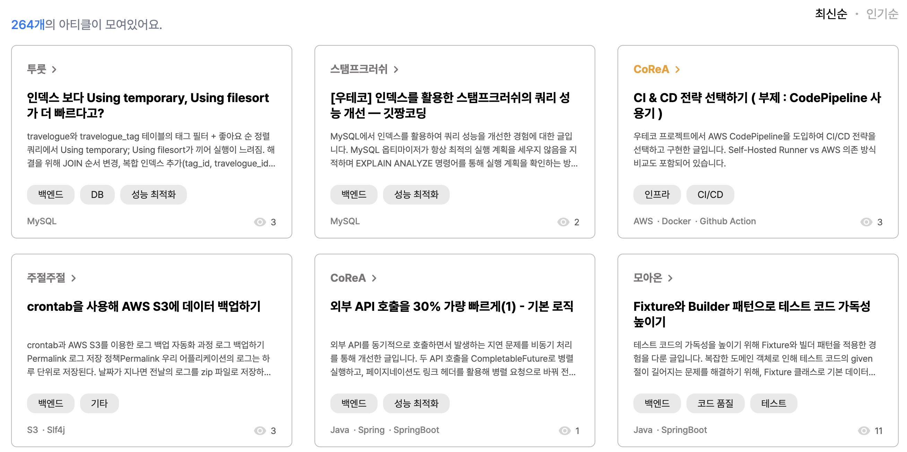
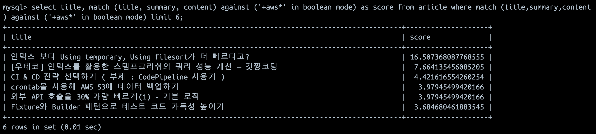
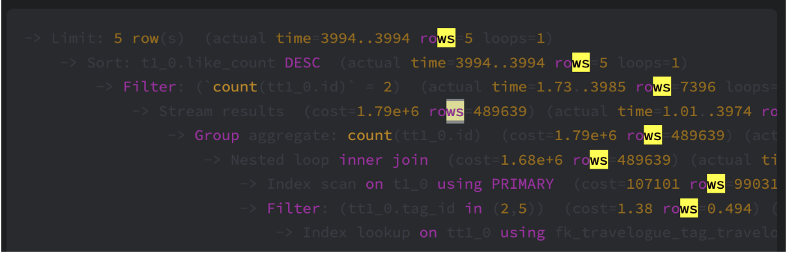
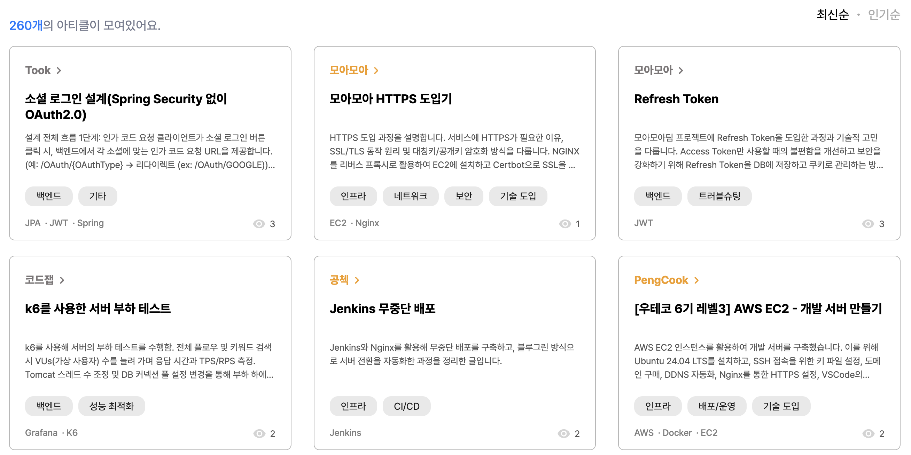
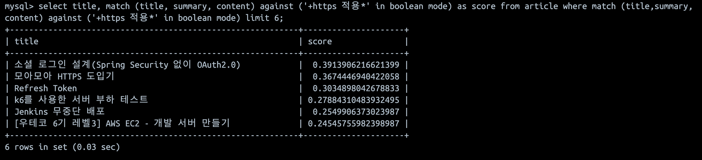
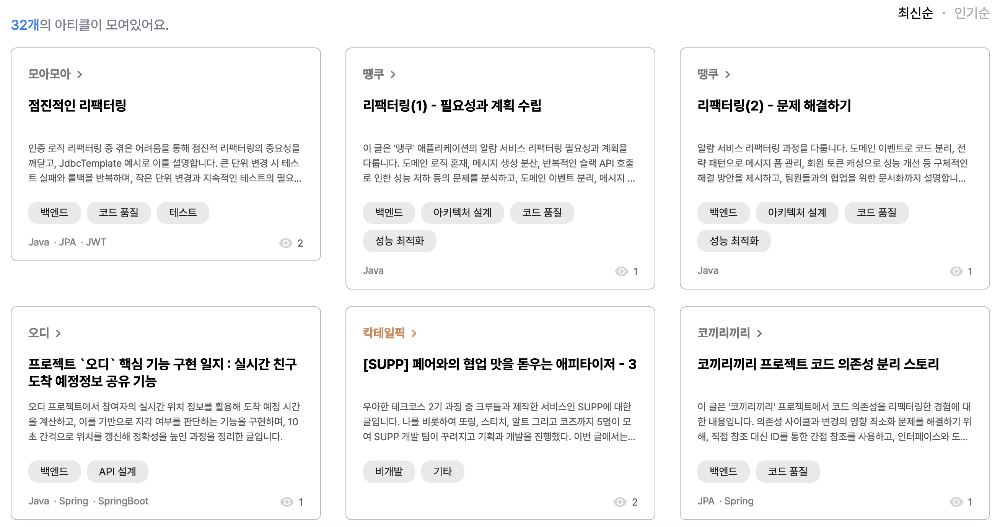
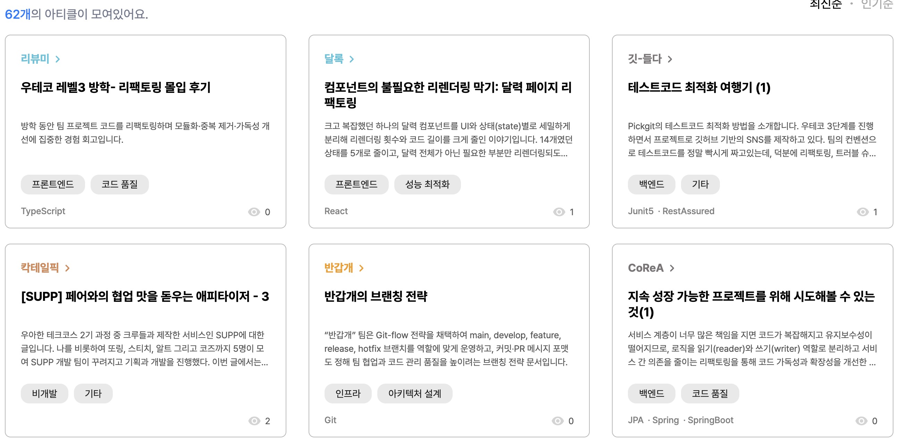

# 검색 품질 향상시키기
> **더 나은 검색 경험을 구축한 기록**
---
## 대상 독자
검색 결과의 품질을 향상시키고 싶은 사람
검색 시 원하는 결과가 상위에 노출되지 않아 고민인 서버 개발자

## 서비스 배경

모아온은 프로젝트라는 맥락 안에서의 기술적 인사이트를 제공하는 서비스입니다. 따라서 핵심 페르소나는 기술적 인사이트를 얻고싶어 하는 뷰어였습니다. 뷰어가 원하는 정보를 찾기 위해서는 검색, 필터, 정렬 등의 기능이 핵심이었습니다.

또한 사용성 테스트에서도 절반에 가까운 사용자는 원하는 정보를 얻기위해 **검색**을 가장 먼저 수행했습니다.

결국 검색 기능은 모아온의 핵심 기능이며, 서비스의 가치에 막대한 영향을 미치는 중요한 기능입니다.

### 기존 검색 시스템: MySQL Full-Text Search

개발 초기에는 단순히 MySQL의 Like 기능을 활용했습니다. 입력한 검색어와 완전히 일치하는 것만 검색되는 것이 옳다고 생각했습니다.

하지만 사용성 테스트에서, 그리고 실제로 사용해 보면서 한계에 직면했습니다.
Like의 “완전 일치”로 인해 검색에 실패하는 경우가 많았습니다. “스프링 CORS”라고 검색했을 때, 스프링 환경에서 CORS를 다루는 글은 검색되지 않았습니다. 완전 일치가 아니기 때문입니다.

그래서 MySQL FullText Search 기능을 활용했습니다. 2-gram parser를 이용해 단어를 2글자씩 잘라 색인했습니다. 덕분에 Like보다 유연한 검색이 가능했습니다. 또 매칭되는 토큰의 수에 비례해 점수화하는 기능 덕분에 정확도가 있었습니다.

### Full-Text Search의 문제

불만족스러운 검색 결과를 마주치는 상황이 많았습니다.

1.관련 없는 문서가 많이 검색됩니다.

“aws”에 대한 검색 결과입니다.

2-gram 파서를 사용중이므로 “aws”를 “aw”, “ws”로 자르게 됩니다. 그리고 토큰의 매칭 빈도만으로 점수를 매깁니다. 첫 번째 게시글의 경우 아래 사진과 같이 “ws”가 많이 매칭되어서 최고 점수를 받았음을 알 수 있습니다.

2-gram을 사용하지 않고 유의미한 토큰을 추출하기 위해서는 형태소 분석이 필요했습니다.
“로드밸런서”와 같이 복합명사들을 쪼개지 않도록 사전도 필요했습니다.

2.세밀한 스코어링이 불가능합니다.

Full-Text Search는 검색어의 빈도만으로 점수를 매깁니다.

“HTTPS 적용”에 대한 검색 결과입니다.
첫 번째를 비롯한 다른 주제의 글들이 상위에 있는 이유는 “HTTPS”라는 단어 자체가 많이 등장했기 때문입니다.

1위 문서인 소셜 로그인 설계 아티클의 경우 API의 URL에 https://가 많아서 1등을 했습니다. 즉 단어의 빈도만으로는 아티클의 관련도가 높다고 볼 수 없습니다.

3.같거나 유사한 의미의 다른 단어로 검색 시 검색되지 않습니다.

많은 사람들이 “리팩터링”과 “리팩토링”을 구분 없이 사용합니다.
둘은 같은 의미임에도 불구하고 검색 결과는 달랐습니다.

“리팩터링”에 대한 결과(위)와 “리팩토링”에 대한 결과(아래)입니다.
전혀 다른 결과가 검색됨을 알 수 있습니다.

## 검색 품질을 결정짓는 세 가지 축

검색 품질은 단순히 “검색 결과가 나온다”로 판단할 수 없습니다.
사용자는 검색창에 단어를 입력하는 것이 아니라, **의도**를 전달합니다.
따라서 검색 품질은 아래 세 가지 요소에 의해 결정됩니다.

1. **형태소 분석** – 사용자의 단어를 기계가 이해 가능한 언어로 해석  
2. **사전(Synonym / Domain Dictionary)** – 서로 다른 단어를 같은 개념으로 연결  
3. **스코어링(Scoring)** – 정말 중요한 문서를 위쪽에 노출

### 형태소 분석

사용자의 검색 의도는 **단어, 품사, 의미에 존재합니다.**
예를들어 “리팩터링을 진행합니다.”라는 문장에서 “리팩터링”을 추출해야합니다.

형태소 분석은 검색엔진이 단어의 **의미 단위**를 인식하게 만듭니다.  
이 순간부터 “검색 실패”가 “검색 부족”으로 바뀌기 시작합니다.

### 사용자 사전

형태소 분석이 복합 명사를 분리하기도 합니다.
예를들어 “로그아웃”은 하나의 의미를 가지지만, “로그”와 “아웃”으로 분리되면 그 의미가 사라집니다.

따라서 형태소 분석 과정에서 “로그아웃”을 분리하지 않고 하나의 단어로 인식할 필요가 있습니다. 사전에 “로그아웃”을 정의함으로써 분리되지 않는 하나의 단어로 취급할 수 있습니다.

### 동의어 사전

사용자는 같은 의미의 단어를 제각기 사용합니다.

| 사용자 입력 | 실제 문서 표현 |
|-------------|----------------|
| 리팩토링 | 리팩터링 |
| docker | 도커 |
| CI/CD | 배포 자동화 |

형태소 분석만으로는 이것을 연결하지 못합니다.  
여기서 필요한 것이 **동의어 사전(Synonyms Dictionary)**입니다.

동의어 사전은 다음 두 가지를 해결합니다.

- **동일 개념어 통합** → “리팩토링” = “리팩터링”
- **도메인 용어 인식** → “스프링 CORS” = “Spring CORS 설정”

### 스코어링

앞의 예시로 볼 수 있듯이 단어가 많이 나온 문서가 사용자가 찾는 문서는 아닙니다.

간단한 예시로 아래와 같이 점수를 평가할 수 있습니다.
- 검색어가 제목에 있는 경우 높은 점수
- 검색어가 여러 개인 경우 문서에서 검색어들이 가까이 있을 수록 높은 점수
- “설계”, “구현”과 같은 상대적으로 비결정적인 흔한 단어는 낮은 점수

인기도나 최신성을 반영할 수도 있지만 정확도가 최우선 과제라 생략합니다.

## 적용해보기

실제 구현은 ElasticSearch를 이용했습니다.

### 형태소 분석

