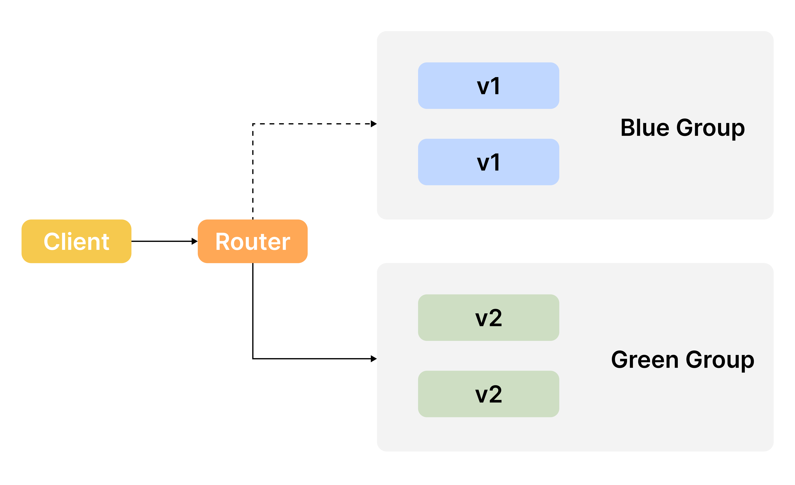
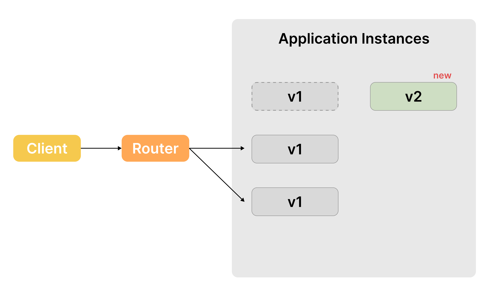
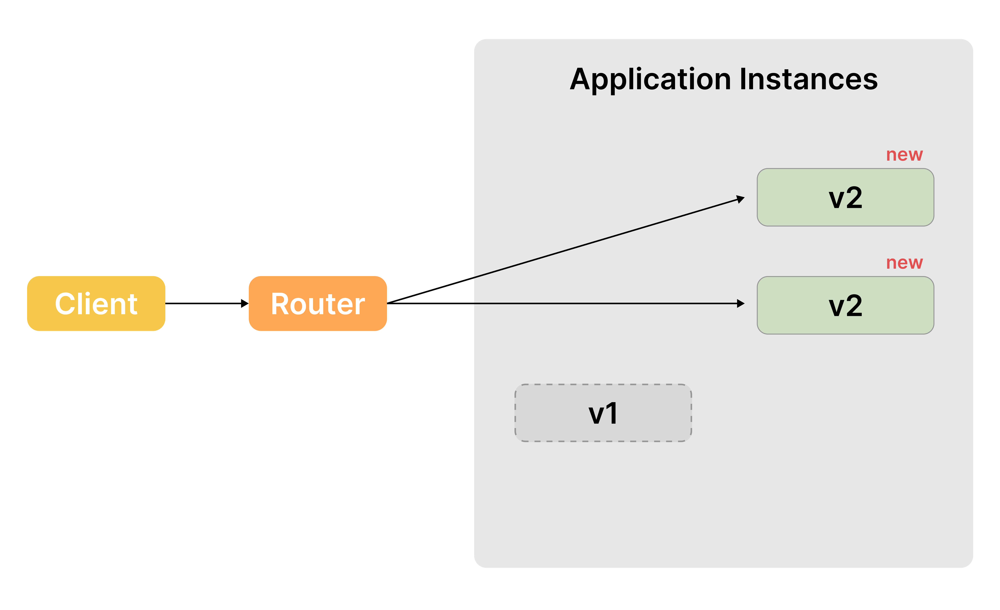
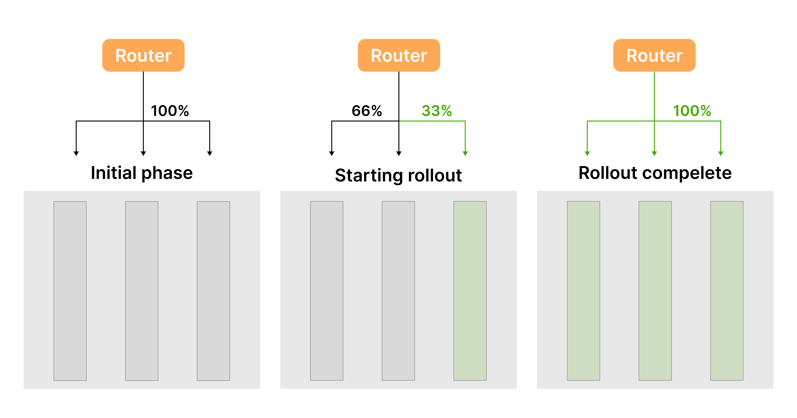

# 1. 무중단배포란?

## 무중단배포 개념

배포는 다운타임 없이 사용자 환경을 방해하지 않고 애플리케이션을 설치하거나 업그레이드하는 것을 목표로 합니다. 배포가 사용자 경험에 미치는 영향과 다양한 측면을 고려해야 합니다.

가장 기본적인 전략은 **배포 재생성 전략**입니다. 이름에서 알 수 있듯이 애플리케이션을 중지했다가 다시 생성합니다. 새로 생성된 배포는 업데이트된 버전의 애플리케이션을 실행합니다. 새 버전이 실행되기 전에 애플리케이션을 중지해야 하므로 사용자는 약간의 다운타임을 경험하게 됩니다.

이 전략은 설정하기 쉽지만 **새 버전에서 애플리케이션에 버그가 발생하면 사용자가 쉽게 되돌릴 수 없는 상황**이 생길 수 있으며, 롤백 시 더 많은 다운타임이 발생할 수 있습니다.

## 왜 무중단배포를 해야할까?

# 2. 무중단배포 전략

## 1. Blue-Green(Red-Black) 배포

블루-그린 배포(Blue-Green Deployment)는 소프트웨어 배포 전략의 하나로, 새로운 버전의 애플리케이션을 안전하게 출시하기 위해 두 개의 환경(블루와 그린)을 사용하는 방법입니다. 이 방식의 주요 목적은 다운타임을 최소화하고, 롤백을 쉽게 할 수 있도록 하는 것입니다. 아래에 블루-그린 배포의 상세한 구성 요소와 절차를 설명하겠습니다.

### 1. 환경 구성

- **블루 환경**: 현재 운영 중인 애플리케이션 버전이 배포된 환경입니다.
- **그린 환경**: 새로 배포할 애플리케이션 버전이 준비된 환경입니다. 이 환경은 블루와 동일한 설정을 갖추고 있으며, 블루에서의 변경 사항이 그린에 반영됩니다.

### 2. 배포 과정

1. 애플리케이션의 **새로운 버전을 그린 환경에 배포**합니다. 이 과정에서 데이터베이스 마이그레이션이나 기타 필요한 구성 변경도 함께 이루어질 수 있습니다.
2. 새 버전이 그린 환경에서 올바르게 작동하는지 검증하기 위해 테스트를 수행합니다. 이 단계에서 성능 테스트, 통합 테스트 등이 포함될 수 있습니다.
3. 새 버전이 안정적임을 확인한 후, **클라이언트의 요청을 블루 환경에서 그린 환경으로 전환**합니다. 이 과정은 부하 분산기를 통해 이루어지며, 이때 전체 트래픽을 전환하지 않고 일부 트래픽을 먼저 그린 환경으로 보내어 문제가 없는지 확인할 수도 있습니다.
4. 전환 후, 애플리케이션의 성능과 안정성을 모니터링합니다. 만약 문제가 발생하면 빠르게 블루 환경으로 롤백할 수 있습니다.
5. 모든 트래픽이 그린 환경으로 성공적으로 전환되고, 문제가 없다면 블루 환경은 더 이상 필요하지 않게 됩니다. 이후 블루 환경은 차기 버전을 위한 준비 환경으로 남기거나, 제거할 수 있습니다.

### 3. 장점

- 클라이언트에게 서비스 중단 없이 새로운 버전을 배포할 수 있습니다.
- 새 버전에서 문제가 발생할 경우, 블루 환경으로 즉시 롤백할 수 있습니다.
- 실제 사용자 트래픽을 발생시키기 전에 새 버전을 안전하게 테스트할 수 있습니다.
- 한 번에 트래픽을 모두 새로운 버전으로 옮기기 때문에 **호환성을 보장하지 않아도 가능합니다.**

### 4. 단점

- 두 개의 환경을 동시에 운영해야 하므로 인프라 비용이 증가할 수 있습니다.
- 관리해야 할 환경이 두 개이기 때문에 설정과 모니터링이 복잡해질 수 있습니다.

### 5. 사용 사례

Blue-Green 배포는 대규모 웹 애플리케이션, 클라우드 기반 서비스, 그리고 사용자에게 연속적인 서비스를 제공해야 하는 환경에서 자주 사용됩니다.

이 방식은 안정적인 배포와 사용자 경험을 유지하기 위해 많은 기업들이 선택하는 전략 중 하나입니다.

### 6. Red-Black

기존 애플리케이션 환경을 'Red', 업데이트된 환경을 'Black'이라고 합니다. Red-Black 배포는 Blue-Green 배포와 동일한 절차로 진행합니다.

Blue-Green과 Red-Black을 구분하는 관점은 명확하지 않습니다. 높은 수준에서 보면 이 두 용어(Green-Blue, Red-Black)는 모두 같은 것을 의미하며, 둘 사이의 기술적 차이는 특정 팀이나 회사 내에서만 의미가 있을 가능성이 높습니다. 자세한 내용은 [What is the difference between blue/green and red/black deployments?](https://octopus.com/blog/blue-green-red-black) 블로그를 참고하시길 바랍니다.

## 2. Rolling 배포

### 1. 개념

**롤링 업데이트**는 여러 개의 애플리케이션 인스턴스가 있을 때 적용되는 배포 전략입니다. **처음에는 모든 인스턴스가 이전 버전을 실행**하며, 다운타임 없이 점진적으로 새 버전으로 전환합니다.

### 2. 배포 과정

1. 업데이트된 버전을 실행하는 **새 인스턴스를 생성**합니다. 이 인스턴스가 시작되면 사용자 요청을 처리할 수 있습니다.
2. **이전 버전을 실행하는 인스턴스 중 하나를 제거**하여, 업데이트된 버전과 이전 버전을 동시에 지원합니다. 이를 위해 두 버전 간의 **상호 운용성**이 ****보장되어야 합니다.
3. 새 인스턴스를 추가하고 이전 버전을 계속 제거하는 방식으로 배포를 진행합니다. 이 과정을 반복하여 모든 인스턴스가 업데이트된 버전으로 교체됩니다.
4. 마지막 인스턴스가 업데이트된 인스턴스로 교체되면 배포가 완료됩니다. 애플리케이션이 예상대로 작동하는지 확인하고, 필요 시 테스트를 수행합니다.

### 3. 장점

- 배포 중 문제가 발생하면, 모든 변경 사항을 롤백할 수 있어 안전한 배포가 가능합니다.
- 업데이트할 인스턴스 수를 설정할 수 있어, **대규모 배포**에서도 효율적으로 관리할 수 있어 유연합니다.

### 4. 단점

- 배포가 진행되는 동안 구버전과 신버전이 공존하기 때문에 호환성 문제가 발생할 수 있습니다.

### 5. 사용사례

- 롤링 배포 방식은 가용 자원(인스턴스)이 제한적일 경우에 주로 사용됩니다.

---

## 3. Canary 배포

### 1. 개념

- Canary **배포**는 점진적으로 업데이트를 배포하여, 처음에는 일부 사용자에게만 새로운 버전을 적용하는 방식입니다.
- 점진적으로 구버전에 대한 트래픽을 신버전으로 옮기는 것은 Rolling 배포 방식과 비슷하지만 Canary 배포의 주된 목적은 위험을 줄이고 시스템의 안정성을 높이는 것입니다.

### 2. 배포 과정

1. 처음에는 전체 사용자 중 일부(예: 25%)에게만 업데이트를 배포합니다.
2. 초기 업데이트가 완료되면, 시스템을 테스트하여 애플리케이션이 정상적으로 작동하는지 확인합니다. 이 단계에서 발생하는 문제는 일부 사용자에게만 영향을 미칩니다.
3. **테스트 결과가 긍정적이면**, 다음 단계로 사용자 비율을 늘립니다 (예: 50%, 75%, 100% 순으로).
4. 각 단계에서 시스템을 다시 테스트하고, 문제가 발생하면 이전 버전으로 롤백할 수 있습니다.

### 3. 장점

- 문제가 발생할 경우 영향을 받는 사용자가 제한적이므로, 전체 시스템에 미치는 위험을 줄일 수 있습니다.
- 사용자 그룹을 선택하여 업데이트를 받을 대상을 조정할 수 있으며, 인구 통계, 물리적 위치, 디바이스 유형 등을 기준으로 사용자 선택이 가능합니다.
- Blue-Green 배포에 비해 환경을 복제할 필요가 없으므로 필요한 리소스가 적습니다.

### 4. 단점

- 하지만 데이터베이스에 큰 변경이 있을 경우, 여전히 Blue-Green 배포와 유사한 문제에 직면할 수 있습니다.
- Canary 배포는 업데이트를 받을 사용자 그룹을 제한해야 하므로, 단순한 트래픽 전환만으로 이루어지는 Blue-Green 배포보다 구현이 더 복잡할 수 있습니다.

---

# 3. Router

다음으로 무중단배포를 위해 경로를 변경해주는 Router에는 무엇이 있는지 알아보겠습니다.

### 1. Nginx **(Reverse Proxy)**

### 장점:

- **간단하고 경량**: 설정이 비교적 간단하고 경량으로 동작하므로 적은 리소스로 효율적인 트래픽 관리를 수행할 수 있습니다.
- **확장성**: 다양한 플러그인 및 모듈을 통해 확장성이 높습니다. 예를 들어 SSL/TLS 처리나 웹서버 기능을 함께 제공할 수 있습니다.
- **고성능**: 고성능으로 많은 양의 트래픽을 처리할 수 있으며, 특히 정적 파일 제공이나 캐싱 기능을 활용할 때 매우 효율적입니다.
- **대중성**: NGINX는 널리 사용되고 있어 커뮤니티 지원이 풍부하고 다양한 튜토리얼과 예제 코드가 많이 존재합니다.

### 단점:

- **상대적으로 단순한 트래픽 제어**: 복잡한 트래픽 분산이나 트래픽 가중치 분배와 같은 고급 트래픽 제어 기능을 제공하지 않습니다.
- **수동 관리 필요**: 설정 파일을 직접 수정하고 재시작해야 하기 때문에 자동화된 트래픽 관리 기능은 제한적입니다.
- **대규모 배포에서 복잡성 증가**: 대규모 환경에서는 여러 인스턴스를 관리해야 할 수 있어 복잡성이 증가할 수 있습니다.

### 2. **로드 밸런서 (Load Balancer)**

### 장점:

- **자동 트래픽 분배**: 로드 밸런서는 자동으로 트래픽을 여러 서버로 분배하여 서비스의 안정성을 높여줍니다.
- **유연성**: 여러 종류의 로드 밸런서(예: L4/L7 로드 밸런서)를 활용하여 애플리케이션 요구 사항에 맞는 트래픽 처리 방법을 선택할 수 있습니다.
- **고가용성**: 다중 서버에 트래픽을 분산시켜 서버 장애 발생 시에도 서비스를 지속할 수 있습니다.
- **클라우드 통합**: AWS ELB, Azure Load Balancer와 같은 클라우드 기반 로드 밸런서는 클라우드 환경과 원활히 통합됩니다.

### 단점:

- **비용**: 클라우드 기반 로드 밸런서는 사용량에 따라 비용이 발생하며, 트래픽이 많을수록 비용이 높아집니다.
- **복잡한 설정**: 고급 설정이나 다양한 조건에 따른 트래픽 분배를 적용하려면 복잡한 설정이 필요할 수 있습니다.
- **지연 시간 증가**: 로드 밸런서를 추가하면 트래픽이 한 번 더 거쳐가야 하므로, 소규모 서비스에서는 불필요한 지연이 발생할 수 있습니다.

### 3. **Kubernetes Ingress Controller**

### 장점:

- **클라우드 네이티브**: Kubernetes 환경에서 네이티브로 동작하므로 클러스터 내에서 트래픽 관리가 매끄럽습니다.
- **자동화**: 자동 스케일링 및 배포 기능과 결합하면 매우 자동화된 트래픽 관리 및 배포가 가능합니다.
- **복잡한 트래픽 관리 가능**: 라우팅 규칙을 쉽게 설정할 수 있으며, 다양한 HTTP 경로 기반 라우팅을 지원합니다.
- **유연성**: 트래픽을 특정 경로, 도메인 또는 호스트 이름에 따라 라우팅할 수 있습니다.

### 단점:

- **복잡성**: Kubernetes와 Ingress Controller를 함께 사용하려면 상당한 학습 곡선이 필요합니다. 특히, Kubernetes 자체에 대한 이해가 부족하다면 설정이 복잡할 수 있습니다.
- **성능**: 대규모 트래픽 처리 시 Ingress Controller의 성능이 낮아질 수 있으며, 이를 해결하기 위한 추가 설정이 필요할 수 있습니다.
- **제한된 기능**: 기본적인 Ingress Controller는 로드 밸런서나 서비스 메쉬처럼 고급 트래픽 관리 기능을 제공하지 않을 수 있습니다.

### 4. **Docker Swarm / Kubernetes**

### 장점:

- **자동화된 배포**: 컨테이너 기반 환경에서는 새로운 버전의 애플리케이션을 자동으로 배포하고 트래픽을 자동으로 분산시킬 수 있습니다.
- **내장된 트래픽 관리**: Docker Swarm이나 Kubernetes 자체에서 기본적인 트래픽 라우팅 기능을 제공합니다.
- **스케일링**: 컨테이너 기반으로 동작하기 때문에 자동 스케일링이 매우 용이합니다.
- **유연성**: 배포 방식과 서비스 라우팅을 자유롭게 설정할 수 있어 다양한 Blue-Green 배포 및 롤백 시나리오를 처리할 수 있습니다.

### 단점:

- **복잡성**: Kubernetes는 매우 강력하지만, 초기 설정과 운영이 복잡합니다. Docker Swarm은 Kubernetes보다는 간단하지만 여전히 설정이 필요합니다.
- **제한된 기본 트래픽 관리**: 기본 트래픽 관리 기능은 제한적일 수 있으며, Istio와 같은 추가 도구를 사용해야 고급 기능을 사용할 수 있습니다.
- **추가 도구 필요**: 경우에 따라 더 복잡한 요구사항이 있을 때는 Kubernetes만으로는 충분하지 않으며, Ingress Controller나 서비스 메쉬를 추가해야 할 수 있습니다.
