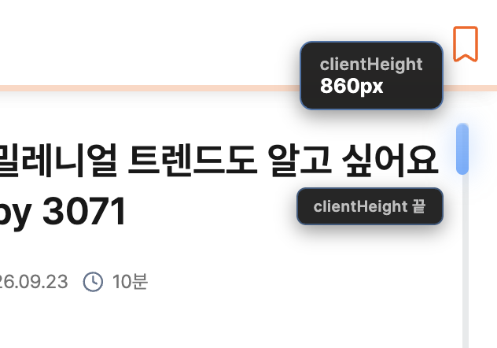
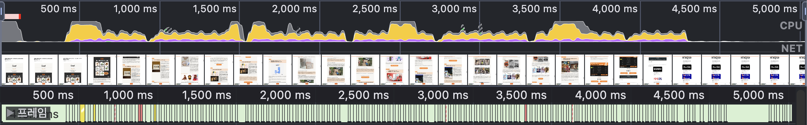
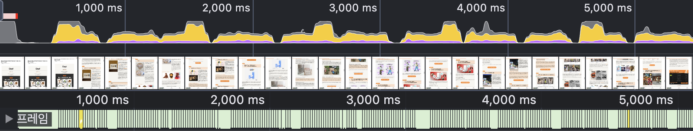

# 스크롤 파헤치기: 브라우저는 스크롤을 어떻게 계산할까

[봄봄](https://www.bombom.news/)에는 스크롤을 활용한 다양한 기능이 존재합니다. 사용자는 뉴스레터를 읽을 때 스크롤 위치에 기반하여 읽기 진행률을 확인할 수 있습니다. 또한, 읽다가 멈춘 뉴스레터에 다시 접속했을 때 마지막으로 읽은 위치를 바로 찾아갈 수 있습니다. 이 외에도 뉴스레터 읽음 여부 판별, 모달창 오픈 시 body 스크롤 비활성화 등 스크롤은 여러 기능에서 핵심 역할을 수행합니다. 저는 봄봄을 개발하며 스크롤 계산을 제대로 이해했을 때, 그 활용 가능성이 무궁무진하다는 것을 깨달았습니다.

따라서 이번 글에서는 스크롤 계산의 기본 원리와 동작을 이해하고, 어떻게 활용할 수 있는지, 실제 봄봄 서비스에서는 어떻게 사용되었는지 정리해보려고 합니다.

## 스크롤 좌표계의 이해: 세 가지 핵심 속성

### 스크롤 위치를 표현하는 세 가지 속성

브라우저는 DOM 요소를 배치할 때 좌표계를 기반으로 레이아웃을 계산합니다.

스크롤 역시 같은 맥락에서 '어느 정도의 거리만큼 내려왔는가'를 좌표로 표현할 수 있으며, 주로 다음 세 가지 속성으로 위치를 계산합니다.

- **scrollHeight**: 요소의 전체 컨텐츠 높이 (화면에 보이지 않는 overflow 영역 포함)
- **scrollTop**: 요소의 컨텐츠 최상단에서 스크롤된 픽셀 수
- **clientHeight**: 현재 화면에 보이는 요소의 내부 높이 (padding 포함)

위 설명은 MDN 문서의 정의를 인용한 것입니다. 이를 좀 더 직관적으로 확인하기 위해 봄봄의 아티클 페이지에 각 속성값을 표시해보았습니다.

<video width="700" autoplay loop muted playsinline>
  <source src="./assets/1-스크롤을%20계산하는%20세%20가지%20속성.mov" type="video/mp4">
</video>

아티클 페이지에서는 문서의 루트(html)에 스크롤이 생성되고 있습니다.

따라서 scrollHeight는 루트 요소 내부의 모든 컨텐츠 높이, 즉 페이지를 펼쳤을 때의 전체 높이가 됩니다. scrollTop은 이 아티클 페이지의 최상단에서 현재 스크롤 위치까지의 거리가 되며, clientHeight는 현재 화면에 보이는 페이지 영역의 높이가 됩니다.

위 영상처럼 스크롤을 내릴 때, scrollHeight와 clientHeight 값은 일정하지만 scrollTop의 값이 커지는 모습을 확인할 수 있었습니다.

### 스크롤 위치의 계산

위 세 가지 속성을 이해하면, 다양한 유형의 스크롤 위치를 계산할 수 있습니다.

가장 자주 사용되는 계산식은 스크롤 진행률입니다.

스크롤 가능한 전체 높이 중 현재까지 스크롤한 비율을 나타내는 값으로, 전체 컨텐츠 중 몇 퍼센트(%)를 읽었는지 알 수 있습니다.

```javascript
const scrollProgress = (scrollTop / (scrollHeight - clientHeight)) * 100;
```

진행률 공식은 위와 같은데요, 앞서 언급한 세 가지 속성을 모두 사용하여 계산합니다.

여기서 주목할 점은 scrollHeight에서 clientHeight를 제외한 값을 전체 높이로 설정한 것입니다.

처음에는 scrollHeight에서 clientHeight를 제외하는 것에 의문을 가졌습니다.

단순하게 생각하면 scrollHeight 자체가 스크롤 가능한 요소의 전체 높이이므로, scrollHeight에서 스크롤링한 픽셀 수인 scrollTop을 나눈 값이 진행률이라 이해할 수 있기 때문입니다.

<br>



<br>

그러나 위의 이미지와 같이, 스크롤이 페이지 최상단에 있을 때도(scrollTop = 0) clientHeight가 유효한 값을 가지는 점을 확인하고, 계산식을 이해할 수 있었습니다.

스크롤 위치와 무관하게 사용자는 항상 컨텐츠의 일부 영역을 화면으로 볼 수 있습니다.

scrollTop이 0일 때도 이미 clientHeight만큼의 영역이 노출되는 것입니다. 따라서 사용자는 실제 컨텐츠의 높이보다 더 짧은 길이만큼 스크롤을 내리게 됩니다.

결과적으로 실제로 스크롤해야 하는 거리는 컨텐츠의 전체 높이가 아닌, 그 높이에서 clientHeight만큼 제외한 값이 됩니다.

이러한 이유로, scrollHeight는 대부분의 계산식에서 단독으로 사용되지 않고 clientHeight를 제외한 값을 실질적인 스크롤 가능 높이로 사용한다는 것을 알 수 있습니다.

<br>

```javascript

페이지 하단까지 남은 거리 = scrollHeight - clientHeight  - scrollTop

페이지 하단 도달 여부 = scrollTop >= scrollHeight - clientHeight

한 페이지 아래로 이동 = scrollTop + clientHeight;

한 페이지 위로 이동 = scrollTop - clientHeight;

스크롤 가능 여부 = scrollHeight - clientHeight > 0;

최대 스크롤 가능 범위 도달 여부 (아래) =  scrollTop < scrollHeight - clientHeight;

```

<br>

### 아티클 읽기 진행률 UI 구현하기

스크롤 위치의 개념을 토대로 아티클 페이지의 뉴스레터 읽기 진행도를 구현했습니다.


아티클 페이지는 루트 스크롤을 통해 읽을 수 있습니다. 즉, 루트 스크롤이 뉴스레터 아티클의 스크롤과 같은 기능을 수행합니다. 따라서 document 객체에 접근하여 필요한 속성값을 바로 참조했습니다. 그리고 이 값을 이용해 진행률(progress)을 계산했습니다.

<br>

```javascript
const calculateProgress = () => {
  const scrollTop = document.documentElement.scrollTop;
  const scrollHeight = document.documentElement.scrollHeight;
  const clientHeight = document.documentElement.clientHeight;

  const totalScrollHeight = scrollHeight - clientHeight;

  return (scrollTop / totalScrollHeight) * 100;
};
```

이 값을 미리 구현해둔 ProgressBar 컴포넌트에 전달하면, 스크롤 위치에 기반한 읽기 진행률 UI를 구현할 수 있습니다.

저희 서비스는 emotion 라이브러리를 사용하고 있으므로 진행률 바(bar) 스타일 컴포넌트에 이 값을 인자로 넘겨, 동적으로 스타일링해주었습니다.

진행률(%)을 `width(%)`의 속성 값으로 전달하면 전체 너비에서 일정 비율만큼을 채워, 진행률을 표현할 수 있습니다.

```javascript
const ProgressGauge =styled.div<{ rate: number } >`
  overflow: hidden;
  width: ${({ rate }) => `${rate}%`};
  height: 100%;
  max-width: 100%;
  border-radius: ${({ rate }) => (rate >= 100 ? "10px" : "10px 0 0 10px")};

  background-color: ${({ theme }) => theme.colors.primary};

  transition: width 0.5s ease-in-out;
`;
```

<br>

위와 같은 과정을 거치면, 간단한 계산만으로 사용자의 편의성을 높이는 진행률 바를 만들 수 있습니다.

<video width="700" autoplay loop muted playsinline>
  <source src="./assets/4-progress-bar.mov" type="video/mp4">
</video>

<br>
<br>

## 스크롤 이벤트 최적화

앞서 구현한 진행률 바는 스크롤할 때마다 진행률을 계산하고 UI를 업데이트합니다.

이처럼 스크롤 이벤트는 사용자가 스크롤하는 동안 초당 수십 번에서 수백 번까지 발생하기 때문에, 모든 이벤트마다 계산을 수행하면 **불필요한 연산과 렌더링이 반복되어** 성능 저하를 일으킬 수 있습니다.

이를 해결하기 위해 Throttle, Debounce, RequestAnimationFrame(RAF)과 같은 최적화 기법을 적용할 수 있습니다.

<br>

### Throttle vs Debounce vs RAF

세 가지 최적화 기법은 각각 다른 상황에 적합합니다.

**쓰로틀링(Throttle)**은 일정 주기마다 한 번씩만 로직이 실행되도록 제한하여 최적화하는 방식으로, 주로 스크롤을 하는 동안 주기적으로 로직을 계속 실행해야 하는 경우에 사용됩니다.

대표적으로 위애서 소개한 진행률 바의 업데이트, 무한 스크롤 등이 이러한 기능에 해당합니다.

다만, 봄봄의 진행률 바는 사용자가 스크롤을 내릴 때마다 실시간으로 UI가 업데이트되는 것을 더 중요하게 생각했기 때문에 쓰로틀링을 적용하지 않았습니다.

<br>

**디바운싱(Debounce)**는 이벤트가 멈춘 후 일정 시간이 지나면 로직을 실행하도록 최적화하는 방식으로, 스크롤이 완전히 멈춘 후에 실행되는 로직에 적용할 수 있습니다.

예를 들어, 스크롤 위치 저장이나 스크롤이 끝난 후 API를 호출하는 함수, 저희 서비스의 뉴스레터 아티클 읽음 처리 로직은 스크롤의 최종 위치를 토대로 기능이 동작합니다. 따라서 스크롤이 움직이는 동안에는 스크롤의 위치를 계산할 필요가 없습니다.

<br>

마지막으로 [**RequestAnimationFrame(RAF)**](https://developer.mozilla.org/ko/docs/Web/API/Window/requestAnimationFrame)는 브라우저의 리페인트 주기에 맞춰 함수를 실행하는 방식입니다.

브라우저는 일반적으로 화면을 초당 60번(60FPS) 업데이트합니다. 즉, 약 16ms마다 한 번씩 화면을 다시 그리는데, 이 간격을 **'리페인트 주기'**라고 합니다.

window 객체의 메서드인 `requestAnimationFrame`은 이 리페인트 수행 전에 실행할 함수를 콜백으로 받아, 브라우저의 렌더링 시점과 동기화하여 부드러운 UI 업데이트를 구현할 수 있습니다.

따라서 실시간 인터랙션이 중요한 UI 최적화에 적합합니다. 쓰로틀링을 적용했을 때 끊겨서 업데이트하는 것처럼 보이는 진행률 바도, RAF를 활용하면 부드러운 애니메이션을 구현할 수 있습니다.

<br>
<br>

### 개선된 성능 확인하기

봄봄에서는 스크롤 위치 저장 기능을 최적화하고자 디바운싱을 적용했습니다. 스크롤이 움직이는 동안 매번 위치를 저장할 필요가 없고, 사용자가 스크롤을 멈춘 후의 최종 위치만 저장하면 되기 때문입니다.

<br>

<video width="700" autoplay loop muted playsinline>
  <source src="./assets/6-scroll-move-but-store.mov" type="video/mp4">
</video>

<br>

최적화를 시작하기 전에, 먼저 스크롤 위치를 저장하는 `handleScroll` 함수가 스크롤 위치 변화에 따라 얼마나 호출되는지 확인했습니다.

그 결과 위 영상처럼 스크롤이 움직일 때마다 `handleScroll`이 호출되는 것을 확인할 수 있었습니다. 즉, 스크롤이 움직이는 동안에도 불필요하게 스크롤 위치를 저장하고 있었습니다.

<br>



<br>

한편 `handleScroll`의 잦은 호출은 프레임 드롭도 유발하고 있었습니다.

봄봄은 스크롤 위치를 local storage에 저장하고 있습니다. 따라서 `handleScroll`이 호출될 때마다, 메인 스레드(main thread)에서 불필요한 localStorage 쓰기 작업이 발생하여 렌더링 작업에 영향을 주었고, 이로 인해 프레임 드롭이 발생했습니다.

이러한 문제점을 확인한 후, `handleScroll`에 다음과 같이 디바운싱을 적용하여 스크롤 이벤트가 멈추고 약 100ms가 지났을 때 함수가 실행되도록 했습니다.

<br>

```javascript
const handleScroll = useDebounce(() => {
  const scrollPercent = getScrollPercent();
  if (scrollPercent >= threshold) {
    scrollStorage.remove();
    return;
  }

  scrollStorage.set(window.scrollY);
}, 100);
```

<br>

<video width="700" autoplay loop muted playsinline>
  <source src="./assets/7-scroll-move-stop-store.mov" type="video/mp4">
</video>

<br>

디바운싱을 적용한 결과, `handleScroll`의 호출 빈도가 눈에 띄게 줄어든 것을 확인할 수 있었습니다. 또한, 성능 측정 결과에서 프레임 드롭도 완화되었습니다.

<br>



<br>
<br>

## 마무리

이번 글에서는 브라우저에서 스크롤을 계산하는 원리와 이를 활용한 기능 구현, 그리고 성능 최적화 방법까지 살펴보았습니다.

scrollHeight, scrollTop, clientHeight라는 세 가지 핵심 속성을 이해하면, 진행률 바부터 무한 스크롤까지 다양한 스크롤 기반 기능을 구현할 수 있습니다.

하지만 스크롤 이벤트는 발생 빈도가 높기 때문에, 상황에 맞게 Throttle, Debounce, RAF와 같은 최적화 기법을 적절히 활용하는 것이 중요합니다.

봄봄을 개발하며 스크롤을 적절히 활용하면 UX를 향상시킬 수 있는 해법이 많아지는 점을 체감할 수 있었습니다. 스크롤 계산의 기본 원리를 이해하고 이를 잘 활용한다면, 더 자연스럽고 정교한 사용자 경험을 제공할 수 있을 것이라고 생각합니다.
