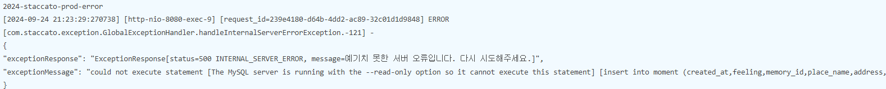
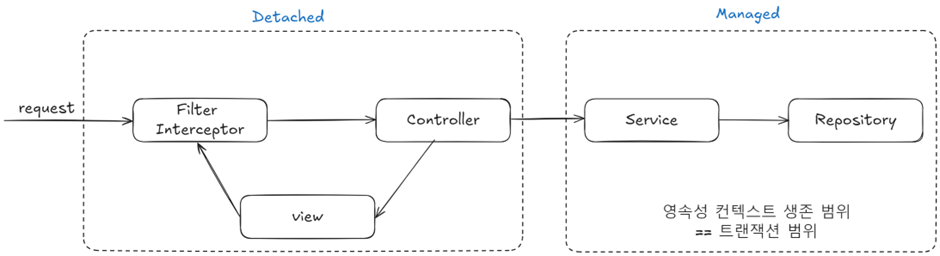
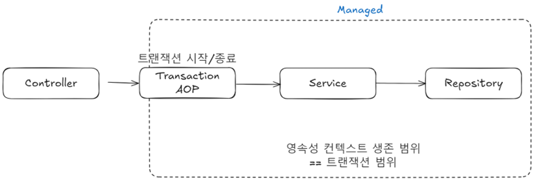
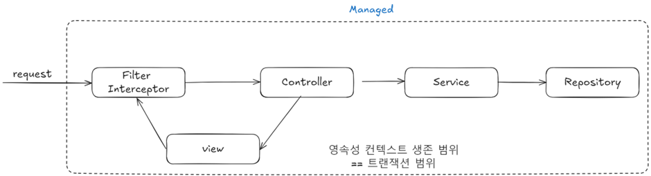
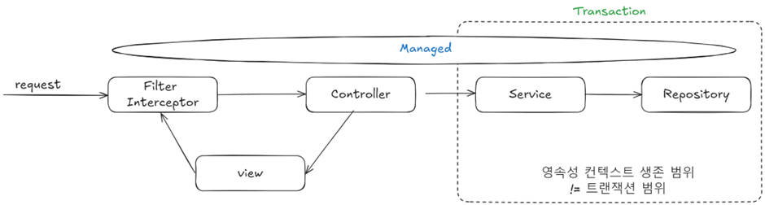
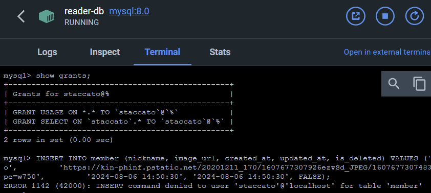
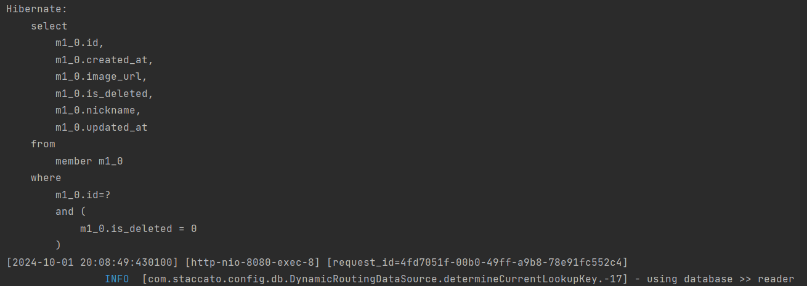
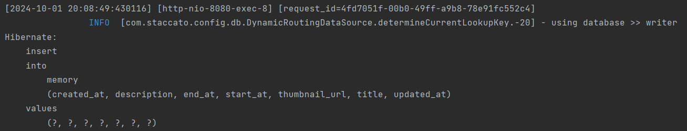
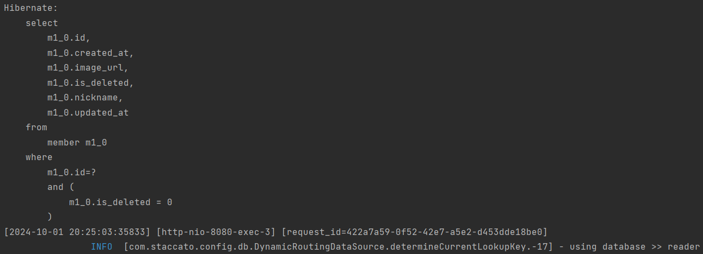
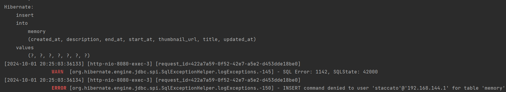

# DB Replication으로 알아보는 OSIV

## 1. 개요

 일상 기록 서비스 Staccato의 DB Replication 환경으로 마이그레션 과정에서 OSIV로 인한 문제를 마주했습니다. <br>
이 글에서는 OSIV란 무엇인지 충분히 이해하고, 앞서 겪은 문제 상황을 분석하며 OSIV의 부작용을 학습합니다.

## 2. 문제 상황
### 2.1 Writer-Reader Replication 환경으로의 마이그레이션

데이터베이스의 성능과 확장성을 높이기 위해 기존의 싱글 DB 인스턴스를 사용하던 구조에서 Writer-Reader Replication 환경으로의 마이그레이션 작업을 진행했습니다.
기존에는 싱글 EC2 인스턴스에 MySql을 설치하여 사용했고, 마이그레이션은 Writer와 Reader RDS 2대를 사용하는 구조로 마이그레이션했습니다.

### 2.2 Spring Boot에서 다중 데이터 소스 구성 과정

Spring Boot에서는 하나의 데이터소스를 사용하는 경우 자동으로 AutoConfiguration을 통해 `DataSource`, `EntityManager`, `TransactionManager` 등을 자동으로 설정해줍니다. 하지만, 2개 이상의 데이터소스를 정의하게 되면 Spring Boot의 기본 AutoConfiguration은 비활성화되고, 개발자가 직접 코드를 통해 두 개의 데이터소스를 명시적으로 구성해야 합니다.

따라서 애플리케이션 코드에서는 `AbstractRoutingDataSource`를 사용하여, 쓰기 트랜잭션은 Writer로, 읽기 트랜잭션은 Reader로 보내도록 설정했습니다.

``` java
protected Object determineCurrentLookupKey() {
    if (isCurrentTransactionReadOnly()) {
        return READER;
    }
    return WRITER;
}
```
또한 특정 조건에 맞는 데이터 소스가 명시되지 않으면 기본적으로 Writer로 동적으로 라우팅할 수 있도록 설정했습니다.
``` java
@Configuration
@Profile("local")
public class DataSourceConfig {
    @DependsOn({WRITER_DATA_SOURCE, READER_DATA_SOURCE})
    @Bean
    public DataSource routingDataSource(
            @Qualifier(WRITER_DATA_SOURCE) DataSource writer,
            @Qualifier(READER_DATA_SOURCE) DataSource reader
    ) {
        DynamicRoutingDataSource routingDataSource = new DynamicRoutingDataSource();
        Map<Object, Object> dataSourceMap = new HashMap<>();
        dataSourceMap.put(WRITER, writer);
        dataSourceMap.put(READER, reader);
        routingDataSource.setTargetDataSources(dataSourceMap);
        routingDataSource.setDefaultTargetDataSource(writer);
        return routingDataSource;
    }
```
### 2.3 문제 발생과 해결 과정

위의 작업을 완료한 후, RDS로 DataSource를 변경하는 작업을 진행했습니다.<br>
그리고 여기에서 다음과 같은 문제가 발생했습니다.

우리보다 앞서 같은 문제로 고생했던 타 팀원 덕분에, OSIV 설정을 비활성화하면 해결할 수 있음을 알 수 있었습니다.
``` yaml
spring.jpa.open-in-view=false
```
하지만 문제의 본질은 이해하지 못하고 있었습니다.<br>
애초에 OSIV가 무엇이며, 왜 문제가 된 것일까요?

## 3. OSIV
### 3.1 OSIV의 기본 개념
OSIV(Open Session In View)는 JPA/Hibernate에서 사용되는 개념으로, 영속성 컨텍스트를 뷰까지 열어두는 것을 의미합니다. 즉, 뷰에서도 엔티티가 영속 상태로 유지되기 때문에 지연 로딩과 같은 영속성 컨텍스트의 특징을 사용할 수 있습니다.

> 참고: OSIV에서 Session이란 Hibernate에서 영속성 컨텍스트를 가리키는 용어입니다.

### 3.2 OSIV의 목적

스프링 컨테이너는 **트랜잭션 범위의 영속성 컨텍스트 전략**을 기본으로 사용합니다. 그리고 같은 트랜잭션 안에서는 항상 같은 영속성 컨텍스트에 접근합니다.


스프링 프레임워크를 사용한다면 보통 비즈니스 로직을 시작하는 Service 계층에 `@Transactional` 어노테이션을 선언하여 트랜잭션을 시작합니다. 그리고 서비스 계층이 끝나는 시점에 트랜잭션이 종료되면서 영속성 컨텍스트도 함께 종료됩니다.


따라서 조회한 엔티티는 Service와 Repository 계층에서는 영속성 컨텍스트에서 관리되면서 영속 상태를 유지하지만, Presentation 계층(Controller, View)에서는 준영속 상태가 됩니다. 즉, Presentation 계층에서는 더 이상 영속성 컨텍스트의 기능을 사용할 수 없습니다. 그리고 지연 로딩 기능이 동작하지 않는다는 점은 문제가 되기도 합니다.

Presentation 계층에서 지연 로딩으로 설정된 연관된 엔티티를 프록시 객체로 조회했다고 가정해보겠습니다. 아직 초기화되지 않은 프록시 객체를 사용하면, 실제 데이터를 불러오기 위해 시도할 것입니다. 하지만, 더 이상 영속성 컨텍스트의 관리 대상이 아니기 때문에, Hibernate 구현체 기준 `org.hibernate.LazyInitializationException`이 발생하게 됩니다.

이와 같이 **엔티티가 Presentation 계층에서 준영속 상태이기 때문에 발생**하는 문제를 해결하기 위해 OSIV를 사용할 수 있습니다.

### 3.3 OSIV의 동작 원리

가장 단순한 구현 방법은 클라이언트의 요청이 들어오자마자 서블릿 필터나 스프링 인터셉터에서 트랜잭션을 시작 및 마치는 것입니다. 이를 요청 당 트랜잭션 방식의 OSIV라고 합니다.


이로 인해, 트랜잭션이 종료된 후에도 영속성 컨텍스트 내의 엔티티에 접근할 수 있고 지연 로딩을 포함한 다양한 JPA 연산이 가능해집니다. 이 방식은 Service 계층처럼 비즈니스 로직 실행 시 데이터가 변경되는 것이 아닌 Presentation 계층에서 데이터를 잠깐 변경했을 때 실제 데이터베이스까지 변경이 반영된다는 문제점이 있습니다. 그렇기 때문에 최근에는 거의 사용하지 않는 방법입니다.

최근에는 이러한 문제점을 어느정도 보완해서 **비즈니스 계층에서만 트랜잭션을 유지하는 방식**의 OSIV를 사용합니다. 스프링 프레임워크가 제공하는 OSIV가 바로 이 방식을 사용하는 OSIV입니다.

### 3.4 Spring의 OSIV
스프링 ORM에서는 다양한 OSIV 클래스를 제공합니다. OSIV를 서블릿 필터 적용할지 스프링 인터셉터에서 적용할지에 따라 원하는 클래스를 선택하여 사용할 수 있습니다.
> Hibernate 기준
> - OpenSessionInViewFilter
> - OpenSessionInViewInterceptor'

앞서 설명했던 요청 당 트랜잭션 방식의 OSIV는 Presentation 계층에서 데이터를 변경할 수 있다는 문제를 스프링 프레임워크가 제공하는 OSIV에서 어느정도 해결되었습니다.

스프링 프레임워크가 제공하는 OSIV는 “비즈니스 계층에서 트랜잭션을 사용하는 OSIV”입니다.


이들은 HTTP 요청이 들어올 때 영속성 컨텍스트를 열고, 요청이 끝날 때까지 이를 유지합니다. 이로 인해, 영속성 컨텍스트 내의 엔티티에 접근할 수 있고 지연 로딩을 포함한 다양한 JPA 연산이 가능해집니다. 트랜잭션의 범위는 영속성 컨텍스트의 다르게 서비스 계층에서 시작되고, 종료됩니다.

영속성 컨텍스트는 트랜잭션 범위 밖에서는 엔티티를 조회만 할 수 있습니다. 따라서 조회는 Controller와 View까지 가능하지만, 트랜잭션은 이미 종료되었기 때문에 서블릿 필터나 스프링 인터셉터로 요청이 돌아왔을 때 flush 호출 없이 영속성 컨텍스트가 종료됩니다.

### 3.5 OSIV 주의사항

(1) 데이터베이스 커넥션을 오래 점유할 수 있으므로, 커넥션 풀 설정에 주의해야 합니다.

(2) Spring OSIV의 경우, Presentation 계층에서 엔티티를 수정한 직후에 트랜잭션을 시작하는 Service 계층을 호출하면 문제가 발생합니다. 
- Spring OSIV는 같은 영속성 컨텍스트를 여러 트랜잭션이 공유할 수 있으므로 이와 같은 문제가 발생할 수 있습니다.

(3) Presentation 계층에서 지연 로딩에 의한 SQL이 실행되므로, 성능 튜닝 시 확인해야 할 부분이 넓습니다.

## 4. 문제 상황 재현하기

실서버에서 겪었던 문제 상황을 재현하기 위해서 MySql Docker Container 2대 중 Reader에 다음과 같이 권한을 설정하여 실행시켰습니다.
```roomsql
-- reader-init.sql: reader_db에 읽기 권한만 부여
-- ddl
REVOKE ALL PRIVILEGES, GRANT OPTION FROM 'staccato'@'%';
GRANT SELECT ON reader_db.* TO 'staccato'@'%';
FLUSH PRIVILEGES;
```
실제로 컨테이너에 접속해서 아래와 같이 권한 설정이 되었음을 확인했습니다.

이를 기반으로 로컬 환경을 설정하여 문제 상황을 재현했습니다.
``` yaml
## application.yml
spring:
  config:
    activate:
      on-profile: local
  application:
    name: staccato
  sql:
    init:
      mode: always
  datasource:
    writer:
      driver-class-name: com.mysql.cj.jdbc.Driver
      jdbcUrl: jdbc:mysql://localhost:3307/staccato
      username: staccato
      password: 1234
    reader:
      driver-class-name: com.mysql.cj.jdbc.Driver
      jdbcUrl: jdbc:mysql://localhost:3308/staccato
      username: staccato
      password: 1234
  jpa:
    show-sql: true
    properties:
      hibernate:
        format_sql: true
        create_empty_composites.enabled: true
    hibernate:
      ddl-auto: validate
    database-platform: org.hibernate.dialect.MySQL8Dialect
    defer-datasource-initialization: true
    open-in-view: false
```

> **주의!**
> 
>재현할 환경은 로컬이기 때문에, `DataSourceConfig`의 `profile`도 로컬로 변경해주어야 합니다.


## 5. 문제 상황 분석하기
> **가설**
>
> 모든 API는 인증을 거친다. 인증을 거칠 때 획득한 Read 트랜잭션을 OSIV로 인해 요청이 끝날 때까지 사용하게 되면서 Write 작업임에도 Read db에서 시도하여 오류가 발생한다.

아래의 설정값을 변경하며, 문제 상황을 분석해보도록 하겠습니다.
``` yaml
spring.jpa.open-in-view=false
```
### 5.1 테스트를 위한 기저 조건 세팅
테스트하기에 앞서, **Writer에 기록된 데이터를 Reader에 복사하는 작업은 재현하지 않았습니다**.<br>
가설이 성립하는지 확인하기 위해서는, 항상 인증을 성공해야하므로 임시로 인증이 항상 통과할 수 있도록 코드를 수정했습니다.
```java
    public Member extractFromToken(String token) {
        Member member = memberRepository.findById(1L)
        .orElseThrow(UnauthorizedException::new);
        log.info(LogForm.LOGIN_MEMBER_FORM, member.getId(), member.getNickname().getNickname());
        return member;
        }
```
어떤 토큰이 들어와도 반환할 ID로 1L을 가진 Member가 필요하기 때문에, Reader의 init.sql 데이터를 삽입하도록 추가했습니다.
```roomsql
-- reader-init.sql: reader_db에 읽기 권한만 부여
-- ddl
INSERT INTO member (nickname, image_url, created_at, updated_at, is_deleted)
VALUES ('staccato', 'image.jpg', '2024-08-06 14:50:30', '2024-08-06 14:50:30', FALSE);
-- 권한 설정
```

### 5.2 테스트 방법
다음의 과정을 반복하며 OSIV를 활성화 했을 때와 비활성화 했을 때의 결과를 분석해보고자 합니다.

**1. 회원을 등록합니다.**
```shell
curl --location 'localhost:8080/login' \
--header 'Content-Type: application/json' \
--data '{
    "nickname": "staccato2"
}'
```
존재하지 않는 닉네임으로 로그인 요청이 들어온다면, 새로운 회원을 저장합니다.
해당 작업을 선행하는 이유는 Writer DB에서 Memory를 생성하려고 할 때 참조 무결성 위반 문제를 방지 하기 위해서 Member를 먼저 등록하기 위함입니다.

**2. 특정 Member의 권한으로 새로운 Memory 생성을 시도합니다.**
```shell
curl --location 'localhost:8080/memories' \
--header 'Authorization: token' \
--header 'Content-Type: application/json' \
--data '{
"memoryThumnailUrl": "https://example.com/memorys/geumohrm.jpg",
"memoryTitle": "2023 여름 휴가",
"description": "친구들과 함께한 여름 휴가 여행",
"startAt": "2023-07-01",
"endAt": "2023-07-10"
}'
```
위의 API를 호출했을 때, 다음과 같은 Controller가 호출됩니다.
```java
@PostMapping
public ResponseEntity<MemoryIdResponse> createMemory(
        @Valid @RequestBody MemoryRequest memoryRequest,
        @LoginMember Member member
        ) {
        MemoryIdResponse memoryIdResponse = memoryService.createMemory(memoryRequest, member);
        return ResponseEntity.created(URI.create("/memories/" + memoryIdResponse.memoryId())).body(memoryIdResponse);
}
```
내부적으로는 다음과 같은 메서드가 호출될 것입니다. 해당 메서드들이 호출될 때, OSIV 설정에 따라 사용하는 영속성 컨텍스트와 Connection 정보를 비교 분석합니다.
```java
@Transactional(readOnly = true)
public Member extractFromToken(String token)
```
```java
@Transactional
public MemoryIdResponse createMemory(MemoryRequest memoryRequest, Member member)
```

### 5.3 spring.jpa.open-in-view=false
특정 Member의 권한으로 새로운 Memory 생성을 시도하면, `ArgumentResolver`에 의해 인증 작업이 수행됩니다. <br>
인증을 시도할 때, `extractFromToken()`을 통해 Member의 정보를 조회합니다.
따라서, 해당 메서드가 호출될 때에는 Reader Database로 connection이 획득됩니다.


해당 메서드가 종료될 때, 트랜잭션이 종료되면서 영속성 컨텍스트 또한 종료됩니다.

이후, `createMemory()`를 호출되면, 새로운 트랜잭션이 시작됨과 동시에 앞서와는 별개의 영속성 컨텍스트가 생성됩니다. 해당 메서드에서는 Writer Database로 connection을 획득합니다.


마찬가지로 메서드가 종료되면서 트랜잭션이 종료됨과 동시에 영속성 컨텍스트 또한 종료됩니다.

OSIV가 비활성화되어있다면, Presentation 계층에서는 영속성 컨텍스트가 유지되지 않습니다.<br>
따라서, 사용하던 Connection을 유지할 필요가 없으므로 Reader DB에 쓰기 작업 시도가 발생하지 않습니다.

### 5.4 spring.jpa.open-in-view=true
특정 Member의 권한으로 새로운 Memory 생성을 시도하면, `ArgumentResolver`에 의해 인증 작업이 수행됩니다. <br>
인증을 시도할 때, `extractFromToken()`을 통해 Member의 정보를 조회합니다.
따라서, 해당 메서드가 호출될 때에는 Reader Database로 connection이 획득됩니다.

해당 메서드가 종료될 때 트랜잭션은 종료되지만, 영속성 컨텍스트는 종료되지 않습니다.

즉, **사용 중이던 Reader DB에 대한 Connection이 반환되지 않습니다.**

따라서 이후에 `createMemory()`를 호출되었을 때 기존의 영속성 컨텍스트를 재사용함에 따라 들고 있는 Connection을 그대로 재사용합니다.

그 과정에서 insert 작업을 Reader DB에 시도하게 되면서, 권한 문제로 인하여 작업을 실패하게 됩니다.

### 5.5 결과
Spring의 OSIV는 Presentation 계층변경 감지 권한은 허용하지 않으면서, 지연 로딩을 할 수 있게 하는 방법으로 영속성 컨텍스트는 유지하되, 트랜잭션을 종료시키는 방법을 택했습니다.<br>
하지만, 영속성 컨텍스트를 유지함에 따라 한 번 얻은 Connection은 요청이 끝날 때까지 반환하지 않습니다.<br>
그렇기 때문에, DB Replication 환경에서는 인증으로 인해 Reader의 Connection을 가져왔을 때, 해당 Connection을 반납하지 않고 재사용하면서 쓰기 작업을 시도해 오류가 발생하는 것을 확인했습니다.

## 6. 마무리
지금까지 Staccato 서비스에서 DB Replication으로 마이그레이션 도중 OSIV로 인해 마주했던 문제를 통해서 OSIV에 대해 학습하고, 그 부작용에 대해 알아보았습니다. 그리고 OSIV를 비활성화하여 간단하게 문제를 해결했습니다.

하지만, OSIV의 default가 활성화인 이유가 있지 않았을까요?

이어지는 글에서는 OSIV의 default가 true인 이유에 대해 알아보고, OSIV 설정을 비활성화하는 방법을 사용하지 않고 어떻게 이 문제를 해결해볼 수 있는지 알아보겠습니다.


