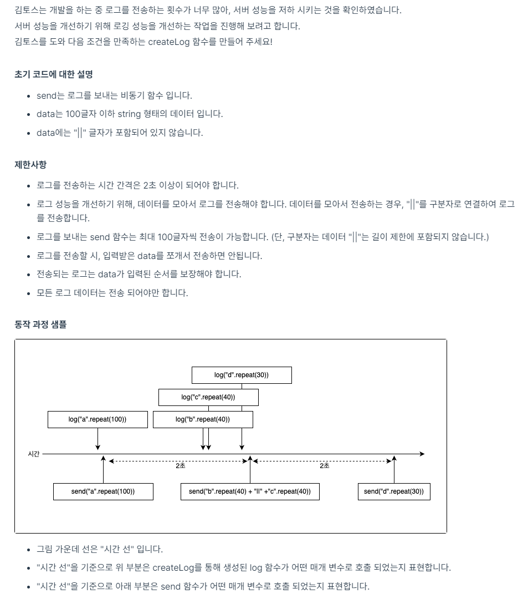
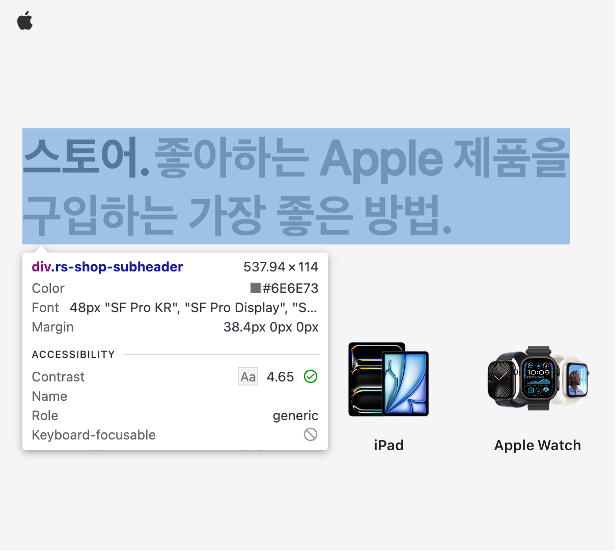

# 성능 최적화, 프론트엔드 개발에서 어떻게 접근할 것인가

## “성능 최적화”란 무엇일까 - 프론트엔드 관점에서 본 정의

프론트엔드에서 말하는 성능은 로딩 성능과 렌더링 성능으로 구성됩니다.

로딩 성능은 사용자가 요청한 페이지가 얼마나 빨리 화면에 나타나는지를,
렌더링 성능은 화면이 표시된 후 인터랙션이나 애니메이션이 얼마나 부드럽게 동작하는지를 의미합니다.

즉, 사용자가 첫 화면을 얼마나 빠르게 볼 수 있는지, 사용성이 얼마나 매끄럽게 이루어지는지가
프론트엔드 성능을 결정짓는 주요 요소입니다.

결국 최적화란 이러한 두 성능 요소를 개선하여
사용자가 더 빠르고 쾌적하게 웹 서비스를 이용할 수 있도록 만드는 과정이라 할 수 있습니다.

## 성능 최적화가 필요한 이유

아래의 결과는 2017년 Think with Google에서
페이지 로딩 속도에 따라 사용자가 이탈할 확률이 얼마나 달라지는지를 조사한 결과입니다.



연구에 따르면, 페이지 로딩 시간이 1초에서 3초로 늘어날 경우
사용자가 페이지를 이탈할 확률은 32% 증가합니다.

1초에서 5초로 늘어나면 90%, 1초에서 10초로 늘어나면 123% 증가합니다.

이는 로딩 속도가 늘어날수록 사용자의 서비스 이용 의지가 떨어진다는 것을 보여줍니다.

일상적으로 생각해보아도, 유튜브 첫 화면이 5초 이상 걸린다면
대부분의 사용자는 느리다고 인식할 것입니다.

즉, 이러한 사용자의 체감 속도는 실제 서비스 유지율에 직접적인 영향을 미칩니다.

따라서 사용자에게 빠르고 쾌적한 경험을 제공하기 위해서는
로딩 성능의 최적화가 사용자 유지 측면에서 매우 중요합니다.

## 그렇다면 어떤 부분부터 최적화를 진행하면 되는걸까?

아마 처음 최적화를 접한다면 무엇을 기준으로 최적화를 하면 좋을지 막막할 것 같습니다.

이걸 알려주는 지표로 Lighthouse가 있습니다.

Lighthouse는 구글에서 만든 크롬 개발자 도구에서 사용할 수 있는 툴로, 웹사이트의 성능을 측정하고 개선 방향을 제시해주는 자동화 툴입니다.

Lighthouse는 아래 사진과 같이 브라우저의 성능을 측정해줍니다.

이번 글에서 집중해서 볼 건 Performance 탭인데요.

Lighthosue가 측정한 이 웹 페이지의 종합 성능 점수입니다.



구글의 Core Web Vitals 권장 기준에 따르면, 웹 페이지의 성능을 안정적으로 유지하기 위해서는 다음 세 가지 지표를 만족하는 것이 좋습니다.

- LCP (Largest Contentful Paint) ≤ 2.5초 — 주요 콘텐츠가 표시되는 속도를 나타내고 로딩 성능을 평가합니다.

- INP (Interaction to Next Paint) ≤ 200ms — 사용자의 입력 후 화면이 반응하는 속도를 나타내고 상호작용 성능을 평가합니다.

- CLS (Cumulative Layout Shift) ≤ 0.1 — 예기치 않은 화면 이동 정도를 나타내고 시각적 안정성을 평가합니다.

추가로 Lighthouse는 아래와 같이 어떤 부분을 개선해나가면 좋을지 방향성도 알려줍니다.

총 2가지 섹션을 보여주는데요.

Lighthouse의 Insights 영역은
실제 성능 점수에 직접적인 영향을 미치는 개선 포인트를 제안하는 섹션으로,
“무엇을 고치면 성능이 향상되는가”를 정량적으로 알려줍니다.

반면 Diagnostics 영역은
페이지의 렌더링 구조나 메인 스레드 사용량, 서드파티 리소스 비중 등을 분석해
“왜 느린가”를 데이터 기반으로 설명해줍니다.

따라서 성능 최적화를 진행할 때는
Insights로 우선순위를 정하고 → Diagnostics로 원인을 구체적으로 파악하는 흐름으로 접근해볼 수 있습니다.

## 그렇다면 최적화 어떻게 해볼 수 있을까? - 저는 이런 방법을 시도해보았습니다

앞서 성능을 로딩 성능과 렌더링 성능으로 구분하여 살펴보았습니다.

이제 두 측면에서, 제가 학습하고 적용한 최적화 방법들을 정리해보려 합니다.

최적화에는 다양한 접근이 존재하지만, 이번 글에서는 제가 실제로 경험한 방법을 중심으로 다루었습니다.

(참고 — React, Webpack 기준)

### 1) 로딩 성능 최적화

브라우저는 HTML, CSS, JS, 이미지 등 다양한 리소스를 다운로드하고
이를 해석한 뒤 화면을 그리는 과정을 거칩니다.

이때 파일의 용량이 크고 불필요한 코드가 많거나,
렌더링을 차단하는 리소스가 존재하면
사용자는 페이지를 느리게 인식하게 됩니다.

로딩 성능을 개선하기 위해서는 리소스의 크기와 요청 흐름을 효율적으로 관리하는 것이 핵심입니다.

소개할 방법은 다음과 같습니다.

### 이미지 최적화

이미지는 페이지 내에서 가장 큰 리소스 중 하나입니다.

이미지 크기를 줄이거나 WebP와 같은 포맷을 사용하면 네트워크 전송량이 줄어 초기 로딩 시간을 단축할 수 있습니다.

### 리소스 코드 전송 최적화

번들 크기를 줄이거나 당장 필요한 코드만 먼저 다운로드하여 초기 화면 표시 속도를 높일 수 있습니다.

gzip, brotli 같은 압축도 요청 효율을 높이는 방법 중 하나입니다.

### 캐시 활용

캐시는 브라우저가 동일한 리소스를 재요청하지 않도록 하여 재방문 시 로딩 속도를 단축합니다. (추후 사례 업데이트 예정)

이러한 최적화 방법들은 모두 사용자가 첫 화면을 더 빠르게 볼 수 있도록 하는 데 목적이 있습니다.

저는 이미지 최적화를 진행하기 위해서 2가지 방법을 사용했는데요.

이미지 압축과 WebP 이미지 변환입니다.

이미지를 압축하는 방법은 외부 사이트에서도 가능하지만 저는 이미지 파일을 들고 왔을 때 코드 내부적으로 알아서 압축을 해주는 것이 더 자연스럽다고 생각해서 코드 내부적으로 자동으로 압축해주는 image-minimizer-webpack-plugin을 사용하였습니다.

제가 적용한 코드는 아래와 같습니다.

```js
new ImageMinimizerPlugin({
      generator: [
        {
          implementation: ImageMinimizerPlugin.sharpGenerate,
          type: 'asset',
          filter: (_, sourcePath) => /\.png$/i.test(sourcePath),
          filename: 'static/[name].webp',
          options: {
            encodeOptions: { webp: { quality: 40 } },
            resize: { width: 1920 }
          }
        }
      ]
    })
  ],
```

image-minimizer-webpack-plugin은 Webpack에서 제공하는 플러그인으로 이미지를 압축하거나 새로운 포맷으로 변환하기 위한 도구입니다.

그중에서도 플러그인에 내장된 sharpGenerator를 사용하면 “압축 + 포맷 변환 + 리사이즈”를 한번에 사용할 수 있는 점이 큰 장점인 것 같아 사용해보았습니다.

다음으로 리소스 코드 전송을 최소화 하기 위해 2가지를 적용해보았습니다.
소스코드 압축, 코드 스플리팅인데요.

웹팩에서 제공하는 optimization 속성을 활성화하면 소스 코드의 크기를 줄일 수 있습니다.

웹펙에서 소스 코드 압축은 기본적으로 프로덕션 모드에서 자동으로 수행되는데요,
mode: 'production'을 사용하면 optimization.minimize가 활성화되고 Terser가 기본값으로 동작하여 공백/주석 제거, 사용되지 않는 코드 제거, 식별자 축약 등을 수행합니다. 기본 설정만으로도 충분한 압축 효과를 얻을 수 있지만 세밀한 제어(ex) console.log 제거, 주석 완전 제거)가 필요하다면 TerserPlugin을 명시적으로 설정해 세부 옵션을 조정할 수 있습니다.
또한 프로덕션 모드에서는 트리 셰이킹과 모듈 결합 등의 최적화가 함께 적용되어서 번들의 크기를 추가로 줄여줍니다.

코드 스플리팅의 경우, React.lazy를 활용했습니다.

```js
const Search = lazy(() => import('./pages/Search/Search'));

<Router>
  <NavBar />
  <Routes>
    <Route path="/" element={<Home />} />
    <Route
      path="/search"
      element={
        <Suspense fallback={<div>Loading...</div>}>
          <Search />
        </Suspense>
      }
    />
  </Routes>
  <Footer />
</Router>;
```

React.lazy는 컴포넌트 단위로 코드를 지연 로드(lazy loading) 할 수 있게 해주는 React 내장 기능입니다.

평소에는 번들 파일 내에 포함되지 않다가 사용자가 해당 컴포넌트를 실제로 렌더링하는 시점에
네트워크 요청을 통해 별도의 청크(chunk) 로 로드되는 방식입니다.

이러한 접근 방식은 초기 로딩 시점에 불필요한 코드 전송을 줄이고 사용자가 실제로 필요로 하는 기능이나 페이지를 요청할 때만
관련 코드를 불러오도록 함으로써 초기 번들 크기를 줄이는 효과가 있습니다.

예를 들어, 사용자 진입 후 즉시 보이지 않는 페이지나 모달 혹은 특정 상호작용 이후에만 필요한 컴포넌트는 React.lazy를 통해 분리하면 초기 렌더링 속도를 방해하지 않습니다.

또한 React.Suspense와 함께 사용하면 비동기로 로드되는 동안 로딩 상태를 자연스럽게 표시할 수 있습니다.

Lazy 적용 후에는 번들이 다음과 같이 페이지별로 분리된 여러 개의 청크 파일로 나누어집니다.

Search 페이지와 관련된 코드가 별도의 청크로 분리되어 초기 로딩 시점의 전송량이 감소했습니다.

이처럼 React.lazy를 적용하면 초기 번들에는 핵심 UI 코드만 포함되고, 나머지 페이지나 기능은 사용자의 실제 탐색 시점에 로드되는 구조로 개선됩니다.

(추후 사례 업데이트 예정)

### 2) 렌더링 성능 최적화

브라우저는 사용자의 조작이 있을 때마다
레이아웃 계산, 스타일 적용, 페인트, 그리고 컴포지팅 단계를 거쳐 화면을 갱신합니다.

이 과정에서 자바스크립트 연산이 길어지거나 DOM 변경이 과도하면
화면이 ‘버벅이는’ 현상이 발생할 수 있습니다.

렌더링 성능을 높이기 위해서는 메인 스레드의 부하를 줄이고
불필요한 렌더링을 최소화하는 것이 중요합니다.

렌더링 성능이 좋지 못하다면, 스크롤, 클릭, 애니메이션 등과 같은 상호작용이 뚝 끊기거나 버벅임이 느껴질 수 있습니다.

이러한 부분들은 로딩이 끝난 뒤의 사용자 경험을 결정하는 중요한 요소이기 때문에 이러한 현상이 발생한다면 최적화를 통해 사용자에게 더 자연스러운 상호작용 경험을 제공해야 합니다.

소개할 방법은 아래와 같습니다.

#### 애니메이션 최적화

애니메이션으로 인해 화면이 끊기거나 버벅이는 현상이 발생할 수 있습니다.

이를 최적화함으로써 보다 더 부드럽고 자연스러운 애니메이션 효과를 사용자에게 제공할 수 있습니다.

#### 리렌더링 최소화

상태 변경 시 불필요하게 많은 컴포넌트가 계속 리렌더링되면 입력 지연이나 스크롤 끊김 등 즉각적으로 반응성이 떨어지는 문제가 생깁니다.

메모이제이션이나 상태 분리를 통해 리렌더링을 줄여볼 수 있습니다.

(추후, 렌더링 부분은 사례 업데이트 혹은 삭제 예정)

## 참고 자료

- [프론트엔드 최적화? 토스에서는 이렇게 합니다!](https://toss.tech/article/firesidechat_frontend_9)
- [Think With Google - Mobile Page Speed](https://www.thinkwithgoogle.com/intl/en-emea/marketing-strategies/app-and-mobile/find-out-how-you-stack-new-industry-benchmarks-mobile-page-speed/)
- [프론트엔드 성능 최적화 가이드](https://search.shopping.naver.com/book/catalog/35627588630?cat_id=50010881&frm=PBOKPRO&query=%ED%94%84%EB%A1%A0%ED%8A%B8%EC%97%94%EB%93%9C+%EC%84%B1%EB%8A%A5+%EC%B5%9C%EC%A0%81%ED%99%94+%EA%B0%80%EC%9D%B4%EB%93%9C&NaPm=ct%3Dmgm5pwj4%7Cci%3Dfea1e581621accfb7c542385f86bc6990cf9d72a%7Ctr%3Dboknx%7Csn%3D95694%7Chk%3D0bf3e93e889a0e15edf364a66a94525d7037fde1)
- [Web Vitals](https://web.dev/articles/vitals?hl=ko)
- [Webpack](https://webpack.kr/)
