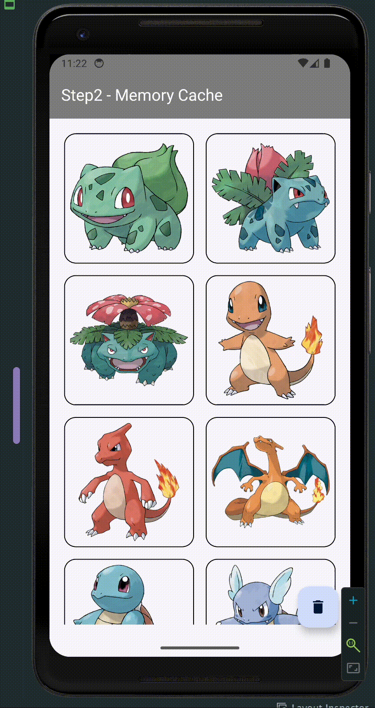
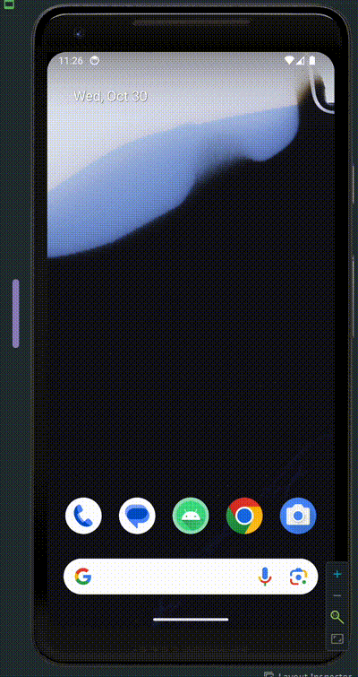
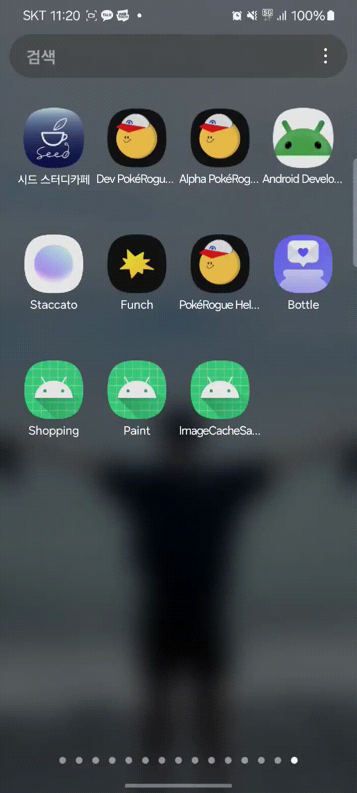

# 안드로이드 이미지 캐시

## 소개
안녕하세요! 저는 현재 우테코에서 안드로이드 개발자로 "PokeRogueHelper" 프로젝트를 진행하고 있습니다.

앱에서 화면을 이동할 때마다 "포켓몬 데이터"를 불러오고 이미지를 렌더링하는 작업이 빈번하게 발생하는데, 이로 인해 이미지 로딩 속도가 느려지는 문제가 발생했습니다.

저희 팀은 `캐시(Cache)`를 활용하여 데이터 로딩을 개선하였습니다. 포켓몬이라는 도메인 특성상 데이터가 자주 변경되지 않기 때문에, 캐시를 적용하여 데이터 로딩과 이미지 랜더링 속도를 크게 개선할 수 있었습니다.

이번 글에서는 빠르고 효율적인 데이터 로드를 위해 반드시 알아야 할 캐시에 대해 알아보고, 이미지 캐시 실습 예제를 통해 캐시를 구현하는 방법을 소개하겠습니다.

> 🤔 Glide 나 Picasso 와 같은 이미지 로드 라이브러리를 사용하면 더 편리하게 이미지 캐시를 적용할 수 있지 않나? 라는 의문이 들 수 있습니다.
>
> 하지만, 이번 글을 통해 캐시의 개념과 중요성을 이해하시고, 캐시를 직접 구현해보면서 캐시의 동작 원리를 이해하시는 것이 나의 프로젝트에 적절한 캐시 전략을 선택하고 적용하는 데 도움이 될 것이라 확신합니다! 💪


# 1. 캐시

캐시는 `데이터를 임시로 저장하는 장소`를 의미합니다.

자주 사용하는 데이터의 경우 매번 네트워크 통신을 통해 데이터를 불러오는 것은 비효율적입니다. 최초로 데이터를 불러올 때,`캐시`에 데이터를 저장하여 `네크워크 통신`을 줄이고, `데이터 로딩 속도`를 개선할 수 있습니다.

## 1-1) 메모리 캐시 vs 디스크 캐시

캐시는 저장 위치에 따라 `메모리 캐시`와 `디스크 캐시`로 나뉩니다.  
내가 저장할 `데이터의 특성`에 따라 적절한 캐시 방법을 선택해야합니다.

`메모리 캐시`는 `RAM` 에 저장되기 때문에 빠르게 데이터를 불러올 수 있지만, 앱이 종료되면 데이터가 사라집니다.

`디스크 캐시`는 `하드 디스크`에 저장되기 때문에 앱이 종료되어도 데이터가 유지됩니다. 하지만, 메모리 캐시에 비해 느리게 데이터를 불러올 수 있습니다.

다음과 같은 기준으로 적절한 캐시 방법을 선택할 수 있습니다.

1. 빠르게 데이터를 로딩해야할 경우: `메모리 캐시`
2. 데이터를 장기간 저장하거나 앱 재시작 시 데이터를 유지해야할 경우: `디스크 캐시`
3. 데이터가 장기간 변경되지 않는 경우: `디스크 캐시`
4. 데이터가 자주 변경되는 경우: `메모리 캐시`
5. 데이터가 실시간으로 변경되는 경우: `캐시 사용 X`

## 1-2) 캐시 오버플로우

> 캐시되는 데이터가 너무 많아져 캐시의 크기를 초과하게 되면 어떻게 될까요? 🤔

캐시에 저장된 데이터가 너무 많아져서 캐시의 크기를 초과하게 되는 경우를 `캐시 오버플로우(Cache Overflow)`라고 합니다.
새로운 데이터를 캐시에 저장하기 위해 저장된 데이터 중 일부는`삭제`되어야 합니다.

이때 어떤 데이터를 먼저 삭제할지 결정하는 방법을 `캐시 교체 알고리즘`이라고 합니다.

## 1-3) 캐시 교체 알고리즘

캐시 교체 알고리즘 중 가장 많이 사용되는 알고리즘은 `LRU` 와 `LFU` 입니다.

1) LFU(Least Frequently Used): 가장 적게 사용된 데이터를 삭제하는 방식
2) LRU(Least Recently Used): 가장 오래 사용되지 않은 데이터를 삭제하는 방식

`LFU` 는 `데이터의 빈도수`에 의거한 캐시 교체 알고리즘입니다. 만약 특정 데이터가 다른 데이터에 비해 더 자주 사용되는 경우에 LFU 알고리즘이 적합합니다.

- ex) `파이리` 라는 포켓몬 이미지가 다른 포켓몬에 비해 압도적으로 많이 사용된다면, LFU 알고리즘을 적용하여 `파이리` 이미지를 캐시에 저장할 수 있습니다.

`LRU` 는 `시간 지역성`에 의거한 가장 많이 사용되는 캐시 교체 알고리즘입니다. `시간 지역성`이란 사용자가 가장 최근에 사용한 데이터가 가장 높은 확률로 다시 사용될 것이라는 개념입니다.

- ex) 사용자가 최근에 `피카츄` 이미지를 사용했다면, 다음에도 `피카츄` 이미지를 사용할 확률이 높다는 것을 의미합니다.

데이터의 특성에 따라 적절한 캐시 교체 알고리즘을 선택하여 캐시를 관리해면 됩니다! 💪

이제 간략하게 캐시에 대해 알아보았으니, 실습을 통해 이미지 캐시를 구현해보겠습니다!

# 3. 실습 - 이미지 캐시

> 자세한 코드는 [실습 깃허브 주소](아직 push 안함!)에서 확인할 수 있습니다!


이미지 URL 을 통해 이미지를 불러와 화면에 랜더링하는 간단한 샘플앱을 만들어보겠습니다. 

## Step1: 네트워크 통신

```kotlin
class ImageLoader(
    private val ImageService: PokemonImageService
) {
    suspend fun bitmaps(urls: List<String>): List<Bitmap> {
        return ImageService.bitmaps(urls)
    }
}
```

`ImageLoader` 에서 `ImageService` 를 통해 네트워크 통신하여 포켓몬 이미지를 불러오겠습니다.


이미지 로딩이 너무 오래걸리네요. 메모리 캐시를 적용해보겠습니다!

## Step2: 메모리 캐시 적용

```kotlin
class ImageLoader(
    private val imageService: ImageService
) {
    private val cachedImages: MutableMap<String, Bitmap> = mutableMapOf<String, Bitmap>()

    suspend fun bitmaps(urls: List<String>): List<Bitmap> {
        if (cachedImages.keys.containsAll(urls.toSet())) {
            return urls.map { requireNotNull(cachedImages[it]) }
        }
        return imageService.bitmaps(urls).also { cacheImages(urls, it) }
    }

    fun clearCache() {
        cachedImages.clear()
    }

    private fun cacheImages(keys: List<String>, images: List<Bitmap>) {
        keys.forEachIndexed { index, key ->
            cachedImages[key] = images[index]
        }
    }
}
```
Map 자료구조를 활용하여 메모리 캐시를 구현하였습니다.

1) `cachedImages`에 이미지가 캐시되어 있는지 확인한 후, 캐시되어 있으면 캐시된 이미지를 반환
2) 그렇지 않으면 네트워크 통신을 통해 이미지를 불러온 후, 캐시에 저장

위와 같은 방식으로 이미지를 캐시하면, 동일한 이미지 URL 의 경우 빠르게 로드할 수 있습니다!



데이터를 리프레쉬하더라도 로딩 화면이 보이지 않을 정도로 이미지 로딩이 빨라졌습니다!
그러나, 앱을 재시작하면 어떨까요??  



메모리 캐시 방식은 `RAM`에 캐시했기 때문에 프로세스가 종료되면 캐시가 비워지게됩니다.  
따라서, 네트워크 통신과 동일하게 이미지를 다시 불러와야합니다.

이를 해결하기 위해 `디스크 캐시`를 적용해보겠습니다!

## Step3: 디스크 캐시 적용

안드로이드 내부 저장소를 활용하여 `PokemonImageSaver` 클래스에 이미지를 저장하고 불러오는 기능을 추가했습니다.

```kotlin
class ImageSaver(context: Context) {
    private val cacheFolder: File = File(context.cacheDir, "pokemon")
        get() {...}

    suspend fun bitmaps(urls: List<String>): List<Bitmap> = withContext(Dispatchers.IO) {
        urls.mapNotNull { url ->
            val file = photoCacheFile(url)
            if (file.exists()) {
                BitmapFactory.decodeFile(file.absolutePath)
            } else {
                null
            }
        }
    }
    suspend fun saveImage(url: String, bitmap: Bitmap) = withContext(Dispatchers.IO) {
        photoCacheFile(url).outputStream().use { output ->
            bitmap.compress(Bitmap.CompressFormat.PNG, 100, output)
        }
    }
```

- `saveImage` 함수에서는 Bitmap 을 PNG 형식으로 압축하여 내부 저장소에 저장합니다.
- `bitmaps` 함수에서는 `urls` 에 해당하는 이미지 파일이 존재하면 Bitmap 으로 디코딩하여 반환합니다.

```kotlin
class ImageLoader(
    private val imageService: ImageService,
    private val imageSaver: ImageSaver
) {
    private val cachedImages: MutableMap<String, Bitmap> = mutableMapOf<String, Bitmap>()

    suspend fun bitmaps(urls: List<String>): List<Bitmap> {
        if (isMemoryCached(urls)) {
            return urls.map { requireNotNull(cachedImages[it]) }
        }
        if (isDiskCached(urls)) {
            return imageSaver.bitmaps(urls).also { cacheImages(urls, it) }
        }

        return imageService.bitmaps(urls)
            .also { bitmap ->
                urls.zip(bitmap).forEach { (url, bitmap) ->
                    imageSaver.saveImage(url, bitmap)
                }
            }
            .also { bitmap ->
                cacheImages(urls, bitmap)
            }
    }
    ...
```
이제 PokemonImageLoader 에서 메모리 캐시와 디스크 캐시를 모두 활용하여 이미지를 불러옵니다.

1) 메모리 캐시에 이미지가 존재하는지 확인
2) 디스크 캐시에 이미지가 존재하는지 확인
3) 네트워크 통신을 통해 이미지를 불러온 후, 디스크 캐시, 메모리 캐시에 저장

이제 앱을 재시작해도 디스크된 이미지를 불러와 빠르게 화면을 로드할 수 있습니다.



## Step4: LRU 캐시 교체 알고리즘 적용

내부 저장소나 RAM 공간이 부족해질 경우, 캐시된 이미지 중 일부를 `삭제`한 후 새로운 이미지를 저장해야합니다.

안드로이드에서는 `LRUCache` 클래스를 제공하여 LRU 캐시 교체 알고리즘을 쉽게 적용할 수 있습니다. 

`mutableMap` 을 `LRUCache` 로 변경해주겠습니다!

```kotlin
class ImageLoader(
    ...
) {
    private val cachedImages: LruCache<String, Bitmap> =
        lruCache(cacheSize(), sizeOf = { _, value -> value.byteCount / 1024 })

    private fun cacheSize(): Int {
        val maxMemory = (Runtime.getRuntime().maxMemory() / 1024).toInt()
        return maxMemory / 8
    }
}
```

먼저 `cacheSize` 함수를 통해 캐시의 최대 크기를 설정합니다.

>  [안드로이드 공식문서](https://developer.android.com/topic/performance/graphics/cache-bitmap?hl=ko)에 따르면 일반/hdpi 기기의 경우 최소 4MB 정도 이고, 800x480인 기기에서 이미지로 채워진 전체 화면 GridView는 약 1.5MB(800*480*4바이트)를 사용하므로
> `maxMemory / 8` 정도로 설정하면 됩니다.


# 결론

그리고 비단, 이미지 뿐만 아니라 데이터 로드에도 캐시를 적용할 수 있으며, 캐시를 적용함으로써 앱의 성능을 향상시킬 수 있습니다.

# 참고 문헌

https://developer.android.com/topic/performance/graphics/cache-bitmap
