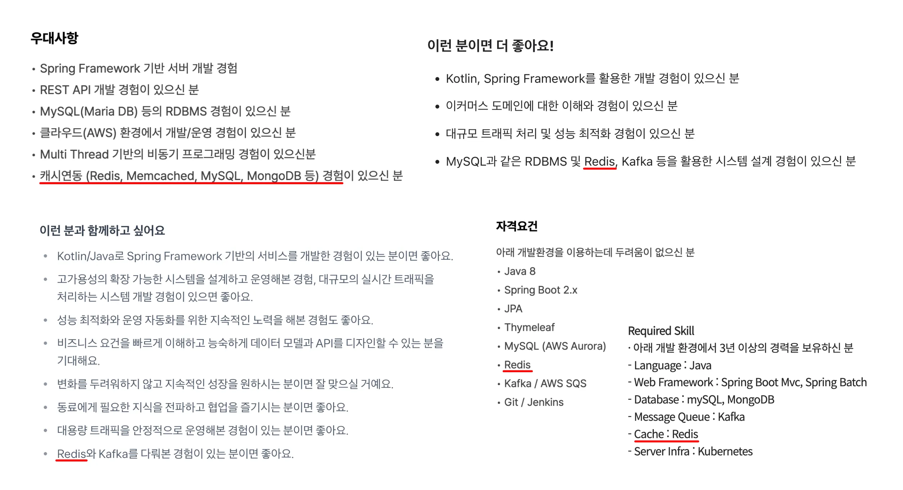
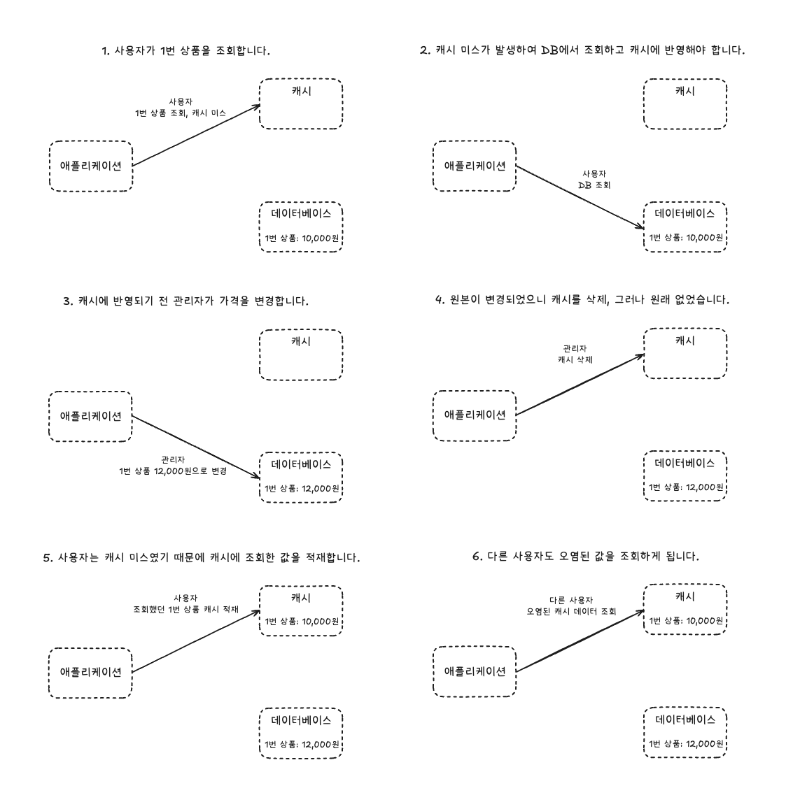
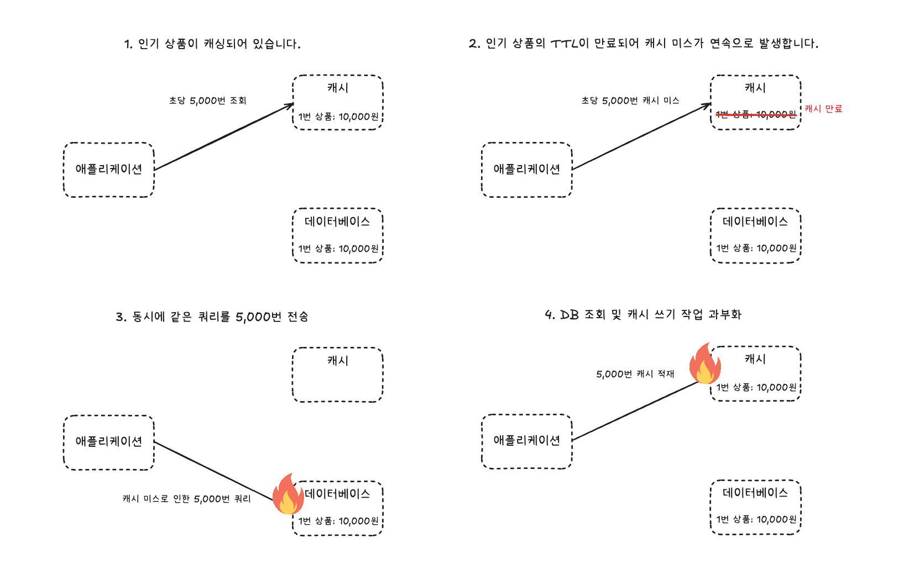
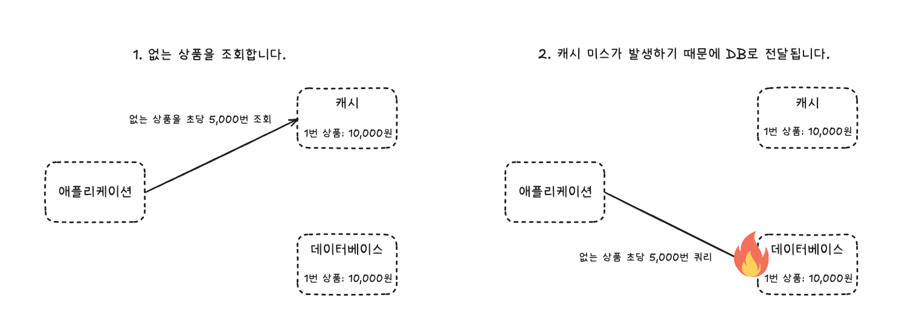
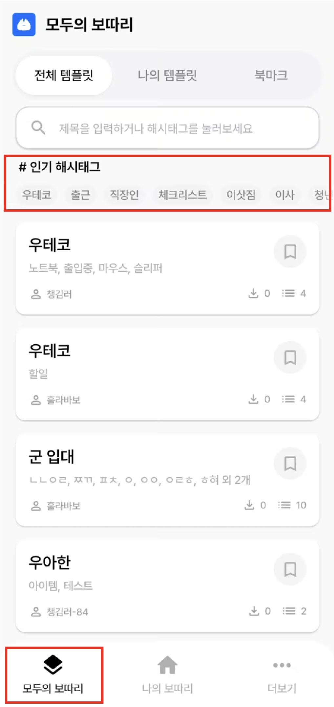
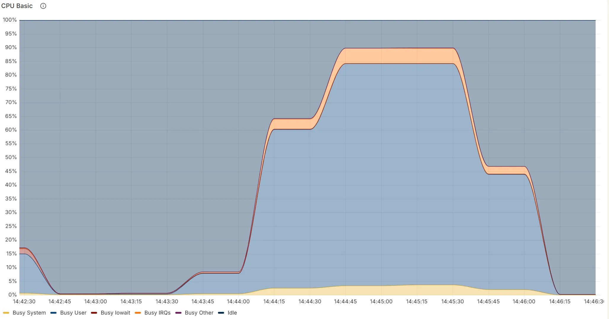

# Redis로 살펴보는 캐시 전략 설계 가이드 - 우리 서비스에 진짜 필요한 캐시는 무엇인가?

## 들어가며

서비스 트래픽은 계속 증가하고, 사용자는 더 빠른 응답을 기대합니다. 반복적인 읽기 요청이 데이터베이스에 부담을 주기 시작할 때, 가장 먼저 떠오르는 해결책은 캐시 도입입니다.



실제로 많은 기업에서 Redis와 같은 캐시 솔루션은 필수 기술로 여겨집니다. 하지만 캐시는 만능 해결책이 아닙니다. 성능 향상이라는 명확한 이점 뒤에는 데이터 정합성, 운영 복잡도, 장애 전파라는 그림자가 따릅니다. 잘못 도입된 캐시는 오히려 시스템 전체를 위협하는 부채가 되기도 합니다.

이 문서는 바로 이 지점에서 시작합니다. 단순히 캐시는 빠르다는 결론을 넘어, 왜 필요한지, 어떤 트레이드오프가 있는지, 그리고 우리 상황에 맞는 전략은 무엇인지를 단계적으로 함께 살펴보고 보따리에서는 어떤 캐시 전략을 채택했는지 공유하려고 합니다.

> ### 보따리
>
> 어떤 순간에도 빠짐없이 챙길 수 있도록 돕는 체크리스트 및 알림 서비스입니다. 
> 우아한테크코스에서 백엔드 4명, 안드로이드 3명으로 구성된 팀으로 서비스를 개발하고 있습니다.
>
> 플레이스토어에서 [보따리](https://play.google.com/store/apps/details?id=com.bottari.bottari&hl=ko)를 만날 수 있어요!

## 대상 독자

- 성능 개선 및 부하 감소를 위해 캐시 도입을 검토 중인 개발자
- 이미 캐시를 도입했지만, 지금의 운영 방식과 전략이 최선인지 점검하고 싶은 사람
- 캐시를 단순한 도구가 아니라 시스템 아키텍처의 일부로 이해하고 싶은 사람

## 목차

- [캐시란 무엇인가](#캐시란-무엇인가)
- [왜 캐시가 필요한가 — 그리고 캐시는 왜 빠른가](#왜-캐시가-필요한가--그리고-캐시는-왜-빠른가)
- [캐싱 전략의 설계와 트레이드오프](#캐싱-전략의-설계와-트레이드오프)
- [실전 운영: 예측 가능한 문제와 방어 전략](#실전-운영-예측-가능한-문제와-방어-전략)
- [실전 아키텍처 설계: 내 서비스에 맞는 캐시 전략 수립하기](#실전-아키텍처-설계-내-서비스에-맞는-캐시-전략-수립하기)
- [마무리](#마무리)

# 캐시란 무엇인가

## 원칙: 느린 원본을 두고, 빠른 복사본을 사용한다

자주 사용하는 물건은 가까운 곳에 두는 것이 효율적입니다. 예를 들어, 매일 마시는 커피 캡슐을 보관하는 위치를 생각해봅시다. 매번 마트에 가서 사오는 대신, 집 안에서 쉽게 접근할 수 있는 곳에 두는 것이 훨씬 편리합니다.

```
마트 (멀고 느림)
  ↓
주방 캐비닛 (가깝지만 찾는 시간 필요)
  ↓
머신 옆 선반 (바로 꺼낼 수 있음)
```

컴퓨터 시스템의 데이터 접근 원리도 이와 동일합니다. 데이터는 목적에 따라 속도가 다른 여러 저장소에 계층적으로 존재합니다.

```
CPU 레지스터 (수 나노초)
   ↓
L1/L2 캐시 (수십 나노초)
   ↓
메모리/RAM (수백 나노초)
   ↓
디스크/SSD (수 밀리초)
   ↓
네트워크/DB (수십~수백 밀리초)
```

캐시(Cache)는 이 계층 구조를 이용해 '느린 원본'과 '빠른 애플리케이션' 사이의 속도 차이를 해결합니다. 자주 사용하는 데이터의 '빠른 복사본'을 원본(DB)보다 훨씬 가까운 메모리에 임시로 만들어두는 기술입니다.

궁극적인 목표는 데이터베이스와 같은 느린 원본 저장소로의 접근을 최소화하여, 시스템 전체의 응답 속도를 높이고 부하를 줄이는 것입니다. 물론, 이 복사본이 항상 원본과 일치한다는 보장은 없으며, 바로 이 지점에서 캐시의 모든 복잡성이 시작됩니다.

## 이 문서에서 다루는 캐시

컴퓨터 과학에는 다양한 종류의 캐시가 있지만, 이 문서는 `애플리케이션 레벨의 캐시`, 특히 Redis를 이용한 캐시 전략을 다룹니다.

**다루지 않는 것**

- Redis 설치 방법이나 기본 명령어 튜토리얼
- Memcached, Hazelcast 등 다른 솔루션과의 상세 비교
- Redis Cluster 구성의 세부 설정

이 문서는 단순히 기술 사용법을 알려주는 것을 넘어, 우리 서비스에 맞는 캐시 전략을 선택하고 운영하는 데 필요한 지식과 관점을 제공하는 데 목표를 둡니다.

# 왜 캐시가 필요한가 — 그리고 캐시는 왜 빠른가

캐시 도입을 논의하는 이유는 대부분 같습니다. 느린 데이터베이스가 빠른 애플리케이션의 발목을 잡기 시작했기 때문입니다. 이 병목 현상이 어떻게 발생하고, 왜 캐시가 근본적인 해결책이 될 수 있는지 구체적인 시나리오를 통해 살펴보겠습니다.

## 느린 원본이 만든 병목

온라인 쇼핑몰의 인기 상품 상세 페이지가 있다고 가정해 봅시다.

- 평시: 응답 시간 300ms로 쾌적하게 서비스 중
- 이벤트 진행 후: 응답 시간이 1초 이상으로 급증하며 사용자 불만 발생
- 원인 분석: 동일한 SELECT 쿼리가 DB에서 초당 5,000번씩 반복 실행 중

```sql
SELECT id, name, price FROM products WHERE id = 12345;
SELECT id, name, price FROM products WHERE id = 12345;
SELECT id, name, price FROM products WHERE id = 12345;
... (초당 5,000번)
```

이 상품 정보는 거의 변하지 않지만, 매 요청마다 DB를 거치며 불필요한 부하를 초래합니다.
이로 인해 `DB 커넥션 고갈 → 응답 지연 → 서비스 전체 장애`로 이어지는 도미노 효과가 발생할 수 있습니다.

단순한 스케일업(Scale-up)은 임시방편일 뿐입니다. 
근본 원인인 비효율적인 반복 조회를 해결하는 것이 아니기 때문입니다.
문제의 본질은 `자주 조회되는 데이터를 매번 DB까지 가서 가져온다`는 구조 자체에 있습니다.

## 빠른 복사본으로 병목 해소

원본(DB) 대신 빠른 복사본을 이용하는 것으로 문제를 해결할 수 있습니다.

### 첫 요청 (Cache Miss)

```
App → Redis (데이터 없음) → DB → Redis에 저장 → 사용자 응답
```

### 이후 요청 (Cache Hit)

```
App → Redis (데이터 있음) → 사용자 응답
```

캐시가 한 번 채워지면, 이후 요청은 DB를 거치지 않고 빠르게 응답할 수 있습니다.
DB 부하가 크게 줄고, 사용자는 눈에 띄게 짧은 응답 시간을 경험합니다.

## 캐시는 왜 빠른가 — 메모리와 디스크의 물리적 차이

캐시의 빠름은 기술적인 마법이 아니라 물리적인 차이에서 비롯됩니다.
데이터베이스는 디스크(SSD, HDD)에 접근하지만, 캐시는 메모리(RAM)에 데이터를 저장합니다.

| 저장소          | 접근 시간 | 상대 속도 (기준: CPU=1초) |
|----------------|-----------|--------------------------|
| CPU 레지스터      | 1ns       | 1초                      |
| 메모리          | 100ns     | 1분 40초                 |
| SSD            | 100µs     | 1~2시간                  |
| HDD            | 10ms      | 1~2개월                  |
| 네트워크        | 0.5ms     | 5.7일                    |

메모리는 전기 신호로 데이터에 직접 접근하는 반면, 디스크는 물리적인 부품(헤드, 플래터 등)의 움직임이 필요하기 때문에 본질적인 속도 차이가 발생합니다.

- Cache Hit: App ↔ Redis ≈ 1~3ms
- Cache Miss: App ↔ Redis ↔ DB ≈ 50~300ms

이 단순한 구조적 차이가, 트래픽이 몰릴 때 시스템 전체 성능을 좌우합니다.

## 빠름의 대가: 트레이드오프 3가지

### 정합성(Consistency)

캐시의 데이터는 특정 시점의 스냅샷(Snapshot)이므로, 원본의 최신 상태를 보장하지 못합니다.
DB의 가격이 12,000원으로 변경돼도 캐시엔 여전히 10,000원이 남아 있을 수 있습니다.
“얼마나 오래된 데이터를 허용할 수 있는가?”는 비즈니스가 정해야 하는 문제입니다.

### 복잡도(Complexity)

이제 우리는 DB뿐 아니라 Redis라는 또 하나의 구성 요소를 관리해야 합니다.
데이터 갱신, 장애 대응, 만료 정책 등 새로운 운영 요소가 늘어납니다.

### 비용(Cost)

메모리는 디스크보다 비쌉니다.
캐시 서버 운영 및 모니터링에도 인프라와 인력이 추가로 필요합니다.

## 도입 전 스스로 던져야 할 질문들

| 구분 | 캐시 도입이 유리한 경우 | 캐시 도입이 위험한 경우 |
| :--- | :--- | :--- |
| **데이터 특성** | 조회가 잦고 갱신이 드문 데이터<br>예: 상품 정보, 카테고리, 공지사항 | 변경이 잦고 일관성이 중요한 데이터<br>예: 장바구니 수량, 실시간 재고, 결제 상태 |
| **트래픽 패턴** | 동일 요청이 반복되는 API<br>예: 메인 페이지, 인기 상품 목록 | 읽기보다 쓰기가 많아 캐시 부하가 적은 경우<br>예: 사용자 업로드 데이터 |
| **비즈니스 요구** | 약간의 데이터 불일치 허용 가능<br>예: 조회수, 좋아요 수 | 데이터 정확성이 절대적<br>예: 포인트 잔액, 주문 금액 |
| **장애 대응** | 캐시 미스 시에도 DB 여유 있음 | 캐시 미스 시 DB가 즉시 병목 |

**핵심 질문**

1.	데이터는 얼마나 자주 바뀌는가?
2.	사용자가 몇 초 전 데이터를 봐도 괜찮은가?
3.	캐시가 없어도 시스템이 버틸 수 있는가?

## 관점의 전환: 캐시는 ‘속도’보다 ‘부하 분산’

캐시는 단순히 빠르게 만드는 기술이 아닙니다.
DB가 가장 중요한 데이터의 `쓰기`와 `일관성 보장`이라는 본연의 역할에 집중하도록 돕는 기술입니다.

빠른 응답은 부수 효과일 뿐, 진짜 목적은 시스템의 안정성과 효율적 자원 분배에 있습니다.
이제 캐시의 역할을 이해했으니, 다음 장에서는 이 트레이드오프를 감안한 실제 전략 설계로 넘어가 보겠습니다.

# 캐싱 전략의 설계와 트레이드오프

캐시 도입을 결정했다면, 이제 `어떻게 데이터를 읽고 쓸 것인지`에 대한 구체적인 구현 방식을 선택해야 합니다. 세상에는 여러 이름의 캐싱 전략이 있지만, 명칭을 암기하는 것보다 각 방식이 어떤 문제를 해결하고 어떤 트레이드오프를 갖는지 이해하는 것이 중요합니다.

이 장에서는 `데이터 정합성`, `성능`, `구현 복잡도`라는 세 가지 기준을 축으로, 상황에 맞는 전략을 설계하는 방법을 알아봅니다.

## 기본 전략 — Cache-Aside (가장 일반적)

> ### 상황
>
> 대부분의 웹 애플리케이션처럼 읽기 요청이 쓰기보다 훨씬 많고, 약간의 데이터 불일치는 감수할 수 있는 경우.

이 접근법의 핵심은 `애플리케이션이 캐시를 직접 제어`한다는 것입니다. 가장 유연하고 직관적이어서 널리 쓰입니다.

- **읽기 (Lazy Loading)**: 데이터 요청이 오면, 애플리케이션이 **캐시를 먼저 확인**합니다. 데이터가 없으면(Cache Miss), 그제야 **DB에서 데이터를 읽어와 캐시에 저장**하고 반환합니다. 필요한 데이터만 캐시에 넣으므로 메모리가 효율적입니다.
- **쓰기 (Cache Invalidation)**: 데이터 변경이 필요하면, 애플리케이션은 **DB의 데이터를 먼저 변경**합니다. 그리고나서 캐시에 있는 기존 데이터를 그냥 삭제(Invalidate)해버립니다. 그러면 다음에 해당 데이터에 대한 읽기 요청이 왔을 때 Cache Miss가 발생하고, 자연스럽게 DB에서 최신 데이터를 가져와 캐시를 갱신하게 됩니다.

### 예시 코드

```java
public Product getProduct(Long productId) {
    String cacheKey = "product:" + productId;

    // 1. 캐시에서 조회
    // Redis Command: GET product:12345
    Product product = redis.get(cacheKey);
    if (product != null) {
        return product; // 캐시 히트
    }

    // 2. 캐시 미스 시 DB에서 조회
    product = database.queryProductById(productId);
    if (product != null) {
        // Redis Command: SET product:12345 "{\"id\":12345,...}" EX 3600
        redis.set(cacheKey, product, TTL); // 캐시에 저장
    }
    return product;
}
```

### Trade-off 분석

**장점**

- **구현이 간단하고 유연함**: 로직이 코드에 명확하게 드러나므로, 특정 데이터만 캐시 시간을 다르게 설정하는 등 세밀한 제어가 가능합니다.
- **빠른 쓰기 성능**: 쓰기 작업은 DB에만 직접 수행하고 캐시는 지우기만 하면 되므로 빠릅니다.

**단점**

- **코드 결합도 증가**: 비즈니스 로직과 캐싱 관련 코드가 섞이게 되며, 이는 유지보수성을 떨어뜨릴 수 있습니다.
- **데이터 불일치 가능성**: DB가 업데이트되고 캐시가 삭제되기 전의 아주 짧은 순간에 다른 사용자가 해당 데이터를 읽으면, 오래된(Stale) 데이터를 보게 될 수 있습니다.
- **첫 요청은 항상 느림**: 캐시에 없는 데이터에 대한 최초의 요청은 항상 DB를 거쳐야 합니다.

## 프레임워크 위임 전략 — Spring Cache 활용

> ### 상황
> 
> 비즈니스 로직을 최대한 깔끔하게 유지하고 싶고, 반복적인 캐싱 코드를 직접 작성하고 싶지 않은 경우. (Spring 환경에서 가장 추천)

이 접근법의 핵심은 `반복적인 캐시 제어 로직을 프레임워크(예: Spring Cache)에 맡긴다`는 것입니다. 개발자는 쉽게 캐싱을 구현할 수 있습니다.

- **읽기 (`@Cacheable`)**: 메서드에 `@Cacheable`을 붙이면, Spring이 메서드 실행 전에 **자동으로 캐시를 확인**합니다. 데이터가 있으면 즉시 반환하고, 없으면 메서드를 실행(DB 조회)한 후 그 결과를 **자동으로 캐시에 저장**해줍니다.
- **쓰기 (`@CacheEvict`)**: 데이터 변경 메서드에 `@CacheEvict`를 붙이면, 메서드가 성공적으로 실행된 후 Spring이 **자동으로 캐시에서 해당 데이터를 삭제**해줍니다.

### 예시 코드

```java
@Service
public class ProductService {

    @Cacheable(value = "products", key = "#productId")
    public Product getProduct(Long productId) {
        return database.queryProductById(productId); // 캐시 미스 시에만 호출
    }

    @CacheEvict(value = "products", key = "#product.id")
    public void updateProduct(Product product) {
        database.updateProduct(product); // DB 업데이트
        // 캐시는 자동으로 삭제됨
    }
}
```

### Trade-off 분석

**장점**

- **압도적으로 깔끔한 코드**: 비즈니스 로직에서 캐싱 코드가 완전히 분리되어 가독성과 유지보수성이 크게 향상됩니다.
- **낮은 구현 복잡도**: 어노테이션과 간단한 설정만으로 캐싱을 적용할 수 있습니다.

**단점**

- **제어의 한계**: 프레임워크가 정해준 방식대로 동작하므로, 아주 복잡하고 세밀한 캐시 제어가 필요할 때는 한계가 있을 수 있습니다.
- **'마법'에 대한 이해 필요**: 어노테이션이 어떻게 동작하는지 내부 원리를 이해하지 못하면, 문제 발생 시 디버깅이 어려울 수 있습니다.

## 특수 전략 — Write-Through / Write-Back

> ### 상황
>
> 일반적인 캐싱 전략으로는 해결하기 어려운, 극단적인 요구사항이 있을 경우.
> 예를 들어 금융 거래, 실시간 정산, 대규모 로그 수집 등에서 사용됩니다.

이 두 전략은 캐시를 단순한 조회 보조 수단이 아니라 데이터 저장 계층의 일부로 통합하는 방식입니다.
즉, 캐시가 단순히 "읽기 성능"을 높이는 역할을 넘어, 쓰기 경로(Write Path)까지 개입합니다.

### Write-Through (정합성 우선)

데이터를 쓸 때, DB와 캐시에 동시에 기록이 성공해야 쓰기 작업이 완료됩니다.

이 방식은 항상 최신 데이터를 캐시에 보장합니다. 캐시와 DB가 1:1로 동기화되어 있어, Cache Miss가 발생할 일이 거의 없습니다.

```
동작 순서
1.	애플리케이션이 데이터를 갱신 요청함
2.	캐시에 먼저 데이터를 기록
3.	캐시가 내부적으로 DB에도 동일한 데이터를 저장
4.	두 단계가 모두 성공해야 쓰기 성공으로 간주

App → Cache(Write)
          ↓
         DB(Write)
```

### 예시 코드

```java
// 예시 코드는 Write-Through의 개념을 애플리케이션 레벨에서 직접 구현한 것이며,
// 실제로는 캐시와 DB 쓰기를 하나의 트랜잭션처럼 다루는 캐시 라이브러리나 프레임워크를 사용하는 경우가 많습니다.
public void updateProductWithWriteThrough(Long productId, Product updated) {
    String cacheKey = "product:" + productId;
    
    try {
        // 1. 캐시에 먼저 기록
        // Redis Command: SET product:12345 "..."
        redis.set(cacheKey, updated, Duration.ofHours(1));
        
        // 2. DB에도 기록
        database.updateProduct(updated);
        
        // 둘 다 성공해야 여기 도달
        return;
    } catch (Exception e) {
        // 어느 한 곳이라도 실패하면 롤백 처리 필요
        // Redis Command: DEL product:12345
        redis.delete(cacheKey);
        throw new ServiceException("Failed to persist data safely", e);
    }
}
```

### Trade-off 분석

**장점**

- 항상 최신 데이터: 캐시와 DB 간 정합성 문제를 원천적으로 방지
- Cache Miss 최소화: 읽기 요청 시 캐시에서 항상 최신 데이터 제공

**단점**

- Cascade Failure 위험: 캐시 장애 → 모든 쓰기 블로킹 → 전체 서비스 마비
- 성능 저하: 쓰기 성능이 DB 속도로 제한됨 (캐시 오버헤드 추가)
- 복잡한 에러 처리: 캐시 성공, DB 실패 시나리오 등 처리 필요

**Cache Failure 시나리오**

1.	캐시(예: Redis)에 장애가 발생하거나 느려짐
2.	모든 쓰기 요청이 DB에 도달하기 전, Redis 단계에서 대기
3.	요청이 몰리면서 DB 커넥션 풀 고갈 → 전체 서비스 지연
4.	최종적으로 API 응답 지연, 타임아웃, 전체 장애로 확산

결국 “DB와 캐시를 모두 업데이트해야 한다”는 원칙이 시스템 전체의 가용성을 떨어뜨리는 원인이 될 수 있습니다.

- 캐시보다 DB 레플리카(Read Replica)를 사용하는 것이 안전하다고 알려져 있습니다. 읽기 전용 트래픽을 분산하면서도, 데이터는 항상 DB에서 가져올 수 있기 때문입니다. 그러나 DB에 Commit 되는 순간, 바로 다음 요청에 DB에 저장된 값이 정확하게 응답되어야 하는 Strong Consistency를 보장하기 어려울 수 있습니다.
- 분산 락 + 짧은 TTL 조합으로 일시적인 불일치만 허용하는 것도 현실적인 대안입니다. 이렇게 하면 “성능은 살리되, 정합성은 일정 수준까지 관리”할 수 있습니다.

### Write-Back (성능 우선)

데이터를 쓸 때 캐시에만 먼저 저장하고, 나중에 비동기 프로세스가 DB에 반영합니다.

```
동작 순서
1.	애플리케이션이 데이터를 캐시에 기록
2.	캐시 서버는 빠르게 성공 응답 반환
3.	백그라운드 스레드나 큐(예: Kafka, Redis Stream)가 일정 주기로 DB에 비동기 반영

App → Cache(Write)
       ↓ (비동기)
      DB(Write Later)
```

### 예시 코드
```java
// 예시 코드의 ConcurrentLinkedQueue는 애플리케이션이 재시작되면 데이터가 유실될 수 있는 단순화된 구현입니다.
// 실제 운영 환경에서는 데이터 영속성이 보장되는 Kafka, RabbitMQ 또는 Redis Stream 같은 메시지 큐를 사용해야 데이터 유실 위험을 줄일 수 있습니다. 
private final Queue<WriteBackTask> writeBackQueue = new ConcurrentLinkedQueue<>();

public void updateProductWithWriteBack(Long productId, Product updated) {
    String cacheKey = "product:" + productId;
    
    // 1. 캐시에만 기록 (매우 빠름)
    redis.set(cacheKey, updated, Duration.ofHours(1));
    
    // 2. 비동기 처리를 위해 큐에 추가
    writeBackQueue.offer(new WriteBackTask(productId, updated));
    
    // 3. 즉시 응답 반환
    return;
}

@Scheduled(fixedDelay = 1000) // 1초마다 배치 처리
public void flushWriteBack() {
    List<WriteBackTask> batch = new ArrayList<>();
    WriteBackTask task;
    
    while ((task = writeBackQueue.poll()) != null && batch.size() < 100) {
        batch.add(task);
    }
    
    if (!batch.isEmpty()) {
        try {
            // DB에 일괄 반영
            database.batchUpdate(batch);
        } catch (Exception e) {
            log.error("WriteBack failed, requeuing tasks", e);
            // 실패한 작업을 다시 큐에 추가
            batch.forEach(writeBackQueue::offer);
        }
    }
}
```

### Trade-off 분석

**장점**

- 매우 빠른 응답: 캐시에만 기록하므로 응답이 거의 즉시
- DB 부하 분산: 대량의 쓰기를 캐시가 먼저 흡수 가능

**단점**

- 데이터 유실 위험: DB 반영 전 캐시 서버 장애 시 데이터 손실
- 복잡한 동기화: DB와 캐시 간 순서 보장, 중복 처리 등 필요
- 일관성 감소: 쓰기 후 즉시 읽으면 구 데이터를 읽을 수 있음

### Write-Through vs Write-Back

| 항목 | Write-Through | Write-Back |
| :--- | :--- | :--- |
| 정합성 | 매우 높음 | 낮음 |
| 성능 | 느림 | 매우 빠름 |
| 복잡도 | 높음 | 매우 높음 |
| 장애 영향 | 전체 시스템으로 확산 가능 | 데이터 유실 위험 |
| 실무 사용 | 매우 드묾 | 제한적(로그, 통계 등) |

대부분의 서비스는 이 두 극단을 피하고 Cache-Aside를 중심으로 TTL, 락, 비동기 갱신 등 부분적인 보완책을 적용하는 것이 현실적인 선택입니다.

### Redis 자료구조를 활용한 고급 캐싱 패턴

단순한 Key-Value를 넘어 Redis가 제공하는 자료구조를 활용하면, 특정 문제들을 훨씬 효율적으로 해결할 수 있습니다.

1. 객체 데이터의 부분 업데이트 (Hash 활용)

    상품 정보처럼 여러 필드(이름, 가격, 재고 등)를 가진 객체를 JSON 문자열로 캐싱할 경우, 가격만 변경하고 싶어도 객체 전체를 DB에서 다시 읽어와 통째로 캐시에 덮어써야 합니다. 이는 불필요한 I/O와 직렬화/역직렬화 비용을 유발합니다.

    Redis의 Hash 자료구조를 활용하면, 객체의 특정 필드만 부분적으로 업데이트할 수 있습니다.

    ```
    # 상품 ID가 12345인 상품 정보를 Hash로 저장
    HSET product:12345 name "게이밍 마우스" price 50000 stock 100

    # 가격만 52000원으로 변경 (다른 필드는 그대로)
    HSET product:12345 price 52000
    ```

    이렇게 하면, 가격 변경 시 전체 객체를 다시 읽고 쓰는 오버헤드를 줄일 수 있고, 네트워크 트래픽도 감소시킬 수 있습니다. 다만, 이 접근법은 캐시와 DB 간의 필드 단위 정합성 관리가 더 복잡해질 수 있으므로 주의가 필요합니다.

2. 실시간 랭킹 캐싱 (Sorted Set 활용)

    '실시간 인기 상품 Top 10'과 같이 순위가 중요한 데이터를 캐싱할 때, Redis의 **Sorted Set**은 압도적인 성능을 제공합니다. 사용자가 상품을 조회할 때마다 ZINCRBY 명령어로 해당 상품의 점수(조회수)를 1씩 증가시키고, ZREVRANGE 명령어로 Top 10 목록을 매우 빠르게 조회할 수 있습니다. 이는 DB에 ORDER BY 쿼리를 보내는 것과 비교할 수 없을 정도로 효율적입니다.

## 결론: 어떤 전략을 선택해야 하는가?

캐싱 전략의 이름을 외우는 것보다, 우리 서비스의 상황에 맞는 질문을 던지는 것이 중요합니다.

1. 가장 간단하고 제어하기 쉬운 방식이면 충분한가?
    - `기본 접근(직접 제어)`으로 시작하세요. 대부분의 문제는 이것으로 해결됩니다.
2. 코드를 깔끔하게 유지하는 것이 더 중요한가? (Spring 환경인가?)
    - `프레임워크 위임 방식`을 사용하세요. 생산성이 크게 향상됩니다.
3. 쓰기 성능이나 데이터 정합성에 대한 극단적인 요구사항이 있는가?
    - `특수 전략(Write-Through, Write-Back)`을 검토하되, 복잡성과 위험성을 충분히 인지하고 도입해야 합니다.

캐시는 만능 해결책이 아닙니다. 성능이라는 이점을 얻는 대신, 복잡도와 데이터 불일치 가능성을 맞바꾸는 트레이드오프 기술입니다.
이 트레이드오프를 이해하고 우리 서비스가 감당할 수 있는 수준이 어디까지인지 파악하는 것이, 완벽한 캐시 전략을 설계하는 첫걸음입니다.

# 실전 운영: 예측 가능한 문제와 방어 전략

캐싱 전략을 잘 세워도 운영 중에는 다양한 예외 상황이 발생합니다. 
이 장에서는 예측 가능한 문제와 현실적인 방어 방법을 정리합니다.

## 문제 1: 데이터 불일치 (Data Inconsistency)

DB와 캐시가 다른 값을 가지는 고전적인 문제입니다. 
특히 Cache-Aside 전략에서 DB 업데이트 → 캐시 무효화 과정이 원자적으로 실행되지 않을 때 발생합니다.

### 시나리오: Cache-Aside 전략에서 업데이트 경쟁 조건 (Race Condition)



1. (읽기 요청 시작) 사용자(Thread A)가 1번 상품 조회를 요청했지만 캐시에 데이터가 없어 Cache Miss가 발생합니다.
2. (DB 조회) 이에 사용자(Thread A)는 DB에서 데이터를 조회하여 `1번 상품: 10,000원` 이라는 정보를 가져옵니다. 이제 이 정보를 캐시에 써야 하는 단계만 남았습니다.
3. (업데이트 요청 끼어들기) 바로 그 순간, `관리자(Thread B)`가 1번 상품 가격을 12,000원으로 변경하고 DB에 반영합니다.
4. (캐시 무효화) `관리자(Thread B)`는 이어서 캐시를 삭제(Invalidate)합니다. (물론 캐시는 이미 비어있었으므로, 이 작업은 큰 의미는 없습니다.)
5. (오염 발생) 이제 다시 `사용자(Thread A)`의 작업이 마무리됩니다. 2번 단계에서 가져왔던 옛날 데이터 '10,000원'을 캐시에 기록합니다. 사용자(Thread A) 입장에서는 그사이에 DB 데이터가 변경되었다는 사실을 전혀 알지 못합니다.
6. 다른 사용자가 1번 상품을 조회하면, 캐시에서 '10,000원'을 읽어가게 됩니다. 이 시점부터 데이터 불일치가 발생합니다.

**최종 결과**

- 데이터베이스: 최신 값인 12,000원을 가지고 있습니다.
- 캐시: 옛날 값인 10,000원으로 채워졌습니다.

**해결 방안**

- 짧은 TTL 설정: 데이터 불일치가 발생하더라도, TTL(Time-To-Live)을 짧게 설정하여 불일치 상태가 지속되는 시간을 최소화합니다. 가장 간단하지만 근본적인 해결책은 아닙니다.
- 분산 락(Distributed Lock) 사용: 데이터 업데이트 시 락을 획득하여, 해당 데이터에 대한 동시적인 읽기/쓰기 접근을 막습니다. (여러 서버가 하나의 공유 자원에 순서대로 접근하도록 제어하는 기술)
- CDC (Change Data Capture) 패턴: DB의 변경 로그를 스트리밍하여 비동기적으로 캐시를 갱신하는 고급 패턴입니다. 시스템 복잡도가 크게 증가하지만, 안정적인 데이터 동기화를 구축할 수 있습니다.

> ### Tip.
>
> 완벽한 정합성을 추구하기보다, 비즈니스적으로 허용 가능한 수준의 불일치(Acceptable Inconsistency)를 정의하고 관리하는 것이 더 현실적인 목표입니다.

## 문제 2: 데이터베이스 과부하 (Database Overload)

캐시의 주된 목적 중 하나는 DB 보호입니다.
하지만 특정 상황에서는 DB의 보호막이 되어야 할 캐시가, 특정 상황에서는 오히려 DB를 공격하는 창이 될 수 있습니다.

### 캐시 스탬피드 (Cache Stampede)

인기 있는 데이터의 캐시가 동시에 만료될 때 발생하는 문제입니다.



시나리오: 초당 5,000명이 찾는 데이터의 캐시가 특정 시각에 만료되면, 그 순간 유입된 5,000개의 요청이 모두 Cache Miss를 경험하고, 동시에 DB로 동일한 쿼리를 전송하여 DB에 과부하가 발생하고, 그 결과를 캐시에 채우는 과정에서 또 다른 과부하가 발생합니다.

**해결 방안**

- **랜덤 TTL (Jitter):** TTL에 약간의 랜덤 값을 더해 캐시 만료 시점을 분산시킵니다. 예를 들어, 60초 TTL 대신 55~65초 사이의 랜덤한 값으로 설정합니다. 가장 간단하고 효과적인 방법입니다.
- **분산 락 또는 세마포어:** Cache Miss가 발생했을 때, 하나의 스레드만 대표로 DB 접근 권한을 얻고, 나머지 스레드는 이 대표 스레드가 캐시를 갱신할 때까지 잠시 대기하게 만듭니다. Redis의 `SETNX` (SET if Not eXists) 명령어로 간단히 구현할 수 있습니다.
- **캐시 웜업 (Cache Warm-up):** 예상되는 인기 데이터는 미리 캐시에 채워 넣어, 캐시 만료 시점에 대비합니다. 예를 들어, 매일 특정 시간에 트래픽이 몰리는 경우, 그 전에 미리 캐시를 갱신해 놓습니다.

### 캐시 관통 (Cache Penetration): 존재하지 않는 데이터 공격

존재하지 않는 데이터에 대한 요청이 계속 들어와 캐시를 무시하고 DB에 부하를 주는 문제입니다.

**시나리오**



공격자가 존재하지 않는 ID(-9999)로 반복적으로 요청을 보낼 경우, 이 데이터는 DB에도 캐시에도 없으므로 모든 요청이 항상 캐시 미스가 되어 DB까지 도달합니다. DB는 의미 없는 조회로 리소스를 낭비하게 됩니다.

**해결 방안**

- Null 값 캐싱: DB 조회 결과 데이터가 없다는 '없음' 정보 자체를 캐싱합니다. {"data": null}과 같은 값을 짧은 TTL로 캐싱하면, 동일한 요청이 들어와도 DB까지 가지 않고 캐시에서 응답할 수 있습니다.
- 블룸 필터(Bloom Filter): 대규모 데이터셋에서 특정 아이템의 존재 여부를 확률적으로 빠르게 검사하는 자료구조입니다. 캐시 앞에 블룸 필터를 두어, 존재 가능성이 없는 요청을 사전에 차단할 수 있습니다.

## 지속적인 관리: 운영 및 모니터링

캐시는 '만들고 끝'이 아닙니다. 제대로 동작하는지, 의도한 효과를 내고 있는지 지속적으로 확인해야 합니다.

### 핵심 모니터링 지표

- 캐시 적중률 (Cache Hit Ratio): Hits / (Hits + Misses). 캐시가 얼마나 효율적으로 부하를 분산하는지 보여주는 가장 중요한 지표입니다. 일반적으로 90~95% 이상을 목표로 하며, 이 수치가 낮다면 캐싱 전략이나 데이터셋이 잘못되었을 가능성이 높습니다.

- 메모리 사용률 (Memory Usage): Redis가 사용하는 메모리 양입니다. maxmemory 설정에 가까워지면 데이터가 강제로 삭제(Eviction)되기 시작하므로, 사전에 증설하거나 데이터 정책을 변경해야 합니다.

- Eviction / Expiration Events: 메모리 부족으로 데이터가 삭제되거나(Eviction), TTL 만료로 삭제되는(Expiration) 이벤트의 발생 빈도입니다. Eviction이 너무 잦다면 메모리가 부족하다는 명확한 신호입니다. 이때는 Redis의 `메모리 제거 정책(maxmemory-policy)`이 allkeys-lru(가장 오랫동안 사용되지 않은 키 제거)나 allkeys-lfu(가장 적게 사용된 키 제거) 등 우리 서비스의 데이터 접근 패턴에 맞게 설정되어 있는지 점검해 볼 필요가 있습니다.

- 응답 시간 (Latency): Redis 명령어(GET, SET 등)의 평균 및 최대 응답 시간입니다. 이 값이 갑자기 증가하면 네트워크 문제나 서버 부하를 의심해야 합니다.

## 요약: 장애는 피할 수 없지만, 대비할 수 있다

운영 환경의 장애는 피할 수 없습니다. 데이터 불일치, 스탬피드, 관통과 같은 문제들은 언제든 발생할 수 있습니다. 중요한 것은 이러한 문제들을 미리 예측하고, 우리 시스템에 맞는 방어 전략을 설계하며, 핵심 지표를 꾸준히 모니터링하여 문제가 발생했을 때 빠르게 대응하는 것입니다.

이제 캐시의 원리부터 전략, 운영 문제까지 모두 살펴봤습니다. 마지막 장에서는 이 모든 지식을 바탕으로 "우리 프로젝트에는 어떤 캐시 전략을 적용할 것인가?"라는 최종 질문에 답하기 위한 의사결정 체크리스트를 제공합니다.

# 보따리에서는 캐시를 어떻게 적용했을까?

지금까지 캐시의 필요성부터 기술적 원리, 다양한 전략과 운영상의 문제점까지 살펴보았습니다.
이제 이 모든 내용을 바탕으로, 보따리 서비스가 어떤 기준으로 캐시를 도입하고 운영했는지 공유해 보겠습니다.

## 캐시 도입 배경



보따리에는 ‘모두의 보따리’라는 화면이 있습니다.
사용자들이 직접 만든 체크리스트를 템플릿 형태로 공유하는 공간으로, 하단 탭에서 접근할 수 있습니다.
이 화면이 로드될 때마다 상단의 인기 해시태그 목록과 여러 템플릿 데이터가 함께 조회됩니다.

### 문제 상황



초기에는 모든 데이터를 MySQL에서 직접 조회했습니다.
인덱스 최적화와 HikariCP 커넥션 풀 튜닝을 거쳤지만, 부하 테스트(VU 200) 시 DB CPU 사용률이 90%를 초과하며 임계치에 근접했습니다.

인기 해시태그 API는 사용자 화면 진입 시마다 호출되는 API였기 때문에, 트래픽 집중 구간에서는 DB가 빠르게 병목 구간에 도달했습니다.

## 대안 검토

캐시를 도입하기 전, 몇 가지 다른 접근 방식을 먼저 검토했습니다.

첫 번째는 통계 테이블과 배치 작업을 활용하는 방법이었습니다.
인기 해시태그를 주기적으로 집계해 별도의 테이블에 저장하고, 일정 주기로 갱신하는 구조죠.
하지만 이 방식은 스키마 관리나 배치 실패 복구 등 운영 복잡도가 높았습니다.
특히 ‘인기 해시태그’는 사용자 반응이 빠르게 바뀔 수 있는 데이터이기 때문에, 배치 주기를 짧게 가져가면 오히려 시스템 부하가 다시 증가하는 역효과를 초래할 수 있었습니다.

두 번째는 히스토리 분리(Cold Data Offloading) 방식이었습니다.
오래된 해시태그 사용 데이터를 별도 테이블로 옮겨서 스캔 범위를 줄이는 접근입니다.
이론적으로는 쿼리 스캔 대상이 줄어 성능이 나아질 수 있지만, 실제로는 단순히 테이블 크기만 줄일 뿐 조회 빈도 자체를 줄이지 못한다는 한계가 있었습니다.
게다가 인기 지표가 ‘누적 사용량’을 기준으로 계산되는 구조라면, 과거 테이블과 현재 테이블을 합쳐 집계해야 하므로 쿼리 구조가 오히려 더 복잡해질 수 있습니다.
결국, 데이터 구조상 쿼리 복잡도와 부하가 완전히 해소되기 어렵다고 판단했습니다.

결국, 쿼리 구조를 유지하면서도 읽기 부하를 줄일 수 있는 가장 현실적인 선택은 캐시 도입이라는 결론에 이르렀습니다.

## 캐시 전략과 TTL 설계

현재 기준으로 인기 해시태그 데이터는 30분 정도의 지연이 발생하더라도 사용자 경험에 큰 영향을 주지 않기 때문에, 데이터 불일치가 허용되는 캐시 친화적인 특성을 가지고 있습니다.

이에 따라 Cache-Aside 전략을 채택하고, TTL(Time-To-Live)을 **30분(1800초)**으로 설정했습니다.

2~3줄의 코드 추가로 캐시를 도입했고, DB 부하를 크게 줄일 수 있었습니다.

```java
@Cacheable(value = "popularHashtags", key = "'limit:' + #limit")
public List<HashtagPopularityProjection> getPopularHashtags(final int limit) {
    // return DB에서 인기 해시태그 조회
}
```

- 최초 요청 시(DB 조회 → 캐시 저장) 이후 30분간은 캐시 데이터로 응답
- TTL 만료 후에는 자동으로 Cache Miss가 발생해 최신 데이터로 갱신
- Redis를 중앙 캐시로 사용하여, 다중 인스턴스 간 데이터 일관성 유지

### 적용 결과

| 구분 | 평균 CPU 사용률 | 최대 CPU 사용률 |
|------|-----------------|-----------------|
| 캐시 미적용 (MySQL) | **289.93%** | **384.98%** |
| 캐시 적용 (MySQL) | **30.39%** | **89.84%** |

- 평균 CPU 사용률 약 **89.5% 감소** *(약 9.5배 개선)*  
- 최대 CPU 사용률 약 **76.7% 감소** *(약 4.3배 개선)*

궁금하신 분들을 위해 [더 자세한 실험 내용](https://github.com/woowacourse-teams/2025-bottari/issues/614)을 첨부하겠습니다.

> ### 하이브리드 접근: 정답은 하나가 아닙니다.
>
> 중요한 것은 서비스 전체에 단 하나의 캐시 전략을 고집할 필요가 없다는 점입니다. 하나의 서비스 안에서도 데이터의 성격은 모두 다릅니다. 상품의 기본 정보는 약간의 지연을 허용하는 Cache-Aside 전략을, 실시간 재고는 캐시를 아예 사용하지 않거나 분산 락을 통해 정합성을 보장하는 식으로, 각 데이터의 특성에 맞는 각기 다른 전략을 조합할 수 있습니다.

# 마무리

이 문서의 시작은 "응답이 느려졌다"는 단순한 문제였습니다. 캐시는 이 문제에 대한 훌륭한 해결책이 될 수 있지만, 동시에 정합성, 복잡도, 비용이라는 새로운 과제를 제시합니다.

"캐시는 빠르다고 다 좋은 게 아니다"라는 말처럼, 무작정 도입하기보다는 다음과 같은 체계적인 과정을 거쳐야 합니다.

- **측정(Measure)**: 병목 지점이 DB의 읽기 부하가 맞는지 프로파일링을 통해 정확히 진단합니다.
- **정의(Define)**: 캐싱할 데이터의 특성과 비즈니스적으로 허용 가능한 불일치 수준을 명확히 정의합니다.
- **설계(Design)**: 우리 상황에 맞는 최적의 캐싱 전략과 운영 계획을 수립합니다.
- **검증(Verify)**: 도입 후 캐시 히트율, DB 부하, 응답 시간을 지속적으로 모니터링하며 개선합니다.

캐시는 성능 도구가 아니라 시스템 안정성과 데이터 흐름을 설계하는 아키텍처의 일부입니다.
`때로는 복잡한 동시성 문제를 기술적으로 완벽하게 막는 것보다,
기획팀과 논의해 ‘허용 가능한 불일치의 수준’을 정의하는 것이 더 현명한 선택`일 수 있습니다.
이 가이드가 기술적 깊이와 균형 잡힌 판단력을 함께 키우는 데 도움이 되길 바랍니다.
