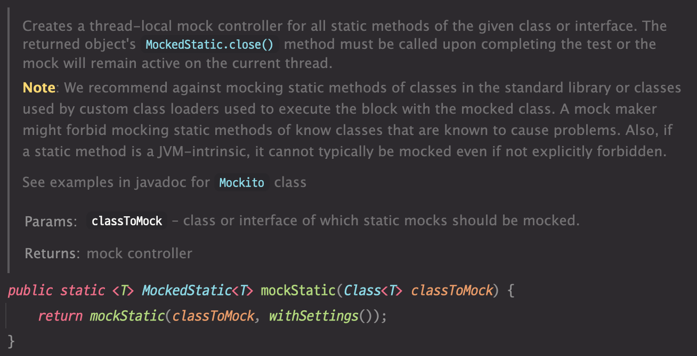
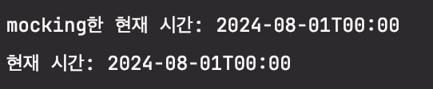
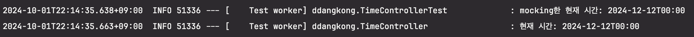
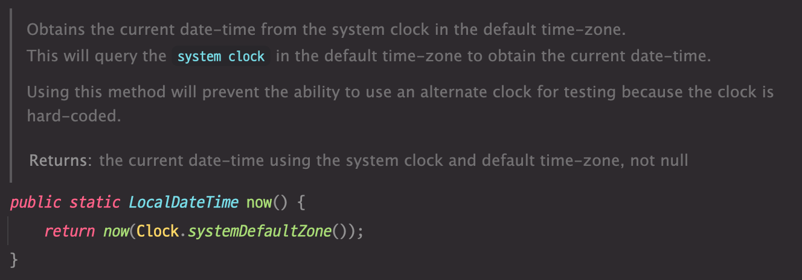
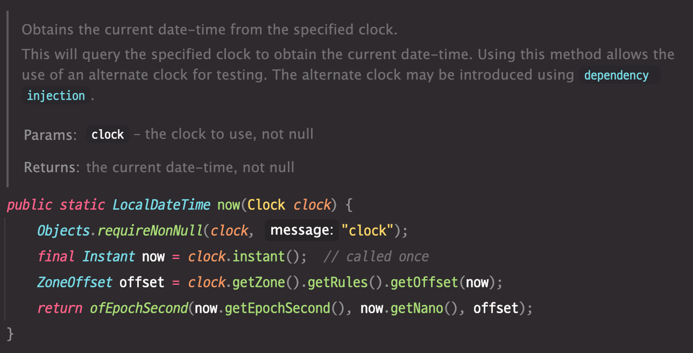

# 어노테이션 하나로 테스트에서 *LocalDateTime.now()* 제어하기

'테스트가 실패해요.'

테스트를 작성한 당시에는 성공했는데 시간이 조금 지나고 나니 멀쩡한 테스트가 실패했습니다.
관련 테스트는 비즈니스 로직에서 `LocalDateTIme.now()`로 현재 시간을 가져오고 있었고, 테스트를 실행할 때마다 현재 시간이 달라져 어느 시점부터 완전히 실패하는 테스트가 되었습니다.

좋은 단위 테스트는 [F.I.R.S.T 원칙](https://howtodoinjava.com/best-practices/first-principles-for-good-tests/)을 따릅니다. 하지만 제가 구현한 테스트는 반복 가능하지 않은 테스트, 즉 **Repeatable** 원칙을 만족하지 못하고 있었습니다. 현재 시간과 같은 랜덤 요소를 제어하는 것은 테스트에서 매우 중요한데요. 저는 단순히 '시간 제어하기'를 넘어 2가지도 함께 고민했습니다.

1. 테스트 가독성 높이기
2. 다른 팀원들도 테스트에서 쉽게 시간 제어하기

위 고민을 해결하기 위해 ~~했는지 소개드리고자 합니다.

## 테스트에서 시간을 어떻게 제어할 것인가?

Mock이란 [테스트 더블](https://www.javacodegeeks.com/2019/04/introduction-to-test-doubles.html) 방법 중 하나로, 테스트에서 실제 객체와 동일한 모의 객체를 만들어 ~~
이러한 행위를 모킹(Mocking)이라고 합니다.

스프링 부트에서는 `spring-boot-starter-test`의존성에 포함된 [Mockito](https://site.mockito.org/) 프레임워크를 사용하여 모킹을 사용합니다.

먼저 테스트 더블 중 모킹이 떠올랐습니다. `LocalDateTIme.now()`를 모킹해서 원하는 시간만 리턴하도록 변경하는 것이죠.

`LocalDateTIme.now()`는 static 메서드입니다. 따라서 Mockito의 일반적인 모킹 방식으로는 제어할 수 없습니다.

### 1. static 메서드 모킹



[Mockito 3.4.0](https://javadoc.io/doc/org.mockito/mockito-core/latest/org/mockito/Mockito.html#48) 버전 이상부터 static 메서드 모킹을 지원합니다.

*TimeController*

```java
@RestController
public class TimeController {

    @GetMapping("/time")
    public void printCurrentTime() {
        LocalDateTime now = LocalDateTime.now();
        System.out.println("현재 시간: " + now);
    }
}
```

*Test*

```java
@WebMvcTest(TimeController.class)
public class TimeControllerTest {

    @Autowired
    private MockMvc mockMvc;

    @Test
    void 현재_시간_mocking() throws Exception {
        LocalDateTime now = LocalDateTime.parse("2024-08-01T00:00:00");
        System.out.println("mocking한 현재 시간: " + now);
        MockedStatic<LocalDateTime> localDateTimeMockedStatic = Mockito.mockStatic(LocalDateTime.class);
        localDateTimeMockedStatic.when(LocalDateTime::now).thenReturn(now);

        mockMvc.perform(get("/time"));

        localDateTimeMockedStatic.close();
    }
}
```

*결과*



그러나 Mockito에서 static 모킹을 지원하는 것은 레거시 코드

try-with-resource 또는 close() 명시 호출로 항상 리소스를 해제해야 합니다. 

가장 큰 문제점은 `mockStatic()`이 스레드 로컬 방식으로 처리된다는 것입니다. 그래서 `@SpringBootTest(webEnvironment = WebEnvironment.RANDOM_PORT)` 등을 사용하는 인수테스트는 다른 스레드에서 실행되기 때문에 반영되지 않습니다


*Test*

```java
@SpringBootTest(webEnvironment = WebEnvironment.RANDOM_PORT)
public class TimeControllerTest {

    private static final Logger log = LoggerFactory.getLogger(TimeControllerTest.class);

    @LocalServerPort
    private int port;

    @BeforeEach
    void setUp() {
        RestAssured.port = port;
    }

    @Test
    void 현재_시간_mocking() {
        LocalDateTime now = LocalDateTime.parse("2024-08-01T00:00:00");
        log.info("mocking한 현재 시간: {} ", now);

        MockedStatic<LocalDateTime> localDateTimeMockedStatic = Mockito.mockStatic(LocalDateTime.class);
        localDateTimeMockedStatic.when(LocalDateTime::now).thenReturn(now);

        RestAssured.when()
                .get("/time");

        localDateTimeMockedStatic.close();
    }
}
```

*결과*


서로 다른 스레드에서 실행되고, 모킹이 적용되지 않았음을 확인할 수 있습니다.

### 2. LocalDateTime을 래핑하는 클래스

```java
@Component
public class LocalDateTimeWrapper {

    public LocalDateTime now() {
        return LocalDateTime.now();
    }
}
```

테스트에서 래핑 클래스를 테스트 더블로 대체하는 방법입니다.

*TimeController*
```java
@RestController
@RequiredArgsConstructor
@Slf4j
public class TimeController {

    private final LocalDateTimeWrapper localDateTimeWrapper;

    @GetMapping("/time")
    public void printCurrentTime() {
        LocalDateTime now = localDateTimeWrapper.now();
        log.info("현재 시간: {}", now);
    }
}
```

*Test*
```java
@WebMvcTest(TimeController.class)
public class TimeControllerTest {

    private static final Logger log = LoggerFactory.getLogger(TimeControllerTest.class);

    @Autowired
    private MockMvc mockMvc;

    @MockBean
    private LocalDateTimeWrapper localDateTimeWrapper;

    @Test
    void 현재_시간_mocking() throws Exception {
        LocalDateTime now = LocalDateTime.parse("2024-12-12T00:00:00");
        when(localDateTimeWrapper.now()).thenReturn(now);
        log.info("mocking한 현재 시간: {}", now);

        mockMvc.perform(get("/time"));
    }
}
```

*결과*




하지만 LocalDateTime 때문에 불필요하게 클래스가 생성되는 것이 내키지 않았습니다.

### 3. Clock 객체를 bean으로 등록한 후 mocking



`now()`의 내부를 살펴보면 `SystemClock`을 인자로 받는 내부 메서드를 호출하고 있습니다



JavaDoc에서는 테스트를 위해 대체 clock을 사용할 수 있다고 안내하고 있습니다.

*Clock bean 등록*
```java
@Configuration
public class ClockConfig {

    @Bean
    public Clock clock() {
        return Clock.system(ZoneId.of("Asia/Seoul"));
    }
}
```

*TimeService*
```java
@Service
@RequiredArgsConstructor
@Slf4j
public class TimeService {

    private final Clock clock;

    public void printCurrentTime() {
        LocalDateTime now = LocalDateTime.now(clock);
        log.info("현재 시간: {}", now);
    }
}
```
Clock 객체를 의존성 주입 후 `LocalDateTime.now(clock)`로 변경합니다.

*Test*
```java
@SpringBootTest
public class TimeServiceTest {

    @Autowired
    private TimeService timeService;

    @MockBean
    private Clock clock;

    @Test
    void 현재_시간_mocking() {
        when(clock.instant()).thenReturn(Instant.parse("2024-12-31T00:00:00Z"));
        when(clock.getZone()).thenReturn(ZoneOffset.UTC);

        timeService.printCurrentTime();
    }
}
```

Clock을 제어해야 하는 테스트마다 모킹과 관련한 보일러플레이트 코드가 발생합니다.

이 때는 `TestConfiguration`에서 고정된 Clock 객체를 primary bean으로 등록해서 테스트 전역으로 제어할 수 있습니다.

*TestConfiguration*

```java
@TestConfiguration
public class TestConfig {

    @Primary
    @Bean
    public Clock testClock() {
        return Clock.fixed(Instant.parse("2024-12-31T00:00:00Z"), ZoneOffset.UTC);
    }
}
```

*Test*
```java
@SpringBootTest
@Import(TestConfig.class)
public class TimeServiceTest {

    @Autowired
    private TimeService timeService;

    @Test
    void 현재_시간_mocking() {
        timeService.printCurrentTime();
    }
}
```
`@Import`로 TestConfiguration 설정을 적용해서 테스트에 고정된 Clock 객체를 사용합니다.

땅콩은 TestConfiguration으로 시간을 제어하도록

## 커스텀 어노테이션으로 Clock 객체를 제어할 수 없을까?

Clock 객체를 전역적으로 제어했지만 테스트를 작성할 때 여전히 불편함이 있었습니다.
1. 매 번 TestConfiguration에 고정된 시간을 확인하면서 테스트를 작성해야 함 ('시간 언제로 고정되어 있었지?')
2. 테스트를 유연하게 작성하기 어려움 ('이 테스트에서는 다른 시간으로 고정해야 하는데...')
3. 테스트에서 데잍를 왜 x시간으로 저장했는지 한 번에 읽히지 않음 ('이 테스트는 왜 x시간으로 저장하지?')

기존 TestConfiguration의 단점을 극복하기 위해 

JUnit의 extension 기능을 활용했습니다


```java
@Target({ElementType.TYPE, ElementType.METHOD})
@Retention(RetentionPolicy.RUNTIME)
@ExtendWith(FixedClockExtension.class)
public @interface FixedClock {

    String date();

    String time();
}
```

```java
public class FixedClockExtension implements BeforeEachCallback {

    private static final Pattern DATE_PATTERN = Pattern.compile("\\d{4}-\\d{2}-\\d{2}");
    private static final Pattern TIME_PATTERN = Pattern.compile("\\d{2}:\\d{2}:\\d{2}");

    @Override
    public void beforeEach(ExtensionContext context) {
        Clock clock = SpringExtension.getApplicationContext(context).getBean(Clock.class);
        FixedClock fixedClockAnnotation = getFixedClockAnnotation(context);

        String date = getDate(fixedClockAnnotation);
        String time = getTime(fixedClockAnnotation);
        when(clock.instant()).thenReturn(Instant.parse("%sT%sZ".formatted(date, time)));
        when(clock.getZone()).thenReturn(ZoneOffset.UTC);
    }

    private FixedClock getFixedClockAnnotation(ExtensionContext context) {
        FixedClock fixedClockAnnotation = context.getRequiredTestMethod().getDeclaredAnnotation(FixedClock.class);
        if (fixedClockAnnotation == null) {
            fixedClockAnnotation = context.getRequiredTestClass().getDeclaredAnnotation(FixedClock.class);
        }
        return fixedClockAnnotation;
    }

    private String getDate(FixedClock fixedClockAnnotation) {
        String date = fixedClockAnnotation.date();
        if (!DATE_PATTERN.matcher(date).matches()) {
            throw new IllegalArgumentException("yyyy-MM-dd의 date 포맷이어야 합니다. invalid date: %s".formatted(date));
        }
        return date;
    }

    private String getTime(FixedClock fixedClockAnnotation) {
        String time = fixedClockAnnotation.time();
        if (!TIME_PATTERN.matcher(time).matches()) {
            throw new IllegalArgumentException("HH:mm:ss의 time 포맷이어야 합니다. invalid time: %s".formatted(time));
        }
        return time;
    }
}
```

`BeforeEachCallback`은 JUnit에서 제공하는 extension

Zone UTC

입력하는 date, time은 KST가 이미 적용된 시간

`LocalDateTime.now()` 동작 방식을 보면

메서드가 우선 순위

```java

```

Clock 객체를 SpyBean으로 등록합니다. `@SpyBean` 은 클래스, 필드만 선언가능

Clock을 사용하는 테스트 클래스에 적용

`@FixedClock` 은 메서드, 클래스 모두 사용 가능 → `@SpyBean` 포함 불가

테스트 flow 이미지

### Test 적용

### 이점
-> 각 테스트마다 개발자 고유의 고정된 시간을 사용할 수 있음
-> 각 테스트마다 독립적으로 고정된 시간을 사용하여 테스트를 작성할 수 있음
-> 고정된 시간이 무엇인지 명시하여 가독성 증가


## reference

- https://www.baeldung.com/mockito-mock-static-methods
- https://docs.oracle.com/javase/8/docs/api/java/time/LocalDate.html#now-java.time.Clock-
- https://github.com/mockito/mockito/issues/1013
