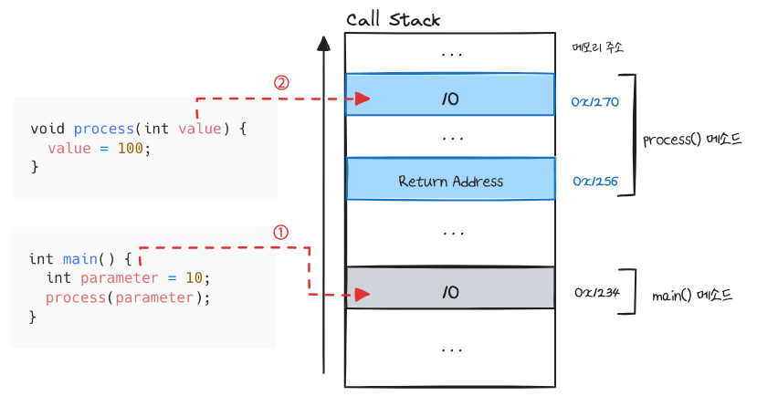
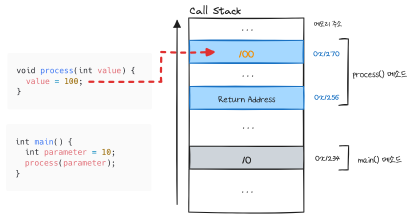
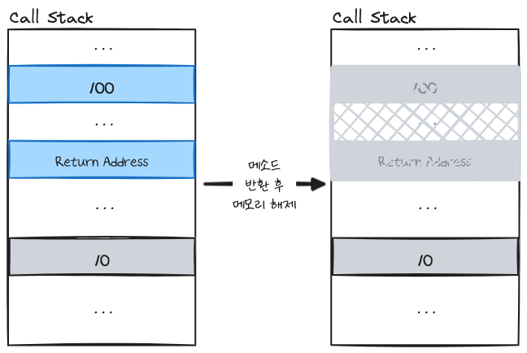
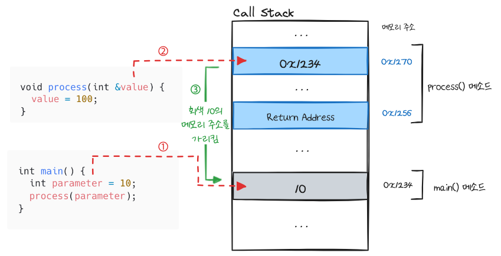
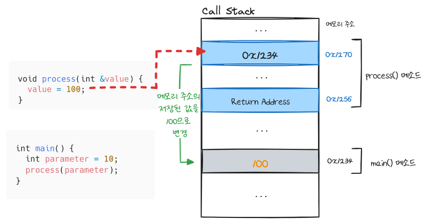
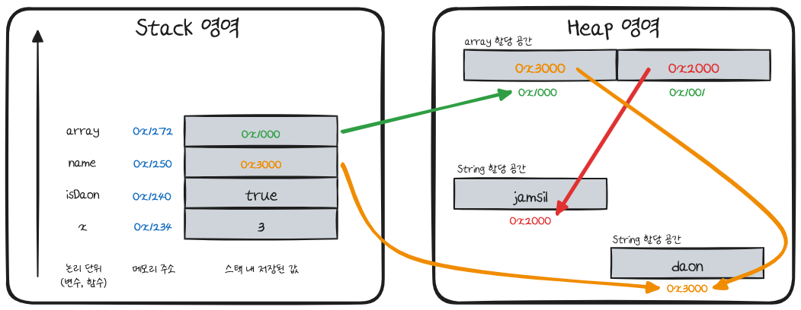
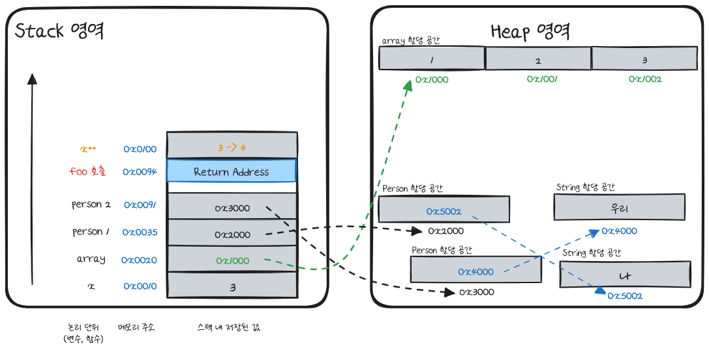
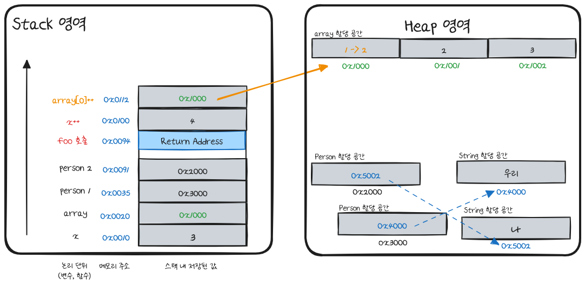
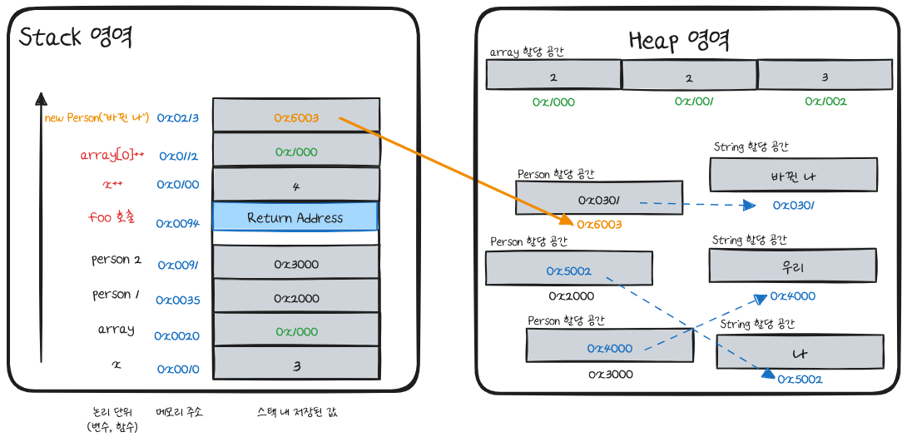
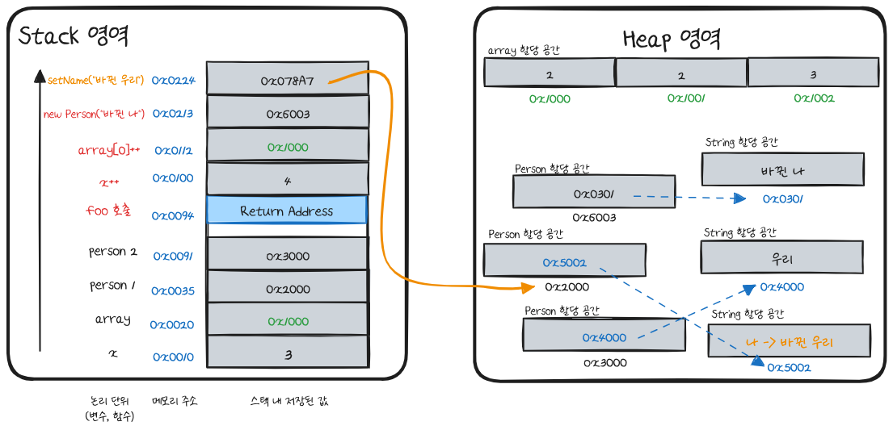

# 자바(Java)가 매개변수를 넘겨주는 방법

자바(Java)는 메서드의 결과가 어떤 영향을 미치는지 헷갈릴 때가 있다. 
아래 자바 언어의 `main()` 메서드를 실행했을 때 결과를 예측해보자.
```java
class Person {
    
    private String name;
    
    public Person(String name) {
        this.name = name;
    }
    
    public String getName() {
        return name;
    }
    
    public void setName(String name) {
        this.name = name;
    }
}


public class Main {
    
    public static void main(String[] args) {
        int x = 3;
        int[] array = {1, 2, 3};
        Person person1 = new Person("나");
        Person person2 = new Person("우리");
        
        foo(x, array, person1, person2);

        System.out.println("x: " + x);
        System.out.println("array[0]: " + array[0]);
        System.out.println("person1.name: " + person1.getName());
        System.out.println("person2.name: " + person2.getName());
    }
    
    private static void foo(int x, int[] array, Person person1, Person person2) {
        x++;
        array[0]++;
        person1 = new Person("바뀐 나");
        person2.setName("바뀐 우리");
    }
}
```
실행 결과는 아래 **서론의 예제 분석**에서 다룰 것이다.

여기자바를 예시로 들었지만 흥미로운 사실은 개발 언어마다 실행 결과가 다르다는 것이다.
왜냐하면 개발 언어마다 메서드의 매개변수서전달 방식이 다르기 때문이다.
가장 일반적으로 알려진 값에 의한 전달(Pass by Value)과 참조에 의한 전달(Pass by Reference)을 토대로 매개변수 전달 방식을 알아보자.

## 용어 정리

### 값에 의한 전달(Pass by Value, Call by Value)
값에 의한 전달은 매개변수로 데이터의 복사본을 전달한다. 
즉, 메서드 안의 모든 수정 사항은 메서드 밖에 영향을 미치지 않는다.

C++ 언어로 알아보자. 
```cpp
#include <iostream>

using namespace std;

void process(int value) {
    // 문자열과 변수의 값을 줄바꿈과 함께 콘솔에 출력한다
    cout << "Value passed into function: " << value << endl;
    value = 100;
    cout << "Value before leaving function: " << value << endl;
}

int main() {
    int parameter = 10;
    cout << "Value before function call: " << parameter << endl;
    process(parameter);
    cout << "Value after function call: " << parameter << endl;

    return 0;
}
```
`main()` 메서드를 실행하면 어떤 결과가 나올까?

```bash
Value before function call: 10                                                                                                                                              
Value passed into function: 10                                                                                                                                                    
Value before leaving function: 100                                                                                                                                                
Value after function call: 10
```
`paramter` 변수의 값이 `process()` 메서드를 수행한 후 100이 될 것을 예상했지만 변하지 않았다.

왜 이런 결과가 도출되었는지 콜 스택(Call Stack)을 통해 알아보자.
콜 스택은 프로그램 실행 중에 메서드 호출을 관리하는 데이터 구조이다.
아래 예시들은 아래에서 위로 데이터가 쌓인다고 가정한다.

### 값에 의한 전달과 콜 스택



먼저 `main()` 메서드에서 호출한 변수 `parameter`가 콜 스택에 쌓인다. 이후 `process()` 메서드가 호출되고 반환 주소(Return Address)가 저장된다. 반환 주소(Return Address)란 메서드가 실행을 마치고 다시 돌아가야 할 위치를 저장하는 메모리 주소이다. 

다음으로 매개변수인 변수 `value`가 콜 스택에 쌓인다.

콜 스택에 저장된 두 변수의 값은 10으로 같지만 서로 다른 메모리 주소에 저장된다.
위의 그림처럼 `main()` 메서드의 `parameter` 변수는 0x7170 주소 값을 `process()` 메서드의 `value` 변수는 0x71270 주소 값을 가진다.



`process() `메서드 내 value 변수의 값을 변경하면 메모리에 할당된 값만 바뀌게 된다.



이후 메서드가 반환되면 `process()` 메서드가 할당된 메모리가 소멸된다. 
그렇기에 `process()` 메서드의 결과가 `parameter`에 반영되지 않았다.

이러한 매개변수 전달 방식을 값에 의한 전달이라 한다.


## 참조에 의한 전달(Pass by Reference)

참조에 의한 전달(Pass by Reference)은 주소 값을 전달하여 동일한 데이터에 대해 여러 변수 이름을 사용한다. 
때문에 값을 수정하면 원본의 데이터도 함께 수정된다.

코드로 예시를 들어보자.
```cpp
#include <iostream>

using namespace std;

// c++은 참조값을 전달하기 위해 &를 사용한다.
void process(int& value) {
    // 문자열과 변수의 값을 줄바꿈과 함께 콘솔에 출력한다
    cout << "Value passed into function: " << value << endl;
    value = 100;
    cout << "Value before leaving function: " << value << endl;
}

int main() {
    int parameter = 10;
    cout << "Value before function call: " << parameter << endl;
    process(parameter);
    cout << "Value after function call: " << parameter << endl;

    return 0;
}
```
`main()` 메서드를 실행해보면 값에 의한 전달(Pass by Value)과 다른 결과가 도출된다.

```bash
Value before function call: 10                                                                                                                                              
Value passed into function: 10                                                                                                                                                    
Value before leaving function: 100                                                                                                                                                
Value after function call: 100
```

값을 복사한 것이 아닌 참조(Alias)를 넘겼기에 `process()` 메서드에서 변경된 값이 원본에도 영향을 끼쳤다.
콜 스택을 통해 더 깊게 알아보자.

### 참조에 의한 전달(Pass by Reference)과 콜 스택



먼저 `main()` 메서드에서 선언된 `parameter` 변수가 스택에 쌓인다.
이후 `process()` 메서드 호출되고 반환 주소(Return Address)가 적재고 그 후 매개변수 정보를 스택에 저장한다.
이때 저장 되는 것은 10 이 아닌 변수 `parameter` 의 값이 저장된 메모리의 주소를 저장된다.



`process()` 메서드에서 매개변수로 전달 받은 변수 `value`는 변수 `parameter`가 저장된 값의 참조이다. 
그래서 변수 `value`를 변경하면 주소 값이 가리키는 변수 `parameter` 메모리의 값을 변경한다.

## 자바의 매개변수 전달 방식

자바는 어떤 방식으로 매개변수를 전달할까?

> When the method or constructor is invoked (§15.12), the values of the actual argument expressions **_initialize newly created parameter variables_**, each of the declared type, before execution of the body of the method or constructor.
> </br> \- JLS(Java Language Specification) ch 8.4.1

자바 명세인 JLS에 자바는 값에 의한 전달(Pass by Value)라 명시되어 있다.

하지만 자바는 기본적으로 원시 타입과 참조 타입이 존재한다.
두 타입은 어떻게 값에 의한 전달(Pass by Value)를 사용할까?
이를 위해 자바의 메모리 할당 방식에 대한 이해가 필요하다.

## 자바 메모리 할당
자바의 메모리 할당은 자바의 가상머신인 JVM의 메모리 구조를 기반으로 이루어진다.
JVM의 메모리 구조는 크게 Stack 영역, Heap 영역, Method 영역으로 나눌 수 있다. 

이 중 변수를 선언할 때 할당되는 메모리는 Stack과 Heap이 있다. 두 메모리 영역의 차이는 데이터 적재 순서이다. Stack 영역은 LIFO 구조로 순서대로 메모리에 쌓이고 가장 최근에 추가된 데이터부터 꺼내지만 Heap 영역은 비연속적인 메모리 블록으로 메모리의 랜덤 위치에 할당된다. 

(이로 인해 JVM은 Garbage Collector로 힙 메모리에 생성된 객체를 관리하며 더 이상 참조되지 않는 객체를 감지하여 메모리를 자동으로 해제한다.)

아래 코드로 예시를 들어보자.
```java
public class MemoryEx {
    
    public void ex() {
        int x = 3;
        boolean isDaon = true;
        String name = "daon";
        String[] array = new String[2];
        array[1] = new String("daon");
        array[2] = "jamsil";
    }
}
```
이들이 적재된 메모리를 나타내면 아래와 같다.



> `String`은 Heap에 저장되지만 저장 방식이 다른 객체와 다르다. 자세한 내용은 `리터럴 풀`을 찾아보자.

자바의 두 타입을 바탕으로 어떻게 동작하는지 알아보자.

### 자바의 원시 타입

값에 의한 전달(Pass by Value)에서 설명한 방식과 동일하게 동작한다.

### 참조 타입 배열 array

자바의 참조 타입인 객체는 좀 더 확장된 규칙이 적용된다. 

객체는 값이 아닌 실제 메모리를 가리키는 포인터를 저장하여 내부 필드의 값을 변경하면 반영 된다.

이게 어떻게 Call By Value지? 란 궁금점이 생길 수 있다. 
참조 타입인 객체는 매개변수로 전달될 때 내부 연산은 가능하지만 그 객체 자체가 새로운 객체로 재할당하는 것은 반영이 되지 않는다.

그 외 참조 타입으로 가능한 연산은 아래와 같다.

> JLS(Java Language Specification)의 4.3.1 절 Object
> - Field 접근
> - Method Invocation
> - Cast Operator
> - String의 `+` 연산자와 호출되면 `toString()` 메서드를 호출하여 문자열로 변환하여 연결한다.
> - instanceof 연산자
> - == 또는 != 또는 ? :

## 서론의 예제 분석

서론의 예제를 분석해보자.

```java
class Person {
    
    private String name;
    
    public Person(String name) {
        this.name = name;
    }
    
    public String getName() {
        return name;
    }
    
    public void setName(String name) {
        this.name = name;
    }
}


public class Main {
    
    public static void main(String[] args) {
        int x = 3;
        int[] array = {1, 2, 3};
        Person person1 = new Person("나");
        Person person2 = new Person("우리");
        
        foo(x, array, person1, person2);

        System.out.println("x: " + x);
        System.out.println("array[0]: " + array[0]);
        System.out.println("person1.name: " + person1.getName());
        System.out.println("person2.name: " + person2.getName());
    }
    
    private static void foo(int x, int[] array, Person person1, Person person2) {
        x++;
        array[0]++;
        person1 = new Person("바뀐 나");
        person2.setName("바뀐 우리");
    }
}
```

실행 결과는 아래와 같다.

```bash
x: 3
array[0]: 2
person1.name: 나
person2.name: 바뀐 우리
```

### 1. 원시 타입 x


변수 x의 동작은 앞서 설명한 값에 의한 전달(Pass by Value) 메모리 할당과 동일하게 동작한다.
그래서 `foo()` 메서드에서의 변경이 유지되지 않는다.

### 2. 참조 타입 배열 array


참조 타입은 생성된 객체 내에 접근하여 값을 변경하는 것이 가능하다.
때문에 포인터에 해당하는 배열의 값을 바꾸면 실제 배열에도 반영된다.

### 3. 참조 타입 Person1


`foo()` 메서드 내부에서 변수 `Person1`에 새로운 객체를 할당했다.
그림과 같이 아예 다른 메모리 주소를 참조하도록 바뀌게 되었다.
그로 인해 `foo()` 메서드가 반환되더라도 변경이 유지되지 않는다.

### 4. 참조 타입 Person2


변수 `Person2`는 `foo()` 메서드 내부에서 객체 내 필드에 접근하여 값을 변경하였다.
참조 타입은 객체 내 필드를 변경하면 그 메모리가 가리키는 값을 따라가 직접 수정하게 되므로 변경이 유지된다.

## 결론

매개변수의 전달 방식은 값에 의한 전달(Pass by Value)와 참조에 의한 전달(Pass by Reference)를 알아보았다.
사용하는 언어의 매개변수 전달 방식도 알게된다면 예기치 못한 에러 상황을 피할 수 있을 것이다. 

---
### 참고 자료
[자바 Language Specification 1.0](https://titanium.cs.berkeley.edu/doc/java-langspec-1.0/)
- Written by: James Gosling, Bill Joy, Guy Steele
- Created on: Aug. 1996
- Referenced on: Sep. 28, 2024
  
[The 자바 Language Specification, 자바 SE 23 Edition](https://docs.oracle.com/javase/specs/)
- Written by: Oracle
- Created on: Sep. 2024
- Referenced on: Sep. 28, 2024

[Passing by Value vs. Passing by Reference in 자바](https://dzone.com/articles/pass-by-value-vs-reference-in-java)
- Written by: Justin Albano
- Created on: Oct. 20, 2017
- Referenced on: Sep. 28, 2024

[Pass-By-Value as a Parameter Passing Mechanism in 자바](https://www.baeldung.com/java-pass-by-value-or-pass-by-reference)
- Written by: Baeldung
- Last Updated on Jan. 8, 2024
- Referenced on Sep. 28, 2024

[[자바] 메모리 관리 및 Pass By Value의 동작 방식 (2/3)](https://mangkyu.tistory.com/106)
<br/>[[자바] Pass By Value와 Pass By Reference의 차이 및 이해 (3/3)](https://mangkyu.tistory.com/106)
- Written by: 망나니개발자 (aka. Mangkyu)
- Created on Jan. 18, 2021
- Referenced on Sep. 28, 2024
