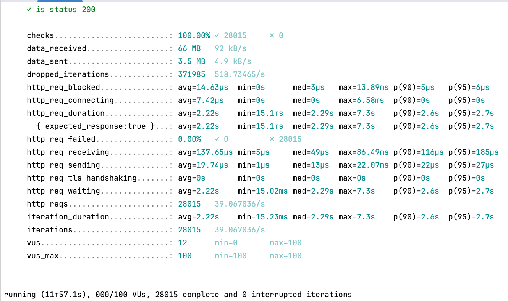
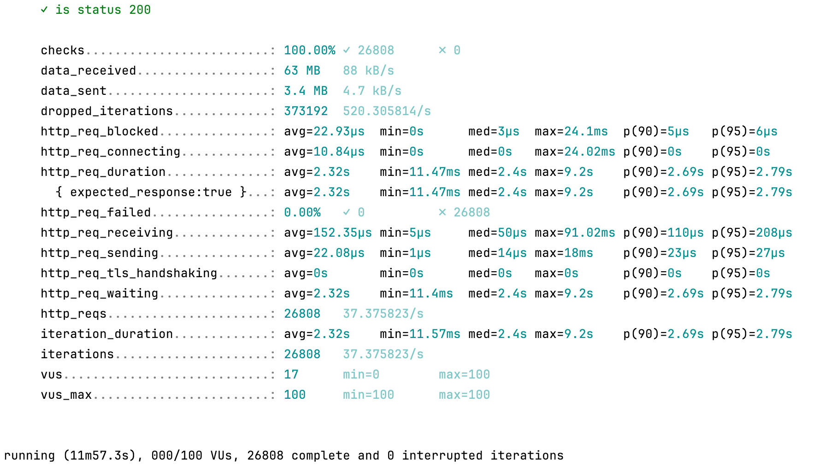
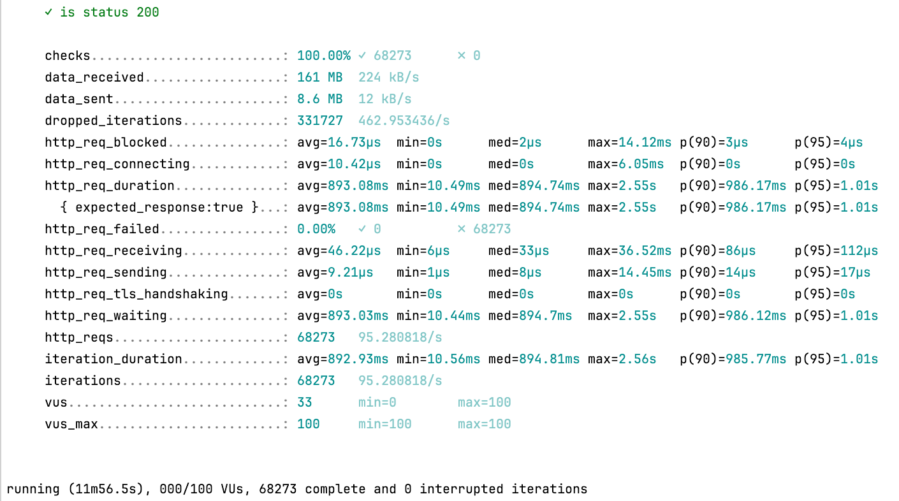
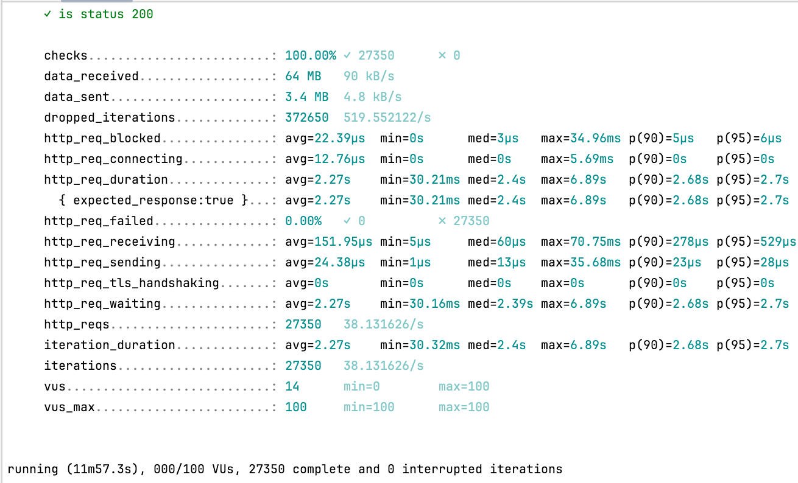
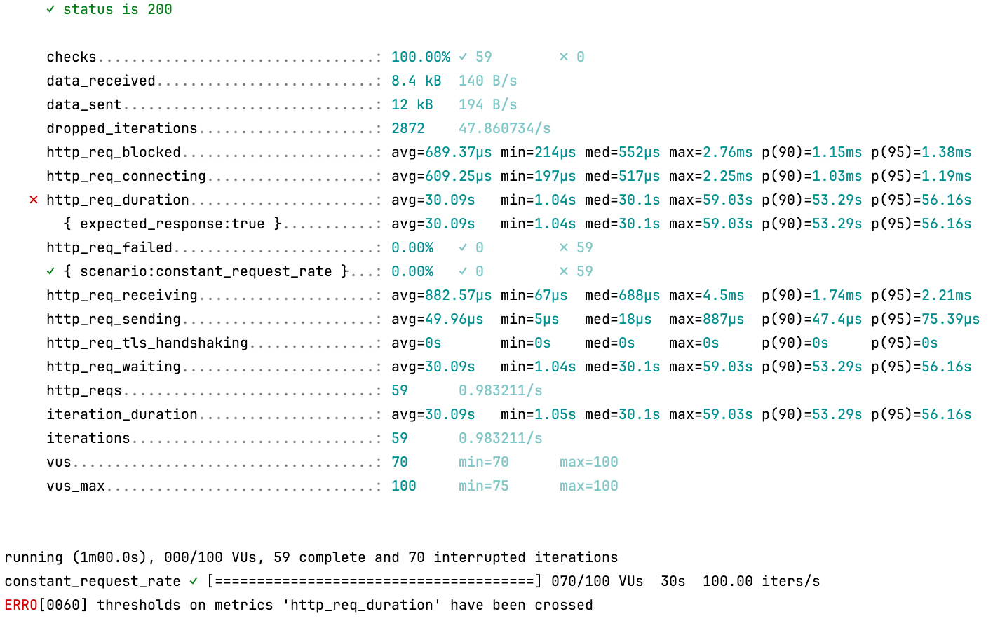
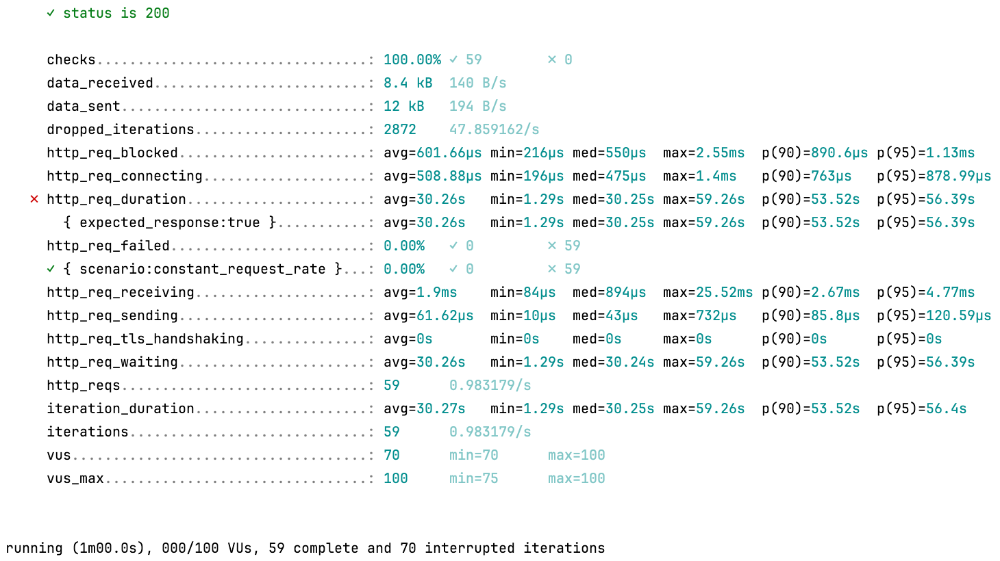
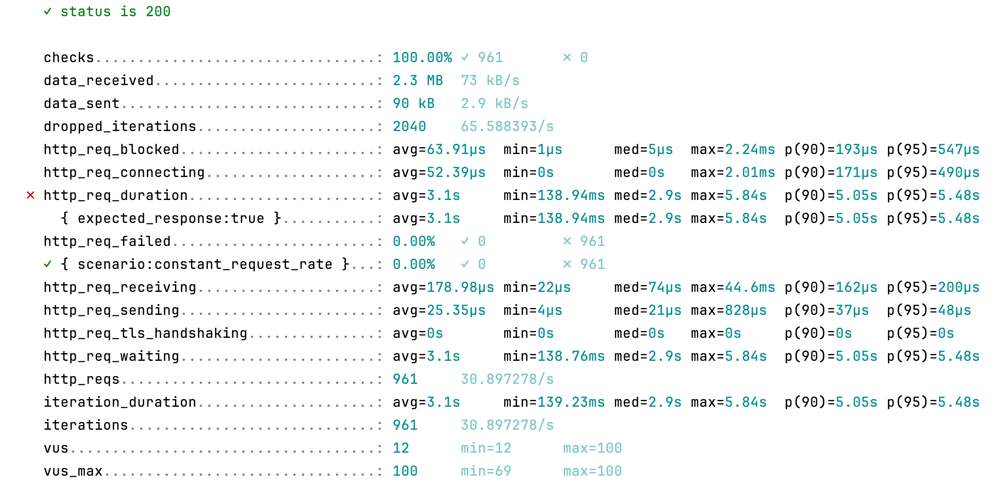
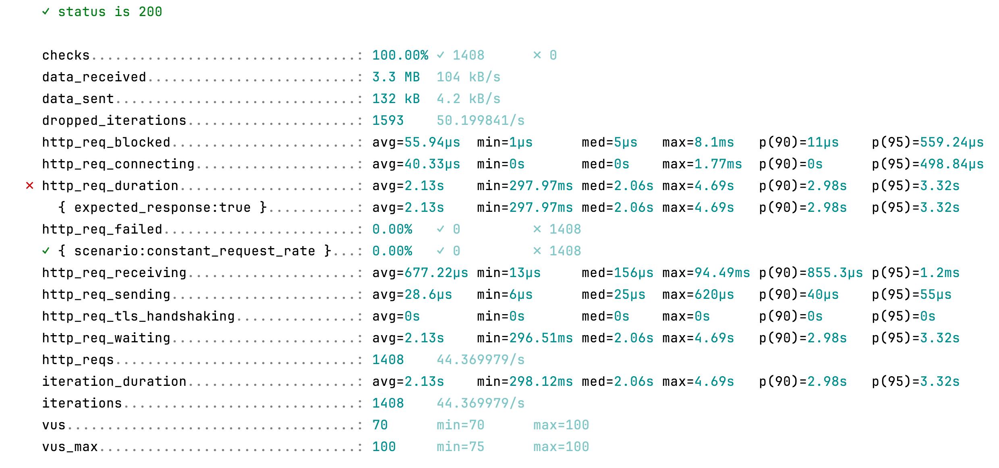

# 자바의 Thread

자바에서 스레드 기술은 태초의 Thread 클래스에서 부터 시작했다. 이후 이를 한 층 더 추상화하고, 스레드 풀을 쉽게 만들게 해주는 API가 추가되고, 스레드를 외부에서 종료시킬 수 있는 API가 추가되었다. 그리고 자바 스레드 기술의 최신 버전이 Virtual Thread다. 막 어려운 개념은 아니고, Process 로 동시성을 처리하다가 버거워서 Thread가 등장한 것 처럼, Thread로 동시성을 처리하기 버거워서 Virtual Thread가 등장한 것이다. 성능 향상을 불러오는 근본적인 이유도 같다.

## Platform Thread

기존의 자바 Thread 인스턴스다. 이들은 운영체제가 제공하는 스레드를 살짝 감싸서 구현된다. 또한, 생성될 때부터 종료될 때까지 운영체제가 제공하는 스레드에 종속된다. 따라서 Platform Thread개수는 자바가 동작하는 운영체제의 OS Thread 개수에 제한된다.

운영체제는 스레드에 독립적인 스택 메모리 공간을 주고 그 외에도 여러 자원을 할당한다. 따라서, Platform Thread를 사용하는 것은 자바가 동작하는 운영체제의 제한에 크게 영향을 받는다. 대신, CPU 위주의 작업이던, IO 위주의 작업 모두 적절히 수행할 수 있다.

## Virtual Thread

가상 스레드 역시 Thread 클래스의 인스턴스다. 다만, Platform Thread와 다르게 운영체제 스레드에 종속되지 않는다. 물론 실행은 운영체제의 스레드 위에서 실행된다. 

운영체제 스레드에 종속되지 않기 때문에 Virtual Thread가 blocking I/O 를 사용하면 그 Virtual Thread만 블로킹 될 뿐, 운영체제 스레드는 블로킹 되지 않고 다른 Virtual Thread를 실행한다. 따라서, 컨텍스트 스위칭 비용이 JVM 레벨에서만 발생한다. 이로 인해 더 높은 처리량을 가질 수 있다.

하지만, CPU 연산 위주의 작업을 할때는 Virtual Thread가 적합하지 않다. Virtual Thread는 blocking I/O 상황에서 발생하는 Context Switching 비용을 줄여 높은 처리량을 가지는 것이지, 작업 실행 속도 자체가 빨라지는 것이 아니다.

### Virtual Thread의 실행


Virtual Thread의 간략한 라이프 사이클

Virtual Thread도 결국 운영체제 위에서 동작하기 때문에 운영체제의 스레드가 Virtual Thread를 실행한다. 따라서 Virtual Thread는 런타임에 동적으로 몇개의 Platform Thread에 매핑되어 작업을 수행한다. 이 mapping 되는 것을 마운트라고 부르고, 마운트된 Platform Thread를 Carrier라고 부른다. 

Virtual Thread가 I/O 등 블로킹 작업을 요청하면 마운트가 해제된다. 따라서 Thread 스케줄러가 다른 Virtual Thread 를 마운트 하여 실행할 수 있다. 나중에 Virtual Thread의 블로킹 작업이 완료되면 스케줄러에 제출되고 스케줄러가 이를 마운트한다.

### Virtual Thread Pinning

JDK의 거의 모든 블로킹 명령은 Virtual Thread의 마운트를 해제하지만, 그렇지 못하는 경우가 있다. 그리고 마운트가 해제되지 않았기 때문에 캐리어와 운영체제가 제공하는 스레드가 모두 블로킹된다. 이는 버그가 아니라 운영체제의 제한이나 JVM의 제한 때문이다. 마운트를 해제하지 못하는 상황을 Pinning이라 부른다. Pinning이 발생하는 경우는 두가지가 있다.

1. `synchronized` 블록이나 메서드의 코드를 수행하는 경우
2. 네이티브 메서드나 [Foreign Function](https://openjdk.org/jeps/424)을 수행하는 경우

Pinning이 발생한다고 해서 어플리케이션이 이상하게 동작하지는 않는다. 다만, 확장성이 떨어질 뿐이다. 극단적으로 많이 발생한다면, Virtual Thread를 사용하는 이유가 없어진다. Virtual Thread의 스케줄링 작업만 추가된 것이므로 더 느려진다.

# 실제로 Virtual Thread를 쓸 수 있나

## Spring Boot 와 Virtual Thread

Spring Boot 2.x 버전에서는 [별도의 설정](https://spring.io/blog/2022/10/11/embracing-virtual-threads#running-spring-applications-on-virtual-threads)을 통해 Servlet 이 Virtual Thread 에서 실행되게 해줄 수 있다. 하지만, 다음과 같은 [주의사항](https://spring.io/blog/2022/10/11/embracing-virtual-threads#mitigating-limitations)이 쓰여있다. `synchronized` 코드가 많아서 Virtual Thread의 장점을 온전히 누릴 수 없다는 말이다.


[그러나 3.2.0 버전에서 이를 개선해 공식적으로 Virtual Thread를 지원](https://spring.io/blog/2023/09/09/all-together-now-spring-boot-3-2-graalvm-native-images-java-21-and-virtual#spring-boot-32)하게 되었다. 당연히 내부적으로 `synchronized` 키워드를 줄였을 것으로 예상한다.

## Mysql과 Virtual Thread

Mysql 등의 RDB는 JDBC API를 통해 자바 어플리케이션과 통신한다. 이를 위해 구현체인 `MySQL Connector/J` 가 필요하다. [기존에는 내부에서 `synchronized`키워드를 사용했으나 9.0.0 버전에서 `ReentrantLocks`로 대체했다.](https://dev.mysql.com/doc/relnotes/connector-j/en/news-9-0-0.html)

# 실험

## 실험 계획

### 대조군과 실험군 설정

현재 진행하고 있는 데벨업 프로젝트는 Virtual Thread를 사용할 수 있다는 이유로 Java 21을 선택했다. Virtual Thread의 활성화를 위해서는 어느정도 성능 향상이 있는지 확인해 볼 필요가 있다고 생각했다. 실험은 4가지 조합의 비교로 진행했다.

1. Spring Boot 3.2.7(Virtual Thread X) + Mysql Connector 8 (대조군)
2. Spring Boot 3.2.7(Virtual Thread X) + Mysql Connector 9 (실험군 1)
3. Spring Boot 3.2.7(Virtual Thread O) + Mysql Connector 8 (실험군 2)
4. Spring Boot 3.2.7(Virtual Thread O) + Mysql Connector 9 (실험군 3)

실험군 1은 MySQL Connector/J 9.0.0의 성능 변화를 확인하기 위한 실험이다.

실험군 2는 Virtual Thread 활성화 여부에 따른 성능 변화를 확인하기 위한 실험이다.

실험군 3은 Virtual Thread 활성화 여부와 MySQL Connector/J 9.0.0에 따른 성능 변화를 종합적으로 확인하기 위한 실험이다.

### 실험 설계

테스트를 위한 기본적인 코드는 [이 레포지토리](https://github.com/robinjoon/java-21-virtual-thread-test)에서 확인할 수 있다. 실험은 다음과 같이 설계했다.

1. Mysql과 Spring Boot 어플리케이션을 도커 컴포스를 이용해 실행한다.
2. 이때, 각각 1개의 CPU 코어와 1024M 의 메모리만 사용할 수 있도록 제한한다. 이는 컨테이너의 환경을 제한해 균일한 성능을 사용하기 위함이다.
3. 데이터베이스에는 100001개의 게시글이 작성되어 있다. 1개의 All 탐색 쿼리와 1개의 index 탐색 쿼리가 발생한다.
4. k6를 이용해 100명의 가상 유저가 `http://localhost:8080/posts/page/123` 로 GET 요청을 각자 200번씩 보낸다. 각 가상유저는 응답을 받는 즉시 가능한 빨리 다음 요청을 보낸다. **단, 첫 요청을 보낸 뒤 30초가 지나면 더이상 요청을 보내지 않는다.** 이를 총 20번 반복해 통계를 생성한다.
    - k6 스크립트
        
        ```jsx
        import http from 'k6/http';
        import {check} from 'k6';
        
        export const options = {
            scenarios: {
                vu_100_scenario1: {
                    executor: 'per-vu-iterations',
                    startTime: '20s',
                    gracefulStop: '5s',
                    vus: 100,
                    iterations: 200,
                    maxDuration: '30s',
                },
                vu_100_scenario2: {
                    executor: 'per-vu-iterations',
                    startTime: '55s',
                    gracefulStop: '5s',
                    vus: 100,
                    iterations: 200,
                    maxDuration: '30s',
                },
                vu_100_scenario3: {
                    executor: 'per-vu-iterations',
                    startTime: '90s',
                    gracefulStop: '5s',
                    vus: 100,
                    iterations: 200,
                    maxDuration: '30s',
                },
                vu_100_scenario4: {
                    executor: 'per-vu-iterations',
                    startTime: '125s',
                    gracefulStop: '5s',
                    vus: 100,
                    iterations: 200,
                    maxDuration: '30s',
                },
                vu_100_scenario5: {
                    executor: 'per-vu-iterations',
                    startTime: '160s',
                    gracefulStop: '5s',
                    vus: 100,
                    iterations: 200,
                    maxDuration: '30s',
                },
                vu_100_scenario6: {
                    executor: 'per-vu-iterations',
                    startTime: '195s',
                    gracefulStop: '5s',
                    vus: 100,
                    iterations: 200,
                    maxDuration: '30s',
                },
                vu_100_scenario7: {
                    executor: 'per-vu-iterations',
                    startTime: '230s',
                    gracefulStop: '5s',
                    vus: 100,
                    iterations: 200,
                    maxDuration: '30s',
                },
                vu_100_scenario8: {
                    executor: 'per-vu-iterations',
                    startTime: '265s',
                    gracefulStop: '5s',
                    vus: 100,
                    iterations: 200,
                    maxDuration: '30s',
                },
                vu_100_scenario9: {
                    executor: 'per-vu-iterations',
                    startTime: '300s',
                    gracefulStop: '5s',
                    vus: 100,
                    iterations: 200,
                    maxDuration: '30s',
                },
                vu_100_scenario10: {
                    executor: 'per-vu-iterations',
                    startTime: '335s',
                    gracefulStop: '5s',
                    vus: 100,
                    iterations: 200,
                    maxDuration: '30s',
                },
                vu_100_scenario11: {
                    executor: 'per-vu-iterations',
                    startTime: '370s',
                    gracefulStop: '5s',
                    vus: 100,
                    iterations: 200,
                    maxDuration: '30s',
                },
                vu_100_scenario12: {
                    executor: 'per-vu-iterations',
                    startTime: '405s',
                    gracefulStop: '5s',
                    vus: 100,
                    iterations: 200,
                    maxDuration: '30s',
                },
                vu_100_scenario13: {
                    executor: 'per-vu-iterations',
                    startTime: '440s',
                    gracefulStop: '5s',
                    vus: 100,
                    iterations: 200,
                    maxDuration: '30s',
                },
                vu_100_scenario14: {
                    executor: 'per-vu-iterations',
                    startTime: '475s',
                    gracefulStop: '5s',
                    vus: 100,
                    iterations: 200,
                    maxDuration: '30s',
                },
                vu_100_scenario15: {
                    executor: 'per-vu-iterations',
                    startTime: '510s',
                    gracefulStop: '5s',
                    vus: 100,
                    iterations: 200,
                    maxDuration: '30s',
                },
                vu_100_scenario16: {
                    executor: 'per-vu-iterations',
                    startTime: '545s',
                    gracefulStop: '5s',
                    vus: 100,
                    iterations: 200,
                    maxDuration: '30s',
                },
                vu_100_scenario17: {
                    executor: 'per-vu-iterations',
                    startTime: '580s',
                    gracefulStop: '5s',
                    vus: 100,
                    iterations: 200,
                    maxDuration: '30s',
                },
                vu_100_scenario18: {
                    executor: 'per-vu-iterations',
                    startTime: '615s',
                    gracefulStop: '5s',
                    vus: 100,
                    iterations: 200,
                    maxDuration: '30s',
                },
                vu_100_scenario19: {
                    executor: 'per-vu-iterations',
                    startTime: '650s',
                    gracefulStop: '5s',
                    vus: 100,
                    iterations: 200,
                    maxDuration: '30s',
                },
                vu_100_scenario20: {
                    executor: 'per-vu-iterations',
                    startTime: '685s',
                    gracefulStop: '5s',
                    vus: 100,
                    iterations: 200,
                    maxDuration: '30s',
                },
            },
        };
        
        export default function () {
            const params = {
                headers: {
                    'Content-Type': 'application/json',
                },
            };
        
            let response = http.get('http://localhost:8080/posts/page/123', params);
        
            check(response, {
                'is status 200': (r) => r.status === 200,
            });
        }
        
        ```
        
5. 각 실험 사이에 하드웨어의 쓰로틀링을 고려해 30분간 아무 작업도 하지 않고 대기했다.

앞에서 설명한 이론대로면 비효율적인 쿼리가 발생하는 만큼 IO 위주의 작업이되고, 가상 스레드의 이점이 부각되는 상황이다. 또한, 가상 스레드를 활성화 했다면, synchronized 키워드를 제거한 MySQL Connector/J 9.0.0가 더 성능이 좋아야 한다.

## 실험 결과

<aside>
❓ 의외의 실험 결과가 나왔다. 구체적인 수치는 재시도 할 때 마다 조금씩 달랐지만 경향이 달라지지는 않았다.

</aside>

### Spring Boot 3.2.7(Virtual Thread X) + Mysql Connector 8



기본 설정에서는 약 28000번의 반복을 했다. 즉, 10분동안 28000개의 요청을 처리했다.

### Spring Boot 3.2.7(Virtual Thread X) + Mysql Connector 9



`MySQL Connector/J 9.0.0`를 사용한 상황에서는 약 26000번의 반복을 했다. 즉, 10분동안 26000개의 요청을 처리했다. 오히려 기본 설정보다 낮은 처리량이다.

### Spring Boot 3.2.7(Virtual Thread O) + Mysql Connector 8



`Virtual Thread`를 사용한 상황에서는 약 68000번의 반복을 했다. 즉, 10분동안 68000개의 요청을 처리했다. 기본 설정 대비 약 2.5배의 처리량을 보여준다.

### Spring Boot 3.2.7(Virtual Thread O) + Mysql Connector 9



`Virtual Thread`와  `MySQL Connector/J 9.0.0`를 사용한 상황에서는 약 27000번의 반복을 했다. 즉, 10분동안 27000개의 요청을 처리했다. 오히려 기본 설정보다 낮은 처리량이다.

## 이상한 실험 결과

실험 결과가 예상과 다른 점은 `MySQL Connector/J 9.0.0` 를 사용하면 예상과 달리 성능이 하락한다는 것이다. 

생각과 다른 점은 Virtual Thread + `MySQL Connector/J 8.3.0` 조합에서 첫 요청에 아래와 같이 Pinned 되었다는 기록이 남고, 이후에는 매우 가끔 이런 로그가 남는다.


몇번의 Pinned 로그가 남는 것을 확인했다. 그런데, 이들 예외의 스택 트레이스가 조금 다르다.

첫번째 로그는 커넥션을 얻는 부분에서 발생했다.

- 첫번째 Pinned
    
    ```
    Thread[#26,ForkJoinPool-1-worker-1,5,CarrierThreads]
        java.base/java.lang.VirtualThread$VThreadContinuation.onPinned(VirtualThread.java:185)
        java.base/jdk.internal.vm.Continuation.onPinned0(Continuation.java:393)
        java.base/java.lang.VirtualThread.parkNanos(VirtualThread.java:631)
        java.base/java.lang.System$2.parkVirtualThread(System.java:2648)
        java.base/jdk.internal.misc.VirtualThreads.park(VirtualThreads.java:67)
        java.base/java.util.concurrent.locks.LockSupport.parkNanos(LockSupport.java:408)
        java.base/sun.nio.ch.Poller.pollIndirect(Poller.java:137)
        java.base/sun.nio.ch.Poller.poll(Poller.java:102)
        java.base/sun.nio.ch.Poller.poll(Poller.java:87)
        java.base/sun.nio.ch.NioSocketImpl.park(NioSocketImpl.java:175)
        java.base/sun.nio.ch.NioSocketImpl.timedRead(NioSocketImpl.java:280)
        java.base/sun.nio.ch.NioSocketImpl.implRead(NioSocketImpl.java:304)
        java.base/sun.nio.ch.NioSocketImpl.read(NioSocketImpl.java:346)
        java.base/sun.nio.ch.NioSocketImpl$1.read(NioSocketImpl.java:796)
        java.base/java.net.Socket$SocketInputStream.read(Socket.java:1099)
        java.base/sun.security.ssl.SSLSocketInputRecord.read(SSLSocketInputRecord.java:489)
        java.base/sun.security.ssl.SSLSocketInputRecord.readHeader(SSLSocketInputRecord.java:483)
        java.base/sun.security.ssl.SSLSocketInputRecord.bytesInCompletePacket(SSLSocketInputRecord.java:70)
        java.base/sun.security.ssl.SSLSocketImpl.readApplicationRecord(SSLSocketImpl.java:1461)
        java.base/sun.security.ssl.SSLSocketImpl$AppInputStream.read(SSLSocketImpl.java:1066)
        java.base/java.io.FilterInputStream.read(FilterInputStream.java:119)
        com.mysql.cj.protocol.FullReadInputStream.readFully(FullReadInputStream.java:64)
        com.mysql.cj.protocol.a.SimplePacketReader.readHeaderLocal(SimplePacketReader.java:81)
        com.mysql.cj.protocol.a.SimplePacketReader.readHeader(SimplePacketReader.java:63)
        com.mysql.cj.protocol.a.SimplePacketReader.readHeader(SimplePacketReader.java:45)
        com.mysql.cj.protocol.a.TimeTrackingPacketReader.readHeader(TimeTrackingPacketReader.java:52)
        com.mysql.cj.protocol.a.TimeTrackingPacketReader.readHeader(TimeTrackingPacketReader.java:41)
        com.mysql.cj.protocol.a.MultiPacketReader.readHeader(MultiPacketReader.java:54)
        com.mysql.cj.protocol.a.MultiPacketReader.readHeader(MultiPacketReader.java:44)
        com.mysql.cj.protocol.a.NativeProtocol.readMessage(NativeProtocol.java:576)
        com.mysql.cj.protocol.a.NativeProtocol.checkErrorMessage(NativeProtocol.java:762)
        com.mysql.cj.protocol.a.NativeProtocol.sendCommand(NativeProtocol.java:701)
        com.mysql.cj.protocol.a.NativeProtocol.sendCommand(NativeProtocol.java:157)
        com.mysql.cj.NativeSession.ping(NativeSession.java:735)
        com.mysql.cj.jdbc.ConnectionImpl.pingInternal(ConnectionImpl.java:1468)
        com.mysql.cj.jdbc.ConnectionImpl.isValid(ConnectionImpl.java:2496) <== monitors:1
        com.zaxxer.hikari.pool.PoolBase.isConnectionDead(PoolBase.java:156)
        com.zaxxer.hikari.pool.HikariPool.getConnection(HikariPool.java:170)
        com.zaxxer.hikari.pool.HikariPool.getConnection(HikariPool.java:146)
        com.zaxxer.hikari.HikariDataSource.getConnection(HikariDataSource.java:128)
        org.hibernate.engine.jdbc.connections.internal.DatasourceConnectionProviderImpl.getConnection(DatasourceConnectionProviderImpl.java:122)
        org.hibernate.internal.NonContextualJdbcConnectionAccess.obtainConnection(NonContextualJdbcConnectionAccess.java:46)
        org.hibernate.resource.jdbc.internal.LogicalConnectionManagedImpl.acquireConnectionIfNeeded(LogicalConnectionManagedImpl.java:113)
        org.hibernate.resource.jdbc.internal.LogicalConnectionManagedImpl.getPhysicalConnection(LogicalConnectionManagedImpl.java:143)
        org.springframework.orm.jpa.vendor.HibernateJpaDialect.beginTransaction(HibernateJpaDialect.java:164)
        org.springframework.orm.jpa.JpaTransactionManager.doBegin(JpaTransactionManager.java:420)
        org.springframework.transaction.support.AbstractPlatformTransactionManager.startTransaction(AbstractPlatformTransactionManager.java:532)
        org.springframework.transaction.support.AbstractPlatformTransactionManager.getTransaction(AbstractPlatformTransactionManager.java:405)
        org.springframework.transaction.interceptor.TransactionAspectSupport.createTransactionIfNecessary(TransactionAspectSupport.java:604)
        org.springframework.transaction.interceptor.TransactionAspectSupport.invokeWithinTransaction(TransactionAspectSupport.java:373)
        org.springframework.transaction.interceptor.TransactionInterceptor.invoke(TransactionInterceptor.java:119)
        org.springframework.aop.framework.ReflectiveMethodInvocation.proceed(ReflectiveMethodInvocation.java:184)
        org.springframework.dao.support.PersistenceExceptionTranslationInterceptor.invoke(PersistenceExceptionTranslationInterceptor.java:138)
        org.springframework.aop.framework.ReflectiveMethodInvocation.proceed(ReflectiveMethodInvocation.java:184)
        org.springframework.data.jpa.repository.support.CrudMethodMetadataPostProcessor$CrudMethodMetadataPopulatingMethodInterceptor.invoke(CrudMethodMetadataPostProcessor.java:164)
        org.springframework.aop.framework.ReflectiveMethodInvocation.proceed(ReflectiveMethodInvocation.java:184)
        org.springframework.aop.interceptor.ExposeInvocationInterceptor.invoke(ExposeInvocationInterceptor.java:97)
        org.springframework.aop.framework.ReflectiveMethodInvocation.proceed(ReflectiveMethodInvocation.java:184)
        org.springframework.aop.framework.JdkDynamicAopProxy.invoke(JdkDynamicAopProxy.java:223)
        jdk.proxy2/jdk.proxy2.$Proxy107.findAll(Unknown Source)
        org.example.vt.service.PostService.findAll(PostService.java:20)
        org.example.vt.controller.PostController.getPosts(PostController.java:26)
        java.base/jdk.internal.reflect.DirectMethodHandleAccessor.invoke(DirectMethodHandleAccessor.java:103)
        java.base/java.lang.reflect.Method.invoke(Method.java:580)
        org.springframework.web.method.support.InvocableHandlerMethod.doInvoke(InvocableHandlerMethod.java:255)
        org.springframework.web.method.support.InvocableHandlerMethod.invokeForRequest(InvocableHandlerMethod.java:188)
        org.springframework.web.servlet.mvc.method.annotation.ServletInvocableHandlerMethod.invokeAndHandle(ServletInvocableHandlerMethod.java:118)
        org.springframework.web.servlet.mvc.method.annotation.RequestMappingHandlerAdapter.invokeHandlerMethod(RequestMappingHandlerAdapter.java:926)
        org.springframework.web.servlet.mvc.method.annotation.RequestMappingHandlerAdapter.handleInternal(RequestMappingHandlerAdapter.java:831)
        org.springframework.web.servlet.mvc.method.AbstractHandlerMethodAdapter.handle(AbstractHandlerMethodAdapter.java:87)
        org.springframework.web.servlet.DispatcherServlet.doDispatch(DispatcherServlet.java:1089)
        org.springframework.web.servlet.DispatcherServlet.doService(DispatcherServlet.java:979)
        org.springframework.web.servlet.FrameworkServlet.processRequest(FrameworkServlet.java:1014)
        org.springframework.web.servlet.FrameworkServlet.doGet(FrameworkServlet.java:903)
        jakarta.servlet.http.HttpServlet.service(HttpServlet.java:564)
        org.springframework.web.servlet.FrameworkServlet.service(FrameworkServlet.java:885)
        jakarta.servlet.http.HttpServlet.service(HttpServlet.java:658)
        org.apache.catalina.core.ApplicationFilterChain.internalDoFilter(ApplicationFilterChain.java:195)
        org.apache.catalina.core.ApplicationFilterChain.doFilter(ApplicationFilterChain.java:140)
        org.apache.tomcat.websocket.server.WsFilter.doFilter(WsFilter.java:51)
        org.apache.catalina.core.ApplicationFilterChain.internalDoFilter(ApplicationFilterChain.java:164)
        org.apache.catalina.core.ApplicationFilterChain.doFilter(ApplicationFilterChain.java:140)
        org.springframework.web.filter.RequestContextFilter.doFilterInternal(RequestContextFilter.java:100)
        org.springframework.web.filter.OncePerRequestFilter.doFilter(OncePerRequestFilter.java:116)
        org.apache.catalina.core.ApplicationFilterChain.internalDoFilter(ApplicationFilterChain.java:164)
        org.apache.catalina.core.ApplicationFilterChain.doFilter(ApplicationFilterChain.java:140)
        org.springframework.web.filter.FormContentFilter.doFilterInternal(FormContentFilter.java:93)
        org.springframework.web.filter.OncePerRequestFilter.doFilter(OncePerRequestFilter.java:116)
        org.apache.catalina.core.ApplicationFilterChain.internalDoFilter(ApplicationFilterChain.java:164)
        org.apache.catalina.core.ApplicationFilterChain.doFilter(ApplicationFilterChain.java:140)
        org.springframework.web.filter.CharacterEncodingFilter.doFilterInternal(CharacterEncodingFilter.java:201)
        org.springframework.web.filter.OncePerRequestFilter.doFilter(OncePerRequestFilter.java:116)
        org.apache.catalina.core.ApplicationFilterChain.internalDoFilter(ApplicationFilterChain.java:164)
        org.apache.catalina.core.ApplicationFilterChain.doFilter(ApplicationFilterChain.java:140)
        org.apache.catalina.core.StandardWrapperValve.invoke(StandardWrapperValve.java:167)
        org.apache.catalina.core.StandardContextValve.invoke(StandardContextValve.java:90)
        org.apache.catalina.authenticator.AuthenticatorBase.invoke(AuthenticatorBase.java:483)
        org.apache.catalina.core.StandardHostValve.invoke(StandardHostValve.java:115)
        org.apache.catalina.valves.ErrorReportValve.invoke(ErrorReportValve.java:93)
        org.apache.catalina.core.StandardEngineValve.invoke(StandardEngineValve.java:74)
        org.apache.catalina.connector.CoyoteAdapter.service(CoyoteAdapter.java:344)
        org.apache.coyote.http11.Http11Processor.service(Http11Processor.java:384)
        org.apache.coyote.AbstractProcessorLight.process(AbstractProcessorLight.java:63)
        org.apache.coyote.AbstractProtocol$ConnectionHandler.process(AbstractProtocol.java:904)
        org.apache.tomcat.util.net.NioEndpoint$SocketProcessor.doRun(NioEndpoint.java:1741)
        org.apache.tomcat.util.net.SocketProcessorBase.run(SocketProcessorBase.java:52)
        java.base/java.lang.VirtualThread.run(VirtualThread.java:311)
    ```
    

두번째 로그는 트랜잭션을 설정하는 부분에서 발생했다.

- 두번째 Pinned
    
    ```
    Thread[#26,ForkJoinPool-1-worker-1,5,CarrierThreads]
        java.base/java.lang.VirtualThread$VThreadContinuation.onPinned(VirtualThread.java:185)
        java.base/jdk.internal.vm.Continuation.onPinned0(Continuation.java:393)
        java.base/java.lang.VirtualThread.park(VirtualThread.java:592)
        java.base/java.lang.System$2.parkVirtualThread(System.java:2639)
        java.base/jdk.internal.misc.VirtualThreads.park(VirtualThreads.java:54)
        java.base/java.util.concurrent.locks.LockSupport.park(LockSupport.java:369)
        java.base/sun.nio.ch.Poller.pollIndirect(Poller.java:139)
        java.base/sun.nio.ch.Poller.poll(Poller.java:102)
        java.base/sun.nio.ch.Poller.poll(Poller.java:87)
        java.base/sun.nio.ch.NioSocketImpl.park(NioSocketImpl.java:175)
        java.base/sun.nio.ch.NioSocketImpl.park(NioSocketImpl.java:201)
        java.base/sun.nio.ch.NioSocketImpl.implRead(NioSocketImpl.java:309)
        java.base/sun.nio.ch.NioSocketImpl.read(NioSocketImpl.java:346)
        java.base/sun.nio.ch.NioSocketImpl$1.read(NioSocketImpl.java:796)
        java.base/java.net.Socket$SocketInputStream.read(Socket.java:1099)
        java.base/sun.security.ssl.SSLSocketInputRecord.read(SSLSocketInputRecord.java:489)
        java.base/sun.security.ssl.SSLSocketInputRecord.readHeader(SSLSocketInputRecord.java:483)
        java.base/sun.security.ssl.SSLSocketInputRecord.bytesInCompletePacket(SSLSocketInputRecord.java:70)
        java.base/sun.security.ssl.SSLSocketImpl.readApplicationRecord(SSLSocketImpl.java:1461)
        java.base/sun.security.ssl.SSLSocketImpl$AppInputStream.read(SSLSocketImpl.java:1066)
        java.base/java.io.FilterInputStream.read(FilterInputStream.java:119)
        com.mysql.cj.protocol.FullReadInputStream.readFully(FullReadInputStream.java:64)
        com.mysql.cj.protocol.a.SimplePacketReader.readHeaderLocal(SimplePacketReader.java:81)
        com.mysql.cj.protocol.a.SimplePacketReader.readHeader(SimplePacketReader.java:63)
        com.mysql.cj.protocol.a.SimplePacketReader.readHeader(SimplePacketReader.java:45)
        com.mysql.cj.protocol.a.TimeTrackingPacketReader.readHeader(TimeTrackingPacketReader.java:52)
        com.mysql.cj.protocol.a.TimeTrackingPacketReader.readHeader(TimeTrackingPacketReader.java:41)
        com.mysql.cj.protocol.a.MultiPacketReader.readHeader(MultiPacketReader.java:54)
        com.mysql.cj.protocol.a.MultiPacketReader.readHeader(MultiPacketReader.java:44)
        com.mysql.cj.protocol.a.NativeProtocol.readMessage(NativeProtocol.java:576)
        com.mysql.cj.protocol.a.NativeProtocol.checkErrorMessage(NativeProtocol.java:762)
        com.mysql.cj.protocol.a.NativeProtocol.sendCommand(NativeProtocol.java:701)
        com.mysql.cj.protocol.a.NativeProtocol.sendQueryPacket(NativeProtocol.java:1050)
        com.mysql.cj.protocol.a.NativeProtocol.sendQueryString(NativeProtocol.java:997)
        com.mysql.cj.NativeSession.execSQL(NativeSession.java:658)
        com.mysql.cj.jdbc.ConnectionImpl.setReadOnlyInternal(ConnectionImpl.java:2115) <== monitors:1
        com.mysql.cj.jdbc.ConnectionImpl.setReadOnly(ConnectionImpl.java:2106)
        com.zaxxer.hikari.pool.ProxyConnection.setReadOnly(ProxyConnection.java:410)
        com.zaxxer.hikari.pool.HikariProxyConnection.setReadOnly(HikariProxyConnection.java)
        org.springframework.jdbc.datasource.DataSourceUtils.prepareConnectionForTransaction(DataSourceUtils.java:190)
        org.springframework.orm.jpa.vendor.HibernateJpaDialect.beginTransaction(HibernateJpaDialect.java:165)
        org.springframework.orm.jpa.JpaTransactionManager.doBegin(JpaTransactionManager.java:420)
        org.springframework.transaction.support.AbstractPlatformTransactionManager.startTransaction(AbstractPlatformTransactionManager.java:532)
        org.springframework.transaction.support.AbstractPlatformTransactionManager.getTransaction(AbstractPlatformTransactionManager.java:405)
        org.springframework.transaction.interceptor.TransactionAspectSupport.createTransactionIfNecessary(TransactionAspectSupport.java:604)
        org.springframework.transaction.interceptor.TransactionAspectSupport.invokeWithinTransaction(TransactionAspectSupport.java:373)
        org.springframework.transaction.interceptor.TransactionInterceptor.invoke(TransactionInterceptor.java:119)
        org.springframework.aop.framework.ReflectiveMethodInvocation.proceed(ReflectiveMethodInvocation.java:184)
        org.springframework.dao.support.PersistenceExceptionTranslationInterceptor.invoke(PersistenceExceptionTranslationInterceptor.java:138)
        org.springframework.aop.framework.ReflectiveMethodInvocation.proceed(ReflectiveMethodInvocation.java:184)
        org.springframework.data.jpa.repository.support.CrudMethodMetadataPostProcessor$CrudMethodMetadataPopulatingMethodInterceptor.invoke(CrudMethodMetadataPostProcessor.java:164)
        org.springframework.aop.framework.ReflectiveMethodInvocation.proceed(ReflectiveMethodInvocation.java:184)
        org.springframework.aop.interceptor.ExposeInvocationInterceptor.invoke(ExposeInvocationInterceptor.java:97)
        org.springframework.aop.framework.ReflectiveMethodInvocation.proceed(ReflectiveMethodInvocation.java:184)
        org.springframework.aop.framework.JdkDynamicAopProxy.invoke(JdkDynamicAopProxy.java:223)
        jdk.proxy2/jdk.proxy2.$Proxy107.findAll(Unknown Source)
        org.example.vt.service.PostService.findAll(PostService.java:20)
        org.example.vt.controller.PostController.getPosts(PostController.java:26)
        java.base/jdk.internal.reflect.DirectMethodHandleAccessor.invoke(DirectMethodHandleAccessor.java:103)
        java.base/java.lang.reflect.Method.invoke(Method.java:580)
        org.springframework.web.method.support.InvocableHandlerMethod.doInvoke(InvocableHandlerMethod.java:255)
        org.springframework.web.method.support.InvocableHandlerMethod.invokeForRequest(InvocableHandlerMethod.java:188)
        org.springframework.web.servlet.mvc.method.annotation.ServletInvocableHandlerMethod.invokeAndHandle(ServletInvocableHandlerMethod.java:118)
        org.springframework.web.servlet.mvc.method.annotation.RequestMappingHandlerAdapter.invokeHandlerMethod(RequestMappingHandlerAdapter.java:926)
        org.springframework.web.servlet.mvc.method.annotation.RequestMappingHandlerAdapter.handleInternal(RequestMappingHandlerAdapter.java:831)
        org.springframework.web.servlet.mvc.method.AbstractHandlerMethodAdapter.handle(AbstractHandlerMethodAdapter.java:87)
        org.springframework.web.servlet.DispatcherServlet.doDispatch(DispatcherServlet.java:1089)
        org.springframework.web.servlet.DispatcherServlet.doService(DispatcherServlet.java:979)
        org.springframework.web.servlet.FrameworkServlet.processRequest(FrameworkServlet.java:1014)
        org.springframework.web.servlet.FrameworkServlet.doGet(FrameworkServlet.java:903)
        jakarta.servlet.http.HttpServlet.service(HttpServlet.java:564)
        org.springframework.web.servlet.FrameworkServlet.service(FrameworkServlet.java:885)
        jakarta.servlet.http.HttpServlet.service(HttpServlet.java:658)
        org.apache.catalina.core.ApplicationFilterChain.internalDoFilter(ApplicationFilterChain.java:195)
        org.apache.catalina.core.ApplicationFilterChain.doFilter(ApplicationFilterChain.java:140)
        org.apache.tomcat.websocket.server.WsFilter.doFilter(WsFilter.java:51)
        org.apache.catalina.core.ApplicationFilterChain.internalDoFilter(ApplicationFilterChain.java:164)
        org.apache.catalina.core.ApplicationFilterChain.doFilter(ApplicationFilterChain.java:140)
        org.springframework.web.filter.RequestContextFilter.doFilterInternal(RequestContextFilter.java:100)
        org.springframework.web.filter.OncePerRequestFilter.doFilter(OncePerRequestFilter.java:116)
        org.apache.catalina.core.ApplicationFilterChain.internalDoFilter(ApplicationFilterChain.java:164)
        org.apache.catalina.core.ApplicationFilterChain.doFilter(ApplicationFilterChain.java:140)
        org.springframework.web.filter.FormContentFilter.doFilterInternal(FormContentFilter.java:93)
        org.springframework.web.filter.OncePerRequestFilter.doFilter(OncePerRequestFilter.java:116)
        org.apache.catalina.core.ApplicationFilterChain.internalDoFilter(ApplicationFilterChain.java:164)
        org.apache.catalina.core.ApplicationFilterChain.doFilter(ApplicationFilterChain.java:140)
        org.springframework.web.filter.CharacterEncodingFilter.doFilterInternal(CharacterEncodingFilter.java:201)
        org.springframework.web.filter.OncePerRequestFilter.doFilter(OncePerRequestFilter.java:116)
        org.apache.catalina.core.ApplicationFilterChain.internalDoFilter(ApplicationFilterChain.java:164)
        org.apache.catalina.core.ApplicationFilterChain.doFilter(ApplicationFilterChain.java:140)
        org.apache.catalina.core.StandardWrapperValve.invoke(StandardWrapperValve.java:167)
        org.apache.catalina.core.StandardContextValve.invoke(StandardContextValve.java:90)
        org.apache.catalina.authenticator.AuthenticatorBase.invoke(AuthenticatorBase.java:483)
        org.apache.catalina.core.StandardHostValve.invoke(StandardHostValve.java:115)
        org.apache.catalina.valves.ErrorReportValve.invoke(ErrorReportValve.java:93)
        org.apache.catalina.core.StandardEngineValve.invoke(StandardEngineValve.java:74)
        org.apache.catalina.connector.CoyoteAdapter.service(CoyoteAdapter.java:344)
        org.apache.coyote.http11.Http11Processor.service(Http11Processor.java:384)
        org.apache.coyote.AbstractProcessorLight.process(AbstractProcessorLight.java:63)
        org.apache.coyote.AbstractProtocol$ConnectionHandler.process(AbstractProtocol.java:904)
        org.apache.tomcat.util.net.NioEndpoint$SocketProcessor.doRun(NioEndpoint.java:1741)
        org.apache.tomcat.util.net.SocketProcessorBase.run(SocketProcessorBase.java:52)
        java.base/java.lang.VirtualThread.run(VirtualThread.java:311)
    ```
    

세번째 이후 로그는 데이터를 가져오는 부분에서 발생했다. n+1 문제 때문에 여러번 읽기 때문에 더 많이 발생했다.

- 세번째 Pinned
    
    ```
    Thread[#26,ForkJoinPool-1-worker-1,5,CarrierThreads]
        java.base/java.lang.VirtualThread$VThreadContinuation.onPinned(VirtualThread.java:185)
        java.base/jdk.internal.vm.Continuation.onPinned0(Continuation.java:393)
        java.base/java.lang.VirtualThread.park(VirtualThread.java:592)
        java.base/java.lang.System$2.parkVirtualThread(System.java:2639)
        java.base/jdk.internal.misc.VirtualThreads.park(VirtualThreads.java:54)
        java.base/java.util.concurrent.locks.LockSupport.park(LockSupport.java:369)
        java.base/sun.nio.ch.Poller.pollIndirect(Poller.java:139)
        java.base/sun.nio.ch.Poller.poll(Poller.java:102)
        java.base/sun.nio.ch.Poller.poll(Poller.java:87)
        java.base/sun.nio.ch.NioSocketImpl.park(NioSocketImpl.java:175)
        java.base/sun.nio.ch.NioSocketImpl.park(NioSocketImpl.java:201)
        java.base/sun.nio.ch.NioSocketImpl.implRead(NioSocketImpl.java:309)
        java.base/sun.nio.ch.NioSocketImpl.read(NioSocketImpl.java:346)
        java.base/sun.nio.ch.NioSocketImpl$1.read(NioSocketImpl.java:796)
        java.base/java.net.Socket$SocketInputStream.read(Socket.java:1099)
        java.base/sun.security.ssl.SSLSocketInputRecord.read(SSLSocketInputRecord.java:489)
        java.base/sun.security.ssl.SSLSocketInputRecord.readHeader(SSLSocketInputRecord.java:483)
        java.base/sun.security.ssl.SSLSocketInputRecord.bytesInCompletePacket(SSLSocketInputRecord.java:70)
        java.base/sun.security.ssl.SSLSocketImpl.readApplicationRecord(SSLSocketImpl.java:1461)
        java.base/sun.security.ssl.SSLSocketImpl$AppInputStream.read(SSLSocketImpl.java:1066)
        java.base/java.io.FilterInputStream.read(FilterInputStream.java:119)
        com.mysql.cj.protocol.FullReadInputStream.readFully(FullReadInputStream.java:64)
        com.mysql.cj.protocol.a.SimplePacketReader.readHeaderLocal(SimplePacketReader.java:81)
        com.mysql.cj.protocol.a.SimplePacketReader.readHeader(SimplePacketReader.java:63)
        com.mysql.cj.protocol.a.SimplePacketReader.readHeader(SimplePacketReader.java:45)
        com.mysql.cj.protocol.a.TimeTrackingPacketReader.readHeader(TimeTrackingPacketReader.java:52)
        com.mysql.cj.protocol.a.TimeTrackingPacketReader.readHeader(TimeTrackingPacketReader.java:41)
        com.mysql.cj.protocol.a.MultiPacketReader.readHeader(MultiPacketReader.java:54)
        com.mysql.cj.protocol.a.MultiPacketReader.readHeader(MultiPacketReader.java:44)
        com.mysql.cj.protocol.a.NativeProtocol.readMessage(NativeProtocol.java:576)
        com.mysql.cj.protocol.a.NativeProtocol.checkErrorMessage(NativeProtocol.java:762)
        com.mysql.cj.protocol.a.NativeProtocol.sendCommand(NativeProtocol.java:701)
        com.mysql.cj.protocol.a.NativeProtocol.sendQueryPacket(NativeProtocol.java:1050)
        com.mysql.cj.protocol.a.NativeProtocol.sendQueryString(NativeProtocol.java:997)
        com.mysql.cj.NativeSession.execSQL(NativeSession.java:658)
        com.mysql.cj.jdbc.ConnectionImpl.setAutoCommit(ConnectionImpl.java:2005) <== monitors:1
        com.zaxxer.hikari.pool.ProxyConnection.setAutoCommit(ProxyConnection.java:401)
        com.zaxxer.hikari.pool.HikariProxyConnection.setAutoCommit(HikariProxyConnection.java)
        org.hibernate.resource.jdbc.internal.AbstractLogicalConnectionImplementor.begin(AbstractLogicalConnectionImplementor.java:72)
        org.hibernate.resource.jdbc.internal.LogicalConnectionManagedImpl.begin(LogicalConnectionManagedImpl.java:282)
        org.hibernate.resource.transaction.backend.jdbc.internal.JdbcResourceLocalTransactionCoordinatorImpl$TransactionDriverControlImpl.begin(JdbcResourceLocalTransactionCoordinatorImpl.java:232)
        org.hibernate.engine.transaction.internal.TransactionImpl.begin(TransactionImpl.java:83)
        org.springframework.orm.jpa.vendor.HibernateJpaDialect.beginTransaction(HibernateJpaDialect.java:176)
        org.springframework.orm.jpa.JpaTransactionManager.doBegin(JpaTransactionManager.java:420)
        org.springframework.transaction.support.AbstractPlatformTransactionManager.startTransaction(AbstractPlatformTransactionManager.java:532)
        org.springframework.transaction.support.AbstractPlatformTransactionManager.getTransaction(AbstractPlatformTransactionManager.java:405)
        org.springframework.transaction.interceptor.TransactionAspectSupport.createTransactionIfNecessary(TransactionAspectSupport.java:604)
        org.springframework.transaction.interceptor.TransactionAspectSupport.invokeWithinTransaction(TransactionAspectSupport.java:373)
        org.springframework.transaction.interceptor.TransactionInterceptor.invoke(TransactionInterceptor.java:119)
        org.springframework.aop.framework.ReflectiveMethodInvocation.proceed(ReflectiveMethodInvocation.java:184)
        org.springframework.dao.support.PersistenceExceptionTranslationInterceptor.invoke(PersistenceExceptionTranslationInterceptor.java:138)
        org.springframework.aop.framework.ReflectiveMethodInvocation.proceed(ReflectiveMethodInvocation.java:184)
        org.springframework.data.jpa.repository.support.CrudMethodMetadataPostProcessor$CrudMethodMetadataPopulatingMethodInterceptor.invoke(CrudMethodMetadataPostProcessor.java:164)
        org.springframework.aop.framework.ReflectiveMethodInvocation.proceed(ReflectiveMethodInvocation.java:184)
        org.springframework.aop.interceptor.ExposeInvocationInterceptor.invoke(ExposeInvocationInterceptor.java:97)
        org.springframework.aop.framework.ReflectiveMethodInvocation.proceed(ReflectiveMethodInvocation.java:184)
        org.springframework.aop.framework.JdkDynamicAopProxy.invoke(JdkDynamicAopProxy.java:223)
        jdk.proxy2/jdk.proxy2.$Proxy107.findAll(Unknown Source)
        org.example.vt.service.PostService.findAll(PostService.java:20)
        org.example.vt.controller.PostController.getPosts(PostController.java:26)
        java.base/jdk.internal.reflect.DirectMethodHandleAccessor.invoke(DirectMethodHandleAccessor.java:103)
        java.base/java.lang.reflect.Method.invoke(Method.java:580)
        org.springframework.web.method.support.InvocableHandlerMethod.doInvoke(InvocableHandlerMethod.java:255)
        org.springframework.web.method.support.InvocableHandlerMethod.invokeForRequest(InvocableHandlerMethod.java:188)
        org.springframework.web.servlet.mvc.method.annotation.ServletInvocableHandlerMethod.invokeAndHandle(ServletInvocableHandlerMethod.java:118)
        org.springframework.web.servlet.mvc.method.annotation.RequestMappingHandlerAdapter.invokeHandlerMethod(RequestMappingHandlerAdapter.java:926)
        org.springframework.web.servlet.mvc.method.annotation.RequestMappingHandlerAdapter.handleInternal(RequestMappingHandlerAdapter.java:831)
        org.springframework.web.servlet.mvc.method.AbstractHandlerMethodAdapter.handle(AbstractHandlerMethodAdapter.java:87)
        org.springframework.web.servlet.DispatcherServlet.doDispatch(DispatcherServlet.java:1089)
        org.springframework.web.servlet.DispatcherServlet.doService(DispatcherServlet.java:979)
        org.springframework.web.servlet.FrameworkServlet.processRequest(FrameworkServlet.java:1014)
        org.springframework.web.servlet.FrameworkServlet.doGet(FrameworkServlet.java:903)
        jakarta.servlet.http.HttpServlet.service(HttpServlet.java:564)
        org.springframework.web.servlet.FrameworkServlet.service(FrameworkServlet.java:885)
        jakarta.servlet.http.HttpServlet.service(HttpServlet.java:658)
        org.apache.catalina.core.ApplicationFilterChain.internalDoFilter(ApplicationFilterChain.java:195)
        org.apache.catalina.core.ApplicationFilterChain.doFilter(ApplicationFilterChain.java:140)
        org.apache.tomcat.websocket.server.WsFilter.doFilter(WsFilter.java:51)
        org.apache.catalina.core.ApplicationFilterChain.internalDoFilter(ApplicationFilterChain.java:164)
        org.apache.catalina.core.ApplicationFilterChain.doFilter(ApplicationFilterChain.java:140)
        org.springframework.web.filter.RequestContextFilter.doFilterInternal(RequestContextFilter.java:100)
        org.springframework.web.filter.OncePerRequestFilter.doFilter(OncePerRequestFilter.java:116)
        org.apache.catalina.core.ApplicationFilterChain.internalDoFilter(ApplicationFilterChain.java:164)
        org.apache.catalina.core.ApplicationFilterChain.doFilter(ApplicationFilterChain.java:140)
        org.springframework.web.filter.FormContentFilter.doFilterInternal(FormContentFilter.java:93)
        org.springframework.web.filter.OncePerRequestFilter.doFilter(OncePerRequestFilter.java:116)
        org.apache.catalina.core.ApplicationFilterChain.internalDoFilter(ApplicationFilterChain.java:164)
        org.apache.catalina.core.ApplicationFilterChain.doFilter(ApplicationFilterChain.java:140)
        org.springframework.web.filter.CharacterEncodingFilter.doFilterInternal(CharacterEncodingFilter.java:201)
        org.springframework.web.filter.OncePerRequestFilter.doFilter(OncePerRequestFilter.java:116)
        org.apache.catalina.core.ApplicationFilterChain.internalDoFilter(ApplicationFilterChain.java:164)
        org.apache.catalina.core.ApplicationFilterChain.doFilter(ApplicationFilterChain.java:140)
        org.apache.catalina.core.StandardWrapperValve.invoke(StandardWrapperValve.java:167)
        org.apache.catalina.core.StandardContextValve.invoke(StandardContextValve.java:90)
        org.apache.catalina.authenticator.AuthenticatorBase.invoke(AuthenticatorBase.java:483)
        org.apache.catalina.core.StandardHostValve.invoke(StandardHostValve.java:115)
        org.apache.catalina.valves.ErrorReportValve.invoke(ErrorReportValve.java:93)
        org.apache.catalina.core.StandardEngineValve.invoke(StandardEngineValve.java:74)
        org.apache.catalina.connector.CoyoteAdapter.service(CoyoteAdapter.java:344)
        org.apache.coyote.http11.Http11Processor.service(Http11Processor.java:384)
        org.apache.coyote.AbstractProcessorLight.process(AbstractProcessorLight.java:63)
        org.apache.coyote.AbstractProtocol$ConnectionHandler.process(AbstractProtocol.java:904)
        org.apache.tomcat.util.net.NioEndpoint$SocketProcessor.doRun(NioEndpoint.java:1741)
        org.apache.tomcat.util.net.SocketProcessorBase.run(SocketProcessorBase.java:52)
        java.base/java.lang.VirtualThread.run(VirtualThread.java:311)
    ```
    

그런데 신기한 것은 이후에는 이런 로그가 잘 남지 않는다는 것이다. 뭔가 이상하다는 생각에 아래 코드를 추가한 뒤 반복적으로 요청을 보내보았다.

```java
@GetMapping("/test")
public synchronized Map<String, String> test() throws InterruptedException {
    Thread.sleep(1000);
    return Map.of("hello","world");
}
```

**반복적인 요청에도 한번의 로그만 남았다.** 즉, 모든 Pinned 상황에서 로그를 남기는 것이 아니라는 결론을 내렸다. 따라서, 위 코드에서 `ReentrantLock` 을 도입했을 때 성능이 좋아지면 다른 것 때문에 성능이 나빠진 것이라 볼 수 있다.

빠른 테스트를 위해 k6 시나리오를 다시 설계했다. Chat GPT 짱이다.

```jsx
import http from 'k6/http';
import {check} from 'k6';

export const options = {
    scenarios: {
        constant_request_rate: {
            executor: 'constant-arrival-rate',
            rate: 100, // 초당 100개의 요청을 보냅니다.
            timeUnit: '1s', // rate가 기준으로 삼는 시간 단위 (여기서는 1초)
            duration: '30s', // 전체 테스트 기간
            preAllocatedVUs: 50, // 미리 할당된 가상 사용자 수
            maxVUs: 100, // 테스트 중에 사용할 최대 가상 사용자 수
        },
    },
    thresholds: {
        http_req_duration: ['p(95)<500'], // 95%의 요청이 500ms 이내에 완료되어야 합니다.
        'http_req_failed{scenario:constant_request_rate}': ['rate<0.01'], // 실패한 요청 비율이 1% 미만이어야 합니다.
    },
};

export default function () {
    const res = http.get('http://localhost:8080/posts/test');

    // 응답 상태 코드가 200인지 확인
    check(res, {
        'status is 200': (r) => r.status === 200,
    });
}

```





ReentrantLock을 사용한 코드의 성능

**두 경우의 성능 차이가 거의 없다.** 따라서 적어도 **지금 테스트 환경에서는 `MySQL Connector/J 9.0.0` 에서 Pinned 문제를 해결했다 해도 이로 인한 차이는 별로 없고, 오히려 변경 사항이 더 성능을 깎는다는 결론을 내릴 수 있다.**

### 순수 JDBC 테스트

대체 왜 이런 결과가 나왔는지 막막해 하던 중, Spring Data JPA 를 사용했기 때문에 JPA 와 Hibernate, hikariCP 등 많은 데이터베이스 관련 기술이 서로 충돌해 문제가 발생했을 수 있다는 생각이 들었다. 따라서 순수한 JDBC 만을 이용해 다시 코드를 작성해 보기로 했다.

#### 8.3.0


#### 9.0.0


**드디어 원하던 결과가 나왔다.** `http_req_duration` 항목이 응답 속도인데, 하위 95% 기준 9.0.0 일 때 약 1.7배 더 빠른 것을 확인할 수 있었다. 따라서 다음과 같은 결론을 내릴 수 있다.

<aside>
💡 Spring Data JPA 와 Hibernate, hikariCP 등 데이터베이스 접근 기술과 `MySQL Connector/J 9.0.0` 의 궁합이 아직 좋지 않다!

</aside>